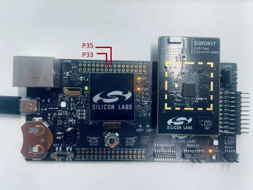
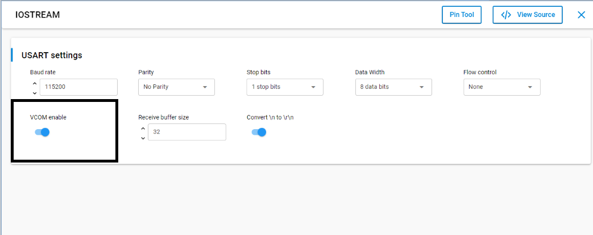
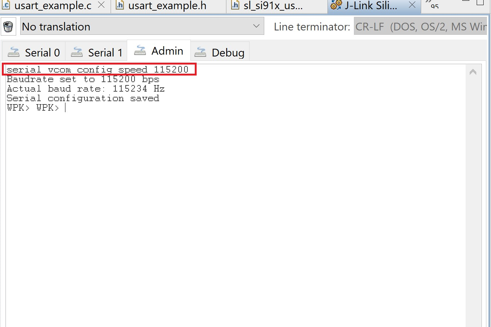
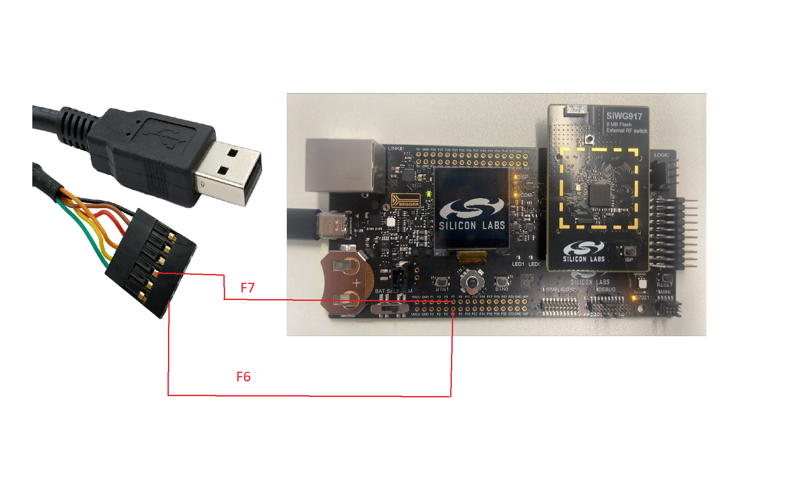
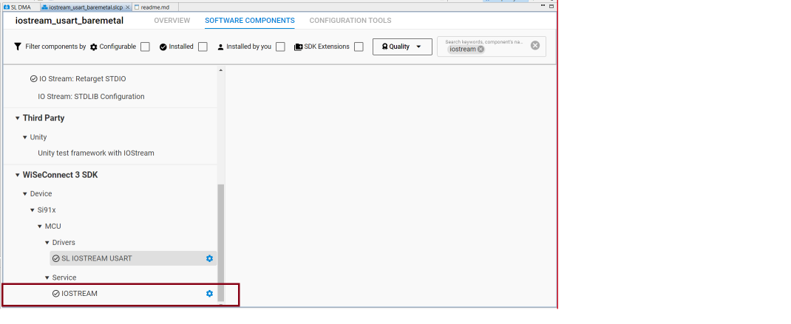
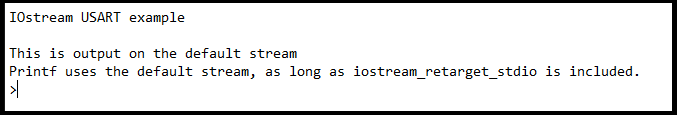

# SiWx91x Platform IOSTREAM USART Baremetal

## Table of Contents

- [SiWx91x Platform IOSTREAM USART Baremetal](#platform-siwx91x-iostream-usart-baremetal)
  - [Table of Contents](#table-of-contents)
  - [Purpose/Scope](#purposescope)
  - [Overview](#overview)
  - [Prerequisites/Setup Requirements](#prerequisitessetup-requirements)
    - [Hardware Requirements](#hardware-requirements)
    - [Software Requirements](#software-requirements)
    - [Setup Diagram](#setup-diagram)
  - [Getting Started](#getting-started)
  - [Application Build Environment](#application-build-environment)
    - [Pin Configuration](#pin-configuration)
  - [Test the Application](#test-the-application)
  - [Troubleshooting](#troubleshooting)
  - [Resources](#resources)
  - [Report Bugs/Support](#report-bugssupport)

## Purpose/Scope

  This application demonstrates how to configure IOSTREAM USART In asynchronous mode, it will send and receive data.

## Overview

This example project demonstrates the use of UART communication over the virtual COM port (VCOM) in a bare metal environment using I/O stream service. The example will echo back any charaters it receives over the serial connection. The VCOM serial port can be used over USB.

This application is configured with the following configs:
  - Tx and Rx enabled
  - Synchronous Master mode
  - 8 Bit data transfer
  - Stop bits 1
  - No Parity
  - No Auto Flow control
  - Baud Rates - 115200

## Prerequisites/Setup Requirements

### Hardware Requirements

- Windows PC
- Silicon Labs SiWx91x Evaluation Kit [[BRD4002](https://www.silabs.com/development-tools/wireless/wireless-pro-kit-mainboard?tab=overview) + [BRD4338A](https://www.silabs.com/development-tools/wireless/wi-fi/siwx917-rb4338a-wifi-6-bluetooth-le-soc-radio-board?tab=overview) / [BRD4342A](https://www.silabs.com/development-tools/wireless/wi-fi/siwx91x-rb4342a-wifi-6-bluetooth-le-soc-radio-board?tab=overview) / [BRD4343A](https://www.silabs.com/development-tools/wireless/wi-fi/siw917y-rb4343a-wi-fi-6-bluetooth-le-8mb-flash-radio-board-for-module?tab=overview) / [BRD4343C](https://www.silabs.com/development-tools/wireless/wi-fi/siw917y-rb4343c-wi-fi-6-bluetooth-le-8mb-flash-radio-board-for-module?tab=overview)]
- SiWx917 AC1 Module Explorer Kit [BRD2708A](https://www.silabs.com/development-tools/wireless/wi-fi/siw917y-ek2708a-explorer-kit?tab=overview)

### Software Requirements

- Simplicity Studio
- Serial console Setup
  - The Serial Console setup instructions are provided [here](https://docs.silabs.com/wiseconnect/latest/wiseconnect-developers-guide-developing-for-silabs-hosts/using-the-simplicity-studio-ide#console-input-and-output).

### Setup Diagram


> **Note**
>- The power port will acts as a VCOM port.

## Getting Started

Refer to the instructions [here](https://docs.silabs.com/wiseconnect/latest/wiseconnect-getting-started/) to:

- [Install Simplicity Studio](https://docs.silabs.com/wiseconnect/latest/wiseconnect-developers-guide-developing-for-silabs-hosts/using-the-simplicity-studio-ide#install-simplicity-studio)
- [Install WiSeConnect extension](https://docs.silabs.com/wiseconnect/latest/wiseconnect-developers-guide-developing-for-silabs-hosts/using-the-simplicity-studio-ide#install-the-wiseconnect-3-extension)
- [Connect your device to the computer](https://docs.silabs.com/wiseconnect/latest/wiseconnect-developers-guide-developing-for-silabs-hosts/using-the-simplicity-studio-ide#connect-siwx91x-to-computer)
- [Upgrade your connectivity firmware](https://docs.silabs.com/wiseconnect/latest/wiseconnect-developers-guide-developing-for-silabs-hosts/using-the-simplicity-studio-ide#update-siwx91x-connectivity-firmware)
- [Create a Studio project](https://docs.silabs.com/wiseconnect/latest/wiseconnect-developers-guide-developing-for-silabs-hosts/using-the-simplicity-studio-ide#create-a-project)

For details on the project folder structure, see the [WiSeConnect Examples](https://docs.silabs.com/wiseconnect/latest/wiseconnect-examples/#example-folder-structure) page.

## Application Build Environment

### Pin Configuration

- Pin configurations for external UART to TTL cable, When VCOM enable is Turned off.

  | USART PINS     | GPIO    | Breakout pin  | Explorer kit Breakout pin|
  | -------------- | ------- | ------------- | ------------------------ |
  | USART0_TX_PIN | GPIO_30  |     P35       |           [RST]          |
  | USART0_RX_PIN | GPIO_29  |     P33       |           [AN]           |



- Pin configurations for external UART to TTL cable, When VCOM enable is Turned ON.

  |  USART PINS     |     917 GPIO    |  Explorer kit GPIO |
  | --------------- | --------------- | ------------------ |
  | ULP_GPIO_TX_PIN | ULP_GPIO_11[F6] |   ULP_GPIO_11   |
  | ULP_GPIO_RX_PIN | ULP_GPIO_9 [F7] |   ULP_GPIO_9    |

### Application Configuration Parameters

- Configure the following parameter in `app_iostream_usart.c`:

- `BUFFER_SIZE`: Specifies the size (in bytes) of the input buffer used by the iostream USART application to hold a single line of user input. By default, it is set to 80.

  ```c
  #define BUFFER_SIZE 80 // Input buffer size
  ```

> **Note**: For recommended settings, please refer the [recommendations guide](https://docs.silabs.com/wiseconnect/latest/wiseconnect-developers-guide-prog-recommended-settings/).

## Test the Application

Refer instructions [here](https://docs.silabs.com/wiseconnect/latest/wiseconnect-getting-started/) for the following task:

 1. Make sure VCOM enable switch is turned on as shown below

     > 

    > **Note**
    >- Please note VCOM has fixed configuration for data transfer ( data bits = 8, stop bits = 1, parity = No parity, flow control = None).
    >- Only Buad rate(Default buad rate is 115200) can be changed for VCOM form admin console using below command
       ```c
    serial vcom config speed 115200
    ```
    > 

    >- To work with different configuations than ( data bits = 8, stop bits = 1, parity = No parity, flow control = None), it's recommended to connect external TTL cable as shown below

    > 


2. Build the SiWx91x - iostream usart baremetal example in Studio.

3. Flash, run and debug the application.Follow the steps for successful execution of the application:

4. In softwate components, search for iostream and open the configuration window.

    > 

   6. Can see the prints on UART VCOM and echos back the data what we send to usart.

   > 

   > **Note**
   >- To add iostream for debug prints in any examples, install below components **Wiseconnect_3_SDK/IOSTREAM SiWx91x**, **SERVICES/IO Stream: SiWx91x UART  - Give instance name vcom**
   >- When iostream components installed for debug prints then make sure DEBUG_UART macro is not present in preprocessor window.

## Troubleshooting

- If the project does not build, ensure Simplicity Studio and the WiSeConnect extension are installed and the board is connected.
- If the device is not detected, reinstall the connectivity firmware and check USB drivers.

## Resources

- [WiSeConnect Getting Started](https://docs.silabs.com/wiseconnect/latest/wiseconnect-getting-started/)
- [WiSeConnect Examples](https://docs.silabs.com/wiseconnect/latest/wiseconnect-examples/)
- [SiWx91x SoC Documentation](https://docs.silabs.com/wiseconnect/latest/)

## Report Bugs/Support

For issues and support, use the Silicon Labs Community or your normal support channel.

