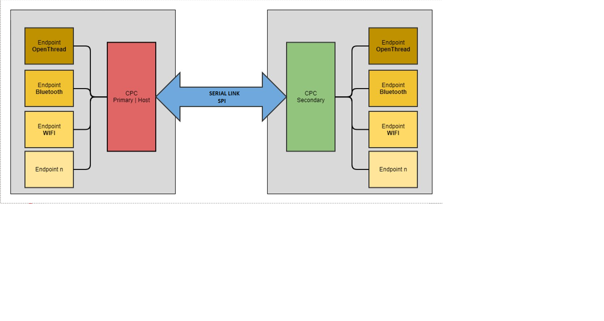
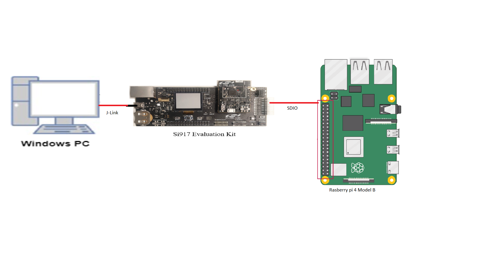
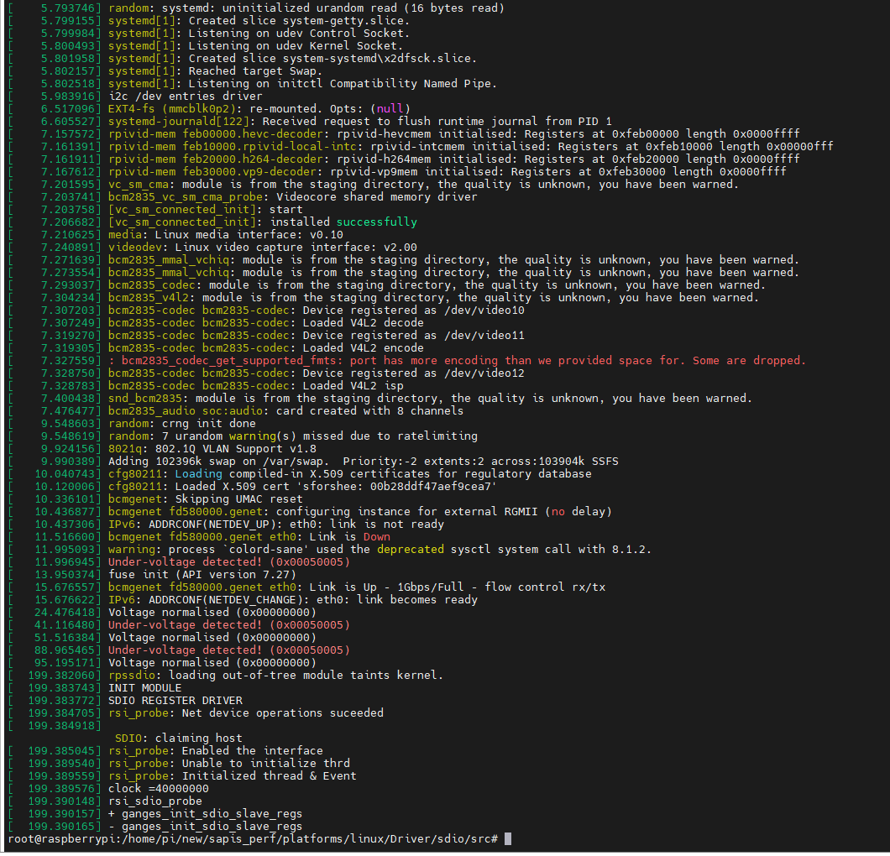
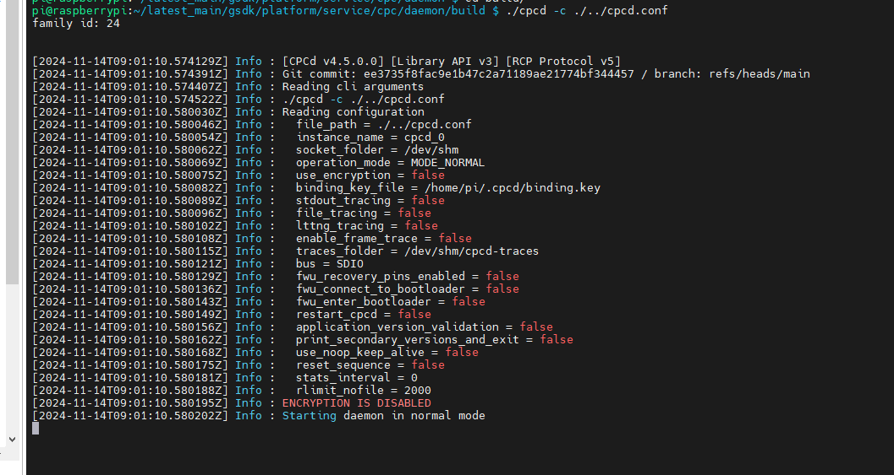
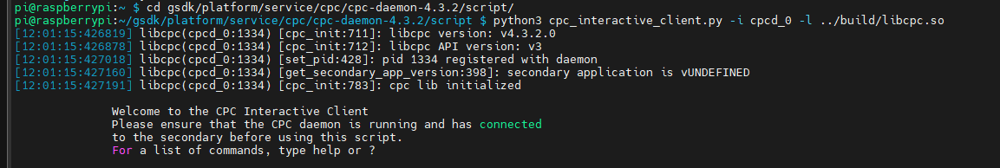
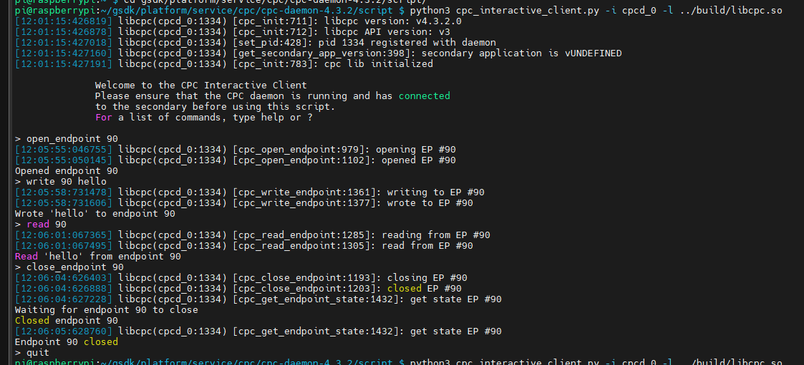

# CPC Secondary SDIO  

## Table of Contents
- [Purpose/Scope](#purposescope)
- [Overview of CPC](#overview-of-cpc)
- [Prerequisites/Setup Requirements](#prerequisitessetup-requirements)

  - [Hardware Requirements](#hardware-requirements)
  - [Software Requirements](#software-requirements)
  - [Setup Diagram](#setup-diagram)

- [Getting Started](#getting-started)
- [Application Build Environment](#application-build-environment)
- [Test the Application](#test-the-application)


## Purpose/Scope
- This application contains an example code to demonstrate Co-Processor Communication (CPC) over SDIO interface. CPC
   enables one host system to communicate with a SiWx917 Radio Board, also named the secondary device or secondary, by physical
   transport (SDIO).
- For further information refer document [here](https://www.silabs.com/documents/public/application-notes/an1351-using-co-processor-communication_daemon.pdf)


## Overview of CPC
- CPC stands for Co-Processor Communication that enables one host system to communicate with a Network Co-processor device (NCP), also named
  the secondary device or secondary, by physical transport (SDIO).

- CPC works in a master-slave scheme. We will refer to it as :

    1. Primary (Host): The primary is a linux host(Ex. Raspberry Pi 4 Model B).

    2. Secondary (SiWx917 Radio Board): The secondary is always a microcontroller responding to a primary.

-  CPC is a piece of code that runs on both the primary and the secondary. Its purpose is to multiplex multiple endpoints over one physical link and allows
   for reliable communication.

>

##  Prerequisites/Setup Requirements
- To use this application following Hardware, Software is required

### Hardware Requirements
- Windows PC
- SoC Mode:
  - Silicon Labs [BRD4338A](https://www.silabs.com/)
  - Silicon Labs [Si917 Evaluation Kit WPK(BRD4002)]
- Host Device (For example : Raspberry Pi 4 Model B) as Primary
- SD-card (128 GB) 

### Software Requirements
  - Simplicity Studio
  - SiSDK version 2024.12.1 
  - Wiseconnect Version 3.4.0
  - CPC Daemon version 4.6.0 , follow github [link](https://github.com/SiliconLabs/cpc-daemon)
  - linux_sdio_driver , link to download is [here](https://github.com/SiliconLabs/linux-sdio-driver)


### Setup Diagram
>

## Getting Started

Refer to the Setup Software instructions [here](https://docs.silabs.com/wiseconnect/latest/wiseconnect-developers-guide-developing-for-silabs-hosts/) to:

- Install Studio and WiSeConnect 3 extension
- Connect your device to the computer
- Upgrade your connectivity firmware
- Create a Studio project with name "sl_cpc_secondary_sdio_freertos"

For details on the project folder structure, see the [WiSeConnect Examples](https://docs.silabs.com/wiseconnect/latest/wiseconnect-examples/#example-folder-structure) page.

## Application Build Environment

The application can be configured to suit your requirements and development environment.

### Pin Configuration
| PIN          | 2.0 GPIO PIN (B0 Board) | Host Device - Raspberry Pi 4 Model B |
|--------------|-------------------------|--------------------------------------|
| SDIO_CLK     | GPIO_25[P25]            | GPIO_22 [PIN-15]                     |
| SDIO_CMD     | GPIO_26[P27]            | GPIO_23  [PIN-16]                    |
| SDIO_DATA0   | GPIO_27 [P29]           | GPIO_24 [PIN-18]                     |
| SDIO_DATA1   | GPIO_28 [P31]           | GPIO_25 [PIN-22]                     |
| SDIO_DATA2   | GPIO_29  [P33]          | GPIO_26 [PIN-37]                     |
| SDIO_DATA3   | GPIO_30 [P35]           | GPIO_27 [PIN-13]                     |
| Ground PIN   | GND                     | GND/PIN 14                           |


Full setup diagram will look like.

>


**Note:**

- Short cables should be used for above connections.

## Test the application

Refer to the instructions [here](https://docs.silabs.com/wiseconnect/latest/wiseconnect-developers-guide-developing-for-silabs-hosts/#configure-an-application) to:

- Build the application with name "sl_cpc_secondary_sdio_freertos" 
- Flash, run and debug the application

**Note:**
Keep Raspberry pi OFF always at the time of flashing the application on secondary.


### Run the CPC Host (Raspberry pi 4 Model B)

1. Writing an OS to Raspberry Pi:


```
1. Download and Install Raspberry Pi Imager.
2. Open Raspberry Pi Imager
3. Click "CHOOSE OS" and select Raspberry Pi OS (32-bit).
4. Insert the microSD card into your PC/Laptop.
5. Click "CHOOSE STORAGE" and select your SD card.
6. Click the gear icon to open Advanced options:
     - Set hostname to "raspberrypi".
     - Enable SSH (password authentication by default).
     - Set username to "pi" and password to "test123".
     - Configure Wi-Fi (optional, can be done later).
     - Set Timezone to Asia/Kolkata and Keyboard layout to US.
     - Save settings by clicking the SAVE icon.
7. Download the latest kernel version for RPI from the Raspberry pi official page.
8. Click "WRITE", confirm with "YES".
```

2. Boot the Raspberry Pi:

```
1. Insert the micro SD card into Raspberry Pi SD card slot
2. Booting of RPi can be observed on Monitor
3. Open terminal, and run the command "ifconfig -a" to know the IP address (to ssh into RPi)
```


3. SSH into the Raspberry Pi from Test PC/Laptop:

```
1. Open MobaXterm, click on session -> SSH -> Give IP address of RPi at Remote Host (Port 22, default) -> click on OK
2. Prompts login as, give, pi
3. When prompts "Are you sure you want to continue connecting (yes/no)?", give answer as 'yes'
```

4. In /boot/firmware/config.txt add the following line to enable sdio in RPi: 

```
dtoverlay=sdio,poll_once=false,sdio_overclock=25
```

5. Keep the linux-sdio-driver folder in home directory , Download the linux-sdio-driver from [here](https://github.com/SiliconLabs/linux-sdio-driver)


6. Follow the below commands from home directory :

```
a. sudo su
b. cd to linux-sdio-driver/platforms/linux/Driver/sdio/src  
c. make clean
d. make 
e. insmod rpssdio.ko
f. dmesg -c
```

>**Note:**
>By following above commands rpssdio.ko module will be loaded. On successful execution, output will look like :
> 
>or message will look like "NOT IN OPEN STATE"
>- Once the command has been successfully executed, removing and reloading the kernel module is not supported. Restart the device in order to install it again.

7. Copy the CPC-daemon to the home directory.

8. Open a new terminal on the Raspberry Pi, navigate to the daemon/cpcd.conf file, and set the following parameters:

```
a. disable_encryption: true
b. bus_type: NETLINK_SDIO
c. reset_sequence: false

```

9. Apply the patch located in resources/cpcd.patch. 


10. Open a new terminal window and follow the below commands from /dameon/ directory:

```
a. mkdir build
b. cd build
c. cmake ../
d. make 
e. sudo make install
f. ./cpcd -c ./../cpcd.conf     
```

**Note:**

On successful execution of above commands, output will look like : "Starting daemon in normal mode" message displayed.

>

11. Once the CPCd connection is successful with the secondary, open another tab(make sure CPCd running in the background) goto /path_to_cpcd/script/ and run "python3 cpc_interactive_client.py -i cpcd_0 -l ../build/libcpc.so" command.

**Note:**

- if you get error saying "ModuleNotFoundError: No module named 'libcpc' " 
Follow the below command: 
export PYTHONPATH=$PYTHONPATH:<daemon directory>/lib/bindings/python/src/libcpc

- If you restart the cpc-daemon after closing it, it will result in a "Daemon exiting with status EXIT_FAILURE" error. To prevent this, power off the Raspberry Pi, reset the secondary device, and then try running it again.


12. Now you should be able to see the welcome message. Using help command you can proceed with the testing. Refer the picture below:
>

### Run the Application

- This sample application demonstrates how to open CPC user endpoint 90, and perform read and write operations.
- The application receives data on user endpoint 90 and echos it back.


**Command syntax:**
```
1. open_endpoint <Endpoint_ID>
2. write <Endpoint_ID> <Data to be written>
3. read <Endpoint_ID>
4. close_endpoint <Endpoint_ID>
5. quit

```

**Note:**
1. In this example supported Endpoint_ID is 90.
2. "quit" command quits the cpc_interactive_client python script.


After successful execution of the application, the output will be as follows:

>

**Command Details are as follows :**

1. "90" is the user endpoint, SL_CPC_ENDPOINT_USER_ID_0.
2. "Hello" is the data which is sent to secondary (supported maximum data size is 256 bytes).
