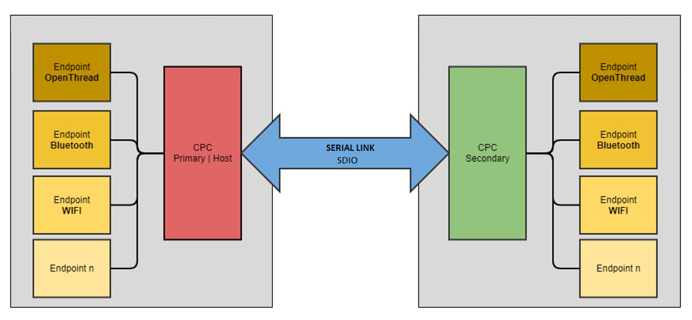

# Co-Processor Communication (CPC)

## Table of Contents
- [Purpose/Scope](#purposescope)
- [Overview of CPC](#overview-of-cpc-)
- [Prerequisites/Setup Requirements](#prerequisitessetup-requirements)

  - [Hardware Requirements](#hardware-requirements-)
  - [Software Requirements](#software-requirements)
  - [Setup Diagram](#setup-diagram)

- [Getting Started](#getting-started)
- [Application Build Environment](#application-build-environment)
- [Test the Application](#test-the-application)


## Purpose/Scope
- This application contains an example code to demonstrate CPC communication over SDIO interface. CPC
   enables one host system to communicate with a SiWx917 Radio Board, also named the secondary device or secondary, by physical
   transport (SDIO).
- For further information refer document [here](https://www.silabs.com/documents/public/application-notes/an1351-using-co-processor-communication_daemon.pdf)

## Overview of CPC
- CPC stands for Co-Processor Communication that enables one host system to communicate with a Network Co-processor device (NCP), also named
  the secondary device or secondary, by physical transport (SDIO).

- CPC works in a master-slave scheme. We will refer to it as :

    1. Primary (Host): The primary is a linux host(Ex. Raspberry Pi 4 Model B).

    2. Secondary (SiWx917 Radio Board): The secondary is always a microcontroller responding to a primary.

-  CPC is a piece of code that runs on both the primary and the secondary. Its purpose is to multiplex multiple endpoints over one physical link and allows
   for reliable communication.



##  Prerequisites/Setup Requirements
- To use this application following Hardware, Software is required

### Hardware Requirements
- Windows PC
- SoC Mode:
  - Silicon Labs [BRD4325A, BRD4325B, BRD4325C, BRD4325G, BRD4338A](https://www.silabs.com/)
- Host Device (For example : Raspberry Pi 4 Model B) as Primary

### Software Requirements
  - Simplicity Studio
  - GSDK version 4.3.2 (Download gecko-sdk.zip package from [Github repository](https://github.com/SiliconLabs/gecko_sdk/tree/v4.3.2))
  - CPCd version 4.3.2 ([Github repository](https://github.com/SiliconLabs/cpc-daemon/tree/v4.3.2)) for Raspberry Pi 4 Model B. Refer readme.md file for installation instruction.
  - Latest Wiseconnect Version be 3.1.1

**Note!**
- Apply the patch located in SiWx917_WiSeConnect_SDK.x.x.x.x/utilities/cpc_patch_files/gsdk_patch_for_si91xcpc.patch to downloaded gsdk release package using "git apply path-to-patch-file/gsdk_patch_for_si91xcpc.patch" command.
- Apply the patch located in SiWx917_WiSeConnect_SDK.x.x.x.x/utilities/cpc_patch_files/cpc_daemon_patch_for_si91x_device.patch to downloaded cpc-daemon using "git apply path-to-patch-file/cpc_daemon_patch_for_si91x_device.patch" command.

### Setup Diagram


## Getting Started

Refer to the instructions [here](https://docs.silabs.com/wiseconnect/latest/wiseconnect-getting-started/) to:

- Install Studio and WiSeConnect 3 extension
- Connect your device to the computer
- Upgrade your connectivity firmware
- Create a Studio project


## Application Build Environment

The application can be configured to suit your requirements and development environment.

### Pin Configuration
| PIN          | 2.0 GPIO PIN (B0 Board) | Host Device - Raspberry Pi 4 Model B |
|--------------|-------------------------|--------------------------------------|
| SDIO_CLK     | GPIO_25[P25]            | GPIO_22 [PIN-15]                     |
| SDIO_CMD     | GPIO_26[P27]            | GPIO_23  [PIN-16]                    |
| SDIO_DATA0   | GPIO_27 [P29]           | GPIO_24 [PIN-18]                     |
| SDIO_DATA1   | GPIO_28 [P31]           | GPIO_25 [PIN-22]                     |
| SDIO_DATA2   | GPIO_29  [P33]          | GPIO_26 [PIN-37]                     |
| SDIO_DATA3   | GPIO_30 [P35]           | GPIO_27 [PIN-13]                     |
| Ground PIN   | GND                     | GND/PIN 14                           |


**Note!**
- Above connection pin mapping is supported for BRD4002A WPK base board.

## Test the application

Refer to the instructions [here](https://docs.silabs.com/wiseconnect/latest/wiseconnect-getting-started/) to:

- Build the application with name "sl_cpc_with_security_secondary_sdio_freertos"
- Flash, run and debug the application

### Run the CPC Host (Raspberry pi 4 Model B)

1. Go to /path_to_cpcd/cpcd.conf file to set the parameters:
```
bus_type: NETLINK_SDIO
disable_encryption: false
reset_sequence: false
```
2. Then apply the provided changes in `cpcd.patch`. which is at /resources/cpccd.patch
3. Make sure to keep the linux-sdio-driver folder in home/pi/ directory , Link to download the linux-sdio-driver folder is :
4. Follow the below commands from home/pi/ directory :

```
a. sudo su
b. cd to linux-sdio-driver/platforms/linux/Driver/sdio/src
c. make clean
d. insmod rpssdio.ko
e. dmesg -c
```

**Note!**
On successful connection of linux-sdio-driver with secondary, output will look like :


4. As security is enabled, the host and secondary must undergo a binding process before communication can begin. This can be initiated from the host by passing the bind argument, ie

```
cpcd -c cpcd.conf --bind ecdh
```

5. After the binding is successful restart the primary and secondary and install the linux-sdio-driver.

6. Primary should connect to secondary device successfully with "Daemon startup was successful. Waiting for client connections" message displayed.


7. Once the CPCd connection is successful with the secondary, open another tab(make sure CPCd running in the background) goto /path_to_cpcd/script/ and run "python3 cpc_interactive_client.py -i cpcd_0 -l ../build/libcpc.so" command.

8. Now you should be able to see the welcome message. Using help command you can proceed with the testing. Refer the picture below:


### Run the Application

- This sample application demonstrates how to open CPC user endpoint 90, and perform read and write operations.
- The application receives data on user endpoint 90 and echos it back.


Command syntax:
```
1. close_endpoint <Endpoint_ID>
2. open_endpoint <Endpoint_ID>
3. quit
4. write <Endpoint_ID> <Data to be written>
5. read <Endpoint_ID>
```

**Note!**
1. In this example supported Endpoint_ID is 90.
2. "quit" command quits the cpc_interactive_client python script.


After successful execution of the application, the output will be as follows:


Command Details are as follows :

1. "90" is the user endpoint, SL_CPC_ENDPOINT_USER_ID_0.
2. "Hello" is the data which is sent to secondary (supported maximum data size is 256 bytes).