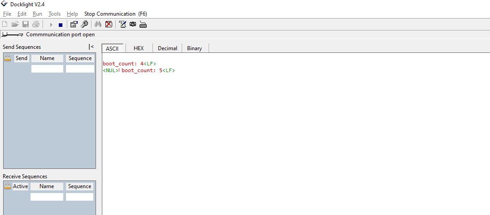

# SL FILE SYSTEM

## Table of Contents

- [Purpose/Scope](#purposescope)
- [Overview](#overview)
- [About Example Code](#about-example-code)
- [Prerequisites/Setup Requirements](#prerequisitessetup-requirements)
  - [Hardware Requirements](#hardware-requirements)
  - [Software Requirements](#software-requirements)
  - [Setup Diagram](#setup-diagram)
- [Getting Started](#getting-started)
- [Test the Application](#test-the-application)

## Purpose/Scope

When flashed with this example the boot count get updated in the "boot_count" file on every boot-up.

**boot_count File:** This file is to store the boot count value and this will be available in the flash memory.

## Overview

- This example interfaces with flash through QSPI interface using littlefs.
- The program can be interrupted at any time without losing track of how many times it has been booted and without corrupting the filesystem.

## About Example Code

- The example code in **file_system_example.c** shows how to set up QSPI to access flash memory for a file system using the LittleFS library.
- Initialize QSPI for LittleFS using `sl_si91x_littlefs_qspi_init()`.
- To use the file system, call `lfs_mount()`.
- Open a file and read the current boot count  `lfs_file_read()`.
- Update the boot count `lfs_file_write()`.
- Close the file using `lfs_file_close()` and unmount the file system using `lfs_unmount()`.

## Prerequisites/Setup Requirements

### Hardware Requirements

- Windows PC
- Silicon Labs Si917 Evaluation Kit + External Flash

>**Note:**
>- LittleFS service is not supported on stacked flash boards. However, if the board supports external flash, users can connect external flash to access the LittleFS service. 
>- For detailed information about pinset configurations, refer to the **Flash and PSRAM Combinations** section in the [Software Reference Manual](https://github.com/SiliconLabs/wiseconnect/blob/release/v3.4.2/docs/software-reference/manuals/siwx91x-software-reference-manual.md).

### Software Requirements

- Simplicity Studio
- Serial console Setup
  - For Serial Console setup instructions, refer to [here](https://docs.silabs.com/wiseconnect/latest/wiseconnect-developers-guide-developing-for-silabs-hosts/#console-input-and-output).

### Setup Diagram

> 

## Getting Started

Refer to the instructions [here](https://docs.silabs.com/wiseconnect/latest/wiseconnect-getting-started/) to:

- [Install Simplicity Studio](https://docs.silabs.com/wiseconnect/latest/wiseconnect-developers-guide-developing-for-silabs-hosts/#install-simplicity-studio)
- [Install WiSeConnect 3 extension](https://docs.silabs.com/wiseconnect/latest/wiseconnect-developers-guide-developing-for-silabs-hosts/#install-the-wi-se-connect-3-extension)
- [Connect your device to the computer](https://docs.silabs.com/wiseconnect/latest/wiseconnect-developers-guide-developing-for-silabs-hosts/#connect-si-wx91x-to-computer)
- [Upgrade your connectivity firmware ](https://docs.silabs.com/wiseconnect/latest/wiseconnect-developers-guide-developing-for-silabs-hosts/#update-si-wx91x-connectivity-firmware)
- [Create a Studio project ](https://docs.silabs.com/wiseconnect/latest/wiseconnect-developers-guide-developing-for-silabs-hosts/#create-a-project)

## Test the Application

1. Run the application 
2. Observe boot_count on console output
 > 

 >
> **Note**:
>
>- When you run the littlefs example first time, after flash erase you see the error **(error: Corrupted dir pair at {0x0, 0x1})** because flash is not yet formatted for littlefs. Ignore the error when running the example the first time.

