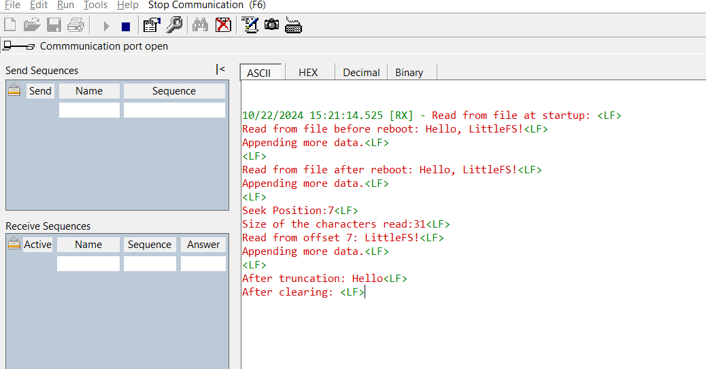

# SL LITTLEFS FILE SYSTEM

## Table of Contents

- [SL LITTLEFS FILE SYSTEM](#sl-littlefs-file-system)
  - [Table of Contents](#table-of-contents)
  - [Purpose/Scope](#purposescope)
  - [Overview](#overview)
  - [About Example Code](#about-example-code)
  - [Prerequisites/Setup Requirements](#prerequisitessetup-requirements)
    - [Hardware Requirements](#hardware-requirements)
    - [Software Requirements](#software-requirements)
    - [Setup Diagram](#setup-diagram)
  - [Getting Started](#getting-started)
  - [Test the Application](#test-the-application)

## Purpose/Scope

Demonstrates basic file operations using the LittleFS library on a QSPI-based flash file system.

**myfile.txt:** This file is used to store the written data, which will be retained in the flash memory.

## Overview

- This example interfaces with flash through QSPI interface using littlefs.
- It shows how to mount a file system, perform various file operations, and simulate a reboot while preserving file data.
- The example covers creating a file, writing to it, appending additional data, reading from specific offsets, truncating file content, and clearing the file.
- A simulated reboot demonstrates data persistence by unmounting and remounting the file system.

## About Example Code

- The example code in **file_operations_example.c** shows how to set up QSPI to access flash memory for a file system using the LittleFS library.
- Initialize QSPI for LittleFS through `sl_si91x_littlefs_qspi_init()`.  
- Mount the file system via `lfs_mount()`. If mounting fails, format it with `lfs_format()` and then mount again.  
- Open the target file for reading using `lfs_file_open()` and retrieve the data using `lfs_file_read()`.  
- Write new data to the file with `lfs_file_write()`, append additional data by opening the file with the `LFS_O_APPEND` flag, and use `lfs_file_truncate()` to change the file size or `lfs_file_seek()` to access a specific offset.  
- Close the file by calling `lfs_file_close()` and unmount the file system through `lfs_unmount()`.  
- Simulate a reboot by unmounting and remounting to ensure data persistence using `simulate_reboot()`.

## Prerequisites/Setup Requirements

### Hardware Requirements

- Windows PC
- Silicon Labs Si917 Evaluation Kit + External Flash

>**Note:**
>- LittleFS service is supported on both stacked flash and external flash SiWG917 OPNs. 
>- For detailed information about pinset configurations, refer to the **Flash and PSRAM Combinations** section in the [Software Reference Manual](https://github.com/SiliconLabs/wiseconnect/blob/release/v3.4.2/docs/software-reference/manuals/siwx91x-software-reference-manual.md).
### Software Requirements

- Simplicity Studio
- Serial console Setup
  - For Serial Console setup instructions, refer to [here](https://docs.silabs.com/wiseconnect/latest/wiseconnect-developers-guide-developing-for-silabs-hosts/#console-input-and-output).

### Setup Diagram

> 

## Getting Started

Refer to the instructions [here](https://docs.silabs.com/wiseconnect/latest/wiseconnect-getting-started/) to:

- [Install Simplicity Studio](https://docs.silabs.com/wiseconnect/latest/wiseconnect-developers-guide-developing-for-silabs-hosts/#install-simplicity-studio)
- [Install WiSeConnect 3 extension](https://docs.silabs.com/wiseconnect/latest/wiseconnect-developers-guide-developing-for-silabs-hosts/#install-the-wi-se-connect-3-extension)
- [Connect your device to the computer](https://docs.silabs.com/wiseconnect/latest/wiseconnect-developers-guide-developing-for-silabs-hosts/#connect-si-wx91x-to-computer)
- [Upgrade your connectivity firmware ](https://docs.silabs.com/wiseconnect/latest/wiseconnect-developers-guide-developing-for-silabs-hosts/#update-si-wx91x-connectivity-firmware)
- [Create a Studio project ](https://docs.silabs.com/wiseconnect/latest/wiseconnect-developers-guide-developing-for-silabs-hosts/#create-a-project)

> **Note**: For recommended settings, see the [recommendations guide](https://docs.silabs.com/wiseconnect/latest/wiseconnect-developers-guide-prog-recommended-settings/).

## Test the Application

1. Run the application 
2. Observe file operations and outputs on the console:
   - Read the data from the file both before and after the simulated reboot.
   - Execute write, append, seek, and truncate operations on the file, observing the results after each action.
   - Clear the file contents and confirm that the file is empty after the operation.
  

>
> **Note**:
>
> When you run the littlefs example first time, after flash erase you see the errors **(error: Corrupted dir pair at {0x0, 0x1})** because flash is not yet formatted for littlefs. Ignore the error when running the example the first time.
