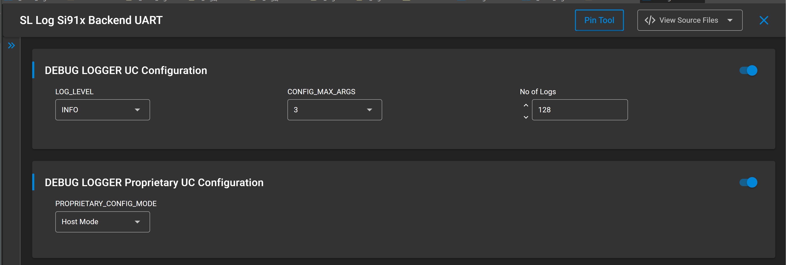

# SL SI91x Logger

## Table of Contents

- [SL SI91x Logger](#sl-si91x-logger)
  - [Table of Contents](#table-of-contents)
  - [Purpose/Scope](#purposescope)
  - [Prerequisites/Setup Requirements](#prerequisitessetup-requirements)
    - [Hardware Requirements](#hardware-requirements)
    - [Software Requirements](#software-requirements)
    - [Setup Diagram](#setup-diagram)
  - [Getting Started](#getting-started)
  - [Application Build Environment](#application-build-environment)
    - [Application Configuration Parameters](#application-configuration-parameters)
    - [Logger Levels](#logger-levels)
  - [UC Config](#uc-config)
    - [Where Each Level Appears in the Code](#where-each-level-appears-in-the-code)
      - [DEBUG](#debug)
      - [INFO](#info)
      - [WARN](#warn)
      - [ERROR](#error)
    - [Time-Sync \& Log Flush Behavior](#time-sync--log-flush-behavior)
    - [Note on Log Flushing (sl\_log\_flush)](#note-on-log-flushing-sl_log_flush)
  - [Test the Application](#test-the-application)

## Purpose/Scope

This example demonstrates how to use the **Logger** service on the **Si91x platform** while transitioning between:

- **M4 power states**: PS3 and PS4  
- **TA performance profiles**:  
  - `HIGH_PERFORMANCE`  
  - `DEEP_SLEEP_WITH_RAM_RETENTION`  

The application cycles through a predefined sequence of **M4 power state / TA profile combinations**, logging:  

- Power transition events on M4  
- TA performance profile changes  
- Timestamp synchronization and per-core timestamp counters  
- Warnings when the requested state/profile is already active  
- Errors when API calls fail (for example, power manager or Wi-Fi profile APIs)  

## Prerequisites/Setup Requirements

To use this application, the following hardware, software, and project setup are required. The setup is identical to other WiSeConnect Si91x examples such as SLEEPTIMER.  

### Hardware Requirements

- Windows PC  
- Silicon Labs **Si917 Evaluation Kit**  
  - WPK (BRD4002) + BRD4338A / BRD4342A / BRD4343A

### Software Requirements

- **Simplicity Studio**  
- **Serial console setup**  
  - For Serial Console setup instructions, refer to the WiSeConnect *Console input and output* section.  
- **Embedded Development Environment**  
  - For Si91x, use the latest version of Simplicity Studio (see **“Download and Install Simplicity Studio”** in the *getting-started-with-siwx917-soc* guide in `release_package/docs/index.html`).  

### Setup Diagram

> 

## Getting Started

Refer to the WiSeConnect *Getting Started* documentation to:

- Install **Simplicity Studio**  
- Install **WiSeConnect extension**  
- Connect the device to the PC  
- Upgrade the **connectivity firmware**  
- Create a **Studio project** for this example  

For details on the project folder structure, see the **WiSeConnect Examples** page.  

## Application Build Environment

This example consists of the following main files:

- **`sl_si91x_logger_example.c`** – core example application that:  
  - Creates M4 and TA tasks  
  - Registers for power transition events  
  - Iterates through predefined M4 power state / TA performance profile combinations  
  - Synchronizes timestamps and prints per-core counters  
- **`sl_si91x_logger_example.h`** – provides the `logger_example_init` prototype used to start the example.  

The entry function:

creates the main **application_start** thread, which in turn creates the M4 and TA worker threads and semaphores.  

### Application Configuration Parameters

Core behavior is defined in `sl_si91x_logger_example.c`:

- **Power transition event mask**

  
  This mask selects the M4 power manager transitions the example will log.  

- **Combination list**

  The array `m4_ta_combinations[MAX_COMBINATIONS]` defines the sequence of 8 combinations of `m4_state` and `ta_profile.profile` that the app will iterate through.  

  

  This list is cycled in the orchestrator (`application_start`) loop.  

- **Logger default level**

  Configure the default log level in uc :
  This controls which logs get compiled/emitted at run time.  

- **Wireless configuration**

  `initialize_wireless()` configures the NWP with a client-mode Wi-Fi configuration, including low-power mode. You typically do not need to modify this unless your system requires a different boot configuration.  

> **Note**: For recommended system-level settings, see the WiSeConnect *Recommended Settings* guide.  

### Logger Levels

The example uses four log levels:

| Level | Purpose | API Macro |
| --- | --- | --- |
| **DEBUG (1 – Least Severe)** | Detailed trace for developers: function entry/exit, raw states. | `SL_PRINT_STRING_DEBUG` |
| **INFO (2)** | High-level state changes and successful operations. | `SL_PRINT_STRING_INFO` |
| **WARN (3)** | Non-fatal anomalies such as repeated requests for the same state. | `SL_PRINT_STRING_WARN` |
| **ERROR (4 – Most Severe)** | Failures that require attention (API failures, resource creation failures). | `SL_PRINT_STRING_ERROR` |

These macros are provided by the **Logger** component and documented in the WiSeConnect API reference.  

## UC Config

1. **Debug Level**  
   Configure the verbosity of logs:
   - `DEBUG` → Logs all levels
   - `INFO` → Logs INFO, WARN, ERROR
   - `WARN` → Logs WARN, ERROR
   - `ERROR` → Logs only ERROR

2. **Max Number of Arguments**  
   Maximum number of arguments used in each print.

3. **Number of Logs**  
   Number of logs that can be buffered before overwrite.

### Where Each Level Appears in the Code

Below is how each level is used in `sl_si91x_logger_example.c`:  

#### DEBUG

- Function entry/exit traces:
  - `application_start`, `initialize_wireless`, `m4_task_start`, `ta_task_start`  
  - `set_m4_power_state`, `set_ta_profile`, `transition_callback`  
- Additional debug prints for:
  - Current vs target M4 power state  
  - Current vs target TA performance profile  

Example:

  

#### INFO

- Successful creation of semaphores and threads in `application_start`.  
- Confirmation of successful M4 state changes and TA profile changes:

    

- Timestamp synchronization completion and current timestamp counts:

    

- Power transition messages in `transition_callback`:

    

#### WARN

- When the requested state/profile is already active:

    

#### ERROR

- On failures during M4 power manager operations:

    

- On failures during TA performance profile configuration:

    

- On wireless initialization and peripheral failures:

    

- On semaphore and thread creation failures:

    

### Time-Sync & Log Flush Behavior

Each iteration of the combination loop:

1. Sets the next `m4_ta_combinations[combination_index]`.  
2. Triggers the M4 and TA tasks via semaphores.  
3. Runs `sl_log_sync_timestamp(0, NULL)` once per iteration and logs M4/TA timestamp counters.  
4. After all **8 combinations** are completed, calls `sl_log_flush()` to flush buffered logs.  

### Note on Log Flushing (sl_log_flush)

`sl_log_flush()` **must be called only from a low‑priority task or the system idle task**.  
This is important because log flushing can take longer than typical real‑time operations, and calling it from a high‑priority task may block time‑critical functions.

In this example, flushing is performed **after all 8 combinations finish**, but in real applications you should ensure that:

- The flush call is placed inside a **low‑priority worker thread**, *or*  
- It is invoked from the **idle task**, where it cannot interfere with timing‑sensitive system behavior.

## Test the Application

Follow these steps to build and test the SI91x Logger example:

1. **Create the project**
   - In Simplicity Studio, create a new WiSeConnect example project and select the **Logger** example (or import this source file set into your existing Si91x project).  

2. **Configure logger level (optional)**
   - Set `SL_LOG_LEVEL_DEFAULT` to your desired verbosity (`DEBUG`, `INFO`, `WARN`, or `ERROR`).  
   - `INFO` is recommended for a balance of useful logs.

3. **Build and flash**
   - Build the project in Simplicity Studio.  
   - Flash the image to the Si91x device.  

4. **Decode and view logger output**
   - To convert the encoded logger stream into readable text format, run the Python decoding script located in the example project folder.
   - Sample command for converting raw log events to readable text is  **python Log_script.py --port (SERIAL_COMPORT) --out (project.out file) --baud 115200**. 
      Ex Command "python Log_script.py --port COM3 --out sl_si91x_logger.out --baud 115200"

5. ## Console Output

> **Note:**
>    1. Actual values depend on timing and board profile.   
>    2. Only `uint32_t` arguments are supported by logger.
>    3. Only Host mode is supported.
>    4. Only max args 3 is supported.

For more examples and setup information, visit the [WiSeConnect Examples](https://docs.silabs.com/wiseconnect/latest/wiseconnect-examples/#example-folder-structure) page.
