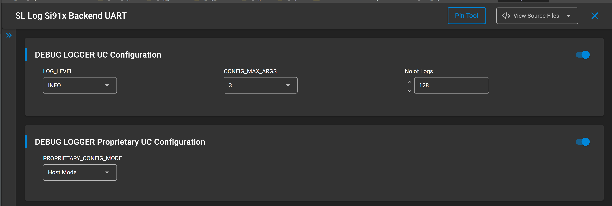
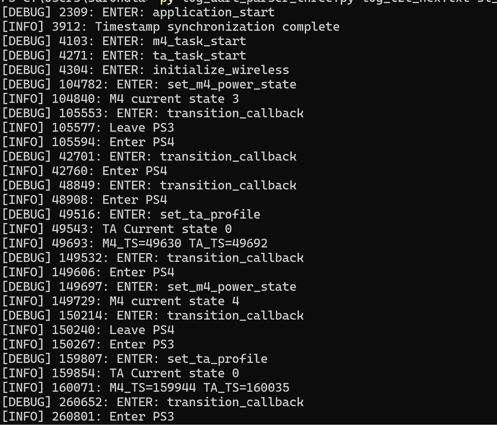

# SiWx91x Platform Logger Example

## Table of Contents

- [SiWx91x Platform Logger Example](#platform-siwx91x-logger-example)
  - [Table of Contents](#table-of-contents)
  - [Purpose/Scope](#purposescope)
  - [Prerequisites/Setup Requirements](#prerequisitessetup-requirements)
    - [Hardware Requirements](#hardware-requirements)
    - [Software Requirements](#software-requirements)
    - [Setup Diagram](#setup-diagram)
  - [Getting Started](#getting-started)
  - [Application Build Environment](#application-build-environment)
    - [Application Configuration Parameters](#application-configuration-parameters)
    - [Logger Levels](#logger-levels)
  - [UC Config](#uc-config)
    - [Where Each Level Appears in the Code](#where-each-level-appears-in-the-code)
      - [NONE](#none)
      - [DEBUG](#debug)
      - [INFO](#info)
      - [WARN](#warn)
      - [ERROR](#error)
    - [Time-Sync \& Log Flush Behavior](#time-sync--log-flush-behavior)
    - [Note on Log Flushing (sl\_log\_flush)](#note-on-log-flushing-sl_log_flush)
  - [Test the Application](#test-the-application)
  - [Troubleshooting](#troubleshooting)
  - [Resources](#resources)
  - [Report Bugs/Support](#report-bugssupport)

## Purpose/Scope

This example demonstrates how to use the **Logger** service on the **SiWx91x platform** while transitioning between:

- **M4 power states**: PS3 and PS4
- **TA performance profiles**:
  - `HIGH_PERFORMANCE`
  - `DEEP_SLEEP_WITH_RAM_RETENTION`

The application cycles through a predefined sequence of **M4 power state / TA profile combinations**, logging:

- Power transition events on M4
- TA performance profile changes
- Timestamp synchronization and per-core timestamp counters
- Warnings when the requested state/profile is already active
- Errors when API calls fail (for example, power manager or Wi-Fi profile APIs)

## Prerequisites/Setup Requirements

To use this application, the following hardware, software, and project setup are required. The setup is identical to other WiSeConnect SiWx91x examples such as SLEEPTIMER.

### Hardware Requirements

- Windows PC
- Silicon Labs SiWx91x Evaluation Kit [[BRD4002](https://www.silabs.com/development-tools/wireless/wireless-pro-kit-mainboard?tab=overview) + [BRD4338A](https://www.silabs.com/development-tools/wireless/wi-fi/siwx917-rb4338a-wifi-6-bluetooth-le-soc-radio-board?tab=overview) / [BRD4342A](https://www.silabs.com/development-tools/wireless/wi-fi/siwx91x-rb4342a-wifi-6-bluetooth-le-soc-radio-board?tab=overview) / [BRD4343A](https://www.silabs.com/development-tools/wireless/wi-fi/siw917y-rb4343a-wi-fi-6-bluetooth-le-8mb-flash-radio-board-for-module?tab=overview) / [BRD4343C](https://www.silabs.com/development-tools/wireless/wi-fi/siw917y-rb4343c-wi-fi-6-bluetooth-le-8mb-flash-radio-board-for-module?tab=overview)]

### Software Requirements

- **Simplicity Studio**
- **Serial console setup**
  - For Serial Console setup instructions, refer to the WiSeConnect *Console input and output* section.
- **Embedded Development Environment**
  - For SiWx91x, use the latest version of Simplicity Studio (see **“Download and Install Simplicity Studio”** in the *getting-started-with-siwx917-soc* guide in `release_package/docs/index.html`).

### Setup Diagram

> 

## Getting Started

Refer to the WiSeConnect *Getting Started* documentation to:

- Install **Simplicity Studio**
- Install **WiSeConnect extension**
- Connect the device to the PC
- Upgrade the **connectivity firmware**
- Create a **Studio project** for this example

For details on the project folder structure, see the **WiSeConnect Examples** page.

## Application Build Environment

This example consists of the following main files:

- **`sl_si91x_logger_example.c`** – core example application that:
  - Creates M4 and TA tasks
  - Registers for power transition events
  - Iterates through predefined M4 power state / TA performance profile combinations
  - Synchronizes timestamps and prints per-core counters
- **`sl_si91x_logger_example.h`** – provides the `logger_example_init` prototype used to start the example.

The entry function:


creates the main **application_start** thread, which in turn creates the M4 and TA worker threads and semaphores.

### Application Configuration Parameters

Core behavior is defined in `sl_si91x_logger_example.c`:

- **Power transition event mask**


  This mask selects the M4 power manager transitions the example will log.

- **Combination list**

  The array `m4_ta_combinations[MAX_COMBINATIONS]` defines the sequence of 8 combinations of `m4_state` and `ta_profile.profile` that the app will iterate through.

  - `MAX_COMBINATIONS`: Specifies the number of `m4_state` and `ta_profile.profile` combinations that the application cycles through during the logger test run. By default, it is set to 8.

    ```c
    #define MAX_COMBINATIONS 8 // Number of M4/TA state combinations cycled through
    ```

  This list is cycled in the orchestrator (`application_start`) loop.

- **Logger default level**

  Configure the default log level in uc :
  This controls which logs get compiled/emitted at run time.

- **Wireless configuration**

  `initialize_wireless()` configures the NWP with a client-mode Wi-Fi configuration, including low-power mode. You typically do not need to modify this unless your system requires a different boot configuration.

> **Note**: For recommended system-level settings, see the WiSeConnect *Recommended Settings* guide.

### Logger Levels

The example uses five log levels:

| Level | Purpose | API Macro |
| --- | --- | --- |
| **NONE** | Disables all logging. | — |
| **DEBUG** | Least severe. Detailed trace for developers: function entry/exit, raw states. | `SL_PRINT_STRING_DEBUG` |
| **INFO** | High-level state changes and successful operations. | `SL_PRINT_STRING_INFO` |
| **WARN** | Non-fatal anomalies such as repeated requests for the same state. | `SL_PRINT_STRING_WARN` |
| **ERROR** | Most severe among the macros used in this example. Failures that require attention (API failures, resource creation failures). | `SL_PRINT_STRING_ERROR` |

The `SL_PRINT_STRING_*` macros are provided by the **Logger** component (see the WiSeConnect API reference). UC **Debug Level** names map to `SL_LOG_CONFIG_LEVEL_*` in `config/sl_log_common_config.h`—the authoritative in-repo definitions for compile-time values (`SL_LOG_CONFIG_LEVEL_NONE`, and so on) and for levels not shown above (for example, `SL_LOG_CONFIG_LEVEL_CRASH`).  

## UC Config



1. **Debug Level**
   Configure the verbosity of logs:
   - `NONE` → No logs
   - `DEBUG` → Logs all levels
   - `INFO` → Logs INFO, WARN, ERROR
   - `WARN` → Logs WARN, ERROR
   - `ERROR` → Logs only ERROR

2. **Max Number of Arguments**
   Maximum number of arguments used in each print.

3. **Number of Logs**
   Number of logs that can be buffered before overwrite.

4. **Proprietary config mode**  
   Logger backend output path:
   - `Buffer Mode` → Logs stored in an internal buffer.
   - `Console Mode` → Logs sent directly to console/UART.
   - `Host Mode` → Logs sent to the host interface (required for this example). call `sl_log_flush()` to send them out.

### Where Each Level Appears in the Code

Below is how each level is used in `sl_si91x_logger_example.c`:  

#### NONE

- No `SL_PRINT_STRING_*` output when this level is selected in UC. 

#### DEBUG

- Function entry/exit traces:
  - `application_start`, `initialize_wireless`, `m4_task_start`, `ta_task_start`
  - `set_m4_power_state`, `set_ta_profile`, `transition_callback`
- Additional debug prints for:
  - Current vs target M4 power state
  - Current vs target TA performance profile

Example:


#### INFO

- Successful creation of semaphores and threads in `application_start`.
- Confirmation of successful M4 state changes and TA profile changes:


- Timestamp synchronization completion and current timestamp counts:


- Power transition messages in `transition_callback`:


#### WARN

- When the requested state/profile is already active:


#### ERROR

- On failures during M4 power manager operations:


- On failures during TA performance profile configuration:


- On wireless initialization and peripheral failures:


- On semaphore and thread creation failures:


### Time-Sync & Log Flush Behavior

Each iteration of the combination loop:

1. Sets the next `m4_ta_combinations[combination_index]`.
2. Triggers the M4 and TA tasks via semaphores.
3. Runs `sl_log_sync_timestamp(0, NULL)` once per iteration and logs M4/TA timestamp counters.
4. After all **8 combinations** are completed, calls `sl_log_flush()` to flush buffered logs.


### Note on Log Flushing (sl_log_flush)

`sl_log_flush()` **must be called only from a low‑priority task or the system idle task**.
This is important because log flushing can take longer than typical real‑time operations, and calling it from a high‑priority task may block time‑critical functions.

In this example, flushing is performed **after all 8 combinations finish**, but in real applications you should ensure that:

- The flush call is placed inside a **low‑priority worker thread**, *or*
- It is invoked from the **idle task**, where it cannot interfere with timing‑sensitive system behavior.


## Test the Application

Follow these steps to build and test the SiWx91x Logger example:

1. **Create the project**
   - In Simplicity Studio, create a new WiSeConnect example project and select the **Logger** example (or import this source file set into your existing SiWx91x project).

2. **Configure logger level (optional)**
   - Set `SL_LOG_LEVEL_DEFAULT` to your desired verbosity (`NONE`, `DEBUG`, `INFO`, `WARN`, or `ERROR`).  
   - `INFO` is recommended for a balance of useful logs.

3. **Build and flash**
   - Build the project in Simplicity Studio.
   - Flash the image to the SiWx91x device.

4. **Decode and view logger output**
   - To convert the encoded logger stream into readable text format, run the Python decoding script located in the example project folder.
   - Sample command for converting raw log events to readable text is  **python Log_script.py --out firmware.out --descriptor SYSVIEW_CaptiveCore.txt --port COM5 --max-args 10**.
      Ex Command "python Log_script.py --out firmware.out --descriptor SYSVIEW_CaptiveCore.txt --port COM5 --max-args 10"

5. ## Console Output



> **Note:**
>    - Actual values depend on timing and board profile.
>    - Only `uint32_t` arguments are supported by logger.
>    - Keep **Proprietary config mode** on Host Mode for this example (Buffer/Console are not supported; see [UC Config](#uc-config)).
>    - SDK examples using NWP have a limitation where fewer than three arguments are not supported.
>    - The default log level is set to **Error**, and you can modify this configuration
        using UC.

For more examples and setup information, visit the [WiSeConnect Examples](https://docs.silabs.com/wiseconnect/latest/wiseconnect-examples/#example-folder-structure) page.

## Troubleshooting

- If the project does not build, ensure Simplicity Studio and the WiSeConnect extension are installed and the board is connected.
- If the device is not detected, reinstall the connectivity firmware and check USB drivers.

## Resources

- [WiSeConnect Getting Started](https://docs.silabs.com/wiseconnect/latest/wiseconnect-getting-started/)
- [WiSeConnect Examples](https://docs.silabs.com/wiseconnect/latest/wiseconnect-examples/)
- [SiWx91x SoC Documentation](https://docs.silabs.com/wiseconnect/latest/)

## Report Bugs/Support

For issues and support, use the Silicon Labs Community or your normal support channel.
