# SL SI91x Logger Backend Example

## Table of Contents

- [SL SI91x Logger Backend Example](#sl-si91x-logger-backend-example)
  - [Table of Contents](#table-of-contents)
  - [Purpose/Scope](#purposescope)
  - [SL Log Service Feature Overview](#sl-log-service-feature-overview)
  - [Prerequisites/Setup Requirements](#prerequisitessetup-requirements)
    - [Hardware Requirements](#hardware-requirements)
    - [Software Requirements](#software-requirements)
    - [Setup Diagram](#setup-diagram)
  - [Getting Started](#getting-started)
  - [Application Build Environment](#application-build-environment)
    - [File Layout](#file-layout)  
    - [Application Configuration Parameters](#application-configuration-parameters)
    - [Logger Levels](#logger-levels)
    - [Note on Log Flushing (sl\_log\_flush)](#note-on-log-flushing-sl_log_flush)
  - [UC Config](#uc-config)
    - [General (common to all backends)](#general-common-to-all-backends)
    - [DEBUG LOGGER Proprietary UC Configuration (non-RTT IO Stream Compact only)](#debug-logger-proprietary-uc-configuration-non-rtt-io-stream-compact-only)
  - [Logger Backends](#logger-backends)
    - [Choosing a Backend](#choosing-a-backend)  
    - [SEGGER SystemView Backend](#segger-systemview-backend)
    - [IO Stream Backend](#io-stream-backend)
    - [Switching or Replacing the Logger Backend](#switching-or-replacing-the-logger-backend)  
  - [Log None Component (No-Op Stub)](#log-none-component-no-op-stub)
  - [Test the Application](#test-the-application)
  - [Console Output](#console-output)
    - [IO Stream Formatted over RTT (Simplicity Commander)](#io-stream-formatted-over-rtt-simplicity-commander)
    - [IO Stream Formatted over UART (VCOM)](#io-stream-formatted-over-uart-vcom)
    - [SEGGER SystemView Events List](#segger-systemview-events-list)
  - [Limitations](#limitations)
  - [Troubleshooting](#troubleshooting)
  - [Resources](#resources)
  - [Report Bugs / Support](#report-bugs--support)

## Purpose/Scope

This example demonstrates the Si91x Logger and how logs are routed through different backends (SEGGER SystemView, or IO Stream Compact/Formatted). By default, log output is sent through IO Stream RTT.

The application:

- Starts a FreeRTOS thread that prints DEBUG, INFO, WARN, and ERROR messages once per second and calls `sl_log_flush()` each iteration.
- Uses button BTN0 to cycle the runtime log verbosity (`log_level` through `SL_LOG_CONFIG_LEVEL_*`).

For information on choosing a backend, the default IO Stream transport options, the UART (VCOM) case, and how Simplicity Studio prompts you to replace an existing backend, see [Logger Backends](#logger-backends).

## SL Log Service Feature Overview

The example exercises a subset of the service. The full feature set you can build on is summarized below. The features marked with a check are demonstrated in this example; the rest are part of the same `si91x_log` / `sl_log` service and are available without code changes.

| Feature | Description | Demonstrated here |
| --- | --- | :---: |
| **Printf-style logging** | `SL_PRINT_STRING_DEBUG/INFO/WARN/ERROR(fmt, ...)`. Format strings are stored in a dedicated `.log_fmt` section, so only an address + arguments are sent at run time. | Yes |
| **Event-style logging** | `SL_PRINT_EVENT_DEBUG/INFO/WARN/ERROR(event_id, ...)`. Logs a numeric event id (no format string), suitable for tightly coded enums. | No |
| **Six log levels** | `DEBUG (1)`, `INFO (2)`, `WARN (3)`, `ERROR (4)`, `CRASH (5)`, `NONE (6)`. | Levels 1–4 |
| **Compile-time level filter** | `SL_LOG_CONFIG_LEVEL_COMPILE_TIME` (UC) compiles out lower-priority calls completely. Setting it to `NONE` removes all logging code. | Indirectly (UC default) |
| **Runtime level filter** | `sl_log_set_loglevel()` / `sl_log_get_loglevel()`. | Yes (BTN0 toggle) |
| **Up to 10 arguments per call** | Configurable via UC. The default is **3**; raise it in UC if you need more. Compile-time `_Static_assert` rejects calls that exceed the limit. | Up to 3 |
| **Ring-buffered delivery** | Events are queued in a power-of-two ring buffer (default **128** events) and drained by `sl_log_flush()`. | Yes |
| **Overflow reporting** | When events are dropped, a synthetic event with `event_id = 0xFFFFFFFF` and the dropped count is emitted, so the host decoder shows a clear `[OVERFLOW]` marker. | Indirectly |
| **Multi-backend support** | IO Stream (RTT/UART transport), SEGGER SystemView. Exactly one backend is active at a time. | Yes (compile-time catalog) |
| **Multi-core timestamp sync** | `sl_log_sync_timestamp(core_id, args)` aligns timestamps between the M4 (host) core and the NWP / captive core. | No |
| **Power-management hooks** | `sl_log_pre_sleep_process()` / `sl_log_post_sleep_process()` save/restore logger state across sleep modes. | No, refer to the example **Platform SiWx91x - Logger Example** for power manager with logger|
| **Assert with CRASH-level logging** | `SL_LOG_CRASH_ASSERT(cond)` / `SL_LOG_DEBUG_ASSERT(cond)` log the file/line/expression and trap to the debugger when attached. | No |
| **Host-side decoder** | `Log_script.py` reads the firmware `.log_fmt` ELF section and decodes the encoded UART/IO Stream stream in real time, with colored per-level output. | Yes |


## Prerequisites/Setup Requirements

To use this application, the following hardware, software, and project setup are required (same class of setup as other WiSeConnect Si91x examples).

### Hardware Requirements

- Host PC (Windows, macOS, or Linux). Simplicity Studio is cross-platform; the optional Python decoder script (`Log_script.py`) runs on any of the three.
- Silicon Labs SiWx91x evaluation kit. Boards covered by this template (per `wifi_templates.xml`):
  - WPK ([BRD4002](https://www.silabs.com/development-tools/wireless/wireless-pro-kit-mainboard?tab=overview)) plus one of: [BRD4338A](https://www.silabs.com/development-tools/wireless/wi-fi/siwx917-rb4338a-wifi-6-bluetooth-le-soc-radio-board?tab=overview) / BRD4339B / BRD4340B / [BRD4342A](https://www.silabs.com/development-tools/wireless/wi-fi/siwx91x-rb4342a-wifi-6-bluetooth-le-soc-radio-board?tab=overview) / [BRD4343A](https://www.silabs.com/development-tools/wireless/wi-fi/siw917y-rb4343a-wi-fi-6-bluetooth-le-8mb-flash-radio-board-for-module?tab=overview) / BRD4343B / [BRD4343C](https://www.silabs.com/development-tools/wireless/wi-fi/siw917y-rb4343c-wi-fi-6-bluetooth-le-8mb-flash-radio-board-for-module?tab=overview) / BRD4343Q / BRD4343S.
  - Standalone radio boards: [BRD2605A](https://www.silabs.com/development-tools/wireless/wi-fi/siwx917-dk2605a-wifi-6-bluetooth-le-soc-dev-kit?tab=overview) / BRD2605B / [BRD2708A](https://www.silabs.com/development-tools/wireless/wi-fi/siw917y-ek2708a-explorer-kit).

### Software Requirements

- Simplicity Studio.
- Serial console setup (for UART-encoded logs or IO Stream UART). See the WiSeConnect *Console input and output* section.
- Embedded development environment. Use a supported Simplicity Studio release (see "Download and Install Simplicity Studio" in the *getting-started-with-siwx917-soc* guide in `release_package/docs/index.html`).
- Python 3.8+ on the host if you plan to run `Log_script.py` (UART or IO Stream Compact decoding):

  ```bash
  pip install pyserial pyelftools colorama
  ```

  `colorama` is optional; the script falls back to plain output without it.

### Setup Diagram


## Getting Started

Refer to the WiSeConnect *Getting Started* documentation to:

- Install Simplicity Studio.
- Install the WiSeConnect extension.
- Connect the device to the PC.
- Upgrade connectivity firmware when needed.
- Create a Studio project from this example.

For the example folder layout, see the WiSeConnect Examples documentation.

## Application Build Environment

Main files for this example:

### File Layout

| File | Purpose |
| --- | --- |
| `app.c` / `app.h` | Standard WiSeConnect entry. `app_init()` calls `logger_example_init()`. |
| `sl_si91x_logger_example.c/.h` | Creates the `application_start` FreeRTOS task, prints a line at each level once per second, handles the BTN0 ISR, and provides the FreeRTOS idle hook that calls `sl_log_flush()`. |
| `Log_script.py` | Host-side decoder for the encoded UART / IO Stream compact streams. |
| `sl_si91x_logger_backend.slcp` | Project descriptor. Selects the default backend (`si91x_log_iostream_formatted`); change one line to swap backends. |

> `sl_log_init()` is invoked automatically during `sl_main` startup by the `si91x_log` component — your application code does not need to call it.

### Application Configuration Parameters

| Parameter | Where it lives | Default | Notes |
| --- | --- | --- | --- |
| **Initial log level (runtime)** | `sl_si91x_logger_example.c`, variable `log_level` | `SL_LOG_CONFIG_LEVEL_ERROR` | Cycles on each BTN0 press. |
| **Compile-time level filter** | UC: *Logger → Debug Level* | `INFO` | Calls below this level are removed by the preprocessor. |
| **Maximum arguments per call** | UC: *Logger → Max Number of Arguments* | `3` | Range 0–10. Compile-time error if exceeded. |
| **Ring-buffer depth** | UC: *Logger → Number of Logs* | `128` | Range 1–255. |
| **Button instance** | `BUTTON_INSTANCE` macro | `button_btn0` | Override before include if you need a different button. |

> **Note**
> In case of sleep-wakeup, Call `button_init_instances()` after wakeup before using BTN0 to change the runtime log level. If the selected logger transport uses SWO or Debug SWO, call `sl_si91x_debug_swo_init()` after wakeup before resuming log output so the SWO path is restored.

### Logger Levels

| Level | Numeric | Macro | Typical use |
| --- | :---: | --- | --- |
| **DEBUG** | 1 | `SL_PRINT_STRING_DEBUG` | Verbose developer trace. |
| **INFO**  | 2 | `SL_PRINT_STRING_INFO`  | Normal progress, state changes. |
| **WARN**  | 3 | `SL_PRINT_STRING_WARN`  | Recoverable anomalies. |
| **ERROR** | 4 | `SL_PRINT_STRING_ERROR` | Failures requiring attention. |
| **CRASH** | 5 | (used by `SL_LOG_CRASH_ASSERT`) | Asserts; logs file:line and traps the debugger if attached. |
| **NONE**  | 6 | n/a | Compile-time filter only — disables all logging code. |

A higher numeric value means a more critical event. Setting the runtime/compile-time filter to `N` allows level `N` and above through.

> **Note:** The default log level is ERROR. The runtime level is seeded from `SL_LOG_CONFIG_LEVEL_COMPILE_TIME` (configurable in the Universal Configurator under the logger backend component) and BTN0 cycles it at runtime through DEBUG -> INFO -> WARN -> ERROR (wrapping back to DEBUG). To change the compile-time default, edit `SL_LOG_CONFIG_LEVEL_COMPILE_TIME` in `sl_log_common_config.h` or in [UC Config](#uc-config).
>
> **Important:** If `SL_LOG_CONFIG_LEVEL_COMPILE_TIME` is set to `NONE`, the logging macros are stripped to no-ops at build time. In that build the runtime `log_level` variable and BTN0 still toggle, but no log output is produced -- you must rebuild with a non-`NONE` LOG_LEVEL to re-enable logs.

### Note on Log Flushing (sl_log_flush)

`sl_log_flush()` should be called from a low-priority task or, preferably, from the system's idle hook to avoid blocking high-priority or real-time tasks, as flushing can take significant time. In this example, log flushing is performed using the RTOS idle hook for best practice.

> **Note:** In some applications (such as those using Power Manager) the SDK already occupies the idle hook. In these cases, call `sl_log_flush()` from a low-priority task instead.

## UC Config

Open the project in Simplicity Studio and select the logger backend component in the Software Components tab to expose its Universal Configurator (UC) parameters. The logger surfaces two UC groups:

- **General** -- common settings backed by `sl_log_common_config.h`. Present for *every* logger backend (UART, SEGGER SystemView, IO Stream Compact, IO Stream Formatted).
- **DEBUG LOGGER Proprietary UC Configuration** -- backed by `sl_log_proprietary_config.h`. Only exposed for backends that emit the proprietary encoded stream: the **IO Stream Compact backend when its transport is not RTT** (for example IO Stream Compact over UART/VCOM). It is *not* exposed for IO Stream Formatted, IO Stream Compact over RTT, or SEGGER SystemView.

### General (common to all backends)

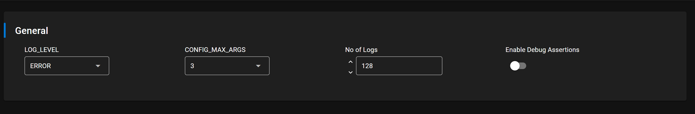

1. **LOG_LEVEL** -- compile-time default for `SL_LOG_CONFIG_LEVEL_COMPILE_TIME`. Selects the build-time logging behaviour:
   - `NONE` -- all logging is permanently disabled. Every `SL_PRINT_STRING_*` macro is replaced with a void operation at compile time, so logs *cannot* be re-enabled at runtime.
   - `DEBUG`, `INFO`, `WARN`, `ERROR` -- the logging macros are compiled in. The chosen level becomes the *initial* runtime filter only; the runtime `log_level` variable is seeded from this value. `ERROR` is the default.

   See [Logger Levels](#logger-levels) for runtime behaviour.

2. **CONFIG_MAX_ARGS** -- maximum number of arguments accepted by a single `SL_PRINT_STRING_*` call (`SL_LOG_CONFIG_ARG`). Exceeding this at compile time produces an error (see [Limitations](#limitations) item 1). Selectable from 0 through 10; the UC default is 3.

3. **No of Logs** -- size, in entries, of the logger's internal ring buffer (`SL_LOG_NUMBER_OF_EVENTS`, range 1-255). Older entries are overwritten when the buffer fills before `sl_log_flush()` runs. Default is 128.

4. **Enable Debug Assertions** -- toggles `SL_LOG_DEBUG_ASSERT_ENABLE`. When enabled, `SL_DEBUG_ASSERT` evaluates its condition and traps on failure; when disabled it compiles to a no-op so release builds save code space. Default is off.

### DEBUG LOGGER Proprietary UC Configuration (non-RTT IO Stream Compact only)

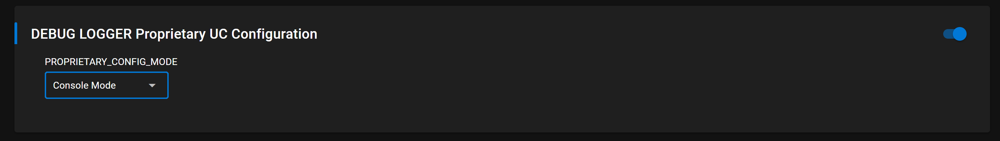

This group only appears when the active backend contributes `log_backend_proprietary`:

| Backend / transport                                                          | Proprietary UC group exposed? |
| ---------------------------------------------------------------------------- | ----------------------------- |
| IO Stream Compact (`si91x_log_iostream_compact`) over a non-RTT transport (UART/VCOM, etc.) | Yes                           |
| IO Stream Compact over RTT (`iostream_rtt_si91x`)                            | No                            |
| IO Stream Formatted (`si91x_log_iostream_formatted`), any transport          | No                            |
| SEGGER SystemView (`log_backend_systemview`)                                 | No                            |

**PROPRIETARY_CONFIG_MODE** -- chooses how the logger emits encoded events (`SL_LOG_CONFIG_MODE`):

- `Buffer Mode` -- events accumulate in the internal ring buffer can't be flushed from the application.
- `Console Mode` -- events are sent directly to the configured console / UART path. **(default)**
- `Host Mode` -- events are forwarded to the host interface. Call `sl_log_flush()` from the idle hook (or a low-priority task) to deliver buffered records.

## Logger Backends

### Choosing a Backend

The SL Log core (`si91x_log`) routes events to **exactly one** installed backend. You select the backend by adding the matching software component in the **Software Components** view.

| Backend component | Component id | On-the-wire format | Best for |
| --- | --- | --- | --- |
| SL Log Si91x Backend IO Stream **compact** | `si91x_log_iostream_compact` | Encoded `sl_log_event_t` records | Highest log throughput, lowest on-wire overhead. Decoded by `Log_script.py`. |
| SL Log Si91x Backend IO Stream **formatted** | `si91x_log_iostream_formatted` | Human-readable text lines | Quick on-screen reading in an RTT viewer or terminal — no host decoder needed. |
| SL Log Si91x Backend SEGGER SystemView | `log_backend_systemview` | SystemView trace events over RTT | Trace correlation alongside FreeRTOS task / interrupt timelines. |

> If your project already references the Si91x logger APIs but you do *not* want any backend installed, see the standalone [Log None Component (No-Op Stub)](#log-none-component-no-op-stub) section below.

> **Important — single backend rule:** Install only one backend component at a time. If you add a second one, Simplicity Studio prompts you to **Replace** the existing backend; see [Switching or Replacing the Logger Backend](#switching-or-replacing-the-logger-backend).

### SEGGER SystemView Backend

- **What it does:** Forwards logger events into SEGGER SystemView as compact, tool-friendly trace data (encoded for a host tool, not plain text on a console).
- **How to install (firmware):** In Software Components, add Log Segger Systemview (id: `log_backend_systemview`). Simplicity Studio resolves SEGGER SystemView (`segger_systemview`) and related pieces. Keep the Si91x Log core (`si91x_log`) for Si91x platform integration (`log_platform_core`). Build and flash the image; connect a J-Link (or supported probe) over SWD to the Si91x M4 debug port as required by your kit.

  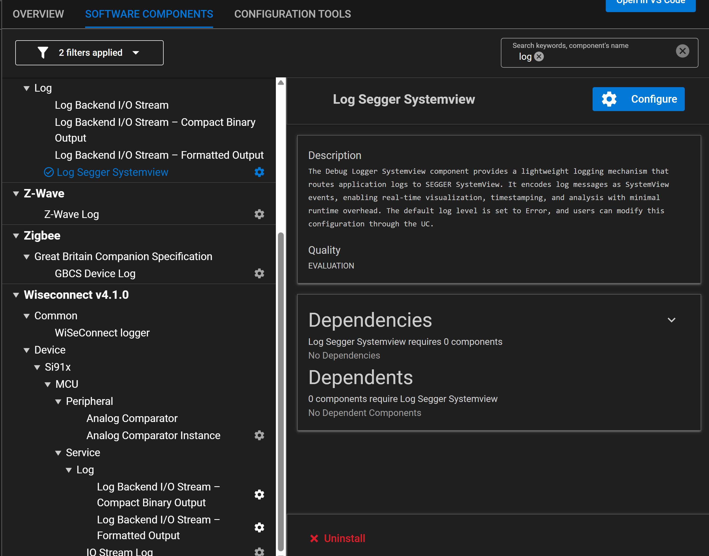

- **Viewing logs:** Use the SEGGER SystemView host application on the PC. The flow below matches the dialogs shown in the figures (SystemView V4.10 UI).

> **Note:** This example is validated with SEGGER SystemView version 4.1.0. Use this version (or a compatible newer release) for best results.

  **SEGGER SystemView Host Setup (Step by Step)**

1. **Start a new SystemView project.** Launch SEGGER SystemView, then open File -> New Project (shortcut Ctrl+Shift+N).

   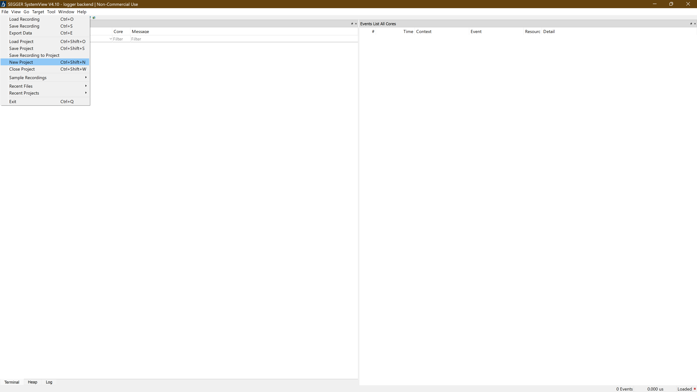

2. **Project name and file location.** Enter a project name, choose where to store the `.SVPrj` file, then click Next.

   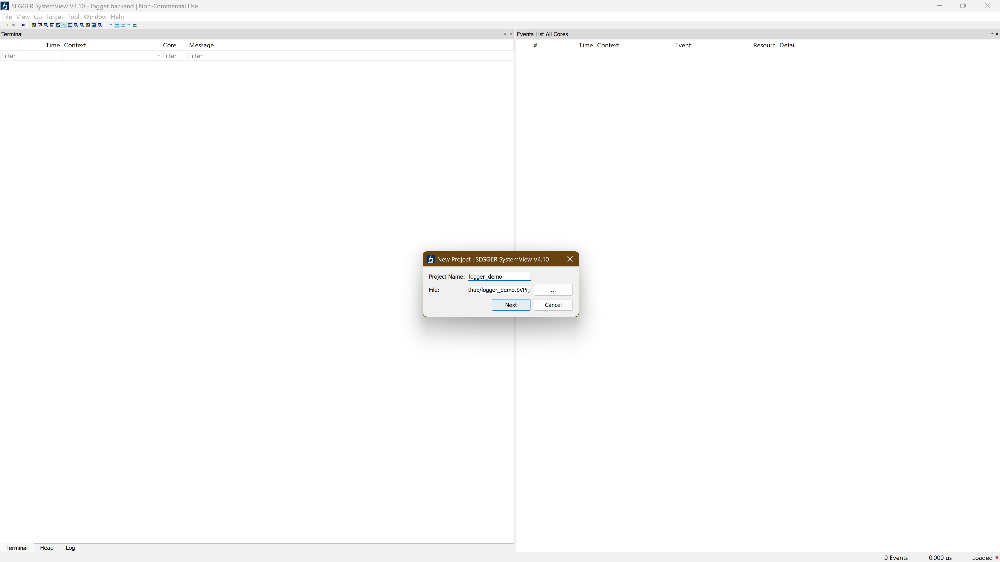

3. **Select the recorder.** In Recorder Configuration, set SystemView Recorder to J-Link (typical for Si91x kits with a J-Link interface). Click Next.

   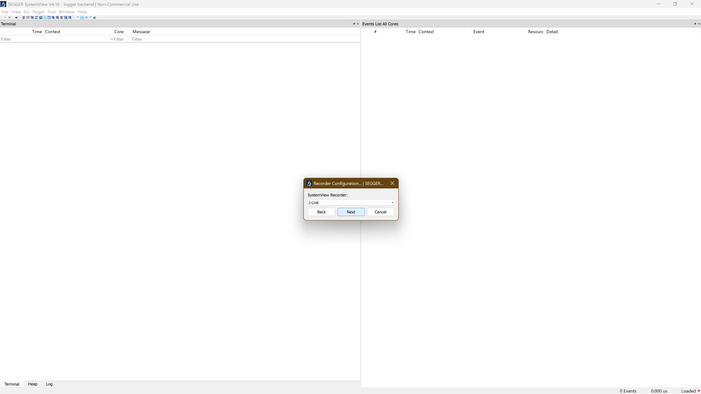

4. **Connection, target, and RTT control block.** Configure the J-Link connection (usually USB), Target Device (for example CORTEX-M4 when tracing the M4 application), Target Interface (SWD), Interface Speed (for example 4000 kHz), and Number of cores set to 2. The Si91x is a dual-core part (M4 application core plus the NWP / companion core), so 2 matches the kit; do not leave this on Auto.

   Under RTT Control Block Detection, select Read from ELF file so SystemView reads RTT and symbol information from your built application image (no manual address entry required).

   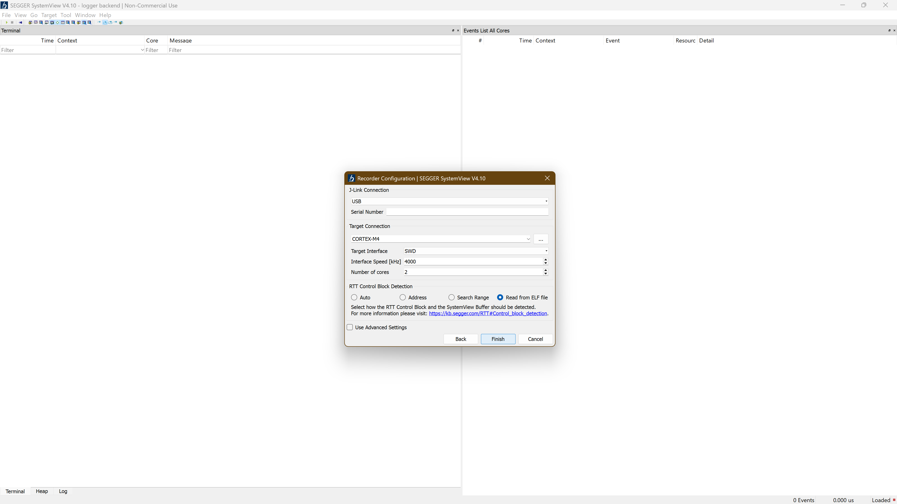

   Complete the wizard with Finish (or Next / Back as the dialogs offer) so the recorder configuration is stored in the project.

5. **Project tab: application image, messages, and descriptions.** Open the Project tab in SystemView (toolbar icons such as Select application ELF Files, Select Description Files, Select Message Files).

   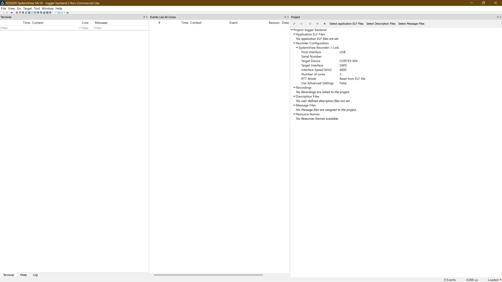

   - **Application ELF files.** Click Select application ELF Files to open the Select Files dialog, then click Add to browse for the image.

     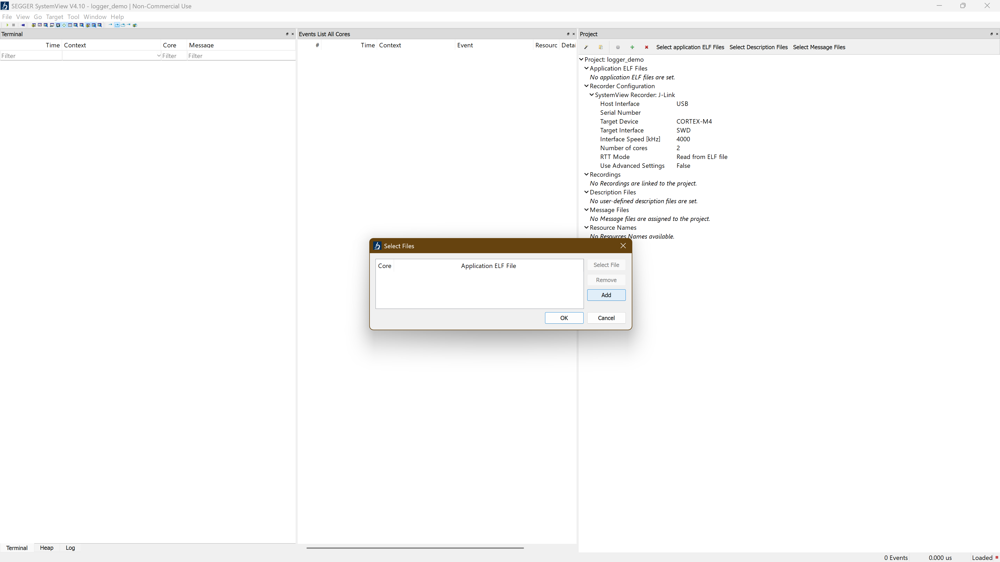

     In the Add Application ELF File dialog, set Core to Core 0 and pick the project's build output -- `sl_si91x_logger_backend.out` from the project's build folder. This image must match the firmware you flashed; SystemView also uses it to resolve `_SEGGER_RTT` and related symbols when Read from ELF file is selected for RTT.

     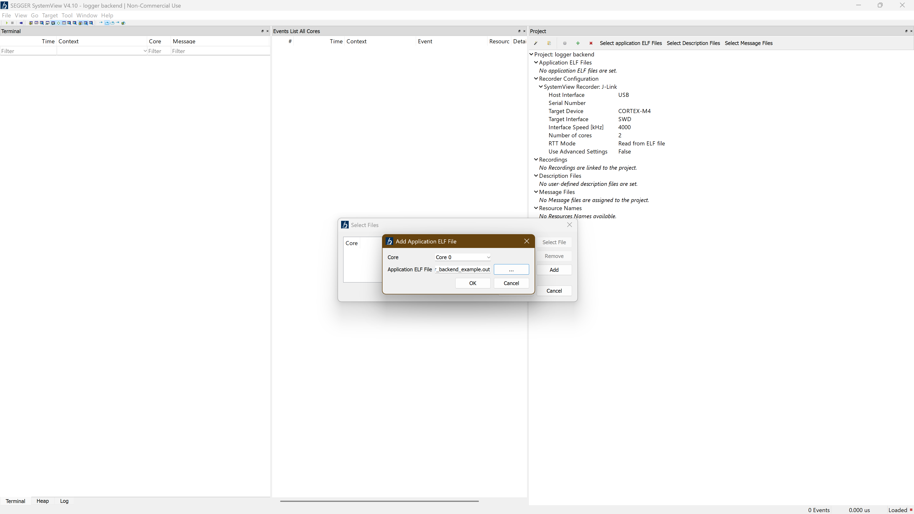

   - **Message files.** Click Select Message Files to open the Select Message Files dialog. The list is already pre-populated with a row for the application ELF/OUT you added in the previous step and by default ELF section will be `.sv-data`.

     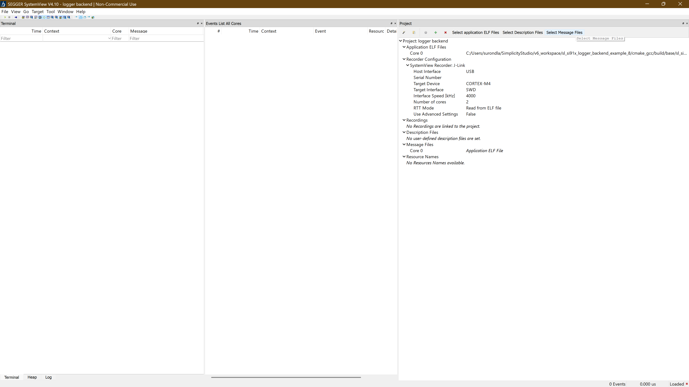

     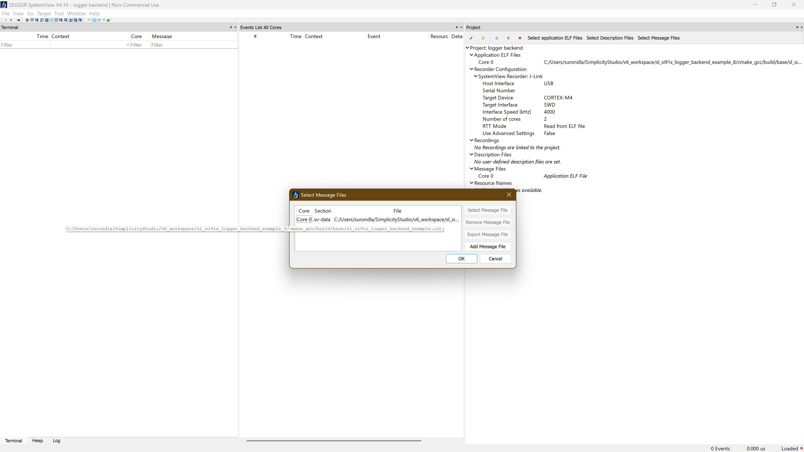

     Double-click the existing row to open the Add Message File dialog, change ELF section name to `.log_fmt` (the section the Si91x logger emits formatted message entries into), and click OK.

     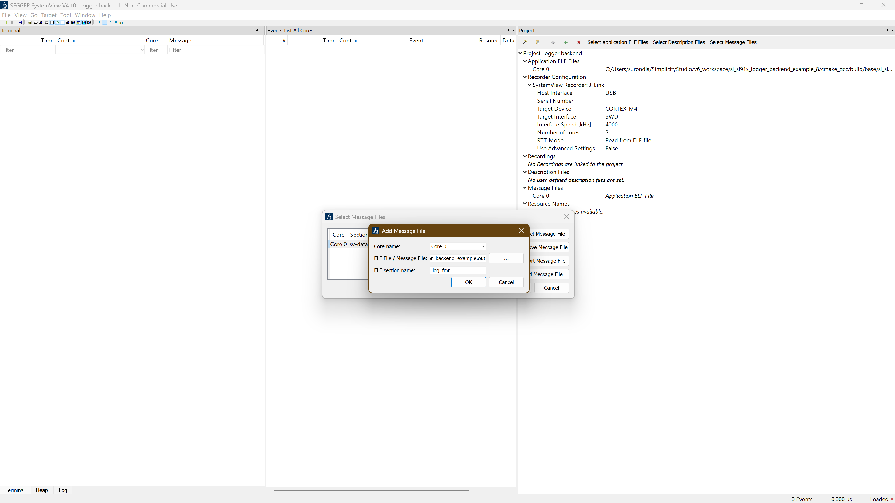

   - **Description files.** Add description files so events decode with the right names. For example, include the FreeRTOS description file when the firmware uses FreeRTOS, and include any Silicon Labs captive or companion-core description files supplied with the SDK, such as `SYSVIEW_CaptiveCore.txt`, when symbols are needed for the wireless or secondary core in a multi-core trace. Store user description files in the project's `Users/<username>/.sysview` directory.
   - The `SYSVIEW_CaptiveCore.txt` description file is provided with the WiseConnect SDK at `wiseconnect/connectivity_firmware /nwp_log_descriptor/SYSVIEW_CaptiveCore.txt`.

6. **Start recording.** Attach the probe, reset or run the target, then use Target / Go (per SEGGER documentation) to start capturing. Logger events appear in the Events list when the firmware is built with `log_backend_systemview` and RTT is configured correctly.

For deeper behavior and troubleshooting, refer to the official SEGGER SystemView user guide and release notes.

### IO Stream Backend

Pick one of the Si91x IO Stream logger components:

| Mode      | Component (id)                                                              | On-the-wire output                                                                            |
| --------- | --------------------------------------------------------------------------- | --------------------------------------------------------------------------------------------- |
| Compact   | SL Log Si91x Backend Iostream compact (`si91x_log_iostream_compact`)        | Encoded proprietary stream (same family as UART; tool-oriented, decoded by `Log_script.py`).  |
| Formatted | SL Log Si91x Backend Iostream formatted (`si91x_log_iostream_formatted`)    | Human-readable, printf-like lines suitable for a terminal or RTT viewer.                      |

> **Note — Use IO Stream Compact for ULP / PS2 use cases:** When the application enters the PS2 ULP power state, Flash is powered down. The IO Stream **Formatted** backend reads its printf format strings from Flash (`.log_fmt`) at runtime to render each log line, so any log emitted while in PS2 — or before the format strings become reachable again after wake-up — appears as a `(null)` / empty message on the host. The IO Stream **Compact** backend emits only the format-string address (plus the cast arguments) and the strings are resolved host-side by `Log_script.py` using the application ELF, so it does not require Flash to be powered to produce valid log output.
>
> For this reason, the WiSeConnect ULP/UULP peripheral examples and the Power Manager Tickless Idle example are configured with `si91x_log_iostream_compact` rather than `si91x_log_iostream_formatted`. Use the same backend in your own application whenever the device must produce log output while running in (or transitioning through) PS2.

To install the IO Stream logger component, open the Software Components tab, navigate to WiSeConnect -> Device -> Si91x -> MCU -> Service, and select either SL Log Si91x Backend Iostream compact or SL Log Si91x Backend Iostream formatted, then click Install. (The figure below shows the formatted variant; the compact variant is installed the same way.)

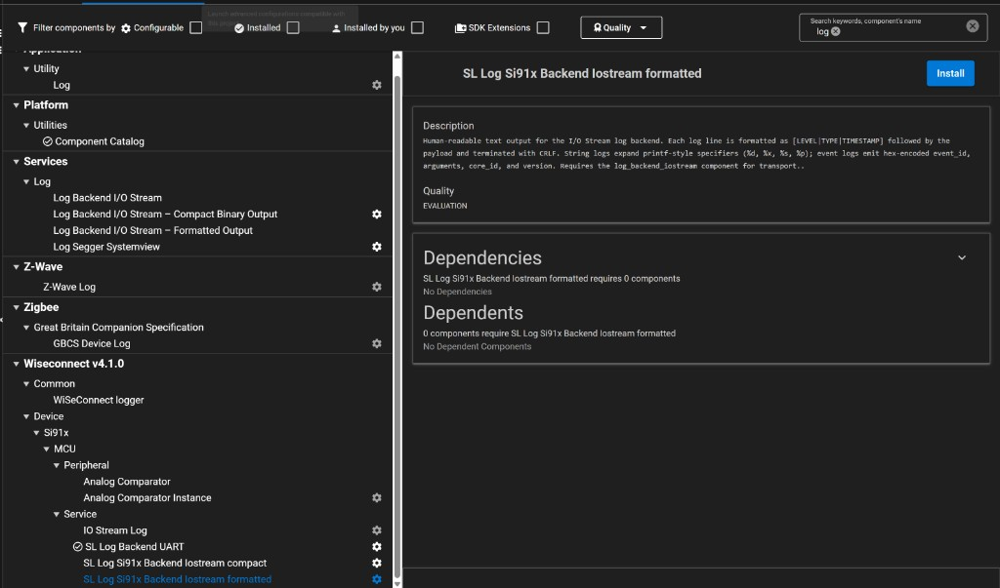

Add either `si91x_log_iostream_compact` or `si91x_log_iostream_formatted`, not both. If Studio offers compact vs formatted and a transport choice, accept the recommended RTT stack unless you deliberately switch to UART or another transport (see below).

**Default transport (RTT).** Installing an IO Stream logger backend pulls in SEGGER RTT and IO Stream: RTT in WiSeConnect as the default path so logs go over RTT without extra steps. After installing the logger backend, you can confirm this by searching `iostream` in the Software Components tab. Both IO Stream and IO Stream RTT appear as already installed (green check / Uninstall action), which means RTT is the default transport and no further steps are needed to start seeing logs in an RTT viewer.

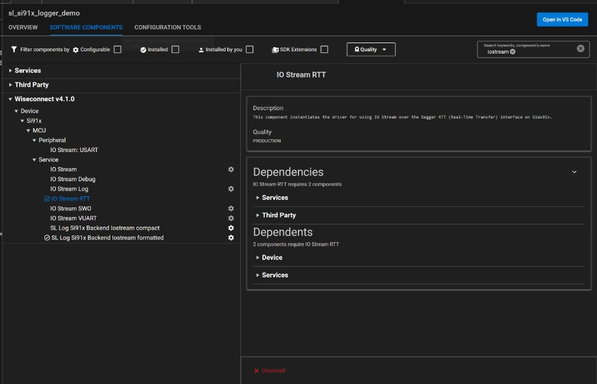

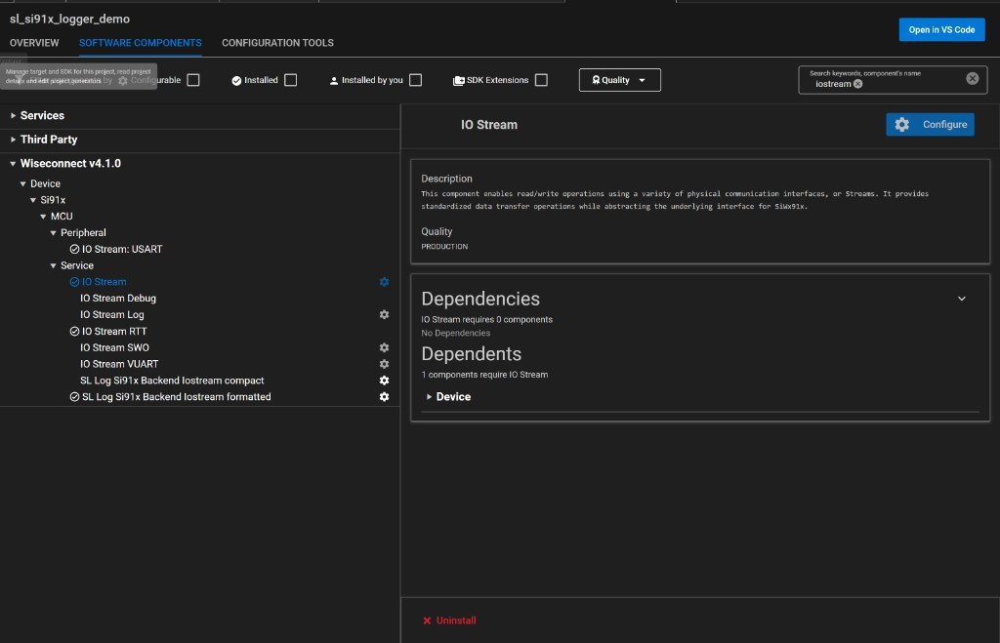

**Other IO Stream transports.** In Software Components, search `iostream`. Under WiSeConnect (device Services / Si91x service components) and under Services (platform IO Stream drivers), you can add alternatives such as IO Stream UART, or other supported streams. Complete any instance or pin configuration the IDE requests.

**For IO Stream UART:** To use IO Stream over UART (VCOM), you need to install two components.

1. IO Stream (id: `iostream_si91x`) -- WiSeConnect Si91x IO Stream base.
2. IO Stream: Si91x UART (id: `iostream_uart_si91x`) -- under Services -> IO Stream -> Driver.

To install the UART IO Stream, open Software Components, search for `iostream`, and under Services -> IO Stream -> Driver, select IO Stream: Si91x UART and click Install.

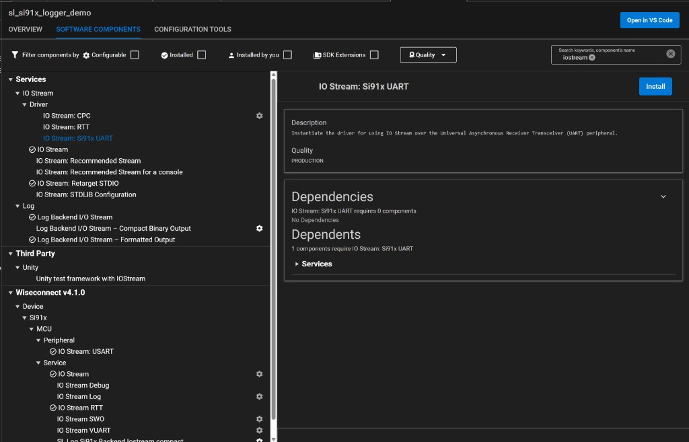

When Studio prompts to Create A Component Instance, enter the instance name `vcom` and click Done so the logger uses the board's virtual COM / debug UART path expected for host serial tools.

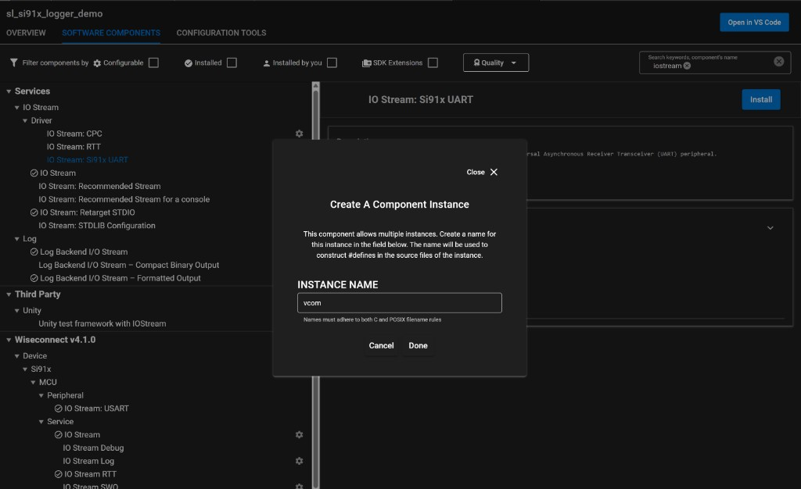

After the instance is created, IO Stream: Si91x UART shows as installed (with an Add New Instances / Instances action available for managing additional instances).

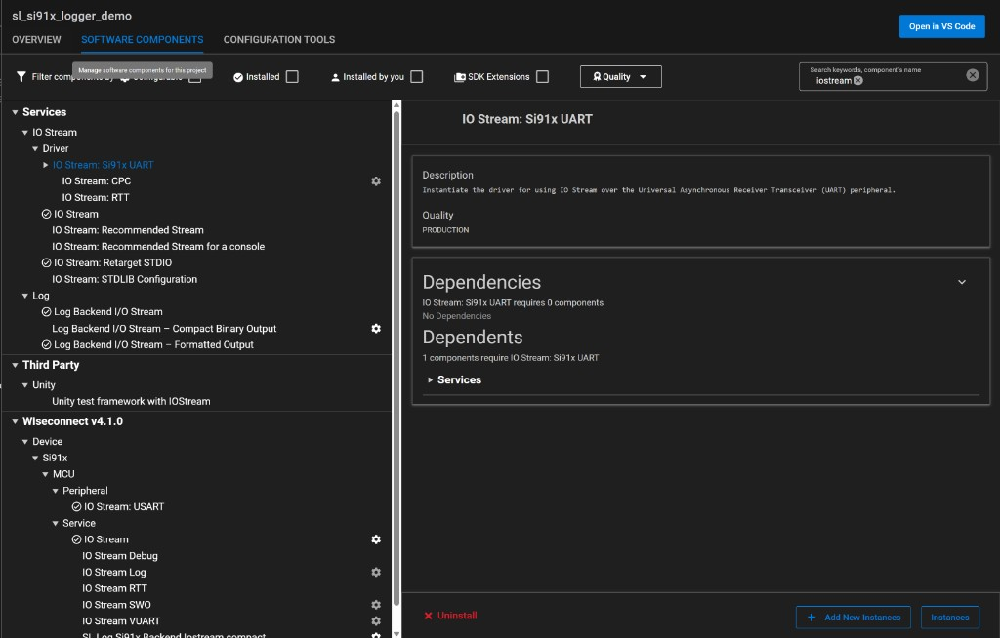

 **IO Stream Formatted Log Line Layout**

With IO Stream Formatted, each printed line uses a fixed bracketed header followed by the message text (for example in SEGGER RTT "Data from stimulus port(s):" or a UART terminal).

Pattern: `[<level><type>|<timestamp_hex>] <message>`

| Field             | Meaning                                                                |
| ----------------- | ---------------------------------------------------------------------- |
| `<level>`         | First character: `D` = Debug, `I` = Info, `W` = Warn, `E` = Error.     |
| `<type>`          | Second character: `S` = string log, `E` = event.                       |
| `<timestamp_hex>` | Third field, an 8-character hexadecimal timestamp.                     |
| `<message>`       | Human-readable string (for example `Info Print`).                      |

Example:

```
[I|S|0494B1BF] Info Print
```

`I` = Info, `S` = string, `0494B1BF` = timestamp, `Info Print` = message.

### Switching or Replacing the Logger Backend

1. Open Software Components for the project.
2. Add the desired backend component (SystemView, or an IO Stream variant).
3. If the new backend conflicts with the one already installed, Simplicity Studio opens a dialog such as "The component was not added", naming both components (for example SL Log Si91x Backend Iostream Formatted vs SL Log Si91x Backend Iostream Compact). You do not need to remove the old backend manually first -- pick one of the radio options:
   - **Replace ...** -- swap the existing logger backend for the new one (recommended when you intend to change transport).
   - **Keep ...** -- leave the current backend and cancel the add.

   The dialog warns that replacing conflicting components may cause irreversible project changes; review the summary, then click OK or Cancel as appropriate.

   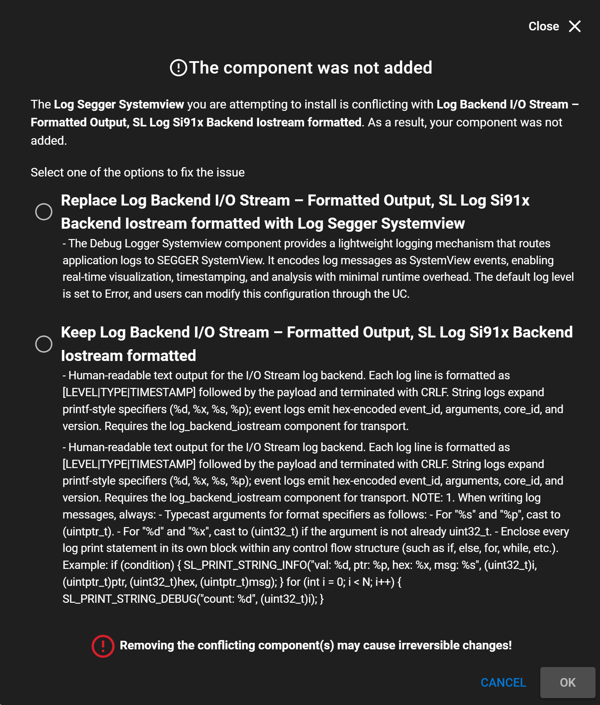

4. Generate / build, and use the correct host flow (decoder script, SystemView, RTT viewer, or serial terminal) for that backend.

## Log None Component (No-Op Stub)

The **SL Log None** component (id: `log_none`) is a lightweight stub that exposes the Si91x logger headers and provides weak no-op implementations of the logger APIs. It is *not* a logger backend — it does not encode, route, or transport any events. Its sole purpose is to keep code compilable and linkable when the full logger is intentionally left out of a project.

- **What it provides**
  - The logger helper header (`sl_log_helper.h`) so that `SL_PRINT_STRING_DEBUG/INFO/WARN/ERROR(...)`, `SL_PRINT_EVENT_*`, `SL_LOG_CRASH_ASSERT`, `SL_LOG_DEBUG_ASSERT`, and similar macros expand to no-ops.
  - Weak stubs for the runtime entry points (for example `sl_log_init`, `sl_log_flush`, `sl_log_set_loglevel`, `sl_log_get_loglevel`) so that calls from existing application or middleware code resolve at link time without pulling in a real backend.

- **When to use it**
  - You are integrating source files (drivers, middleware, examples) that already invoke the Si91x logger macros / APIs, but you do not want to add a real backend (RTT, UART, SystemView) to your build — for example to save flash, avoid extra peripherals, or strip logging from a release image.
  - You want a clean way to compile and link a project that references the logger surface area without producing "undefined reference" or "unknown identifier" errors and without emitting any log traffic.

- **What it is *not***
  - It is not a backend. It does not encode or transport events anywhere; nothing reaches RTT, UART, or SystemView.
  - It is not a runtime "off" switch — for that, set the compile-time **LOG_LEVEL** to `NONE` in UC (see [General (common to all backends)](#general-common-to-all-backends)) when the full logger is installed, or leave the runtime `log_level` at a high threshold.

- **How to add it**
  - **Via SLCP** — list it under the `component` section of your project's `.slcp`, for example:

    ```yaml
    component:
      - id: log_none
    ```

  - **Via SLCC** — add it as a dependency from your own component's `.slcc`:

    ```yaml
    requires:
      - name: log_none
    ```

  - The component is hidden from the Software Components catalog by design (`visibility: never`), so it is added by editing the project descriptor or by being pulled in as a transitive dependency rather than from the UI.

## Test the Application

1. **Create the project** from the **Platform SiWx91x – Logger Backend Example** template, or import these sources into your own Si91x project.
2. **Configure (optional)**
   - Pick the backend you want — see [Choosing a Backend](#choosing-a-backend).
   - Adjust UC *Debug Level*, *Max Number of Arguments*, and *Number of Logs* as needed.
3. **Build and flash** the project.
4. **View logs**, depending on the backend you selected:

   | Backend | How to view |
   | --- | --- |
   | IO Stream **compact** (RTT) | Capture RTT, then run `Log_script.py` against the captured stream. |
   | IO Stream **formatted** (RTT) | Open an RTT viewer (J-Link RTT Viewer or Studio's Serial 1 Console) — text appears directly. |
   | IO Stream **UART (VCOM)** | Open the board VCOM port at the configured baud — text appears directly (formatted) or pipe through `Log_script.py` (compact). |
   | SystemView | Run SEGGER SystemView with the project as set up above. |

5. **Press BTN0** to cycle the runtime log level (`DEBUG → INFO → WARN → ERROR → DEBUG`). Observe how lower-priority lines disappear from the host as the threshold rises.


## Console Output

The captures below show the same firmware running with each backend. The first INFO line (`Log Backend: <variant> ...`) is emitted once at startup by the example's compile-time backend-detection code in `sl_si91x_logger_example.c`; the repeating block (`Formatted: Current log level: ...`, `Visible prints: ...`, `INFO`, `WARN`, `ERROR`) is the per-second loop in `application_start`.

### IO Stream Formatted over RTT (Simplicity Commander)

Default install. With `si91x_log_iostream_formatted` and the auto-pulled `iostream_rtt` component, open Simplicity Commander, switch to the **RTT** tab, enable **Reset target on connect**, and click **Connect**:

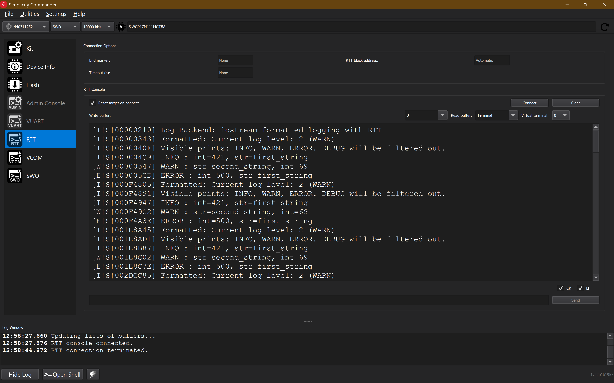

### IO Stream Formatted over UART (VCOM)

After installing `iostream_si91x` plus `iostream_uart_si91x` with instance `vcom` as backend, the same lines stream out the board's virtual COM port. Open any serial terminal (here, Docklight) at **115200 8N1**:

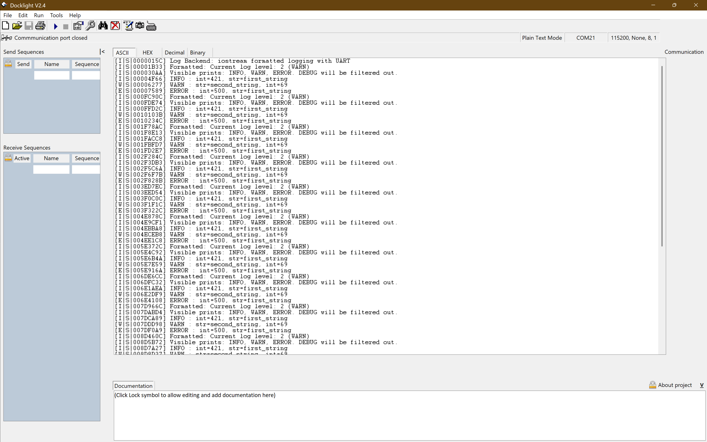

### SEGGER SystemView Events List

With `log_backend_systemview` installed and the [SEGGER SystemView host setup](#segger-systemview-host-setup-step-by-step) completed, logger events appear in the SystemView **Events** and **Terminal** panes (Core 0, Context = `app`):

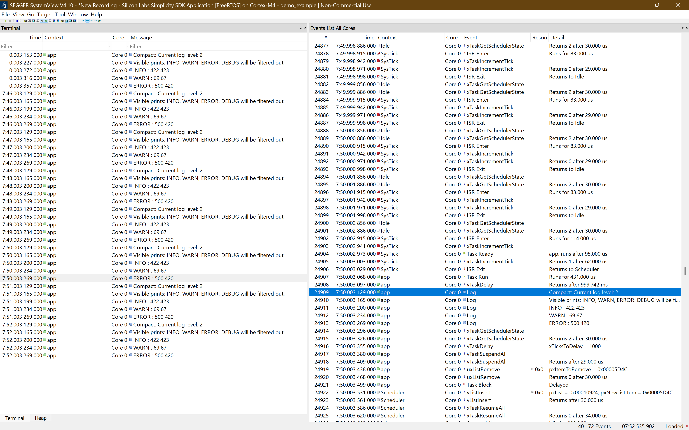

## Limitations

1. **Maximum number of arguments.** When calling any log printing macro the maximum number of arguments is 10. Passing more than 10 produces a compilation error. Always ensure log macro calls use no more than 10 arguments.

2. **Format specifiers and argument-type requirements by backend.**

   | Backend             | Allowed specifiers     | Required cast                                                                                            | Mixing rules                              |
   | ------------------- | ---------------------- | -------------------------------------------------------------------------------------------------------- | ----------------------------------------- |
   | IO Stream Formatted | `%d`, `%x`, `%p`, `%s` | `(uint32_t)` for non-pointer / non-string args; `(uintptr_t)` for `%p` and `%s` arguments.               | May mix freely.                           |
   | IO Stream Compact   | `%lu`                  | `(uint32_t)` for every argument; strings cannot be rendered (decode on the host with `Log_script.py`).   | Numeric only.                             |
   | SEGGER SystemView   | `%d`, `%u`, `%x` | None enforced by the macro.                              | None |

   IO Stream Formatted -- allowed:

   ```c
   SL_PRINT_STRING_INFO("val: %d, ptr: %p, hex: %x, msg: %s",
                        (uint32_t)i, (uintptr_t)ptr,
                        (uint32_t)hex, (uintptr_t)msg);
   ```

   IO Stream Formatted -- not allowed:

   ```c
   SL_PRINT_STRING_INFO("float: %f", fvalue); // %f not supported
   SL_PRINT_STRING_INFO("val: %d", i);        // missing (uint32_t) cast
   ```

   IO Stream Compact -- allowed:

   ```c
   SL_PRINT_STRING_INFO("number: %lu", (uint32_t)number);
   ```

   IO Stream Compact -- not allowed:

   ```c
   SL_PRINT_STRING_INFO("msg: %s", (uintptr_t)msg); // strings unsupported in Compact
   ```

   Using unsupported format specifiers, or failing to cast arguments as required, results in invalid or unreadable output and may produce build warnings or errors.

3. **Buffer overflow is reported, not blocked.** When the ring buffer fills, new events are dropped and an `event_id = 0xFFFFFFFF` overflow marker (with the dropped count) is delivered the next time `sl_log_flush()` runs. Increase **Number of Logs** in UC, or call `sl_log_flush()` more often, if you see overflows.

4. **Lowest allowable power state is PS3 for RTT and SystemView backends when a debugger is connected.** When using an RTT-based IO Stream backend or the SEGGER SystemView backend, the logger prevents the device from entering sleep or active power states below PS3 while an active debugger connection is detected, so debug and log capture sessions can remain connected.

## Troubleshooting

- If the project does not build, confirm Simplicity Studio, the WiSeConnect extension, and SDK versions match the `.slcp` requirements.
- If the device is not detected, refresh connectivity firmware and USB drivers.
- If IO Stream UART shows no output, confirm IO Stream Si91x, IO Stream: Si91x UART, and the `vcom` instance are installed and configured.
- `Log_script.py --reset` on a multi-kit bench: the helper invokes `commander device reset` without `--serialno` / `--ip`, so it targets the first attached J-Link / WSTK adapter. If you have more than one kit connected, either disconnect the others, or add the appropriate selector flag to the command (or extend `reset_device()` in `Log_script.py`) so the correct board is reset.
- On Windows, COM ports appear as `COM<N>` (for example `COM3`). On macOS and Linux they appear as `/dev/tty.usbmodem*` and `/dev/ttyACM*` / `/dev/ttyUSB*` respectively; pass the matching path via `--port` to `Log_script.py`.

## Resources

- [WiSeConnect Getting Started](https://docs.silabs.com/wiseconnect/latest/wiseconnect-getting-started/)
- [WiSeConnect Examples](https://docs.silabs.com/wiseconnect/latest/wiseconnect-examples/)
- [Si91x SoC Documentation](https://docs.silabs.com/wiseconnect/latest/)

## Report Bugs / Support

For issues and support, use the Silicon Labs Community or your normal support channel.
