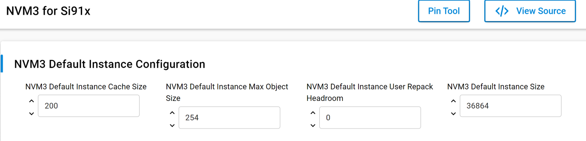

# SL NVM3 COMMON FLASH

## Table of Contents

- [Purpose/Scope](#purposescope)
- [Overview](#overview)
- [About Example Code](#about-example-code)
- [Prerequisites/Setup Requirements](#prerequisitessetup-requirements)
  - [Hardware Requirements](#hardware-requirements)
  - [Software Requirements](#software-requirements)
  - [Setup Diagram](#setup-diagram)
- [Getting Started](#getting-started)
- [Application Build Environment](#application-build-environment)
- [Test the Application](#test-the-application)

## Purpose/Scope

- This application demonstrates the use of Third Generation Non-Volatile Memory (NVM3) data storage in Si91x common flash.

## Overview

The NVM3 provides a means to write and read data objects (key/value pairs) stored in Flash. Wear-leveling is applied to reduce erase and write cycles and maximize flash lifetime. The driver is resilient to power loss and reset events, ensuring that objects retrieved from the driver are always in a valid state. A single NVM3 instance can be shared among several wireless stacks and application code, making it well-suited for multiprotocol applications.

For more detailed information about NVM3, refer to [Third Generation NonVolatile Memory (NVM3) Data Storage](https://www.silabs.com/documents/public/application-notes/an1135-using-third-generation-nonvolatile-memory.pdf).

## About Example Code

- This example performs wireless initialization before using NVM3 APIs using sl_net_init(). This is done to set up NWP-M4 communication.
- After successful wireless init, NVM3 init is done using nvm3_initDefault() API.
- Two counter objects are initialized using nvm3_writeCounter() API. One is used to track the number of writes and another is used for
  tracking number of deleted objects.
- Four NVM3 data objects are written with keys numbered from 1 to 4 using nvm3_writeData() APIs and each write is followed by nvm3_incrementCounter()
  API for tracking the number of data objects written.
- After writing each data object, it is again read using nvm3_readData() API.
- The nvm3_app_display() function now shows all the objects stored in NVM3.
- After writing and reading all keys, they are deleted using nvm3_deleteObject() API.
- The nvm3_app_display() function now shows all the objects deleted in NVM3.
- At end all the NVM3 data is erased using nvm3_eraseAll() API.
- NVM3 PSRAM example supports the execution of both Text and Data segments from PSRAM.

## Prerequisites/Setup Requirements

### Hardware Requirements

- Windows PC
- Silicon Labs Si917 Evaluation Kit [WPK(BRD4002) + BRD4338A / BRD4342A / BRD4343A ]
- SiWx917 AC1 Module Explorer Kit (BRD2708A)

### Software Requirements

- Simplicity Studio
- Serial console Setup
  - For Serial Console setup instructions, refer [here](https://docs.silabs.com/wiseconnect/latest/wiseconnect-developers-guide-developing-for-silabs-hosts/#console-input-and-output).

### Setup Diagram

## Getting Started

Refer to the instructions [here](https://docs.silabs.com/wiseconnect/latest/wiseconnect-getting-started/) to:

- [Install Simplicity Studio](https://docs.silabs.com/wiseconnect/latest/wiseconnect-developers-guide-developing-for-silabs-hosts/#install-simplicity-studio)
- [Install WiSeConnect 3 extension](https://docs.silabs.com/wiseconnect/latest/wiseconnect-developers-guide-developing-for-silabs-hosts/#install-the-wi-se-connect-3-extension)
- [Connect your device to the computer](https://docs.silabs.com/wiseconnect/latest/wiseconnect-developers-guide-developing-for-silabs-hosts/#connect-si-wx91x-to-computer)
- [Upgrade your connectivity firmware ](https://docs.silabs.com/wiseconnect/latest/wiseconnect-developers-guide-developing-for-silabs-hosts/#update-si-wx91x-connectivity-firmware)
- [Create a Studio project ](https://docs.silabs.com/wiseconnect/latest/wiseconnect-developers-guide-developing-for-silabs-hosts/#create-a-project)

For details on the project folder structure, see the [WiSeConnect Examples](https://docs.silabs.com/wiseconnect/latest/wiseconnect-examples/#example-folder-structure) page.

## Application Build Environment

- Configure UC from the slcp component.

   
- Open **sl_si91x_nvm3_common_flash.slcp** project file select **software component** tab and search for **NVM3 for Si91x** in search bar.
- Using configuration wizard one can configure different parameters like:

### General Configuration

  Configure following macros from UC,
- NVM3_DEFAULT_CACHE_SIZE: Number of NVM3 objects to cache. To reduce access times this number should be equal to or higher than the number 
  of NVM3 objects in the default NVM3 instance.
- NVM3_DEFAULT_MAX_OBJECT_SIZE: Max NVM3 object size that can be stored. This value should be greater than or equal to 204
- NVM3_DEFAULT_REPACK_HEADROOM: NVM3 Default Instance User Repack Headroom, Headroom determining how many bytes below the forced repack limit 
  the user repack limit should be placed. The default is 0, which means the user and forced repack limits are equal.
- NVM3_DEFAULT_NVM_SIZE - Size of the NVM3 storage region in flash. This size should be aligned with the flash page size of the device.

## Test the Application

Refer to the instructions [here](https://docs.silabs.com/wiseconnect/latest/wiseconnect-getting-started/) to:

1. Compile and run the application.
2. After successful program execution the prints in serial console looks as shown below.

   >
