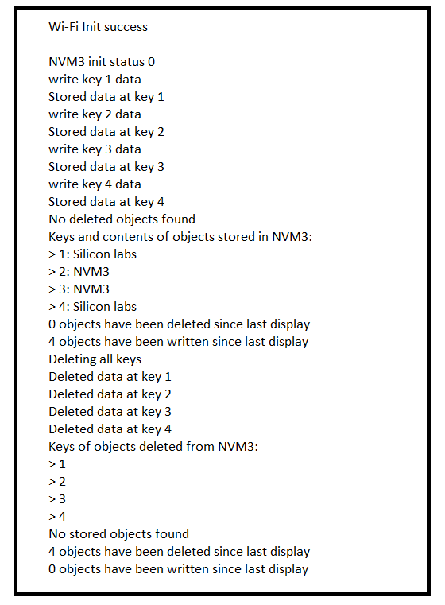

# SiWx91x Platform NVM3 Common Flash

## Table of Contents

- [SiWx91x Platform NVM3 Common Flash](#platform-siwx91x-nvm3-common-flash)
  - [Table of Contents](#table-of-contents)
  - [Purpose/Scope](#purposescope)
  - [Overview](#overview)
    - [Initialization order (mandatory on SiWx91x SoC, common flash)](#initialization-order-mandatory-on-siwx91x-soc-common-flash)
  - [About Example Code](#about-example-code)
  - [Prerequisites/Setup Requirements](#prerequisitessetup-requirements)
    - [Hardware Requirements](#hardware-requirements)
    - [Software Requirements](#software-requirements)
    - [Setup Diagram](#setup-diagram)
  - [Getting Started](#getting-started)
  - [Application Build Environment](#application-build-environment)
    - [General Configuration](#general-configuration)
  - [Test the Application](#test-the-application)
  - [Troubleshooting](#troubleshooting)
  - [Resources](#resources)
  - [Report Bugs/Support](#report-bugssupport)

## Purpose/Scope

- This application demonstrates the use of Third Generation Non-Volatile Memory (NVM3) data storage in SiWx91x common flash.

## Overview

The NVM3 provides a means to write and read data objects (key/value pairs) stored in Flash. Wear-leveling is applied to reduce erase and write cycles and maximize flash lifetime. The driver is resilient to power loss and reset events, ensuring that objects retrieved from the driver are always in a valid state. A single NVM3 instance can be shared among several wireless stacks and application code, making it well-suited for multiprotocol applications.

For more detailed information about NVM3, refer to [Third Generation NonVolatile Memory (NVM3) Data Storage](https://www.silabs.com/documents/public/application-notes/an1135-using-third-generation-nonvolatile-memory.pdf).

### Initialization Order (mandatory on SiWx91x SoC, common flash)

On SiWx91x SoC, NVM3 in common flash requires NWP-M4 communication for program and erase. Wireless initialization must therefore complete before any NVM3 API is called, including `nvm3_initDefault()`.
1. Call `sl_net_init()` (or an equivalent wireless initialization that brings up NWP-M4 communication).
2. Call `nvm3_initDefault()` and other NVM3 APIs only after `sl_net_init()` returns `SL_STATUS_OK`.
   
Calling NVM3 APIs earlier may return `SL_STATUS_NVM3_NO_VALID_PAGES` (0x5E) even when the NVM3 region is sized and linked correctly. On SiWx91x, that status can indicate missing wireless/NWP setup rather than a corrupt or mis-sized NVM3 region.

This ordering requirement is for **common flash** only; NVM3 in **dual flash** does not require wireless initialization (see the dual-flash NVM3 example).

## About Example Code

- This example performs wireless initialization before using NVM3 APIs using `sl_net_init()`. This is mandatory on common flash because it sets up NWP-M4 communication.
- After successful wireless initialization, NVM3 init is done using `nvm3_initDefault()` API.
- Two counter objects are initialized using nvm3_writeCounter() API. One is used to track the number of writes and another is used for
  tracking number of deleted objects.
- Four NVM3 data objects are written with keys numbered from 1 to 4 using nvm3_writeData() APIs and each write is followed by nvm3_incrementCounter()
  API for tracking the number of data objects written.
- After writing each data object, it is again read using nvm3_readData() API.
- The nvm3_app_display() function now shows all the objects stored in NVM3.
- After writing and reading all keys, they are deleted using nvm3_deleteObject() API.
- The nvm3_app_display() function now shows all the objects deleted in NVM3.
- At end all the NVM3 data is erased using nvm3_eraseAll() API.
- NVM3 PSRAM example supports the execution of both Text and Data segments from PSRAM.

## Prerequisites/Setup Requirements

### Hardware Requirements

- Windows PC
- Silicon Labs SiWx91x Evaluation Kit [[BRD4002](https://www.silabs.com/development-tools/wireless/wireless-pro-kit-mainboard?tab=overview) + [BRD4338A](https://www.silabs.com/development-tools/wireless/wi-fi/siwx917-rb4338a-wifi-6-bluetooth-le-soc-radio-board?tab=overview) / [BRD4342A](https://www.silabs.com/development-tools/wireless/wi-fi/siwx91x-rb4342a-wifi-6-bluetooth-le-soc-radio-board?tab=overview) / [BRD4343A](https://www.silabs.com/development-tools/wireless/wi-fi/siw917y-rb4343a-wi-fi-6-bluetooth-le-8mb-flash-radio-board-for-module?tab=overview) / [BRD4343C](https://www.silabs.com/development-tools/wireless/wi-fi/siw917y-rb4343c-wi-fi-6-bluetooth-le-8mb-flash-radio-board-for-module?tab=overview)]
- SiWx917 AC1 Module Explorer Kit (BRD2708A)

### Software Requirements

- Simplicity Studio
- Serial console Setup
  - For Serial Console setup instructions, refer to [link name](https://docs.silabs.com/wiseconnect/latest/wiseconnect-developers-guide-developing-for-silabs-hosts/using-the-simplicity-studio-ide#console-input-and-output).

### Setup Diagram


## Getting Started

Refer to the instructions [here](https://docs.silabs.com/wiseconnect/latest/wiseconnect-getting-started/) to:

- [Install Simplicity Studio](https://docs.silabs.com/wiseconnect/latest/wiseconnect-developers-guide-developing-for-silabs-hosts/using-the-simplicity-studio-ide#install-simplicity-studio)
- [Install WiSeConnect extension](https://docs.silabs.com/wiseconnect/latest/wiseconnect-developers-guide-developing-for-silabs-hosts/using-the-simplicity-studio-ide#install-the-wiseconnect-3-extension)
- [Connect your device to the computer](https://docs.silabs.com/wiseconnect/latest/wiseconnect-developers-guide-developing-for-silabs-hosts/using-the-simplicity-studio-ide#connect-siwx91x-to-computer)
- [Upgrade your connectivity firmware](https://docs.silabs.com/wiseconnect/latest/wiseconnect-developers-guide-developing-for-silabs-hosts/using-the-simplicity-studio-ide#update-siwx91x-connectivity-firmware)
- [Create a Studio project](https://docs.silabs.com/wiseconnect/latest/wiseconnect-developers-guide-developing-for-silabs-hosts/using-the-simplicity-studio-ide#create-a-project)

For details on the project folder structure, see the [WiSeConnect Examples](https://docs.silabs.com/wiseconnect/latest/wiseconnect-examples/#example-folder-structure) page.

## Application Build Environment

- Configure UC from the slcp component.

   
- Open **sl_si91x_nvm3_common_flash.slcp** project file select **software component** tab and search for **NVM3 for SiWx91x** in search bar.
- Using configuration wizard one can configure different parameters like:

> **Note**: For recommended settings, please refer the [recommendations guide](https://docs.silabs.com/wiseconnect/latest/wiseconnect-developers-guide-prog-recommended-settings/).

### General Configuration

  Configure following macros from UC,
- NVM3_DEFAULT_CACHE_SIZE: Number of NVM3 objects to cache. To reduce access times this number should be equal to or higher than the number
  of NVM3 objects in the default NVM3 instance.
- NVM3_DEFAULT_MAX_OBJECT_SIZE: Max NVM3 object size that can be stored. This value should be greater than or equal to 204
- NVM3_DEFAULT_REPACK_HEADROOM: NVM3 Default Instance User Repack Headroom, Headroom determining how many bytes below the forced repack limit
  the user repack limit should be placed. The default is 0, which means the user and forced repack limits are equal.
- NVM3_DEFAULT_NVM_SIZE - Size of the NVM3 storage region in flash. This size should be aligned with the flash page size of the device.

- Configure the following application macros in `app.c`:

- `MAX_OBJECT_COUNT`: Specifies the maximum number of data objects that can be stored in the NVM3 instance by the application. By default, it is set to 10.

  ```c
  #define MAX_OBJECT_COUNT    10                                  // Maximum number of data objects saved
  ```

## Test the Application

Refer to the instructions [here](https://docs.silabs.com/wiseconnect/latest/wiseconnect-getting-started/) to:

1. Compile and run the application.
2. After successful program execution the prints in serial console looks as shown below.

   >

## Troubleshooting

- If the project does not build, ensure Simplicity Studio and the WiSeConnect extension are installed and the board is connected.
- If the device is not detected, reinstall the connectivity firmware and check USB drivers.
- If `nvm3_initDefault()` returns `SL_STATUS_NVM3_NO_VALID_PAGES` (0x5E):
  - Verify that wireless initialization (`sl_net_init()` or equivalent) has completed successfully before the NVM3 call. On SiWx91x SoC common flash this status often reflects missing NWP-M4 communication rather than an invalid NVM3 region.
  - Make sure NVM3 is not being initialized from `sl_platform_init()`, an early `app_init()` path, or any other code that runs before wireless initialization.
  - If the application needs NVM3 before wireless is up, use NVM3 in dual flash instead of common flash. Refer to the dual-flash NVM3 example for more information.

## Resources

- [WiSeConnect Getting Started](https://docs.silabs.com/wiseconnect/latest/wiseconnect-getting-started/)
- [WiSeConnect Examples](https://docs.silabs.com/wiseconnect/latest/wiseconnect-examples/)
- [SiWx91x SoC Documentation](https://docs.silabs.com/wiseconnect/latest/)

## Report Bugs/Support

For issues and support, use the Silicon Labs Community or your normal support channel.

