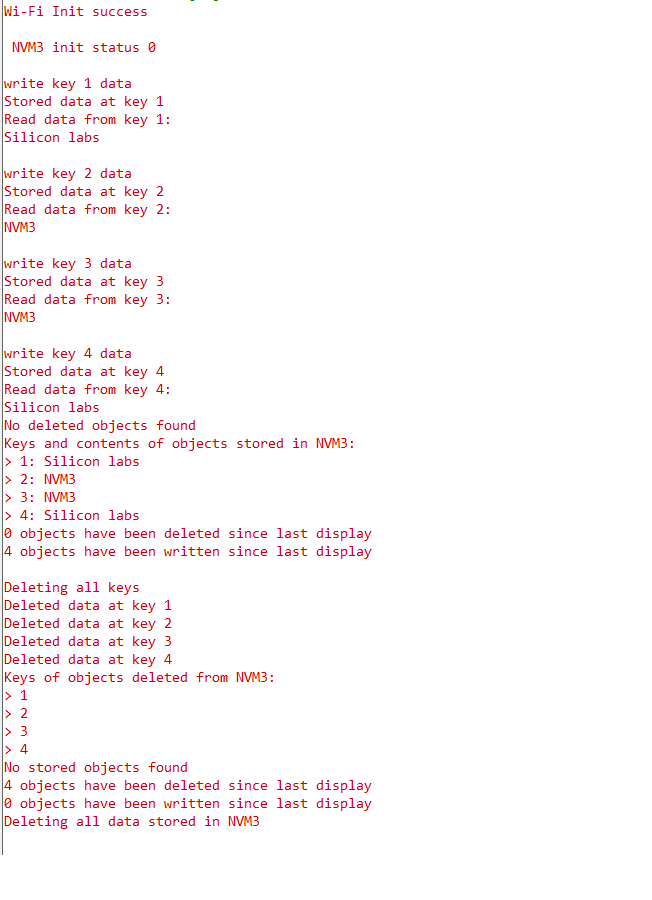

# SL NVM3 COMMON FLASH

- [Purpose/Scope](#purposescope)
- [Prerequisites/Setup Requirements](#prerequisitessetup-requirements)
  - [Hardware Requirements](#hardware-requirements)
  - [Software Requirements](#software-requirements)
  - [Setup Diagram](#setup-diagram)
- [Getting Started](#getting-started)
- [Test the Application](#test-the-application)
- [Resources](#resources)

## Purpose/Scope

- This application demonstrates the use of Third Generation Non-Volatile Memory (NVM3) data storage in Si91x common flash.
- This application performs Wifi init to allow communication between TA and M4.
- This application writes initializes NVM3 and does following operations:

  1. Store 4 keys in flash using NVM3 write
  2. Display 4 keys stored
  3. Delete 4 keys

## Prerequisites/Setup Requirements

- To use this application following Hardware, Software and the Project Setup is required.

### Hardware Requirements

- Windows PC
- Silicon Labs [Si917 Evaluation Kit WPK(BRD4002) + BRD4325B]
  - The Serial Console setup instructions are provided below,
refer instructions [here](https://docs.silabs.com/wiseconnect/latest/wiseconnect-getting-started/getting-started-with-soc-mode#perform-console-output-and-input-for-brd4338-a).

### Software Requirements

- Simplicity Studio
- Embedded Development Environment
  - For Silicon Labs Si91x, use the latest version of Simplicity Studio (refer **"Download and Install Simplicity Studio"** section in **getting-started-with-siwx917-soc** guide at **release_package/docs/index.html**)

### Setup Diagram

> 

## Getting Started

Refer instructions [here](https://docs.silabs.com/wiseconnect/latest/wiseconnect-getting-started/) for the following tasks:

- Install Studio and WiSeConnect 3 extension
- Connect your device to the computer
- Upgrade your connectivity firmware
- Create a Studio project

## Test the Application

- Users observes following prints on console.

  

## Resources

- [AN1135: Using Third Generation Non-Volatile Memory (NVM3) Data Storage](https://www.silabs.com/documents/public/application-notes/an1135-using-third-generation-nonvolatile-memory.pdf)