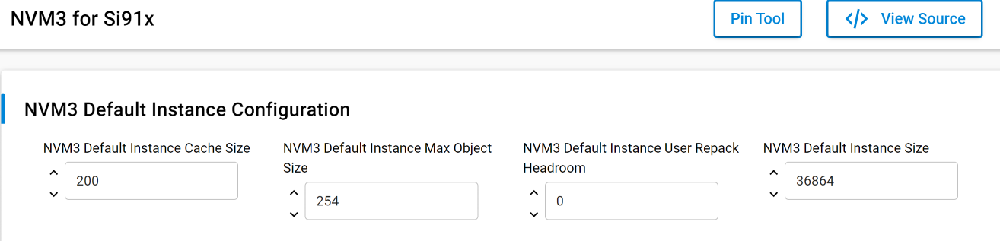

# SL NVM3 DUAL FLASH

## Table of Contents

- [Purpose/Scope](#purposescope)
- [Prerequisites/Setup Requirements](#prerequisitessetup-requirements)
  - [Hardware Requirements](#hardware-requirements)
  - [Software Requirements](#software-requirements)
  - [Setup Diagram](#setup-diagram)
- [Getting Started](#getting-started)
- [Application Build Environment](#application-build-environment)
  - [Code modifications for printing on the uart console](#code-modifications-for-printing-on-the-uart-console)
  - [Pinout on WPK for uart console](#pinout-on-wpk-for-uart-console)
- [Test the Application](#test-the-application)
- [Resources](#resources)

## Purpose/Scope

- This application demonstrates the use of Third Generation Non-Volatile Memory (NVM3) data storage in Si91x dual flash.

## Overview

The NVM3 provides a means to write and read data objects (key/value pairs) stored in Flash. Wear-leveling is applied to reduce erase and write cycles and maximize flash lifetime. The driver is resilient to power loss and reset events, ensuring that objects retrieved from the driver are always in a valid state. A single NVM3 instance can be shared among several wireless stacks and application code, making it well-suited for multiprotocol applications.

For more detailed information about NVM3, refer to [Third Generation NonVolatile Memory (NVM3) Data Storage](https://www.silabs.com/documents/public/application-notes/an1135-using-third-generation-nonvolatile-memory.pdf).

## About Example Code

- This example performs NVM3 init using nvm3_initDefault() API.
- Two counter objects are initialized using nvm3_writeCounter() API. One is used to track the number of writes and another is used for
  tracking number of deleted objects.
- After initializing counters, application indefinetly waits for user input.
- Refer to Test the Application section for more information on how to give input to application.

## Prerequisites/Setup Requirements

- To use this application following Hardware, Software and the Project Setup is required

### Hardware Requirements

- Windows PC
- Silicon Labs Si917 Evaluation Kit [WPK(BRD4002) + External Flash]

### Software Requirements

- Simplicity Studio
- Serial console Setup
  - For Serial Console setup instructions, refer [here](https://docs.silabs.com/wiseconnect/latest/wiseconnect-developers-guide-developing-for-silabs-hosts/#console-input-and-output).

### Setup Diagram

## Getting Started

Refer to the instructions [here](https://docs.silabs.com/wiseconnect/latest/wiseconnect-getting-started/) to:

- [Install Simplicity Studio](https://docs.silabs.com/wiseconnect/latest/wiseconnect-developers-guide-developing-for-silabs-hosts/#install-simplicity-studio)
- [Install WiSeConnect 3 extension](https://docs.silabs.com/wiseconnect/latest/wiseconnect-developers-guide-developing-for-silabs-hosts/#install-the-wi-se-connect-3-extension)
- [Connect your device to the computer](https://docs.silabs.com/wiseconnect/latest/wiseconnect-developers-guide-developing-for-silabs-hosts/#connect-si-wx91x-to-computer)
- [Upgrade your connectivity firmware ](https://docs.silabs.com/wiseconnect/latest/wiseconnect-developers-guide-developing-for-silabs-hosts/#update-si-wx91x-connectivity-firmware)
- [Create a Studio project ](https://docs.silabs.com/wiseconnect/latest/wiseconnect-developers-guide-developing-for-silabs-hosts/#create-a-project)

For details on the project folder structure, see the [WiSeConnect Examples](https://docs.silabs.com/wiseconnect/latest/wiseconnect-examples/#example-folder-structure) page.

## Application Build Environment

- Configure UC from the slcp component.

   

- Open **sl_si91x_nvm3_dual_flash.slcp** project file select **software component** tab and search for **NVM3 for Si91x** in search bar.
- Using configuration wizard one can configure different parameters like:

### General Configuration

  Configure following macros from UC,
- NVM3_DEFAULT_CACHE_SIZE: Number of NVM3 objects to cache. To reduce access times this number should be equal to or higher than the number 
  of NVM3 objects in the default NVM3 instance.
- NVM3_DEFAULT_MAX_OBJECT_SIZE: Max NVM3 object size that can be stored. This value should be greater than or equal to 204
- NVM3_DEFAULT_REPACK_HEADROOM: NVM3 Default Instance User Repack Headroom, Headroom determining how many bytes below the forced repack limit 
  the user repack limit should be placed. The default is 0, which means the user and forced repack limits are equal.
- NVM3_DEFAULT_NVM_SIZE - Size of the NVM3 storage region in flash. This size should be aligned with the flash page size of the device.

## Test the Application

- Users can give the following commands through VCOM:

  - For storing new key, type below syntax followed by enter
    write key string
    ex: write 1 SiliconLabs
  - For reading data from key, type below syntax followed by enter
    read key
    ex: read 1
  - For deleting key, type below syntax followed by enter
    delete key
    ex: delete 1
  - For displaying content stored and keys deleted, type below syntax followed by enter
    display
    ex: display
  - For deleting all data stored in NVM3, type below syntax followed by enter
    erase
    ex: erase
  - For repacking NVM3, type below syntax followed by enter
    repack
    ex: repack

- After successful program execution the prints in serial console looks as shown below.

    

## Resources

- [AN1135: Using Third Generation Non-Volatile Memory (NVM3) Data Storage](https://www.silabs.com/documents/public/application-notes/an1135-using-third-generation-nonvolatile-memory.pdf)
