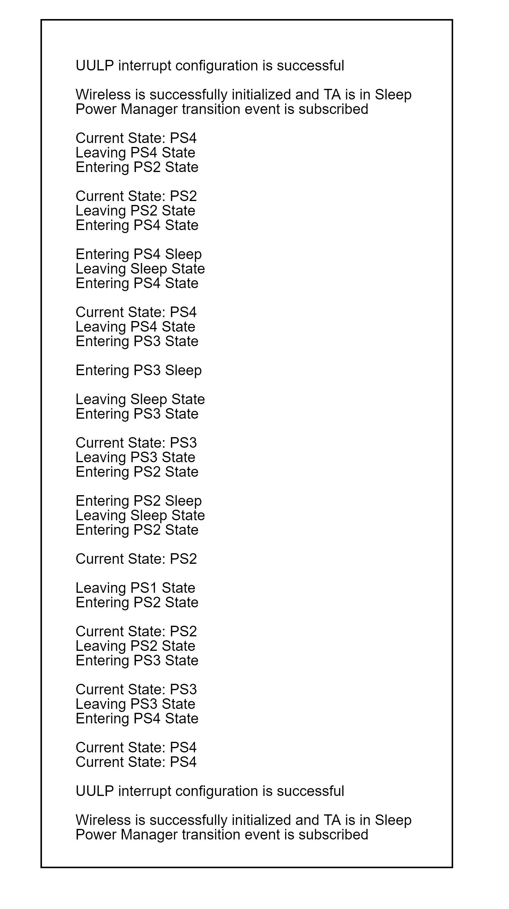

# SL POWER MANAGER M4 WIRELESS

## Table of Contents

- [Purpose/Scope](#purposescope)
- [Overview](#overview)
- [About Example Code](#about-example-code)
- [Prerequisites/Setup Requirements](#prerequisitessetup-requirements)
  - [Hardware Requirements](#hardware-requirements)
  - [Software Requirements](#software-requirements)
  - [Setup Diagram](#setup-diagram)
- [Getting Started](#getting-started)
- [Application Build Environment](#application-build-environment)
  - [Application Configuration Parameters](#application-configuration-parameters)
- [Test the Application](#test-the-application)

## Purpose/Scope

- This application demonstrates the power manager service APIs, state transitions, sleep-wakeup (with RAM retention) and sleep-wakeup (without RAM retention).

## Overview

- According to the macros configured in power_manager_example.h file, it executes the state transition and sleep-wakeup with RAM retention on button press, sleep-wakeup without RAM retention using second trigger as wakeup source.
- State transitions demonstrated are as follows: PS4 -> PS2, PS2 -> PS4, PS4 -> PS4 Sleep -> PS4, PS4 -> PS3, PS3 -> PS3 Sleep -> PS3, PS3 -> PS2, PS2 -> PS2 Sleep -> PS2, PS2 -> PS3, PS3 -> PS4. It switches the state at the time of button press.
- Sleep - wakeup without RAM retention is demonstrated as follows: PS4 -> PS0 -> wakeup -> restart the controller.
- For the integration of power manager in other projects, refer the instructions at the given path: **examples/si91x_soc/service/power_manager_m4_wireless/resources/power_manager_integration_guide/power_manager_integration.pdf** 

## About Example Code

- At initialization, a thread is created and the application_start() function is called along the thread.
- All the activities are handled in the application_start() function.
- Firstly wifi is initialized, M4-TA secure handshake is established to send commands to TA, TA is switched to STANDBY_WITH_RAM_RETENTION mode.
- Power Manager service is initialized, the processor is switched to PS4 state and the clock is 32 MHz (Power Save) using \ref sl_si91x_power_manager_init.
- According to the revised implementation, the PS4 and PS3 powersave modes will continue to use the same clock frequency (32MHz).
- All the possible events are ored and passed to the \ref sl_si91x_power_manager_subscribe_ps_transition_event along with the callback function address.
- RAM retention is enabled and configured using \ref sl_si91x_power_manager_configure_ram_retention.

- Upon button press, it changes the state and performs sleep-wakeup operations.
  - PS4 -> PS2: Unwanted peripherals are powered off using \ref sl_si91x_power_manager_remove_peripheral_requirement, PS2 state requirement is added using \ref sl_si91x_power_manager_add_ps_requirement.
  - PS2 -> PS4: To transmit to PS2, remove the requirement for the PS2 state using \ref sl_si91x_power_manager_remove_ps_requirement and add a requirement for the PS4 state using \ref sl_si91x_power_manager_add_ps_requirement switches the power state to PS4.
  - PS4 -> PS4 Sleep -> PS4:
    - Wakeup Source is selected as the calendar second trigger. The calendar peripheral is initialized before setting it as a wakeup source, the RC clock is selected using \ref sl_si91x_calendar_set_configuration, the calendar is initialized using \ref sl_si91x_calendar_init, the second trigger is selected as wakeup source using \ref sl_si91x_power_manager_set_wakeup_sources, Now callback is registered for second trigger (it enables the trigger also) using \ref sl_si91x_calendar_register_sec_trigger_callback.
    - Now soc goes to sleep using \ref sl_si91x_power_manager_sleep. Upon wake-up, the calendar is stopped using \ref sl_si91x_calendar_rtc_stop and callback is unregistered using \ref sl_si91x_calendar_unregister_sec_trigger_callback.

  - PS4 -> PS3: To transmit to PS3, remove the requirement for PS4 state using \ref sl_si91x_power_manager_remove_ps_requirement and add the requirement for PS3 state using \ref sl_si91x_power_manager_add_ps_requirement switches the power state to PS3.
  - PS3 -> PS3 Sleep -> PS3:
    - Wakeup Source is selected as the calendar second trigger. The calendar peripheral is initialized before setting it as a wakeup source, the RC clock is selected using \ref sl_si91x_calendar_set_configuration, the calendar is initialized using \ref sl_si91x_calendar_init, the second trigger is selected as wakeup source using \ref sl_si91x_power_manager_set_wakeup_sources, Now callback is registered for second trigger (it enables the trigger also) using \ref sl_si91x_calendar_register_sec_trigger_callback.
    - Now soc goes to sleep using \ref sl_si91x_power_manager_sleep. Upon wake-up, the calendar is stopped using \ref sl_si91x_calendar_rtc_stop and callback is unregistered using \ref sl_si91x_calendar_unregister_sec_trigger_callback.

  - PS3 -> PS2: Unwanted peripherals are powered off using \ref sl_si91x_power_manager_remove_peripheral_requirement. To transmit to PS2, remove the requirement for PS3 state using \ref sl_si91x_power_manager_remove_ps_requirement and add the requirement for PS3 state using \ref sl_si91x_power_manager_add_ps_requirement switches the power state to PS3.
  - PS3 -> PS2: Unwanted peripherals are powered off using \ref sl_si91x_power_manager_remove_peripheral_requirement. To transmit to PS2, remove the requirement for PS3 state using \ref sl_si91x_power_manager_remove_ps_requirement and add the requirement for PS3 state using \ref sl_si91x_power_manager_add_ps_requirement switches the power state to PS3.
  - PS2 -> PS2 Sleep -> PS2:
    - Wakeup Source is selected as the calendar second trigger. The calendar peripheral is initialized before setting it as a wakeup source, the RC clock is selected using \ref sl_si91x_calendar_set_configuration, the calendar is initialized using \ref sl_si91x_calendar_init, the second trigger is selected as wakeup source using \ref sl_si91x_power_manager_set_wakeup_sources, Now callback is registered for second trigger (it enables the trigger also) using \ref sl_si91x_calendar_register_sec_trigger_callback.
    - Now soc goes to sleep using \ref sl_si91x_power_manager_sleep.
    - Upon wakeup, the calendar is stopped using \ref sl_si91x_calendar_rtc_stop and the callback is unregistered using \ref sl_si91x_calendar_unregister_sec_trigger_callback.
  - PS2 -> PS3: To transmit to PS3, remove the requirement for the PS2 state using \ref sl_si91x_power_manager_remove_ps_requirement and add the requirement for the PS3 state using \ref sl_si91x_power_manager_add_ps_requirement switches the power state to PS3.
  - PS3 -> PS4: To transmit to PS3, remove the requirement for PS3 state using \ref sl_si91x_power_manager_remove_ps_requirement and add the requirement for PS4 state using \ref sl_si91x_power_manager_add_ps_requirement switches the power state to PS4.

  - PS4 -> PS0 -> Restarts the soc
    - The TA is switched to STANDBY_POWER_SAVE which means, sleep without retention.
    - Wakeup Source is selected as the calendar second trigger. The calendar peripheral is initialized before setting it as a wakeup source, the RC clock is selected using \ref sl_si91x_calendar_set_configuration, the calendar is initialized using \ref sl_si91x_calendar_init, the second trigger is selected as wakeup source using \ref sl_si91x_power_manager_set_wakeup_sources, Now callback is registered for second trigger (it enables the trigger also) using \ref sl_si91x_calendar_register_sec_trigger_callback.
    - It goes to PS0 state using \ref sl_si91x_power_manager_add_ps_requirement. After waking up using the calendar one-second trigger, it restarts the controller.  

## Prerequisites/Setup Requirements

- To use this application following Hardware, Software and Project Setup is required.

### Hardware Requirements

- Windows PC
- Silicon Labs Si917 Evaluation Kit [WPK(BRD4002) + BRD4338A / BRD4342A / BRD4343A ]
  - The Serial Console setup instructions are provided below:
Refer instructions [here](https://docs.silabs.com/wiseconnect/latest/wiseconnect-developers-guide-developing-for-silabs-hosts/#console-input-and-output).

### Software Requirements

- Simplicity Studio
- Embedded Development Environment
  - For Silicon Labs Si91x, use the latest version of Simplicity Studio (refer **"Download and Install Simplicity Studio"** section in **getting-started-with-siwx917-soc** guide at **release_package/docs/index.html**)

### Setup Diagram

## Getting Started

Refer instructions [here](https://docs.silabs.com/wiseconnect/latest/wiseconnect-getting-started/) for the following tasks:

- Install Studio and WiSeConnect 3 extension
- Connect your device to the computer
- Upgrade your connectivity firmware
- Create a Studio project

For details on the project folder structure, see the [WiSeConnect Examples](https://docs.silabs.com/wiseconnect/latest/wiseconnect-examples/#example-folder-structure) page.

## Application Build Environment

## Test the Application

Refer instructions [here](https://docs.silabs.com/wiseconnect/latest/wiseconnect-getting-started/) for the following tasks:

1. Compile and run the application.
2. Enable macros whose functionality needs to be tested.
3. By default it initializes the wifi and switches TA to standby with RAM retention mode, power manager service is initialized and callback is subscribed. Press the button to change the power state.
4. After successful program execution, the prints in the serial console look as shown below.

   
