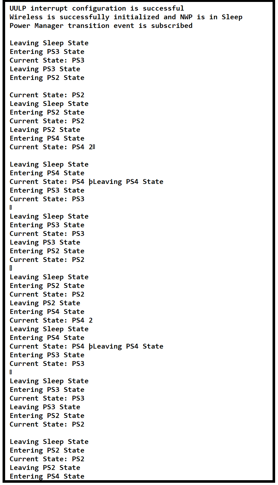

# SL POWER MANAGER TICKLESS IDLE

## Table of Contents

- [SL POWER MANAGER TICKLESS IDLE](#sl-power-manager-tickless-idle)
  - [Table of Contents](#table-of-contents)
  - [Purpose/Scope](#purposescope)
  - [Overview](#overview)
  - [About Example Code](#about-example-code)
  - [Prerequisites/Setup Requirements](#prerequisitessetup-requirements)
    - [Hardware Requirements](#hardware-requirements)
    - [Software Requirements](#software-requirements)
    - [Setup Diagram](#setup-diagram)
  - [Getting Started](#getting-started)
  - [Test the Application](#test-the-application)

## Purpose/Scope

 This application demonstrates the power manager service APIs, state transitions(PS4, PS3 and PS2) and sleep-wakeup (PS4, PS3 and PS2 sleep with RAM retention) with tick-less idle mode.

## Overview

- Tick-less Mode, a capability offered by the FreeRTOS real-time operating system (RTOS), enables the system to diminish power usage by transitioning into a low-power state during periods of task inactivity.
- According to the configuration in power_manager_tickless_idle example application, it updates the power state in the requirement as per the user selection upon OS timer expiration. It then determines the highest attainable operating state and begins the transition. When application gets the idle time, Power manager initiates the sleep.
- Sleep - Demonstrations of wake-up with RAM retention are showcased in PS4, PS3 and PS2 states, automatically adjusting to the attainable state.

## About Example Code

- Power Manager service is initialized in PS3 state with 40MHz clock (Power Save) using sl_si91x_power_manager_init.
- At initialization, a thread is created and the application_start() function is called along the thread.
- All the activities are handled in the application_start() function.
- Firstly wifi is initialized, M4-NWP secure handshake is established to send commands to NWP, NWP is switched to STANDBY_WITH_RAM_RETENTION mode.
- All the possible events are `OR`'ed and passed to the `sl_si91x_power_manager_subscribe_ps_transition_event` along with the callback function address.
- On OS timer expiry, it updates the requirement and changes the highest attainable operating state and performs sleep-wakeup operations.
- Wake-up Source is selected as SysRTC and wireless wake-up by default. Application will go to sleep as per the idle time provided by scheduler and it will wake-up with either wireless wake-up or SysRTC.

## Prerequisites/Setup Requirements

- To use this application following Hardware, Software and Project Setup is required.

### Hardware Requirements

- Windows PC
- Silicon Labs Si917 Evaluation Kit [WPK(BRD4002) + BRD4338A / BRD4342A / BRD4343A ]

### Software Requirements

- Simplicity Studio
- Embedded Development Environment
  - For Silicon Labs Si91x, use the latest version of Simplicity Studio (refer **"Download and Install Simplicity Studio"** section in **getting-started-with-siwx917-soc** guide at [here](https://docs.silabs.com/wiseconnect/latest/wiseconnect-developers-guide-developing-for-silabs-hosts/#setup-software).
  - The Serial Console setup instructions are provided below:
    Refer instructions [here](https://docs.silabs.com/wiseconnect/latest/wiseconnect-developers-guide-developing-for-silabs-hosts/#console-input-and-output).

### Setup Diagram

## Getting Started

Refer getting started [here](https://docs.silabs.com/wiseconnect/latest/wiseconnect-getting-started/) for the following tasks:

- Install Studio and WiSeConnect 3 extension
- Connect your device to the computer
- Upgrade your connectivity firmware
- Create a Studio project

For details on the project folder structure, see the [WiSeConnect Examples](https://docs.silabs.com/wiseconnect/latest/wiseconnect-examples/#example-folder-structure) page.

## Test the Application

Refer instructions [here](https://docs.silabs.com/wiseconnect/latest/wiseconnect-developers-guide-developing-for-silabs-hosts/#build-an-application) for the following tasks:

1. Compile and run the application.
2. By default it initializes the wifi and switches NWP to standby with RAM retention mode, power manager service is initialized and callback is subscribed.
3. After successful program execution, observe the prints in the serial console.

     ### Output console
     >  
