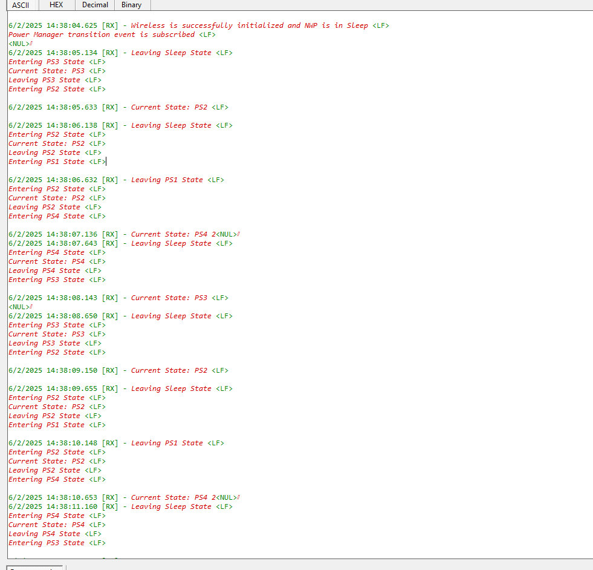
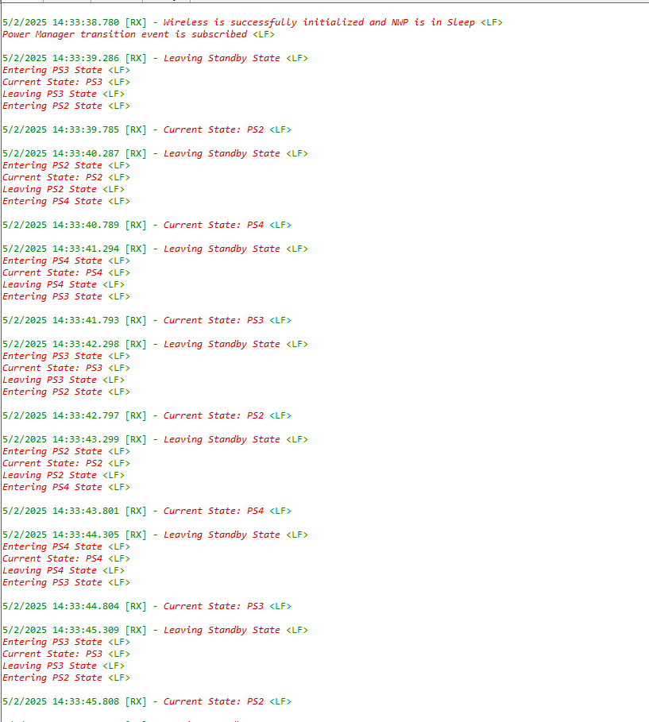

# SiWx91x Platform Power Manager Tickless Idle

## Table of Contents

- [SiWx91x Platform Power Manager Tickless Idle](#platform-siwx91x-power-manager-tickless-idle)
  - [Purpose/Scope](#purposescope)
  - [Overview](#overview)
  - [About Example Code](#about-example-code)
  - [Application Build Environment](#application-build-environment)
  - [Prerequisites/Setup Requirements](#prerequisitessetup-requirements)
    - [Hardware Requirements](#hardware-requirements)
    - [Software Requirements](#software-requirements)
    - [Setup Diagram](#setup-diagram)
  - [Getting Started](#getting-started)
  - [Test the Application](#test-the-application)
  - [Troubleshooting](#troubleshooting)
  - [Resources](#resources)
  - [Report Bugs/Support](#report-bugssupport)

## Purpose/Scope

 This application demonstrates the power manager service APIs, active state transitions (PS4, PS3, and PS2), standby state transitions (PS4, PS3, and PS2) and sleep-wakeup (PS4, PS3, PS2, and PS1 sleep with RAM retention) with tick-less idle mode.

## Overview

- Tick-less Mode, a capability offered by the FreeRTOS real-time operating system (RTOS), enables the system to diminish power usage by transitioning into a low-power state during periods of task inactivity.
- The power_manager_tickless_idle example application updates the power state based on the user's selection when the OS timer expires. It then identifies the highest attainable operating state and initiates the transition. When the application becomes idle, the power manager triggers either sleep or standby mode, depending on the value of the SL_SI91X_STANDBY macro.
- Sleep or Standby - Demonstrations of wake-up with RAM retention are showcased in PS4, PS3, and PS2 states, automatically adjusting to the attainable state.

 **Note:** In this application, the Ultra-Low Power (ULP) Timer is configured as the wakeup source from the PS1. The Power Manager supports the following ULP peripherals as a wakeup sources during the PS1 state:
  | **ULP Peripherals Supported** |
  |---------------------|
  | *ULP GPIO*       |
  | *ULP Timer*      |
  | *ULP ADC*        |
  | *ULP Comparator* |
  | *ULP UART*       |
> To configure the other peripheral in PS1 State, refer to the [SiWx917 Software Reference Manual](https://github.com/SiliconLabs/wiseconnect/blob/v4.1.1-content-for-docs/docs/software-reference/manuals/siwx91x-software-reference-manual.md).

## About Example Code

- Power Manager service is initialized in PS3 state with 40 MHz clock (Power Save) using sl_si91x_power_manager_init.
- At initialization, a thread is created and the application_start() function is called along the thread.
- All the activities are handled in the application_start() function.
- Firstly wifi is initialized, M4-NWP secure handshake is established to send commands to NWP, NWP is switched to STANDBY_WITH_RAM_RETENTION mode.
- All the possible events are `OR`'ed and passed to the `sl_si91x_power_manager_subscribe_ps_transition_event` along with the callback function address.
- On OS timer expiry, it updates the requirement and changes the highest attainable operating state and performs sleep-wakeup operations.
- By default, the System RTC (SysRTC) and wireless interface are configured as wake-up sources for PS4, PS3 and PS2 sleep. The application enters sleep based on the idle time determined by the scheduler and resumes operation upon receiving either a wireless wake-up event or a SysRTC interrupt. In the PS1 state, wake-up occurs exclusively through the ULP Timer.

## Application Build Environment

You can configure the application to suit your requirements and development environment. Read through the following sections and make any changes needed.

To enable transitions from the active state to sleep or standby state, configure the parameters outlined below accordingly.

- `SL_SI91X_STANDBY`: Selects whether the application transitions through sleep states or standby states. By default, it is set to 0 (sleep transitions); set it to 1 to enable standby-state transitions.

  - By default, the SL_SI91X_STANDBY macro is configured with a value of 0, indicating that the application performs the following sequence of power state transitions:
  - PS3 State => PS3 Sleep => PS3 State =>PS2 State => PS2 Sleep => PS2 State => PS1 State => PS2 State => PS4 State => PS4 Sleep => PS4 State => PS3 State and repeat.

    ```c
    #define SL_SI91X_STANDBY                                      0
    ```

  - To enable the Standby state transition, set the SL_SI91X_STANDBY macro to 1. With this configuration, the application performs the following sequence of power state transitions:
  - PS3 State => PS3 Standby => PS3 State => PS2 State => PS2 Standby => PS2 State => PS4 State => PS4 Standby => PS4 State => PS3 State and repeat.

    ```c
    #define SL_SI91X_STANDBY                                      1
    ```

- Configure the following macros in `power_manager_tickless_idle_example.c`:

- `ULP_TIMER_MATCH_VALUE`: Specifies the ULP timer match count used to schedule the periodic wakeup interval. By default, it is set to 10000000, which corresponds to approximately 500 ms with a 20 MHz down-counter reference.

    ```c
    #define ULP_TIMER_MATCH_VALUE 10000000   // Timer match value for down-counter type with 20 MHz clock for 500 ms
    ```

- `BUTTON_INSTANCE_0`: Selects the on-board button instance used as a wakeup source for the application. By default, it is set to `button_btn0`.

    ```c
    #define BUTTON_INSTANCE_0     button_btn0 // Button instance for wakeup
    ```

## Prerequisites/Setup Requirements

- To use this application following Hardware, Software and Project Setup is required.

### Hardware Requirements

- Windows PC
- Silicon Labs SiWx91x Evaluation Kit WPK [[BRD4002](https://www.silabs.com/development-tools/wireless/wireless-pro-kit-mainboard?tab=overview) + [BRD4338A](https://www.silabs.com/development-tools/wireless/wi-fi/siwx917-rb4338a-wifi-6-bluetooth-le-soc-radio-board?tab=overview) / [BRD4342A](https://www.silabs.com/development-tools/wireless/wi-fi/siwx91x-rb4342a-wifi-6-bluetooth-le-soc-radio-board?tab=overview) / [BRD4343A](https://www.silabs.com/development-tools/wireless/wi-fi/siw917y-rb4343a-wi-fi-6-bluetooth-le-8mb-flash-radio-board-for-module?tab=overview) / [BRD4343C](https://www.silabs.com/development-tools/wireless/wi-fi/siw917y-rb4343c-wi-fi-6-bluetooth-le-8mb-flash-radio-board-for-module?tab=overview)]

### Software Requirements

- Simplicity Studio
- Embedded Development Environment
  - For Silicon Labs SiWx91x, use the latest version of Simplicity Studio refer **"Download and Install Simplicity Studio"** section in **getting-started-with-siwx917-soc** guide at [here](https://docs.silabs.com/wiseconnect/latest/wiseconnect-developers-guide-developing-for-silabs-hosts/using-the-simplicity-studio-ide#install-simplicity-studio).
  - The Serial Console setup instructions are provided below:
    Refer instructions [here](https://docs.silabs.com/wiseconnect/latest/wiseconnect-developers-guide-developing-for-silabs-hosts/using-the-simplicity-studio-ide#console-input-and-output).

### Setup Diagram


## Getting Started

Refer to the instructions [here](https://docs.silabs.com/wiseconnect/latest/wiseconnect-getting-started/) to:

- [Install Simplicity Studio](https://docs.silabs.com/wiseconnect/latest/wiseconnect-developers-guide-developing-for-silabs-hosts/using-the-simplicity-studio-ide#install-simplicity-studio)
- [Install WiSeConnect extension](https://docs.silabs.com/wiseconnect/latest/wiseconnect-developers-guide-developing-for-silabs-hosts/using-the-simplicity-studio-ide#install-the-wiseconnect-3-extension)
- [Connect your device to the computer](https://docs.silabs.com/wiseconnect/latest/wiseconnect-developers-guide-developing-for-silabs-hosts/using-the-simplicity-studio-ide#connect-siwx91x-to-computer)
- [Upgrade your connectivity firmware](https://docs.silabs.com/wiseconnect/latest/wiseconnect-developers-guide-developing-for-silabs-hosts/using-the-simplicity-studio-ide#update-siwx91x-connectivity-firmware)
- [Create a Studio project](https://docs.silabs.com/wiseconnect/latest/wiseconnect-developers-guide-developing-for-silabs-hosts/using-the-simplicity-studio-ide#create-a-project)

For details on the project folder structure, see the [WiSeConnect Examples](https://docs.silabs.com/wiseconnect/latest/wiseconnect-examples/#example-folder-structure) page.

## Test the Application

> **Note:** Use **`Log_script.py`** from the **SiWx91x Platform Logger** example (`examples/si91x_soc/service/sl_si91x_logger/`) to decode structured console log output. Run:
>
> `python Log_script.py --out firmware.out --descriptor SYSVIEW_CaptiveCore.txt --port COM5 --max-args 3`
>
> Replace **COM5** with the serial port your board uses on the host PC.

Refer instructions [here](https://docs.silabs.com/wiseconnect/latest/wiseconnect-developers-guide-developing-for-silabs-hosts/using-the-simplicity-studio-ide#build-an-application) for the following tasks:

1. Compile and run the application.
2. By default it initializes the wifi and switches NWP to standby with RAM retention mode, power manager service is initialized and callback is subscribed.
3. After successful program execution, observe the prints in the serial console.

     ### Output console if SL_SI91X_STANDBY is not set in appplication.
     > 
     ### Output console if SL_SI91X_STANDBY is set in application.
     > 

## Troubleshooting

- If the project does not build, ensure Simplicity Studio and the WiSeConnect extension are installed and the board is connected.
- If the device is not detected, reinstall the connectivity firmware and check USB drivers.

## Resources

- [WiSeConnect Getting Started](https://docs.silabs.com/wiseconnect/latest/wiseconnect-getting-started/)
- [WiSeConnect Examples](https://docs.silabs.com/wiseconnect/latest/wiseconnect-examples/)
- [SiWx91x SoC Documentation](https://docs.silabs.com/wiseconnect/latest/)

## Report Bugs/Support

For issues and support, use the Silicon Labs Community or your normal support channel.

