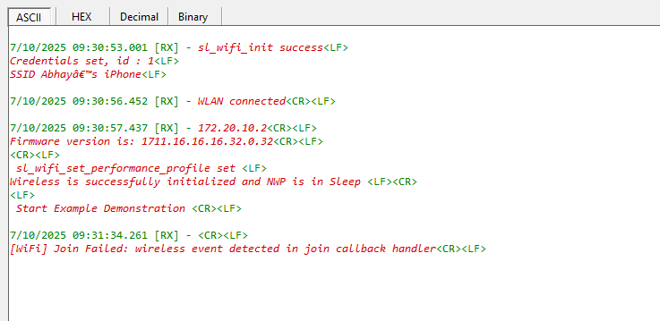

# SiWx917 PS2 Wireless Event Monitor

## Table of Contents

- [SiWx917 PS2 Wireless Event Monitor](#siwx917-ps2-wireless-event-monitor)
  - [Table of Contents](#table-of-contents)
  - [Purpose/Scope](#purposescope)
  - [Overview](#overview)
  - [About Example Code](#about-example-code)
  - [Application Build Environment](#application-build-environment)
    - [Configure sl\_net\_default\_values.h](#configure-sl_net_default_valuesh)
  - [Prerequisites/Setup Requirements](#prerequisitessetup-requirements)
    - [Hardware Requirements](#hardware-requirements)
    - [Software Requirements](#software-requirements)
    - [Setup Diagram](#setup-diagram)
  - [Getting Started](#getting-started)
  - [Test the Application](#test-the-application)
    - [Build and Deploy](#build-and-deploy)
    - [Application Behavior](#application-behavior)
    - [Testing Wireless Event Monitoring during PS2](#testing-wireless-event-monitoring-during-ps2)
    - [Expected Output](#expected-output)
      - [Sample Output Console](#sample-output-console)
      - [GPIO Output Console](#gpio-output-console)

## Purpose/Scope

This application demonstrates how to handle wireless events during the PS2 power state. It shows how a SiWx917 device can be configured to stay in a low-power mode (PS2) while still maintaining wireless connectivity, allowing the system to process packet events triggered by specific wireless activity.

## Overview

- The PS2 Wireless Event Monitor mechanism allows the SiWx917 device to optimize power consumption by transitioning the M4 core into the PS2 low-power state, while the Network Processor (NWP) remains in standby with RAM retention to preserve wireless connectivity. Since wireless event handling is not possible in PS2, the M4 core periodically transitions to the PS3 state every 400 ms to service any pending wireless activity. This periodic wake-up ensures responsiveness to wireless events while maintaining low power usage.
- When specific wireless events such as wireless event reception, connection requests, or other configured triggers occur it is queued in the TA buffer, M4 core periodically transitions (400 ms) from PS2 state to PS3 state to handle these events.
- This implementation significantly reduces power consumption while maintaining essential wireless connectivity, making it ideal for battery-powered IoT devices.

## About Example Code

- This example demonstrates wireless event handling during PS2 power state feature on a SiWx917 device.
- On startup, a dedicated thread is created and the `application_start()` function is invoked to initialize the application logic.
- The M4 core first transitions to the PS3 state for initial setup and Wi-Fi initialization.
- A secure handshake is established between the M4 and the Network Processor (NWP) to enable reliable communication.
- The NWP is set to `ASSOCIATED_POWER_SAVE_LOW_LATENCY` mode, ensuring wireless connectivity is maintained with minimal power consumption.
- The M4 core enters PS2 state.
- Upon entering PS2 state:
   - The M4 processor clock is reduced to 2 MHz to further conserve power.
   - The ULP timer is initialized to toggle ULP GPIO 1 at 5 ms intervals, providing a periodic toggles. The ULP timer is configured with a 32 KHz clock source to ensure the timer frequency remains constant during power state transitions, providing reliable timing regardless of the M4 core's power state.
- An OS timer is set to generate an interrupt every 400 ms to transition to the PS3 state to service the pending wireless events. During this transition, IRQs are disabled, which may delay the ULP timer interrupt. To prevent backlight glitches during this period, ULP GPIO 1 is set to high as a precautionary measure in the application.
- Before transitioning to PS3 state, the clock is changed from 2 MHz to 20 MHz.
- If a pending wireless interrupt is queued in PS3, the system processes the event.
- After processing, the system returns to PS2 to resume low-power operation.
- A dummy function `ps3_state_application_action()` is provided for users to implement custom wireless event logic during PS3 state transitions.
- If no wireless event is detected, the system directly transitions to PS2.
- The ULP timer callback continues to toggle ULP GPIO 1, demonstrating periodic activity.

This example provides a reference for implementing ultra-low-power wireless applications that require both energy efficiency and responsiveness to wireless events.

## Application Build Environment

The application can be configured to user-specific requirements and development environments. Read through the following sections and make any necessary changes.

### Configure sl_net_default_values.h

**File path for Simplicity Studio IDE:**

1. In the Project pane, expand the **resources/defaults** folder and open the **sl_net_default_values.h** file. Configure the following parameters to enable your Silicon Labs Wi-Fi device to connect to your Wi-Fi network:

   - DEFAULT_WIFI_CLIENT_PROFILE_SSID refers to the name with which the Wi-Fi network shall be advertised. The Si91X module is connected to it.

      ```c
      #define DEFAULT_WIFI_CLIENT_PROFILE_SSID               "YOUR_AP_SSID"      
      ```

   - DEFAULT_WIFI_CLIENT_CREDENTIAL refers to the secret key if the access point is configured in WPA-PSK/WPA2-PSK security modes.

      ```c
      #define DEFAULT_WIFI_CLIENT_CREDENTIAL                 "YOUR_AP_PASSPHRASE" 
      ```

   - DEFAULT_WIFI_CLIENT_SECURITY_TYPE refers to the security type of the access point. The supported security modes are mentioned in `sl_wifi_security_t`.

      ```c
      #define DEFAULT_WIFI_CLIENT_SECURITY_TYPE              SL_WIFI_WPA2
      ```

2. Configure the following parameter to adjust the M4 power state transition period from PS2 to PS3 Active.

   - STATE_TRANSITION_TIME defines the periodic interval (in milliseconds) for transitioning from PS2 to PS3 power state to service pending wireless events. By default, this period is set to 400 ms in the application.
  
      ```c
      #define STATE_TRANSITION_TIME                                         400   
      ```

3. Configure the following parameter to set the M4 ULP Ultra-Low Power (ULP) timer interrupt period.

   - ULP_TIMER_MATCH_VALUE defines the timer match value used to generate periodic interrupts for toggling the ULP GPIO. By default, this generates interrupts every 5 ms. The ULP timer operates using a 32 kHz RC clock, where a 1-second interval corresponds to a match value of 32,000 (based on the peripheral clock frequency). For a 5 ms interval, the match value is set to 160.

      ```c
      #define ULP_TIMER_MATCH_VALUE                          160  
      ```

## Prerequisites/Setup Requirements

To use this application, the following hardware, software, and project setup is required.

### Hardware Requirements

- Windows PC
- Silicon Labs Si917 Evaluation Kit [WPK(BRD4002) + BRD4343A]

### Software Requirements

- Simplicity Studio
- Embedded Development Environment
  - For Silicon Labs Si91x, use the latest version of Simplicity Studio (see the **"Download and Install Simplicity Studio"** section in [Developing with WiSeConnect™ SDK v3.x with SiWx91x™ Boards](https://docs.silabs.com/wiseconnect/latest/wiseconnect-developers-guide-developing-for-silabs-hosts/#setup-software).
  - The Serial Console setup instructions are provided below:
    For instructions, refer [here](https://docs.silabs.com/wiseconnect/latest/wiseconnect-developers-guide-developing-for-silabs-hosts/#console-input-and-output).

### Setup Diagram


## Getting Started

- Install Studio and WiSeConnect 3 extension
- Connect your device to the computer
- Upgrade your connectivity firmware
- Create a Studio project

For details on the project folder structure, see the [WiSeConnect Examples](https://docs.silabs.com/wiseconnect/latest/wiseconnect-examples/#example-folder-structure) page.

## Test the Application

### Build and Deploy
Refer to instructions [here](https://docs.silabs.com/wiseconnect/latest/wiseconnect-developers-guide-developing-for-silabs-hosts/#build-an-application) for building and deploying the application.

### Application Behavior

- The application initializes Wi-Fi and configures the NWP in standby mode with RAM retention for event monitoring.
- M4 core transitions to PS2 state for low-power operation (2 MHz clock).
- ULP timer toggles GPIO every 5 ms, OS timer triggers PS2→PS3 transitions every 400 ms.
- NWP remains active to detect wireless events during PS2 state.

### Testing Wireless Event Monitoring during PS2

1. **Connect device to WiFi network**.
2. **Disconnect from AP** (power off AP or move out of range).
3. **Observe console output** for WoW event detection:
   ```c
   [WiFi] Join Failed: wireless event detected in join callback handler
   ```

### Expected Output
#### Sample Output Console
>

#### GPIO Output Console
>

    