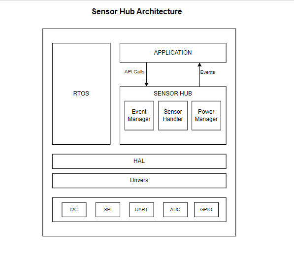
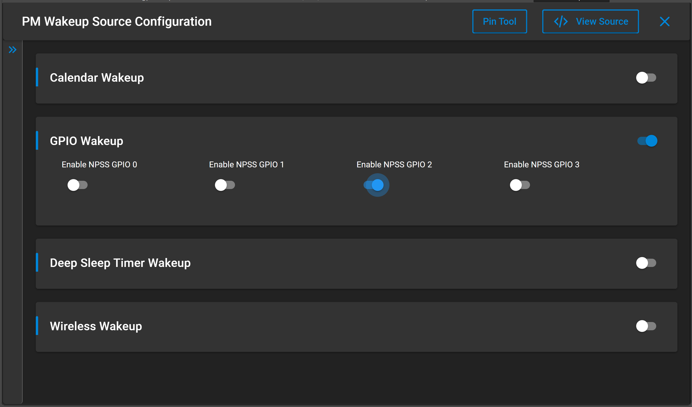

# SENSOR HUB

## Table of Contents

- [SENSOR HUB](#sensor-hub)
  - [Table of Contents](#table-of-contents)
  - [Purpose/Scope](#purposescope)
  - [About Example Code](#about-example-code)
  - [Framework](#framework)
  - [Prerequisites/Setup Requirements](#prerequisitessetup-requirements)
    - [Hardware Requirements](#hardware-requirements)
    - [Software Requirements](#software-requirements)
    - [Setup Diagram](#setup-diagram)
  - [Getting Started](#getting-started)
  - [Application Build Environment](#application-build-environment)
    - [SensorHub Configuration Parameters](#sensorhub-configuration-parameters)
    - [AWS Configuration](#aws-configuration)
  - [Sensor Pins Setup](#sensor-pins-setup)
    - [I2C Sensor Pin Configurations](#i2c-sensor-pin-configurations)
    - [SPI Sensor Pin Configurations](#spi-sensor-pin-configurations)
    - [ADC Sensor Pin Configurations](#adc-sensor-pin-configurations)
    - [SDC Sensor Pin Configurations](#sdc-sensor-pin-configurations)
  - [Test the Application](#test-the-application)
  - [Expected Results](#expected-results)

## Purpose/Scope

- This application demonstrates SensorHub service. 
- This service provides a convenient framework to integrate any sensor/s on I2C, GPIO, UART and ADC interfaces. It supports Sensor activity in low-power mode.

## About Example Code

- This application demonstrates the SensorHub service using the following sensors,
  * 3- I2C-based sensors namely a BH1750(Light Sensor), LM75(Temperature Sensor) and APDS9960(RGB Proximity Gesture sensor)
  * 2- ADC and SDC -based Sensors(Joystick and GUVA_12D_UV)
  * 1- GPIO-based Push Button-0 as sensor
  * 1- SPI-based sensor ADXL345(Accelerometer Sensor)

- The application starts in PS4 mode, initializes peripherals, and configures sensors on the corresponding peripheral interfaces. Sensor data will be sampled and shown on the serial console based on the sensor configurations.

- The SensorHub service supports the following features:
  - Data Sample Modes:
      * Interrupt Mode
      * Polling Mode
  
  - Data Delivery Modes:
      * Polling Mode
          * Timeout
          * Threshold
          * Number of Samples 
      * Interrupt Mode
          * Interrupt (with GPIO-based and ADC-based)
  - Power State Transitions: 
      * PS4 Active > PS4 Sleep 
      * PS4 Active > PS2 Active
      * PS2 Active > PS2 Sleep
      * PS2 Active > PS1 
      * PS2 Active > PS4 Active
    
> **Note:** These transitions are not enabled by default. To enable, use below mentioned configurations in 'PowerSave Configurations:' section.

## Framework




- SensorHub has four tasks: 
  * Application task: This task handles the Create Sensor, Start Sensor, Stop Sensor, and Delete Sensor.
  * Event manager task: This task deals with processing the events of Sensor Hub and notifying the Application.
  * Sensor task: This task primarily involves managing sensors, including controlling them, obtaining data from the sensors, and dispatching events to the Event Manager.
  * Power manager task: this task handles switching the power states.

## Prerequisites/Setup Requirements

 - To use this application following Hardware, Software, and Project Setup are required.

### Hardware Requirements	

- Silicon Labs Si917 Pro Kit [WPK + BRD4338A / BRD4342A / BRD4343A ]
- BH1750 Light Sensor
- LM75 Temperature Sensor
- APDS9960 RGB-Gesture-Proximity Sensor
- 2 ADC-based Sensor(Joystick and GUVA_12D_UV)

### Software Requirements
- Si91x Wiseconnect
- Simplicity Studio
- Serial console-setup
  - The Serial console setup instructions are provided below, 
Refer [here](https://docs.silabs.com/wiseconnect/latest/wiseconnect-developers-guide-developing-for-silabs-hosts/#console-input-and-output)

### Setup Diagram


## Getting Started

Refer instructions [here](https://docs.silabs.com/wiseconnect/latest/wiseconnect-getting-started/) for the following tasks:

- Install Studio and WiSeConnect 3 extension
- Connect your device to the computer
- Upgrade your connectivity firmware
- Create a Studio project

For details on the project folder structure, see the [WiSeConnect Examples](https://docs.silabs.com/wiseconnect/latest/wiseconnect-examples/#example-folder-structure) page.

## Application Build Environment

### SensorHub Configuration Parameters

1. Configure the number of sensor info in the ***/sensors/inc/sensors_config.h** file.
    ```c

    #define SL_MAX_NUM_SENSORS 5 // Maximum sensors present in the system
    ```

2. Configure the following parameters in the ***sensorhub_config.c*** file:
    * **Data Sample Modes:**
      - **Polling Sensor Mode** configures the following parameters:

        ```c

        .sensor_mode         = SL_SH_POLLING_MODE,
        .sampling_interval   = 100, 
        ```

        - If sensor_mode is selected as ***SL_SH_POLLING_MODE***, then data_deliver.data_mode should be configured as **one** of the following for a sensor configuration structure:
            - For **TIMEOUT Data Mode** configure the following parameters:

              ```c

              .data_deliver.data_mode          = SL_SH_TIMEOUT
              .data_deliver.timeout       = 1000
              ```

            - For **THRESHOLD Data Mode** configure the following parameters:

              ```c

              .data_deliver.data_mode          = SL_SH_THRESHOLD,  
              .data_deliver.threshold     = 1000,
              ```

            - For **SAMPLING Data Mode** configure the following parameters:

              ```c

              .data_deliver.data_mode          = SL_SH_NUM_OF_SAMPLES,  
              .data_deliver.numOfSamples  = 5,
              ```

            - **Example of Sensor Polling Mode Configurations**:-

              ```c

              .sensor_name               = "TEMPERATURE_SENSOR_LM75",
              .sensor_bus                = SL_SH_I2C,
              .sensor_id                 = SL_SENSOR_LM75_ID,
              .address                   = SL_LM75_ID,
              .sensor_mode               = SL_SH_POLLING_MODE,
              .sampling_interval         = 100,
              .data_deliver.data_mode    = SL_SH_NUM_OF_SAMPLES,
              .data_deliver.numofsamples = 5,
              ```
              ```c
              //For ADC Sensors, channel should be BIT(channel number)
              .sensor_name               = "ADC_JOYSTICK",
              .sensor_id                 = SL_SENSOR_ADC_JOYSTICK_ID,
              .channel                   = BIT(SL_SH_ADC_CH0_CHANNEL),
              .sensor_bus                = SL_SH_ADC,
              .sensor_mode               = SL_SH_POLLING_MODE,
              .sampling_interval         = 200,
              .data_deliver.data_mode    = SL_SH_NUM_OF_SAMPLES,
              .data_deliver.numofsamples = SL_SH_ADC_SENSOR0_NUM_OF_SAMPLES,
              ```

      - **INTERRUPT Sensor Mode** configures the below parameters:

        ```c

        .sensor_mode                = SL_SH_INTERRUPT_MODE,
        .sampling_intr_req_pin      = BUTTON_0_GPIO_PIN, 
        .sensor_intr_type           = SL_SH_FALL_EDGE,
        .data_deliver.data_mode     = SL_SH_NO_DATA_MODE,
        ```
          - **Example of Sensor Interrupt Mode Configurations:-**

            ```c

            //For I2C Sensor
            .sensor_name               = "LIGHT_SENSOR",
            .sensor_bus                = SL_SH_I2C,
            .sensor_id                 = SL_SENSOR_BH1750_ID,
            .address                   = SL_BH1750_ID,
            .sensor_mode               = SL_SH_INTERRUPT_MODE,
            .sampling_intr_req_pin     = BUTTON_0_GPIO_PIN,
            .sensor_intr_type          = SL_SH_FALL_EDGE,
            .data_deliver.data_mode    = SL_SH_NO_DATA_MODE,
            ```


            ```c
            //For ADC Sensors, channel should be BIT(channel number)
            .sensor_name               = "ADC_JOYSTICK",
            .sensor_id                 = SL_SENSOR_ADC_JOYSTICK_ID,
            .channel                   = BIT(SL_SH_ADC_CH0_CHANNEL),
            .sensor_bus                = SL_SH_ADC,
            .sensor_mode               = SL_SH_INTERRUPT_MODE,
            .data_deliver.data_mode     = SL_SH_NO_DATA_MODE,
            ```
3. **PowerSave Configurations:**
    * To configure the power save transitions from PS2 to PS4 and vice-versa, update the below macro in the  preprocessor settings:
      ```c
      SL_SH_POWER_STATE_TRANSITIONS=1
      //Enable this macro moves the application from PS4 state to PS2 state. 
      //In PS2 state the sensor data will be sampled and collected.
      ```

4. **ADC Configurations**:
    - Configure SH_ADC_ENABLE=1 in properties -> C/C++ Build -> Setting -> Tool Settings -> GNU ARM C Compiler -> Preprocessor to enable ADC
    - Configure the following parameters in the ***sensorhub_config.c*** file to change the ADC's mode from FIFO to STATIC and vice versa.

      ```c
      .adc_config.adc_cfg.operation_mode = SL_ADC_STATIC_MODE
      ```
    
    - The Joystick emulator and the GUVA sensor are compatible with both ADC static and FIFO modes. 
    
    - **ADC static mode:-**
        - SensorHub polling mode is supported
        - ADC is capable of reading only one Sample at a time and generates an interrupt in static mode.
        configure as shown below in the ***adc_sensor_hal.h*** file:

          ```C
            
          #define SL_SH_ADC_CH0_NUM_SAMPLES 1
          #define SL_SH_ADC_SENSOR0_NUM_OF_SAMPLES 5 
          ```  

    - **ADC FIFO mode:-**
      - The SensorHUB interrupt mode configurations are utilized in conjunction with **ADC FIFO mode**.      
      - Configure the following parameter ***sensorhub_config.c*** file:

        ```c
        .adc_config.adc_cfg.operation_mode = SL_ADC_FIFO_MODE,
        ```

      - In the SensorHub interrupt mode, The ADC will continuously sample 4 channels, regardless of the number of channels enabled in sets of 4 (0-3).
      configure as shown below in the ***adc_sensor_hal.h*** file:

        ```C
          // Set SL_SH_ADC_CH0_NUM_SAMPLES to a value between 100 and 1023 if you are using sample rate >= 100
          // If you want to set SL_SH_ADC_CH0_NUM_SAMPLES to 1 and use <= 2 channels, you should use a lower sampling rate (less than 100)
          // Using any other combination may result in undefined behavior due to an immediate ADC interrupt.
          #define SL_SH_ADC_CH0_NUM_SAMPLES         100 
          #define SL_SH_ADC_SAMPLING_RATE           100
          #define SL_SH_ADC_SENSOR0_NUM_OF_SAMPLES  1
        ``` 
 
      * ADC can read between 1 and 1023 samples at a time and generates interrupts when operating in FIFO mode.

    - **ADC Power Save(PS-1)**
       * To configure the PS1 power state from the PS2 State, please update the below macro in the preprocessor settings.
        1. Disable the tickles mode in the FreeRTOS.h file.
        2. The PS1 state transition only applies to ADC FIFO Mode. Before entering this mode, kindly turn off any other sensors.

          ```C
          SL_SH_PS1_STATE=1 
          //Enabling this macro moves the core from PS2 Active state to PS1 state by using the Power_Task 
          ```
5. **SDC Configurations**:
    - Disable the ADC **SH_ADC_ENABLE** macro if enabled in the preprocessor settings and enable the **SH_SDC_ENABLE** macro for the sdc
    - For SDC Multichannel enable the **SDC_MUTI_CHANNEL_ENABLE** macro in the preprocessor settings
    - Disable the remaining sensor configurations.
    - one sensor hub configuration structure is enough for the all connected sensors.
    - Configure the following parameters in the ***sensorhub_config.c*** 
    - SDC will support only for the JoyStick 

      ```c
      .sh_sdc_config.sh_sdc_sample_ther        = SDC_SAMP_THRESH,   // Number of samples to read from SDC register
      .sh_sdc_config.sh_sdc_no_channel_sel     = SDC_NUM_CH_SEL,    // Number of channel sel
      .sh_sdc_config.sh_sdc_sample_trigger_sel = SDC_SAMP_TRIG_SEL, // RTC trigger Sel(1-1ms 0-1sec)
      .sh_sdc_config.sh_sdc_cnt_trig_evnt      = SDC_CNT_TRIG_EVNT, // in which trigger event AUX-ADC Data will sampled
      ```
    - The Joystick emulator and the GUVA sensor are compatible with both ADC. 
    
    - **SDC Configuration settings:-**
        - SensorHub interrupt mode is supported
          
          ```c
            .sensor_name              = "ADC_JOYSTICK",
            .sensor_id                 = SL_SENSOR_ADC_JOYSTICK_ID,
            .channel                   = SL_SH_ADC_CH0_CHANNEL,
            .sensor_bus                = SL_SH_ADC,
            .sensor_mode               = SL_SH_INTERRUPT_MODE,
            .data_deliver.data_mode    = SL_SH_NO_DATA_MODE,
        ```
    - **SDC Power Save(PS-1)**
      - The SensorHUB interrupt mode configurations are utilized in conjunction with **SDC mode**.
          ```C
          SL_SH_PS1_STATE=1 
          //Enabling this macro will move the core from PS2 Active state to PS1 state by using the Power_Task 
          ```
6. **Button Configurations as a wakeup source**:          
          To set GPIO as wakeup source configure following in slcp-> software components -> PM Wakeup Source Configuration 
    
   
### AWS Configuration
AWS ONLY begins by implementing the modifications and settings listed below.

>Note: AWS will work ONLY in PS4 Active power state.

1. After creating the project add **SH_AWS_ENABLE=1** macro in the preprocessor settings.

2. Now refer to ***Wi-Fi - AWS IoT MQTT Client (SoC)*** example readme.
3. Make the relevant changes according to the above example readme in ***sl_net_default_values.h***,  ***aws_iot_config.h*** present in *config* folder 
4. Modify the relevant changes in ***sensorhub_aws_app.c*** also. 
5. Increase the buffer size AWS_IOT_MQTT_TX_BUF_LEN to 1024 in config/aws_iot_config.h

## Sensor Pins Setup

### I2C Sensor Pin Configurations

|          Sensor PIN            |         ULP GPIO PIN       |     Description    |
| -------------------------------| -------------------------- | -------------------|
|             SCL                | ULP_GPIO_7 [EXP_HEADER-15] | Connect to SCL pin |
|             SDA                | ULP_GPIO_6 [EXP_HEADER-16] | Connect to SDA pin |
|             VCC                |         (WPK) (3v3)        | Connect to 3v3 pin |
|             GND                |         (WPK) (GND)        | Connect to GND pin |
| ADDR (for BH1750 Light Sensor) |         (WPK) (GND)        | Connect to GND pin |

### SPI Sensor Pin Configurations for BRD4338A radio board

| Sensor PIN  | BRD4338A GPIO pin  | BRD4338A Description | BRD4343A GPIO pin   | BRD4343A Description
| ------------| ------------------ | -------------------- | ------------------- | -------------------- |
| SCK         | ULP_GPIO_8  [P15]  | P15                  |  ULP_GPIO_8  [P15]  | P15                  |
| CS          | ULP_GPIO_10 [P17]  | P17                  |  ULP_GPIO_4  [P17]  | P17                  |  
| MOSI        | ULP_GPIO_1  [P16]  | Connect to SDA       |  ULP_GPIO_1  [P16]  | Connect to SDA       |  
| MISO        | ULP_GPIO_2  [F10]  | Connect to SDO       |  ULP_GPIO_2  [P37]  | Connect to SDO       |


### ADC Sensor Pin Configurations 
| Sensor PIN |   ULP GPIO PIN     |             Description(for GUVA sensor)             |
| ---------- | ------------------ | ---------------------------------------------------- |
| ADC Input  | ULP_GPIO_8 [ P15 ] | Connect to Joystick output (P36) / GUVA sensor output| 


### SDC Sensor Pin Configurations

| Sensor PIN |   ULP GPIO PIN     |           Description            |
| ---------- | ------------------ | -------------------------------- |
| ADC Input  | ULP_GPIO_8 [ P15 ] | Connect to Joystick output (P36) |
| 

## Test the Application

- Compile and run the application.
- Connect the I2C, SPI, and (ADC or SDC) sensors, based on the above pin configuration.

## Expected Results

- The sensor events should be observed on the Serial Terminal as per the given configuration. 

>### Note:
>#### General
  >
  >- The GPIO based Interrupt Sensor Mode won't function in Sleep mode.
  >- SPI sensor only works in PS4 state.
  >- Disable ADC if using SPI sensor.
  >- ADC Multi Channel is not supported
>#### ADC
  >
  >- ADC static mode reads the data from the ADC registers and does not depends on ADC Interrupt.
  >- ADC static mode only supports SensorHub's Polling mode. And it reads 1 sample at a time based on the Sensor Hub Polling Sampling interval.
  >- ADC FIFO mode supports SensorHub Interrupt Mode.
  >- To use ADC with High sampling rate increase the number of samples.
