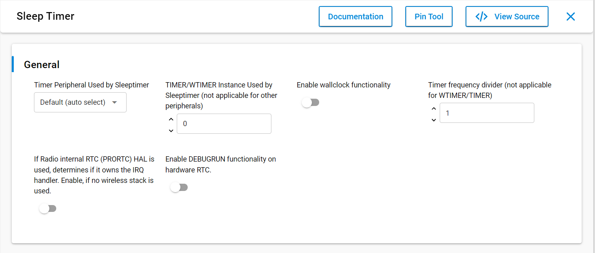

# SL SLEEPTIMER

## Table of Contents

- [Purpose/Scope](#purposescope)
- [Prerequisites/Setup Requirements](#prerequisitessetup-requirements)
  - [Hardware Requirements](#hardware-requirements)
  - [Software Requirements](#software-requirements)
  - [Setup Diagram](#setup-diagram)
- [Getting Started](#getting-started)
- [Application Build Environment](#application-build-environment)
  - [Application Configuration Parameters](#application-configuration-parameters)
- [Test the Application](#test-the-application)

## Purpose/Scope

- This application contains an example code to demonstrate one shot and periodic SLEEPTIMER with LED toggle functionality.

## Prerequisites/Setup Requirements

- To use this application following Hardware, Software and the Project Setup is required.

### Hardware Requirements

- Windows PC
- Silicon Labs [Si917 Evaluation Kit WPK(BRD4002) + BRD4338A]
  - The Serial Console setup instructions are provided below,
refer instructions [here](https://docs.silabs.com/wiseconnect/latest/wiseconnect-getting-started/getting-started-with-soc-mode#perform-console-output-and-input-for-brd4338-a).

### Software Requirements

- Simplicity Studio
- Embedded Development Environment
  - For Silicon Labs Si91x, use the latest version of Simplicity Studio (refer **"Download and Install Simplicity Studio"** section in **getting-started-with-siwx917-soc** guide at **release_package/docs/index.html**)

### Setup Diagram

> 

## Getting Started

Refer instructions [here](https://docs.silabs.com/wiseconnect/latest/wiseconnect-getting-started/) for the following tasks:

- Install Studio and WiSeConnect 3 extension
- Connect your device to the computer
- Upgrade your connectivity firmware
- Create a Studio project

## Application Build Environment

### Application Configuration Parameters

- Do not change any UC configuration. Si91x only uses si91x SYSRTC peripheral for sleeptimer and all the other peripherals/features listed in UC are not supported for Si91x.

  

- Configure the following parameter in sleeptimer.c file, update/modify following macro if required

  ```C
    #define TOOGLE_DELAY_MS1_ONESHOT //  configured for 5000 ms
    #define TOOGLE_DELAY_MS1_PERIODIC // configured for 400 ms
  ```

## Test the Application

Refer instructions [here](https://docs.silabs.com/wiseconnect/latest/wiseconnect-getting-started/) to:

1. Compile and run the application.
2. Sets the board state of LED1 to on and off after 5 sec and then configured for periodic blink rate of 400 ms.
3. LED1 should blink on WPK base board and prints should come on console. 

   
