# SiWx91x Platform Dev Kit

This example collects and processes sensor data from the SiWx91x dev kit board, transmits them over a Wi-Fi network, and displays them on the Simplicity Connect iOS/Android application.

## Table of Contents

- [SiWx91x Platform Dev Kit](#platform-siwx91x-dev-kit)
  - [Table of Contents](#table-of-contents)
  - [Purpose/Scope](#purposescope)
  - [Prerequisites/Setup Requirements](#prerequisitessetup-requirements)
    - [Hardware Requirements](#hardware-requirements)
    - [Software Requirements](#software-requirements)
    - [Setup Diagram](#setup-diagram)
  - [Program Demo Application](#program-demo-application)
  - [Application Build Environment](#application-build-environment)
  - [Run the Application](#run-the-application)
  - [Troubleshooting](#troubleshooting)
  - [Resources](#resources)
  - [Report Bugs/Support](#report-bugssupport)

## Purpose/Scope

The app starts in provisioning mode over BLE. User can use the Simplicity Connect iOS/Android app to scan for available Wi-Fi networks, select their desired network, enter the network credential, and then transmit the credential over a secure BLE connection.

Once provisioned, the app then connects to the selected network and brings up the sensor webserver. Users can then use their the Simplicity Connect iOS/Android app to view the sensor data collected by the dev kit board.

All device activities can be observed on the serial terminal prints. You may use a readily available terminal program such as [Tera Term](https://teratermproject.github.io/index-en.html) or [PuTTY](https://www.putty.org/).

## Prerequisites/Setup Requirements

 Before running the application, the user will need the following things to setup.

### Hardware Requirements

- Windows PC
- Wireless Access Point
- **SoC Mode**:
  - Kits
    - [BRD2605A](https://www.silabs.com/development-tools/wireless/wi-fi/siwx917-dk2605a-wifi-6-bluetooth-le-soc-dev-kit?tab=overview) (SiWx91x Dev Kit Board)
- Android Phone or iPhone with Simplicity Connect App (formerly EFR Connect App), which is available in Play Store and App Store (or) Windows PC with windows Silicon labs connect application.

### Software Requirements

- [Simplicity Studio](https://www.silabs.com/developers/simplicity-studio)
- Silicon Labs [Simplicity Connect App (formerly EFR Connect App)](https://www.silabs.com/developers/simplicity-connect-mobile-app?tab=downloads), the app can be downloaded from Google Play store/Apple App store.
  > IMPORTANT: This example requires Simplicity Connect version 2.9.3 or later.

### Setup Diagram

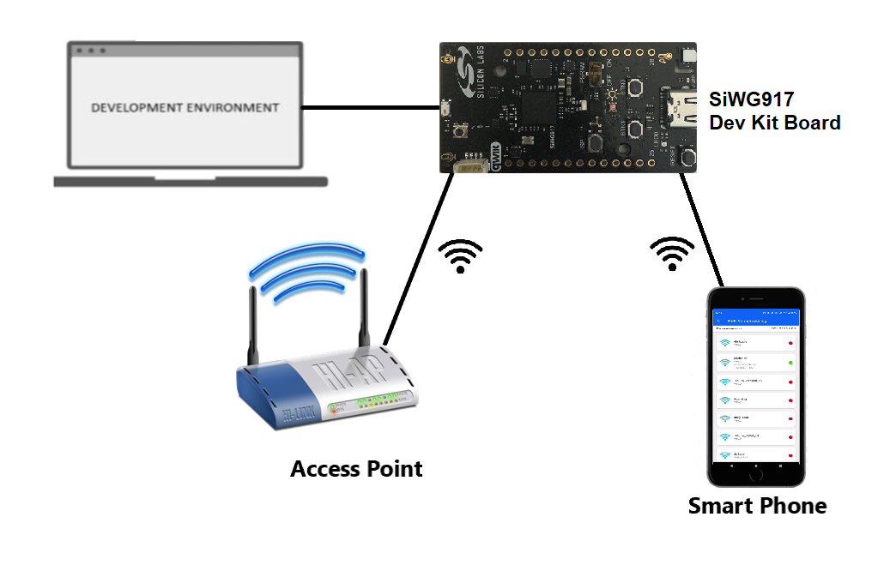

## Program Demo Application

  Follow the instructions on the [Developing for SiWx91x Host page](https://docs.silabs.com/wiseconnect/latest/wiseconnect-developers-guide-developing-for-silabs-hosts/#install-simplicity-studio) to:

- [Install Simplicity Studio](https://docs.silabs.com/wiseconnect/latest/wiseconnect-developers-guide-developing-for-silabs-hosts/#install-simplicity-studio)
- [Connect the SiWx917 board to your computer](https://docs.silabs.com/wiseconnect/latest/wiseconnect-developers-guide-developing-for-silabs-hosts/#connect-si-wx91x-to-computer)
- [Update the SiWx917 connectivity firmware](https://docs.silabs.com/wiseconnect/latest/wiseconnect-developers-guide-developing-for-silabs-hosts/#update-si-wx91x-connectivity-firmware)
- [Run the demo](https://docs.silabs.com/wiseconnect/latest/wiseconnect-getting-started/getting-started-with-soc-mode#run-the-demo). Locate the Wi-Fi SiWx91x Dev Kit [BRD2605A](https://www.silabs.com/development-tools/wireless/wi-fi/siwx917-dk2605a-wifi-6-bluetooth-le-soc-dev-kit?tab=overview) / BRD2605B tile and click `Run` to program the dev kit board with the demo binary. 

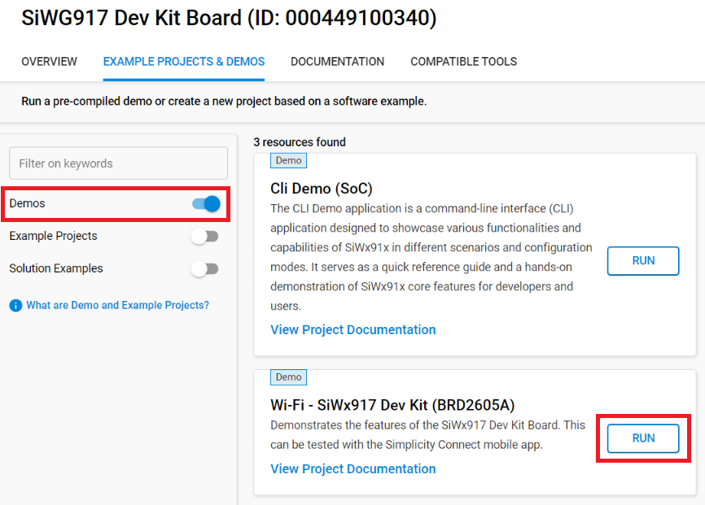

- Alternatively, you can follow the instructions on the [Developing with Radio Boards in SoC Mode page](https://docs.silabs.com/wiseconnect/latest/wiseconnect-developers-guide-developing-for-silabs-hosts/#developing-with-wi-se-connect-sdk-v3-x-with-si-wx91x-radio-boards) to:
  - [Create a project](https://docs.silabs.com/wiseconnect/latest/wiseconnect-developers-guide-developing-for-silabs-hosts/#create-a-project)
  - [Build the application](https://docs.silabs.com/wiseconnect/latest/wiseconnect-developers-guide-developing-for-silabs-hosts/#build-an-application)
  - [Flash the application](https://docs.silabs.com/wiseconnect/latest/wiseconnect-developers-guide-developing-for-silabs-hosts/#flash-an-application)

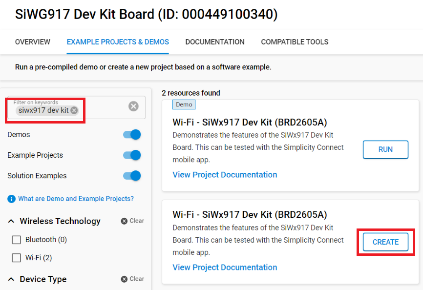

- After upgrading the application binary, proceed with the demo by referring to the next steps under [run the application](#run-the-application) section.

## Application Build Environment

- Configure the following Wi-Fi parameters in `wifi_app.c`:

- `WIFI_CLIENT_PROFILE_SSID`: Specifies the SSID of the Wi-Fi network to which the device connects as a station. Update the string with the name of your Wi-Fi network.

  ```c
  #define WIFI_CLIENT_PROFILE_SSID "YOUR_INITIAL_AP_SSID" // Wi-Fi network SSID
  ```

- `WIFI_SCAN_TIMEOUT`: Specifies the maximum time (in milliseconds) the Wi-Fi scan operation waits for a response before timing out. By default, it is set to 10000.

  ```c
  #define WIFI_SCAN_TIMEOUT         10000                   // Wi-Fi scan timeout in ms
  ```

- `DHCP_HOST_NAME`: Specifies the host name advertised by the DHCP client. By default, it is set to `NULL`, meaning no host name is sent.

  ```c
  #define DHCP_HOST_NAME            NULL                    // DHCP host name
  ```

- `APP_RECONN_LOOP_CTR_LIM`: Specifies the maximum number of reconnection attempts before the application gives up on re-establishing the Wi-Fi connection. By default, it is set to 3.

  ```c
  #define APP_RECONN_LOOP_CTR_LIM   3                       // Reconnection loop counter limit
  ```

- Configure the following server parameters in `sensor_app.c`:

- `HTTP_SERVER_PORT`: Specifies the HTTP server port used by the application to serve sensor data over HTTP. By default, it is set to 80.

  ```c
  #define HTTP_SERVER_PORT        80     // HTTP server port
  ```

- `SERVER_PORT`: Specifies the TCP server port used by the sensor application for data exchange. By default, it is set to 5000.

  ```c
  #define SERVER_PORT             5000   // Server port
  ```

- `SCAN_RESULT_BUFFER_SIZE`: Specifies the size (in bytes) of the buffer used to hold Wi-Fi scan results. By default, it is set to 2000.

  ```c
  #define SCAN_RESULT_BUFFER_SIZE (2000) // Scan result buffer size
  ```

- Configure the following BLE parameter in `ble_app.c`:

- `RSI_BLE_APP_DEVICE_NAME`: Specifies the Bluetooth Low Energy (BLE) device name advertised by the application. By default, it is set to `"WIFI_SENSOR"`.

  ```c
  #define RSI_BLE_APP_DEVICE_NAME "WIFI_SENSOR" // BLE device name
  ```

- Configure the following parameter in `app.c`:

- `RSI_TCP_IP_BYPASS`: Enables or disables the TCP/IP bypass mode. When enabled, the host handles the TCP/IP stack; when disabled, the NWP handles it. By default, it is set to `RSI_DISABLE`.

  ```c
  #define RSI_TCP_IP_BYPASS RSI_DISABLE // TCP/IP bypass mode
  ```

> **Note**: For recommended settings, please refer the [recommendations guide](https://docs.silabs.com/wiseconnect/latest/wiseconnect-developers-guide-prog-recommended-settings/).

## Run the Application

**Step 1** : The SiWx91x device starts in provisioning mode. All device activities can be observed on the serial terminal prints.

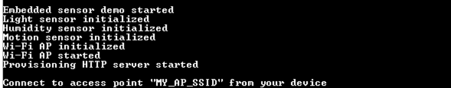

**Step 2** : Launch the Simplicity Connect app and select the `Wi-Fi Sensors` demo.

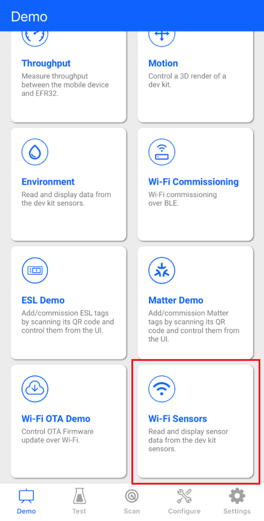

**Step 3** : The Simplicity Connect app starts scanning for the `WIFI_SENSOR` device on BLE. Select the `WIFI_SENSOR` device on the Simplicity Connect app.

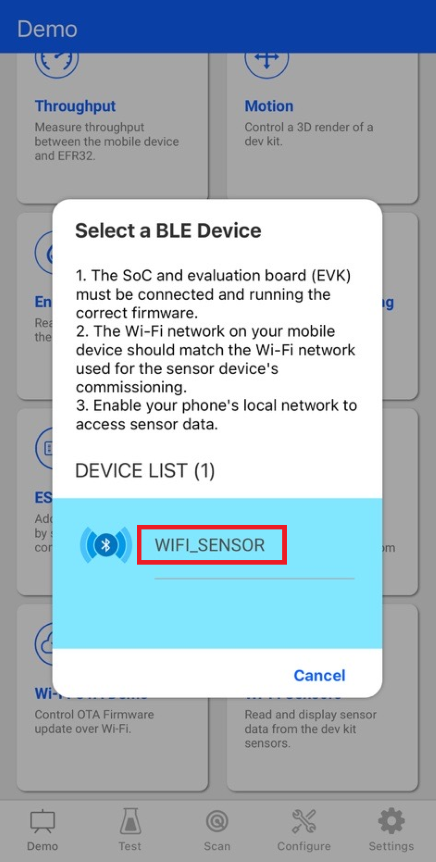

**Step 4** : Select your desired network, enter password, and then click `Ok`. The Simplicity Connect app then transmits the network credential securely over BLE connection.

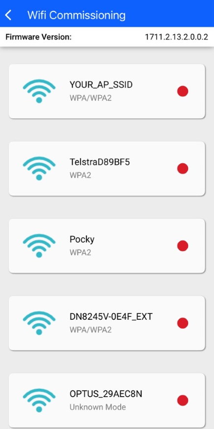

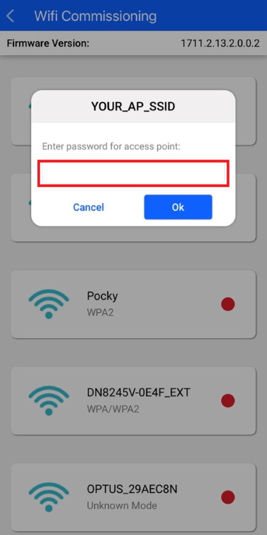

**Step 5** : The SiWx91x dev kit switches to Wi-Fi Station mode and connects to the selected Wi-Fi network. The Simplicity Connect app then connects to the sensor webserver running on the dev kit board. Wait until connection is established.

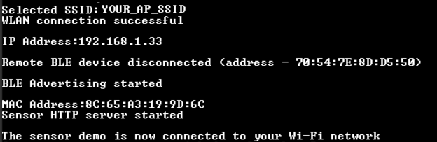

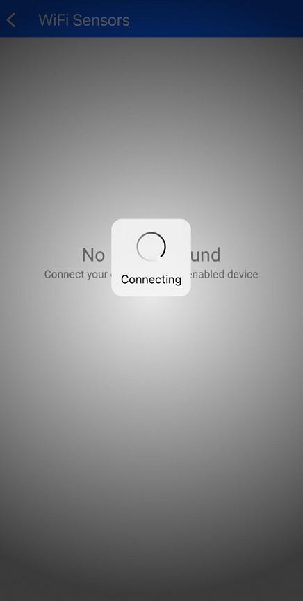

**Step 6** : Select one of the options to view sensor data.

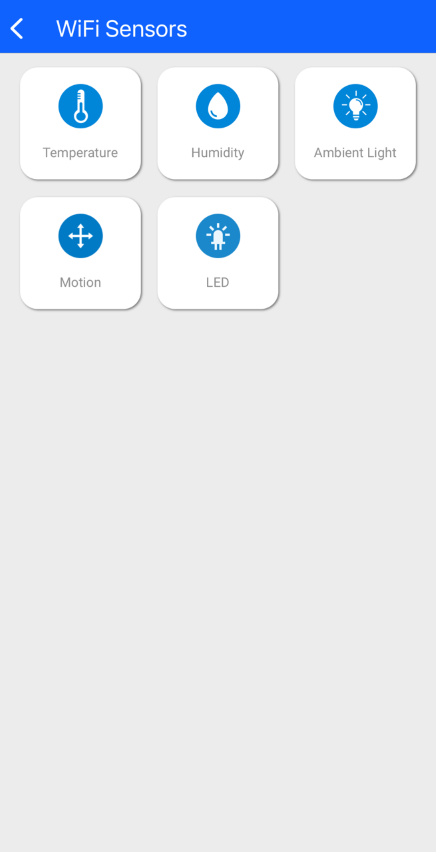

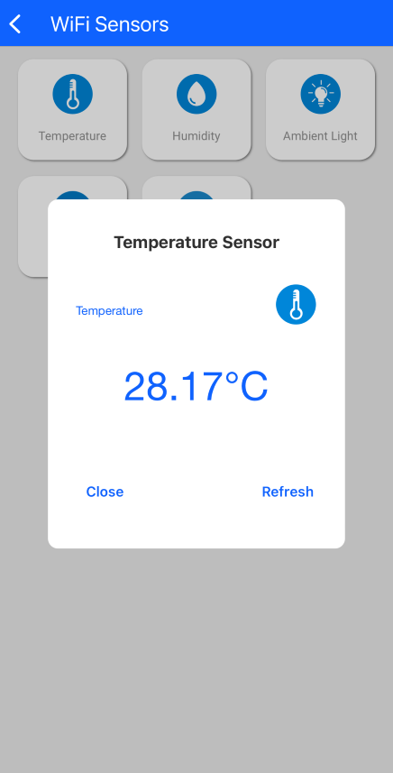

**Step 7** : Select `LED` to control the LED on the dev kit board.

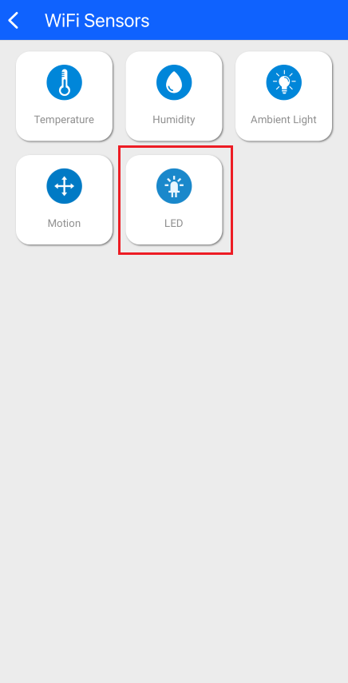

**Step 8** : Select a color and observe the LED on the dev kit changes color. You can also switch the LED on/off.

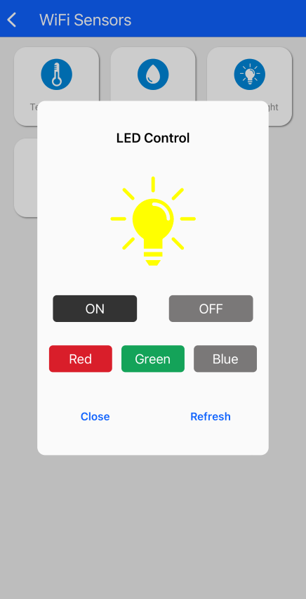

## Troubleshooting

- If the project does not build, ensure that Simplicity Studio and the WiSeConnect extension are installed and the board is connected.
- If the device is not detected, reinstall the connectivity firmware and check USB drivers.

## Resources

- [WiSeConnect Getting Started](https://docs.silabs.com/wiseconnect/latest/wiseconnect-getting-started/)
- [WiSeConnect Examples](https://docs.silabs.com/wiseconnect/latest/wiseconnect-examples/)
- [SiWx91x SoC Documentation](https://docs.silabs.com/wiseconnect/latest/)

## Report Bugs/Support

For issues and support, use the Silicon Labs Community or your normal support channel.

