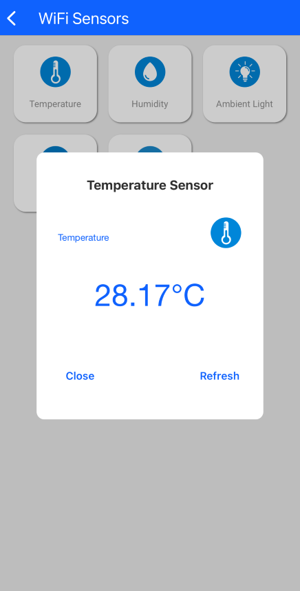

# SiWG917 Dev Kit

This example collects and processes sensor data from the SiWG917 dev kit board, transmits them over a Wi-Fi network, and displays them on the Simplicity Connect iOS/Android application.

## Table of Contents

- [SiWG917 Dev Kit](#siwg917-dev-kit)
  - [Table of Contents](#table-of-contents)
  - [Purpose/Scope](#purposescope)
  - [Prerequisites/Setup Requirements](#prerequisitessetup-requirements)
    - [Hardware Requirements](#hardware-requirements)
    - [Software Requirements](#software-requirements)
    - [Setup Diagram](#setup-diagram)
  - [Program Demo Application](#program-demo-application)
  - [Application Build Environment](#application-build-environment)
  - [Run the Application](#run-the-application)

## Purpose/Scope

The app starts in provisioning mode over BLE. User can use the Simplicity Connect iOS/Android app to scan for available Wi-Fi networks, select their desired network, enter the network credential, and then transmit the credential over a secure BLE connection.

Once provisioned, the app then connects to the selected network and brings up the sensor webserver. Users can then use their the Simplicity Connect iOS/Android app to view the sensor data collected by the dev kit board.

All device activities can be observed on the serial terminal prints. You may use a readily available terminal program such as [Tera Term](https://teratermproject.github.io/index-en.html) or [PuTTY](https://www.putty.org/).

## Prerequisites/Setup Requirements

 Before running the application, the user will need the following things to setup.

### Hardware Requirements

- Windows PC
- Wireless Access Point
- **SoC Mode**:
  - Kits
    - BRD2605A (SiWG917 Dev Kit Board)
- Android Phone or iPhone with Simplicity Connect App (formerly EFR Connect App), which is available in Play Store and App Store (or) Windows PC with windows Silicon labs connect application.

### Software Requirements

- [Simplicity Studio](https://www.silabs.com/developers/simplicity-studio)
- Silicon Labs [Simplicity Connect App (formerly EFR Connect App)](https://www.silabs.com/developers/simplicity-connect-mobile-app?tab=downloads), the app can be downloaded from Google Play store/Apple App store.
  > IMPORTANT: This example requires Simplicity Connect version 2.9.3 or later.

### Setup Diagram

## Program Demo Application

  Follow the instructions on the [Developing for SiWx91x Host page](https://docs.silabs.com/wiseconnect/latest/wiseconnect-developers-guide-developing-for-silabs-hosts/#install-simplicity-studio) to:

- [Install Simplicity Studio](https://docs.silabs.com/wiseconnect/latest/wiseconnect-developers-guide-developing-for-silabs-hosts/#install-simplicity-studio)
- [Connect the SiWx917 board to your computer](https://docs.silabs.com/wiseconnect/latest/wiseconnect-developers-guide-developing-for-silabs-hosts/#connect-si-wx91x-to-computer)
- [Update the SiWx917 connectivity firmware](https://docs.silabs.com/wiseconnect/latest/wiseconnect-developers-guide-developing-for-silabs-hosts/#update-si-wx91x-connectivity-firmware)
- [Run the demo](https://docs.silabs.com/wiseconnect/latest/wiseconnect-getting-started/getting-started-with-soc-mode#run-the-demo). Locate the `Wi-Fi SiWx917 Dev Kit (BRD2605A)` tile and click `Run` to program the dev kit board with the demo binary. 

- Alternatively, you can follow the instructions on the [Developing with Radio Boards in SoC Mode page](https://docs.silabs.com/wiseconnect/latest/wiseconnect-developers-guide-developing-for-silabs-hosts/#developing-with-wi-se-connect-sdk-v3-x-with-si-wx91x-radio-boards) to:
  - [Create a project](https://docs.silabs.com/wiseconnect/latest/wiseconnect-developers-guide-developing-for-silabs-hosts/#create-a-project)
  - [Build the application](https://docs.silabs.com/wiseconnect/latest/wiseconnect-developers-guide-developing-for-silabs-hosts/#build-an-application)
  - [Flash the application](https://docs.silabs.com/wiseconnect/latest/wiseconnect-developers-guide-developing-for-silabs-hosts/#flash-an-application)

- After upgrading the application binary, proceed with the demo by referring to the next steps under [run the application](#run-the-application) section.

## Application Build Environment

> **Note**: For recommended settings, see the [recommendations guide](https://docs.silabs.com/wiseconnect/latest/wiseconnect-developers-guide-prog-recommended-settings/).

## Run the Application

**Step 1** : The SiWG917 device starts in provisioning mode. All device activities can be observed on the serial terminal prints.

**Step 2** : Launch the Simplicity Connect app and select the `Wi-Fi Sensors` demo.

**Step 3** : The Simplicity Connect app starts scanning for the `WIFI_SENSOR` device on BLE. Select the `WIFI_SENSOR` device on the Simplicity Connect app.

**Step 4** : Select your desired network, enter password, and then click `Ok`. The Simplicity Connect app then transmits the network credential securely over BLE connection.

**Step 5** : The SiWG917 dev kit switches to Wi-Fi Station mode and connects to the selected Wi-Fi network. The Simplicity Connect app then connects to the sensor webserver running on the dev kit board. Wait until connection is established.

**Step 6** : Select one of the options to view sensor data.

**Step 7** : Select `LED` to control the LED on the dev kit board.

**Step 8** : Select a color and observe the LED on the dev kit changes color. You can also switch the LED on/off.

