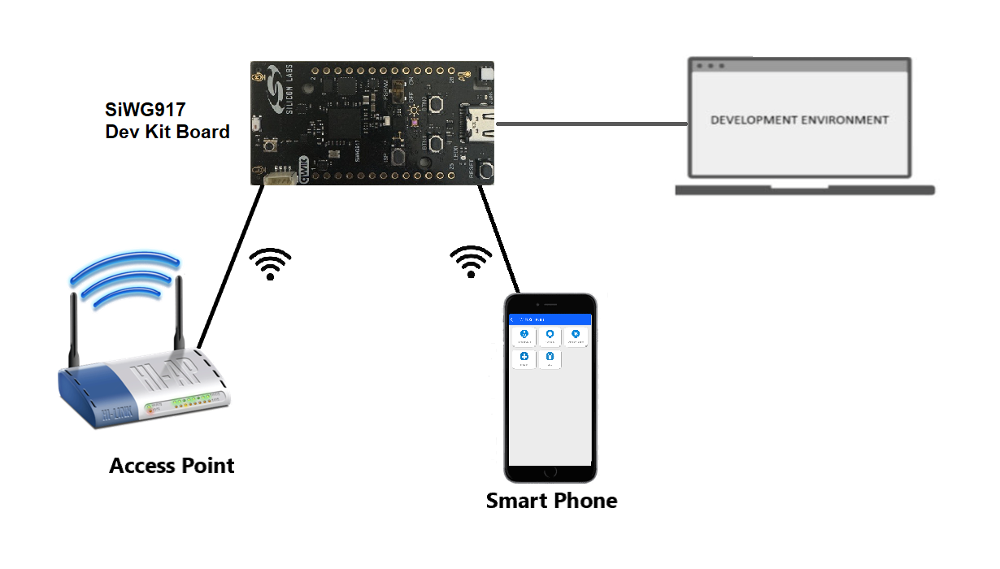
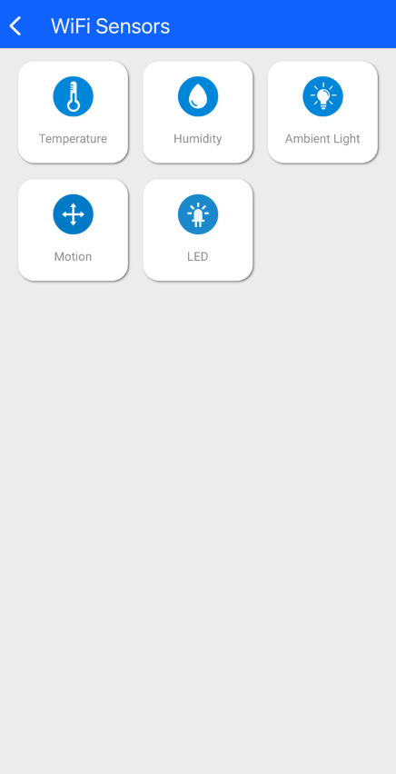

# SiWG917 Dev Kit

This example collects and processes sensor data from the SiWG917 dev kit board, transmits them over a Wi-Fi network, and displays them on the Simplicity Connect iOS/Android application.

## Table of Contents

- [Purpose/Scope](#purposescope)
- [Prerequisites/Setup Requirements](#prerequisitessetup-requirements)
  - [Hardware Requirements](#hardware-requirements)
  - [Software Requirements](#software-requirements)
  - [Setup Diagram](#setup-diagram)
- [Program Demo Application](#program-demo-application)
- [Run the Application](#run-the-application)

## Purpose/Scope

The app starts in Wi-Fi access point (AP) mode. User can use their mobile device to connect to the SiWG917 dev kit's AP network and use the Simplicity Connect iOS/Android app to view the sensor data collected by the dev kit board.

Additionally, the app also runs a local webserver that enables provisioning of the SiWG917 device onto a Wi-Fi network. User can access the webserver via a browser, scan for available networks, select their desired network and enter the network credential. Once provisioned, the app then proceeds to bring down the AP and switches to Wi-Fi Station mode. The app connects to the selected network and brings up the sensor webserver. Users can then use their browser to view the sensor data collected by the dev kit board.

All device activities can be observed on the serial terminal prints. You may use a readily available terminal program such as [Tera Term](https://teratermproject.github.io/index-en.html) or [PuTTY](https://www.putty.org/).

## Prerequisites/Setup Requirements

 Before running the application, the user will need the following things to setup.

### Hardware Requirements

- Windows PC
- Wireless Access Point
- **SoC Mode**:
  - Kits
    - BRD2605A (SiWG917 Dev Kit Board)
- Android Phone or iPhone with Simplicity Connect App (formerly EFR Connect App), which is available in Play Store and App Store (or) Windows PC with windows Silicon labs connect application.

### Software Requirements

- [Simplicity Studio](https://www.silabs.com/developers/simplicity-studio)
- Silicon Labs [Simplicity Connect App (formerly EFR Connect App)](https://www.silabs.com/developers/simplicity-connect-mobile-app?tab=downloads), the app can be downloaded from Google Play store/Apple App store.

### Setup Diagram

## Program Demo Application

  Follow the instructions on the [Developing for SiWx91x Host page](https://docs.silabs.com/wiseconnect/latest/wiseconnect-developers-guide-developing-for-silabs-hosts/#install-simplicity-studio) to:

- [Install Simplicity Studio](https://docs.silabs.com/wiseconnect/latest/wiseconnect-developers-guide-developing-for-silabs-hosts/#install-simplicity-studio)
- [Connect the SiWx917 board to your computer](https://docs.silabs.com/wiseconnect/latest/wiseconnect-developers-guide-developing-for-silabs-hosts/#connect-si-wx91x-to-computer)
- [Update the SiWx917 connectivity firmware](https://docs.silabs.com/wiseconnect/latest/wiseconnect-developers-guide-developing-for-silabs-hosts/#update-si-wx91x-connectivity-firmware)
- [Run the demo](https://docs.silabs.com/wiseconnect/latest/wiseconnect-getting-started/getting-started-with-soc-mode#run-the-demo). Locate the `Wi-Fi SiWx917 Dev Kit (BRD2605A)` tile and click `Run` to program the dev kit board with the demo binary. 

- Alternatively, you can follow the instructions on the [Developing with Radio Boards in SoC Mode page](https://docs.silabs.com/wiseconnect/latest/wiseconnect-developers-guide-developing-for-silabs-hosts/#developing-with-wi-se-connect-sdk-v3-x-with-si-wx91x-radio-boards) to:
  - [Create a project](https://docs.silabs.com/wiseconnect/latest/wiseconnect-developers-guide-developing-for-silabs-hosts/#create-a-project)
  - [Build the application](https://docs.silabs.com/wiseconnect/latest/wiseconnect-developers-guide-developing-for-silabs-hosts/#build-an-application)
  - [Flash the application](https://docs.silabs.com/wiseconnect/latest/wiseconnect-developers-guide-developing-for-silabs-hosts/#flash-an-application)

- After upgrading the application binary, proceed with the demo by referring to the next steps under [run the application](#run-the-application) section.

## Run the Application

### Viewing Sensor Data

**Step 1** : The SiWG917 device starts in AP mode. All device activities can be observed on the serial terminal prints.

**Step 2** : Connect your mobile device to the SiWG917 device's AP. The default network name and password are `MY_AP_SSID` and `MY_AP_PASSPHRASE`, respectively.

**Step 3** : Launch the Simplicity Connect app and select the `Wi-Fi Sensors` demo.

**Step 4** : Select one of the options to view sensor data.

**Step 5** : Select `LED` to control the LED on the dev kit board.

**Step 6** : Select a color and observe the LED on the dev kit changes color. You can also switch the LED on/off.

### Connecting to a Wi-Fi Network

**Step 1** : Make sure that your mobile device is connected to the SiWG917 dev kit's AP network.

**Step 2** : Enter `192.168.10.10` on your browser to open the provisioning webpage.

**Step 3** : Click `Scan` to scan for available networks. 

**Step 4** : Select your desired network, enter password, and then click `Connect`.

**Step 5** : The SiWG917 dev kit switches to Wi-Fi Station mode and connects to the selected Wi-Fi network. 

**Step 6** : Connect your mobile device to the same Wi-Fi network that the SiWG917 is connected to. You can access the sensor webpage by entering 
the device IP address in your browser. The device IP address can be found in the serial terminal prints. If it fails to connect, go back to step 1.

**Step 7** : Click `Refresh` to load and view the latest sensor data

