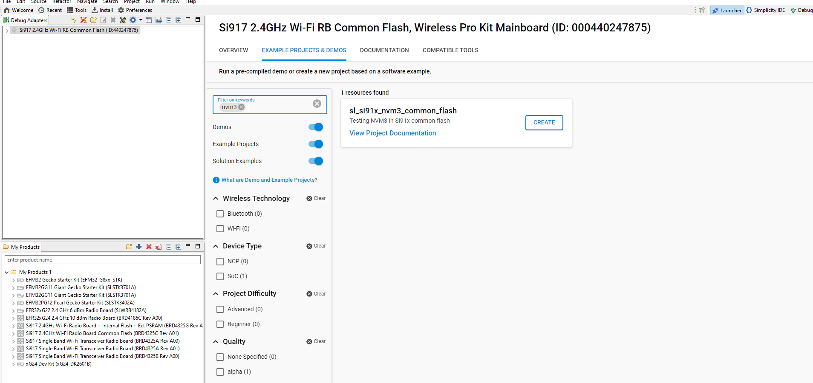

# NVM3 Si91x Common Flash

## Introduction 
- This example application demonstrates the use of Third Generation Non-Volatile Memory (NVM3) data storage in Si91x common flash.
- This example writes initializes NVM3 and does following operations
	1. Store 4 keys in flash using NVM3 write
	2. Display 4 keys stored.
	3. Delete 4 keys.

## Setting Up 
 - To use this application following Hardware, Software and the Project Setup is required

### Hardware Requirements	
  - Windows PC 
  - Silicon Labs [Si917 Evaluation Kit WPK + BRD4325C/BRD4325G/BRD4325A]
 

### Software Requirements
  - Si91x SDK
  - Embedded Development Environment
    - For Silicon Labs Si91x, use the latest version of Simplicity Studio (refer **"Download and Install Simplicity Studio"** section in **getting-started-with-siwx917-soc** guide at **release_package/docs/index.html**)

## Code modifications for printing on the uart console
  - None

## Pinout on WPK for uart console
  - P27 - UART Tx
  - EXP1 - GND

## Project Setup
- **Silicon Labs Si91x** refer **"Download SDK"** section in **getting-started-with-siwx917-soc** guide at **release_package/docs/index.html** to work with Si91x and Simplicity Studio

## Loading Application on Simplicity Studio
- With the product Si917 selected, navigate to the example projects by clicking on Example Projects & Demos 
in simplicity studio and click on tosl_si91x_nvm3_common_flash Example application as shown below
	

## Build 
- Compile the application in Simplicity Studio using build icon 

## Device Programming
- To program the device ,refer **"Burn M4 Binary"** section in **getting-started-with-siwx917-soc** guide at **release_package/docs/index.html** to work with Si91x and Simplicity Studio

## Executing the Application
- Users will observe following prints on console
Refer to 

## Resources

* [AN1135: Using Third Generation Non-Volatile Memory (NVM3) Data Storage](https://www.silabs.com/documents/public/application-notes/an1135-using-third-generation-nonvolatile-memory.pdf)