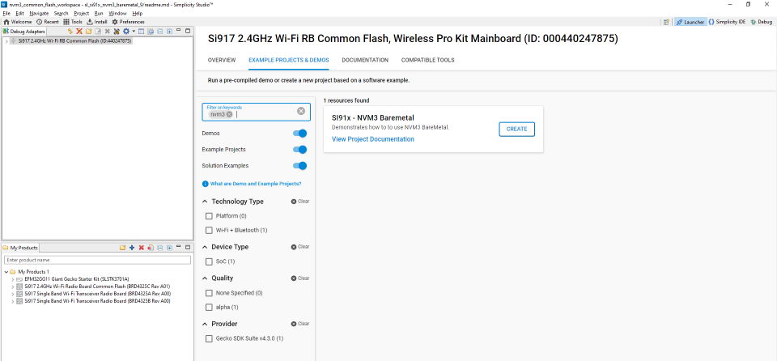

# NVM3 Si91x Dual Flash

## Introduction 
- This example application demonstrates the use of Third Generation Non-Volatile Memory (NVM3) data storage in Si91x dual flash.

## Setting Up

- To use this application following Hardware, Software and the Project Setup is required

### Hardware Requirements

- Windows PC
- Silicon Labs [Si917 Evaluation Kit WPK + BRD4325B]
 

### Software Requirements

- Si91x SDK
- Embedded Development Environment
  - For Silicon Labs Si91x, use the latest version of Simplicity Studio (refer **"Download and Install Simplicity Studio"** section in **getting-started-with-siwx917-soc** guide at **release_package/docs/index.html**)

## Code modifications for printing on the uart console

- In rsi_board.c file make M4_UART1_INSTANCE as 1 and M4_UART2_INSTANCE as 0

## Pinout on WPK for uart console

- EXP4 - UART Tx
- EXP6 - UART Rx
- EXP1 - GND

## Project Setup

- **Silicon Labs Si91x** refer **"Download SDK"** section in **getting-started-with-siwx917-soc** guide at **release_package/docs/index.html** to work with Si91x and Simplicity Studio

## Loading Application on Simplicity Studio

- With the product Si917 selected, navigate to the example projects by clicking on Example Projects & Demos
  in simplicity studio and click on to NVM3 Bare Metal Example application as shown below

## Build

- Compile the application in Simplicity Studio using build icon

## Device Programming

- To program the device ,refer **"Burn M4 Binary"** section in **getting-started-with-siwx917-soc** guide at **release_package/docs/index.html** to work with Si91x and Simplicity Studio

## Executing the Application

- Users can give the following commands:

  - Write - Writes into an existing or new file
  - Read - Rest the contents of an existing file
  - Delete - Deletes the contents of an existing file

Refer to 

## Resources

- [AN1135: Using Third Generation Non-Volatile Memory (NVM3) Data Storage](https://www.silabs.com/documents/public/application-notes/an1135-using-third-generation-nonvolatile-memory.pdf)
