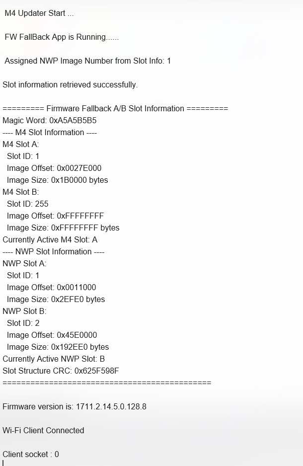

# M4 FW AB UPDATER (A/B Fallback)

## Table of Contents

- [M4 FW AB UPDATER (A/B Fallback)](#m4-fw-ab-updater-ab-fallback)
  - [Table of Contents](#table-of-contents)
  - [Purpose/Scope](#purposescope)
  - [Prerequisites/Setup Requirements](#prerequisitessetup-requirements)
    - [Hardware Requirements](#hardware-requirements)
    - [Software Requirements](#software-requirements)
    - [Setup Diagram](#setup-diagram)
  - [Getting Started](#getting-started)
  - [Test the Application](#test-the-application)

## Purpose/Scope

This application fetches the M4 application address from flash. If a valid address is obtained from slot information, it jumps to the M4 application; otherwise, it enters an infinite loop in case of failure.

## Prerequisites/Setup Requirements

### MBR Provisioning

> **Note:** Refer to UG625: SiWG917 Firmware Fallback User Guide before executing the reference examples.

Before using the A/B firmware fallback feature, the fallback profile must be enabled in the MBR on the device.

To enable firmware fallback for the devices using default MBR, use `commander manufacturing provision --mbr default --profile fallback -d <OPN>` command in the Simplicity Commander CLI tool.

To confirm the firmware fallback feature is enabled on the device, use `commander readmem --range 0x4000091:+1` command in the Simplicity Commander CLI tool and confirm the value to be 1.

For more details on firmware fallback feature enablement and usage, refer to UG625: SiWG917 Firmware Fallback User Guide.

### Hardware Requirements

- Windows PC
- Silicon Labs Si917 Evaluation Kit [WPK(BRD4002) + BRD4338A ]

### Software Requirements

- Simplicity Studio

### Setup Diagram

## Getting Started

Refer to the instructions [here](https://docs.silabs.com/wiseconnect/latest/wiseconnect-getting-started/) to:

- [Install Simplicity Studio](https://docs.silabs.com/wiseconnect/latest/wiseconnect-developers-guide-developing-for-silabs-hosts/#install-simplicity-studio)
- [Install WiSeConnect extension](https://docs.silabs.com/wiseconnect/latest/wiseconnect-developers-guide-developing-for-silabs-hosts/#install-the-wi-se-connect-extension)
- [Connect your device to the computer](https://docs.silabs.com/wiseconnect/latest/wiseconnect-developers-guide-developing-for-silabs-hosts/#connect-si-wx91x-to-computer)
- [Upgrade your connectivity firmware](https://docs.silabs.com/wiseconnect/latest/wiseconnect-developers-guide-developing-for-silabs-hosts/#update-si-wx91x-connectivity-firmware)
- [Create a Studio project](https://docs.silabs.com/wiseconnect/latest/wiseconnect-developers-guide-developing-for-silabs-hosts/#create-a-project)

For details on the project folder structure, see the [WiSeConnect Examples](https://docs.silabs.com/wiseconnect/latest/wiseconnect-examples/#example-folder-structure) page.

> **Note**: For recommended settings, please refer the [recommendations guide](https://docs.silabs.com/wiseconnect/latest/wiseconnect-developers-guide-prog-recommended-settings/).

## Test the Application

1. Compile and run the application.
2. This application retrieves the active application flash offset and branches to the retrieved offset.

