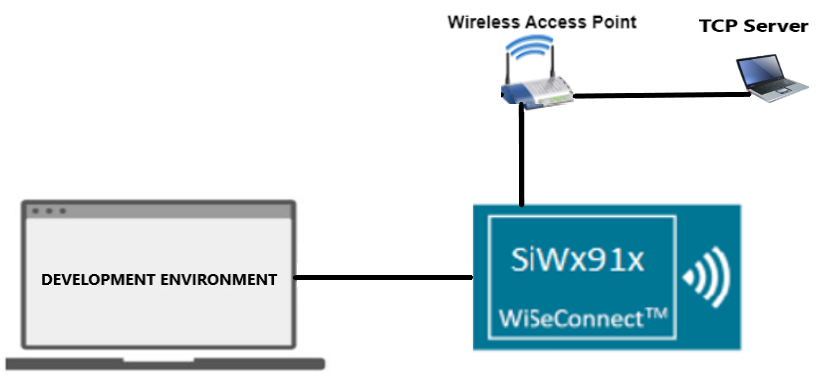
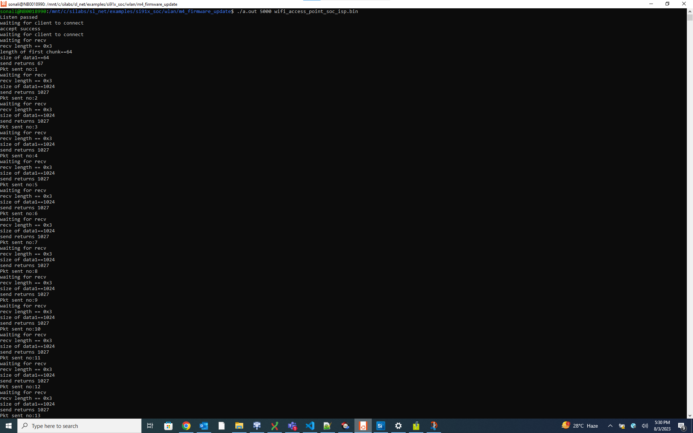
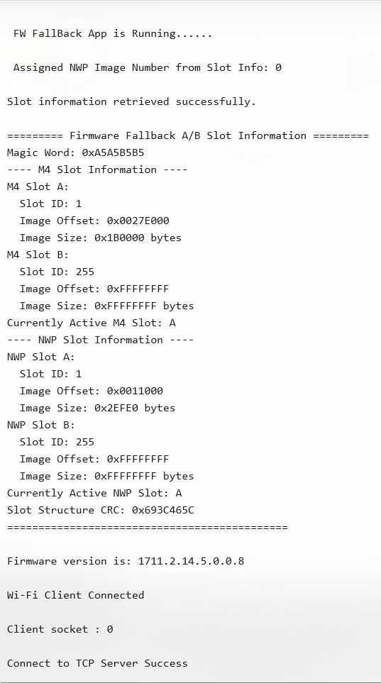
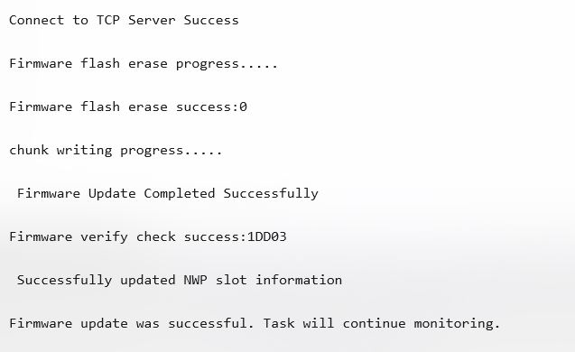

# Wi-Fi - NWP-M4 Firmware Update via TCP (A/B Fallback)

## Table of Contents

- [Wi-Fi - NWP-M4 Firmware Update via TCP (A/B Fallback)](#wi-fi---nwp-m4-firmware-update-via-tcp-ab-fallback)
  - [Table of Contents](#table-of-contents)
  - [Purpose/Scope](#purposescope)
  - [Prerequisites/Setup Requirements](#prerequisitessetup-requirements)
    - [Hardware Requirements](#hardware-requirements)
    - [Software Requirements](#software-requirements)
    - [Setup Diagram](#setup-diagram)
  - [Getting Started](#getting-started)
  - [Application Build Environment](#application-build-environment)
    - [STA Instance-related Parameters](#sta-instance-related-parameters)
    - [TCP Configuration](#tcp-configuration)
  - [Test the Application](#test-the-application)

## Purpose/Scope

This application shows how to update the M4 firmware of a device via Wi-Fi by downloading the firmware file from a remote TCP server. The server can be run on a local PC. The update process works as follows:

- **Connection**: The device connects to a Wi-Fi network and acts as a TCP client.
- **Request**: The device sends a request to the TCP server for the firmware update file.
- **Download**: The server sends the firmware file to the device.
- **Update**: The device erases the target flash region, writes the new firmware to the appropriate offset, and then restarts to complete the update process.

This process allows the device to update its software over the air (OTA) without needing a physical connection.

>**Note:**
>A/B firmware update functionality requires a special MBR to be preloaded on the device. Ensure these components are correctly loaded before running this example.
>This feature doesnot support sleep wakeup functionality from M4 Updater.

## Prerequisites/Setup Requirements

### Hardware Requirements  

- Windows PC
- Silicon Labs SiWx917 Evaluation Kit [WPK/WSTK + BRD4325A]
- Wireless Access Point
- Linux PC or Cygwin on Windows (to build and run the TCP server source provided)

### Software Requirements

- Simplicity Studio
- Linux Build Environment
  - Installation of build tools for Linux including the gcc compiler (or equivalent on PC or Mac)
  - For Ubuntu, use the following command for installation: `user@ubuntu:~$ sudo apt install build-essential`.
  - If you do not have Linux, you can use [Cygwin for Windows](https://www.cygwin.com/) instead.
- VCOM Setup
  - The Docklight tool's setup instructions are provided below.

    

### Setup Diagram



## Getting Started

Refer to the instructions [here](https://docs.silabs.com/wiseconnect/latest/wiseconnect-getting-started/) to:

- [Install Simplicity Studio](https://docs.silabs.com/wiseconnect/latest/wiseconnect-developers-guide-developing-for-silabs-hosts/#install-simplicity-studio)
- [Install WiSeConnect 3 extension](https://docs.silabs.com/wiseconnect/latest/wiseconnect-developers-guide-developing-for-silabs-hosts/#install-the-wi-se-connect-3-extension)
- [Connect your device to the computer](https://docs.silabs.com/wiseconnect/latest/wiseconnect-developers-guide-developing-for-silabs-hosts/#connect-si-wx91x-to-computer)
- [Upgrade your connectivity firmware ](https://docs.silabs.com/wiseconnect/latest/wiseconnect-developers-guide-developing-for-silabs-hosts/#update-si-wx91x-connectivity-firmware)
- [Create a Studio project ](https://docs.silabs.com/wiseconnect/latest/wiseconnect-developers-guide-developing-for-silabs-hosts/#create-a-project)

For details on the project folder structure, see the [WiSeConnect Examples](https://docs.silabs.com/wiseconnect/latest/wiseconnect-examples/#example-folder-structure) page.

## Application Build Environment

The application can be configured to suit your requirements and development environment.

In the Project Explorer pane, expand the **config** folder and open the [`sl_net_default_values.h`](https://github.com/SiliconLabs/wiseconnect/blob/master/resources/defaults/sl_net_default_values.h) file. Configure the following parameters to enable your Silicon Labs Wi-Fi device to connect to your Wi-Fi network.

### STA Instance-related Parameters

- DEFAULT_WIFI_CLIENT_PROFILE_SSID refers to the name with which the Wi-Fi network shall be advertised and Si91X module is connected to it.

  ```c
  #define DEFAULT_WIFI_CLIENT_PROFILE_SSID               "YOUR_AP_SSID"      
  ```

- DEFAULT_WIFI_CLIENT_CREDENTIAL refers to the secret key if the access point is configured in WPA-PSK/WPA2-PSK security modes.

  ```c
  #define DEFAULT_WIFI_CLIENT_CREDENTIAL                 "YOUR_AP_PASSPHRASE" 
  ```

- DEFAULT_WIFI_CLIENT_SECURITY_TYPE refers to the security type of the access point. The supported security modes are mentioned in `sl_wifi_security_t`.

  ```c
  #define DEFAULT_WIFI_CLIENT_SECURITY_TYPE               SL_WIFI_WPA2 
  ```

- Other STA instance configurations can be modified if required in `default_wifi_client_profile` configuration structure.

- SL_APP_TOGGLE_SLOT_INFO controls firmware slot switching when WiFi fails. By default (0), the device stays on the current slot. Setting it to 1 enables automatic switching to the alternate firmware slot if WiFi cannot connect.

  ```c
  #define SL_APP_TOGGLE_SLOT_INFO 0 
  ```

- The firmware slot update functionality is controlled by the following macro:

  ```c
  #define SL_APP_UPDATE_FIRMWARE_SLOT 0 
  ```

  - Purpose: Controls whether the firmware slot information for M4 and NWP cores is updated after a successful firmware update.
    - Default Value: 0 (Disabled)
    - Possible Values:
      - 0: Disable firmware slot updates.
      - 1: Enable firmware slot updates.

- Debug Logging Configuration
  - The **DISABLE_AB_DEBUG_LOGS** macro controls whether debug logs are enabled or disabled in the A/B Firmware Fallback module. By default, debug logs are disabled.

    ```c
    #define DISABLE_AB_DEBUG_LOGS 1 
    ```

  - The macro is defined in the following file:  [`components/device/silabs/si91x/mcu/drivers/service/firmware_fallback/src/sl_si91x_fw_fallback.c`](https://github.com/SiliconLabs/wiseconnect/blob/master/components/device/silabs/si91x/mcu/drivers/service/firmware_fallback/src/sl_si91x_fw_fallback.c)

- Encryption and Fallback Slot Configuration
  - The **SL_SI91X_FALLBACK_SLOT_ENCRYPTION** macro enables sleep/wakeup support and is part of the SPL "FW fallback" feature. Enable this macro only when Encrypted XIP of M4 is enabled. Define it in your project's preprocessor settings.

    ```c
    #define SL_SI91X_FALLBACK_SLOT_ENCRYPTION 0  // Disabled by default
    ```

  - **Important Requirements when enabling this macro:**
    1. **Encrypted XIP of M4 must be enabled** - This macro should only be used when encryption features are active
    2. **FW fallback feature must be enabled** for your board before enabling this macro
    3. **Examples using this macro MUST be loaded with OTA (Over-The-Air) updates**
    4. **You MUST use the updater application** for examples that have this macro enabled
    5. **DO NOT use Commander** for examples that have this macro enabled. Please consider this a slot example.

  - **Purpose:** This macro enables enhanced sleep/wakeup support with encryption capabilities for firmware fallback operations. It's an SPL (Silicon Labs) specific feature that requires proper board configuration and OTA deployment methods.

  - **Warning:** When enabled, this macro will display compile-time warnings to ensure developers understand the requirements. These warnings can be disabled by commenting out the `#pragma message` lines in the header file.

- Burn NWP Security Version (optional)
  - The **SL_APP_BURN_NWP_SECURITY_VERSION** macro controls whether the app burns the NWP security version after a successful Wi-Fi connection. Disabled by default.

    ```c
    #define SL_APP_BURN_NWP_SECURITY_VERSION 0  // 0: Disabled, 1: Enabled
    ```

  - When enabled, the app calls `sl_si91x_burn_nwp_security_version()` with the active NWP firmware address obtained from slot info. Use only if your update flow requires burning a new security version.

- After completing the OTA update process, it is recommended to perform a system reset using the [`sl_si91x_soc_nvic_reset()`](https://docs.silabs.com/wiseconnect/latest/wiseconnect-api-reference-guide-common/soft-reset-functions#sl-si91x-soc-nvic-reset) function. This ensures that the updated firmware is properly loaded, and the system is initialized with the new firmware.

- The [`sl_si91x_soc_nvic_reset()`](https://docs.silabs.com/wiseconnect/latest/wiseconnect-api-reference-guide-common/soft-reset-functions#sl-si91x-soc-nvic-reset) function is available in the `app.c` file but is commented out by default. Uncomment the following line in the `app.c` file to enable the reset:

  ```c
  sl_si91x_soc_nvic_reset();
  ```

### TCP Configuration

- In the Project Explorer pane, open the **app.c** file. 

  ```c
  #define SERVER_PORT        5000             // TCP server port of the remote TCP server
  #define SERVER_IP_ADDRESS  "192.168.0.100"  // Server IP address 
  ```

> **Note**: For recommended settings, see the [recommendations guide](https://docs.silabs.com/wiseconnect/latest/wiseconnect-developers-guide-prog-recommended-settings/).

## Test the Application

Refer to the instructions [here](https://docs.silabs.com/wiseconnect/latest/wiseconnect-getting-started/) to:

- Build the application
- Flash, run, and debug the application

To establish the TCP server with firmware file on remote PC, follow the steps below:

 1. Copy the TCP server application [firmware_update_tcp_server_9117.c](https://github.com/SiliconLabs/wiseconnect-wifi-bt-sdk/tree/master/examples/featured/firmware_update/firmware_update_tcp_server_9117.c) provided with the application source to a Linux PC connected to the Wi-Fi access point.
 
 2. For Updater image OTA Copy the upadter TCP server application [firmware_update_tcp_server_for_updater.c] provided with the application source to a Linux PC connected to the Wi-Fi access point.

 3. Compile the application.

     `user@linux:~$ gcc "server_file_name".c -o ota_server.bin`

 4. Run the application, providing the TCP port number (specified in the SiWx91x app) together with the firmware file and path.

    `user@linux:~$ ./ota_server.bin 5000 wifi_access_point.rps`

    ... where **wifi_access_point.rps** is the firmware image to be sent to SiWx91x.

   

   

 


