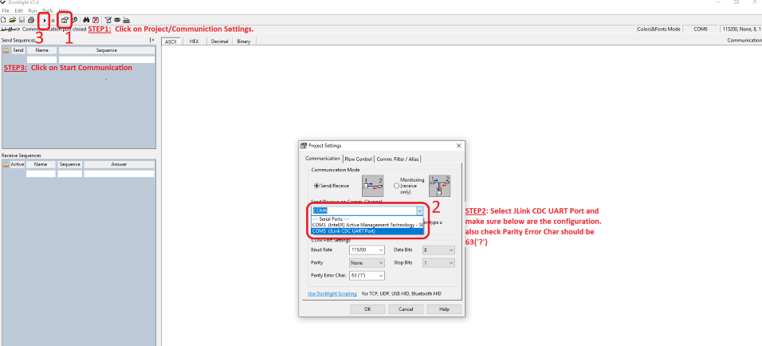
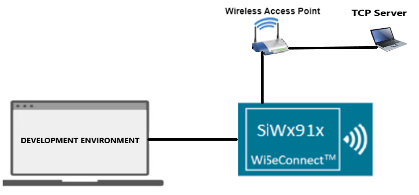
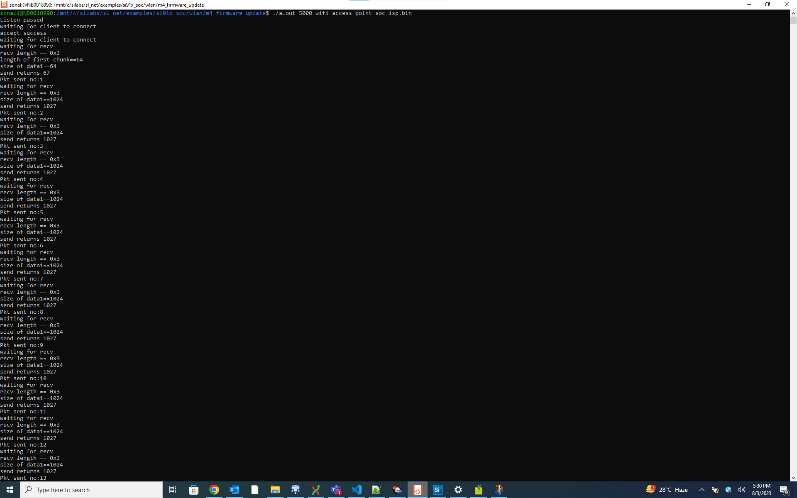
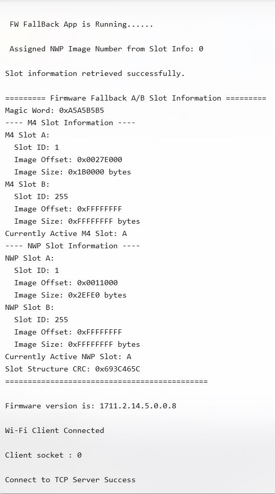
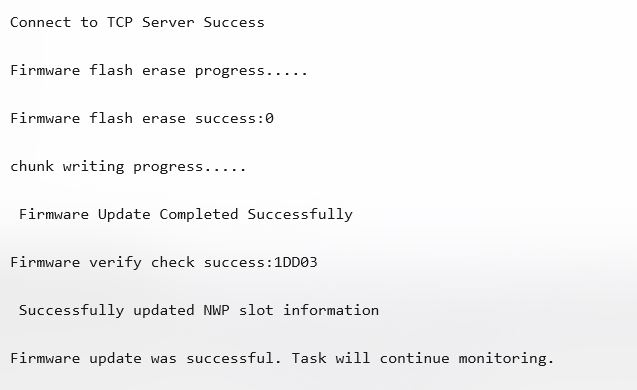

# SiWx91x Platform Firmware Fallback Slot B

## Table of Contents

- [SiWx91x Platform Firmware Fallback Slot B](#platform-siwx91x-firmware-fallback-slot-b)
  - [Table of Contents](#table-of-contents)
  - [Purpose/Scope](#purposescope)
  - [Overview](#overview)
  - [Prerequisites/Setup Requirements](#prerequisitessetup-requirements)
    - [Hardware Requirements](#hardware-requirements)
    - [Software Requirements](#software-requirements)
    - [Setup Diagram](#setup-diagram)
  - [Getting Started](#getting-started)
  - [Application Build Environment](#application-build-environment)
    - [STA Instance-related Parameters](#sta-instance-related-parameters)
    - [TCP Configuration](#tcp-configuration)
  - [Test the Application](#test-the-application)
  - [Troubleshooting](#troubleshooting)
  - [Resources](#resources)
  - [Report Bugs/Support](#report-bugssupport)

## Purpose/Scope

This application shows how to update the M4 firmware of a device via Wi-Fi by downloading the firmware file from a remote TCP server. The server can be run on a local PC. This update process works as follows:

- **Connection**: The device connects to a Wi-Fi network and acts as a TCP client.
- **Request**: The device sends a request to the TCP server for the firmware update file.
- **Download**: The server sends the firmware file to the device.
- **Update**: The device erases the target flash region, writes the new firmware to the appropriate offset, and then restarts to complete the update process.

This process allows the device to update its software over the air (OTA) without needing a physical connection.

>**Note:**
>This feature doesnot support sleep wakeup functionality from M4 Updater.

## Overview

This example downloads M4 firmware over Wi-Fi from a TCP server and programs the device flash (Slot B). It is used with the A/B fallback flow for OTA updates.

## Prerequisites/Setup Requirements

### MBR Provisioning

> **Note:** Refer to UG625: SiWx91x Firmware Fallback User Guide before executing the reference examples.

Before using the A/B firmware fallback feature, the fallback profile must be enabled in the MBR on the device.

To enable firmware fallback for the devices using default MBR, use `commander manufacturing provision --mbr default --profile fallback -d <OPN>` command in the Simplicity Commander CLI tool.

To confirm the firmware fallback feature is enabled on the device, use `commander readmem --range 0x4000091:+1` command in the Simplicity Commander CLI tool and confirm the value to be 1.

For more details on firmware fallback feature enablement and usage, refer to UG625: SiWx91x Firmware Fallback User Guide.

### Hardware Requirements

- Windows PC
- Silicon Labs SiWx91x Evaluation Kit [[BRD4002](https://www.silabs.com/development-tools/wireless/wireless-pro-kit-mainboard?tab=overview) + [BRD4338A](https://www.silabs.com/development-tools/wireless/wi-fi/siwx917-rb4338a-wifi-6-bluetooth-le-soc-radio-board?tab=overview) / [BRD4342A](https://www.silabs.com/development-tools/wireless/wi-fi/siwx91x-rb4342a-wifi-6-bluetooth-le-soc-radio-board?tab=overview) / [BRD4343A](https://www.silabs.com/development-tools/wireless/wi-fi/siw917y-rb4343a-wi-fi-6-bluetooth-le-8mb-flash-radio-board-for-module?tab=overview) / [BRD4343C](https://www.silabs.com/development-tools/wireless/wi-fi/siw917y-rb4343c-wi-fi-6-bluetooth-le-8mb-flash-radio-board-for-module?tab=overview)]
- Wireless Access Point
- Linux PC or Cygwin on Windows (to build and run the TCP server source provided)

### Software Requirements

- Simplicity Studio
- Linux Build Environment
  - Installation of build tools for Linux including the gcc compiler (or equivalent on PC or Mac).
  - For Ubuntu, use the following command for installation: `user@ubuntu:~$ sudo apt install build-essential`.
  - If you do not have Linux, you can use [Cygwin for Windows](https://www.cygwin.com/) instead.
- VCOM Setup
  - The Docklight tool's setup instructions are provided below.

    

### Setup Diagram



## Getting Started

Refer to the instructions [here](https://docs.silabs.com/wiseconnect/latest/wiseconnect-getting-started/) to:

- [Install Simplicity Studio](https://docs.silabs.com/wiseconnect/latest/wiseconnect-developers-guide-developing-for-silabs-hosts/#install-simplicity-studio)
- [Install WiSeConnect extension](https://docs.silabs.com/wiseconnect/latest/wiseconnect-developers-guide-developing-for-silabs-hosts/#install-the-wi-se-connect-extension)
- [Connect your device to the computer](https://docs.silabs.com/wiseconnect/latest/wiseconnect-developers-guide-developing-for-silabs-hosts/#connect-si-wx91x-to-computer)
- [Upgrade your connectivity firmware ](https://docs.silabs.com/wiseconnect/latest/wiseconnect-developers-guide-developing-for-silabs-hosts/#update-si-wx91x-connectivity-firmware)
- [Create a Studio project ](https://docs.silabs.com/wiseconnect/latest/wiseconnect-developers-guide-developing-for-silabs-hosts/#create-a-project)

For details on the project folder structure, see the [WiSeConnect Examples](https://docs.silabs.com/wiseconnect/latest/wiseconnect-examples/#example-folder-structure) page.

## Application Build Environment

The application can be configured to suit your requirements and development environment.

In the Project Explorer pane, expand the **config** folder and open the [`sl_net_default_values.h`](https://github.com/SiliconLabs/wiseconnect/blob/v4.1.1-content-for-docs/resources/defaults/sl_net_default_values.h) file. Configure the following parameters to enable your Silicon Labs Wi-Fi device to connect to your Wi-Fi network.

### STA Instance-related Parameters

- `DEFAULT_WIFI_CLIENT_PROFILE_SSID`: Specifies the SSID of the Wi-Fi access point to which the SiWx91x module connects as a station. Update this string with the name of your Wi-Fi network.

  ```c
  #define DEFAULT_WIFI_CLIENT_PROFILE_SSID               "YOUR_AP_SSID"
  ```

- `DEFAULT_WIFI_CLIENT_CREDENTIAL`: Specifies the passphrase/secret key used when the access point is configured in WPA-PSK or WPA2-PSK security modes. Update with your access point's passphrase.

  ```c
  #define DEFAULT_WIFI_CLIENT_CREDENTIAL                 "YOUR_AP_PASSPHRASE"
  ```

- `DEFAULT_WIFI_CLIENT_SECURITY_TYPE`: Selects the security mode used to connect to the access point. Supported modes are listed in `sl_wifi_security_t`. By default, it is set to `SL_WIFI_WPA2`.

  ```c
  #define DEFAULT_WIFI_CLIENT_SECURITY_TYPE               SL_WIFI_WPA2
  ```

- Other STA instance configurations can be modified if required in `default_wifi_client_profile` configuration structure.

- `SL_APP_TOGGLE_SLOT_INFO`: Controls firmware slot switching when a Wi-Fi connection fails. By default, it is set to 0, which keeps the device on the current slot; set it to 1 to enable automatic switching to the alternate firmware slot when Wi-Fi cannot connect.

  ```c
  #define SL_APP_TOGGLE_SLOT_INFO 0
  ```

- `SL_APP_UPDATE_FIRMWARE_SLOT`: Controls whether the firmware slot information for M4 and NWP cores is updated after a successful firmware update. By default, it is set to 0 (disabled); set it to 1 to enable firmware slot updates.

  ```c
  #define SL_APP_UPDATE_FIRMWARE_SLOT 0
  ```

- `SL_APP_COMBINED_IMAGE_SUPPORT`: Enables or disables support for processing multiple firmware images in sequence (combined image update). By default, it is set to 0 (disabled); set it to 1 to process multiple images (e.g., M4 and NWP) in a single update session while maintaining the socket connection between images.

  ```c
  #define SL_APP_COMBINED_IMAGE_SUPPORT 0
  ```

  - **Note:** When enabled, the socket connection remains open between images to allow downloading the second image. The socket is closed only after all images are processed.

- `DISABLE_AB_DEBUG_LOGS`: Controls whether debug logs are enabled or disabled in the A/B Firmware Fallback module. By default, it is set to 1 (debug logs disabled). The macro is defined in [`components/device/silabs/si91x/mcu/drivers/service/firmware_fallback/src/sl_si91x_fw_fallback.c`](https://github.com/SiliconLabs/wiseconnect/blob/v4.1.1-content-for-docs/components/device/silabs/si91x/mcu/drivers/service/firmware_fallback/src/sl_si91x_fw_fallback.c).

  ```c
  #define DISABLE_AB_DEBUG_LOGS 1
  ```

- `SL_SI91X_FALLBACK_SLOT_ENCRYPTION`: Enables enhanced sleep/wakeup support with encryption capabilities for firmware fallback operations (SPL "FW fallback" feature). By default, it is set to 0 (disabled). Enable only when Encrypted XIP of M4 is enabled and define it in your project's preprocessor settings.

  ```c
  #define SL_SI91X_FALLBACK_SLOT_ENCRYPTION 0  // Disabled by default
  ```

  - **Important Requirements when enabling this macro:**
    1. **Encrypted XIP of M4 must be enabled** - This macro should only be used when encryption features are active
    2. **FW fallback feature must be enabled** for your board before enabling this macro
    3. **Examples using this macro MUST be loaded with OTA (Over-The-Air) updates**
    4. **You MUST use the updater application** for examples that have this macro enabled
    5. **DO NOT use Commander** for examples that have this macro enabled. Please consider this a slot example.

  - **Warning:** When enabled, this macro will display compile-time warnings to ensure developers understand the requirements. These warnings can be disabled by commenting out the `#pragma message` lines in the header file.

- `SL_APP_BURN_NWP_SECURITY_VERSION`: Controls whether the application burns the NWP security version after a successful Wi-Fi connection. By default, it is set to 0 (disabled); set it to 1 to enable. When enabled, the app calls `sl_si91x_burn_nwp_security_version()` with the active NWP firmware address obtained from slot info. Use only if your update flow requires burning a new security version.

  ```c
  #define SL_APP_BURN_NWP_SECURITY_VERSION 0  // 0: Disabled, 1: Enabled
  ```

- After completing the OTA update process, it is recommended to perform a system reset using the [`sl_si91x_soc_nvic_reset()`](https://docs.silabs.com/wiseconnect/latest/wiseconnect-api-reference-guide-common/soft-reset-functions#sl-si91x-soc-nvic-reset) function. This ensures that the updated firmware is properly loaded, and the system is initialized with the new firmware.

- The [`sl_si91x_soc_nvic_reset()`](https://docs.silabs.com/wiseconnect/latest/wiseconnect-api-reference-guide-common/soft-reset-functions#sl-si91x-soc-nvic-reset) function is available in the `app.c` file but is commented out by default. Uncomment the following line in the `app.c` file to enable the reset:

  ```c
  sl_si91x_soc_nvic_reset();
  ```

### TCP Configuration

- In the Project Explorer pane, open the **app.c** file.

- `SERVER_IP_ADDRESS`: Specifies the IPv4 address of the remote TCP server hosting the firmware image. Update it to match the IP of the host PC running the TCP server on your network. By default, it is set to `"192.168.0.158"`.

  ```c
  #define SERVER_IP_ADDRESS  "192.168.0.158"   // Server IP address
  ```

- `SERVER_PORT`: Specifies the TCP port number of the remote TCP server hosting the firmware image. It must match the port used when launching the TCP server on the host PC. By default, it is set to 5000.

  ```c
  #define SERVER_PORT        5000             // TCP server port of the remote TCP server
  ```

- `RECV_BUFFER_SIZE`: Specifies the size (in bytes) of the receive buffer used to read firmware data from the TCP server. By default, it is set to 1027.

  ```c
  #define RECV_BUFFER_SIZE   1027             // Receive data buffer size
  ```

> **Note**: For recommended settings, please refer the [recommendations guide](https://docs.silabs.com/wiseconnect/latest/wiseconnect-developers-guide-prog-recommended-settings/).

## Test the Application

Refer to the instructions [here](https://docs.silabs.com/wiseconnect/latest/wiseconnect-getting-started/) to:

- Build the application
- Flash, run, and debug the application

To establish the TCP server with firmware file on remote PC, follow the steps below:

 1. Copy the TCP server application [firmware_update_tcp_server_9117.c](https://github.com/SiliconLabs/wiseconnect/tree/v4.1.1-content-for-docs/examples/si91x_soc/soc_fw_fallback/sl_si91x_slot_b_fw/firmware_update_tcp_server_9117.c) provided with the application source to a Linux PC connected to the Wi-Fi access point.

 2. For Updater image OTA Copy the upadter TCP server application [firmware_update_tcp_server_for_updater.c] provided with the application source to a Linux PC connected to the Wi-Fi access point.

 3. Compile the application.

     `user@linux:~$ gcc "server_file_name".c -o ota_server.bin`

 4. Run the application, providing the TCP port number (specified in the SiWx91x app) together with the firmware file and path.

    `user@linux:~$ ./ota_server.bin 5000 wifi_access_point.rps`

    ... where **wifi_access_point.rps** is the firmware image to be sent to SiWx91x.

   

   

 

## Troubleshooting

- If the project does not build, ensure Simplicity Studio and the WiSeConnect extension are installed and the board is connected.
- If the device is not detected, reinstall the connectivity firmware and check USB drivers.
- If OTA update fails, verify Wi-Fi connection, TCP server is running with the correct firmware file, and MBR fallback profile is provisioned.

## Resources

- [WiSeConnect Getting Started](https://docs.silabs.com/wiseconnect/latest/wiseconnect-getting-started/)
- [WiSeConnect Examples](https://docs.silabs.com/wiseconnect/latest/wiseconnect-examples/)
- [SiWx91x SoC Documentation](https://docs.silabs.com/wiseconnect/latest/)

## Report Bugs/Support

For issues and support, use the Silicon Labs Community or your normal support channel.

