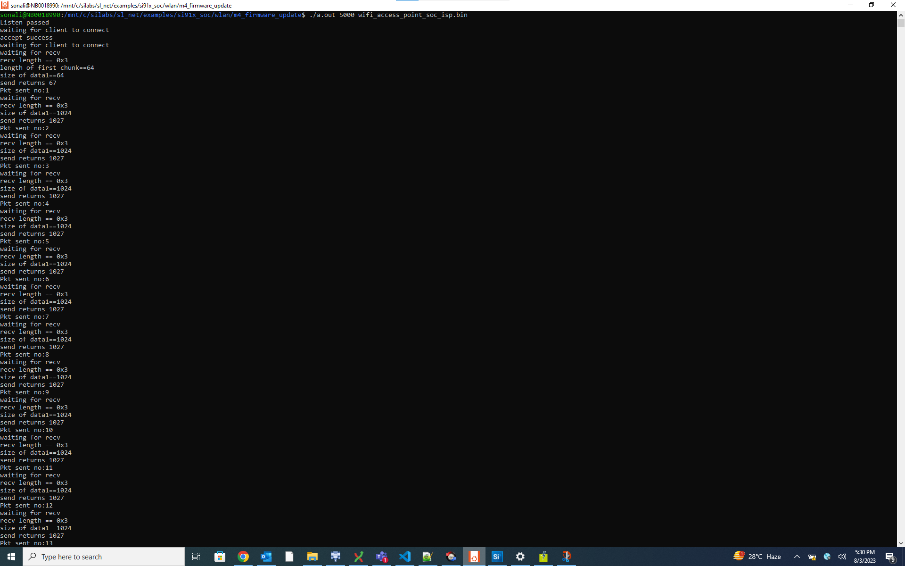

# M4 Firmware Update

## Table of Contents

- [Purpose/Scope](#purposescope)
- [Prerequisites/Setup Requirements](#prerequisitessetup-requirements)
  - [Hardware Requirements](#hardware-requirements)
  - [Software Requirements](#software-requirements)
  - [Setup Diagram](#setup-diagram)
- [Getting Started](#getting-started)
- [Application Build Environment](#application-build-environment)
- [Test the application](#test-the-application)

## Purpose/Scope

This application demonstrates how to update the SiWx91x firmware via Wi-Fi by downloading an image from a remote TCP server. The TCP server may be hosted on a local PC (as demonstrated in this example), or alternately on a cloud service such as Amazon AWS or Microsoft Azure. The update process works as follows:

- The SiWx91x connects via Wi-Fi as a TCP client to a TCP update server
- The SiWx91x OTA application sends a firmware file request to the server
- The server responds with the firmware file
- The OTA application programs the M4 firmware into the SiWx91x flash memory and reboots

## Prerequisites/Setup Requirements

### Hardware Requirements  

- Windows PC
- Silicon Labs SiWx917 Evaluation Kit [WPK/WSTK + BRD4325A]
- Wireless Access Point
- Linux PC or Cygwin on Windows (to build and run the TCP server source provided)

### Software Requirements

- Simplicity Studio
- Linux Build Environment
  - Installation of Build tools for Linux including the gcc compiler (or equivalent on PC or Mac)
  - For Ubuntu, use the following command for installation: `user@ubuntu:~$ sudo apt install build-essential`
  - If you don't have Linux, [Cygwin for Windows](https://www.cygwin.com/) may be used instead
- VCOM Setup
  - The Docklight tool's setup instructions are provided below.

    

### Setup Diagram


## Getting Started

Refer to the instructions [here](https://docs.silabs.com/wiseconnect/latest/wiseconnect-getting-started/) to:

- Install Studio and WiSeConnect 3 extension
- Connect your device to the computer
- Upgrade your connectivity firmware
- Create a Studio project

## Application Build Environment

The application can be configured to suit your requirements and development environment.

- In the Project Explorer pane, expand the **config** folder and open the **sl_net_default_values.h** file. Configure the following parameters to enable your Silicon Labs Wi-Fi device to connect to your Wi-Fi network

**STA instance related parameters**

- DEFAULT_WIFI_CLIENT_PROFILE_SSID refers to the name with which Wi-Fi network that shall be advertised and Si91X module is connected to it.

  ```c
  #define DEFAULT_WIFI_CLIENT_PROFILE_SSID               "YOUR_AP_SSID"      
  ```

- DEFAULT_WIFI_CLIENT_CREDENTIAL refers to the secret key if the Access point is configured in WPA-PSK/WPA2-PSK security modes.

  ```c
  #define DEFAULT_WIFI_CLIENT_CREDENTIAL                 "YOUR_AP_PASSPHRASE" 
  ```

- DEFAULT_WIFI_CLIENT_SECURITY_TYPE refers to the security type of the Access point. The supported security modes are mentioned in `sl_wifi_security_t`.

  ```c
  #define DEFAULT_WIFI_CLIENT_SECURITY_TYPE               SL_WIFI_WPA2 
  ```

- Other STA instance configurations can be modified if required in `default_wifi_client_profile` configuration structure.

**TCP Configuration**

- In the Project Explorer pane, open the **app.c** file. 

  ```c
  #define SERVER_PORT        5000             // TCP server port of the remote TCP server
  #define SERVER_IP_ADDRESS  "192.168.0.100"  // Server IP address 
  ```

## Test the application

Refer to the instructions [here](https://docs.silabs.com/wiseconnect/latest/wiseconnect-getting-started/) to:

- Build the application
- Flash, run and debug the application

To esstablish the TCP Server with firmware file on remote PC, follow the below steps:

 1. Copy the TCP server application [firmware_update_tcp_server_9117.c](https://github.com/SiliconLabs/wiseconnect-wifi-bt-sdk/tree/master/examples/featured/firmware_update/firmware_update_tcp_server_9117.c) provided with the application source to a Linux PC connected to the Wi-Fi access point.
  2. Compile the application

  > `user@linux:~$ gcc firmware_update_tcp_server.c` -o ota_server.bin

  3. Run the application providing the TCP port number (specified in the SiWx91x app) together with the firmware file and path

  > `user@linux:~$ ./ota_server.bin 5000 wifi_access_point.rps`

... where **wifi_access_point.rps** is the firmware image to be sent to SiWx91x.




