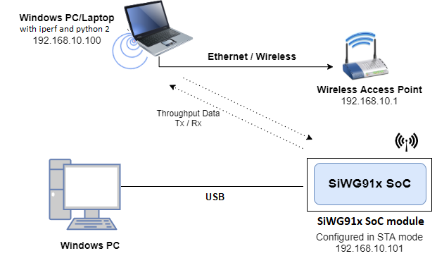
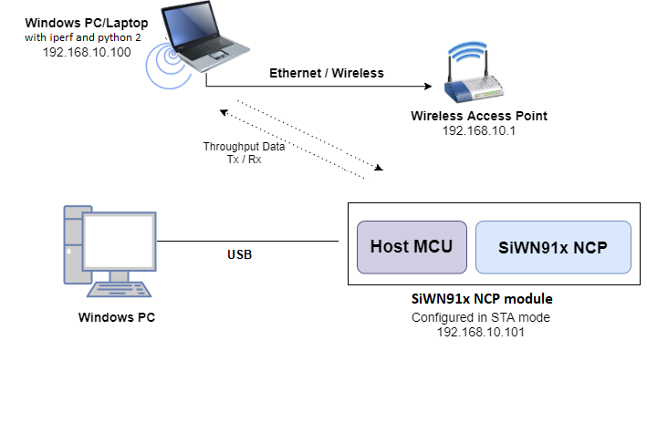
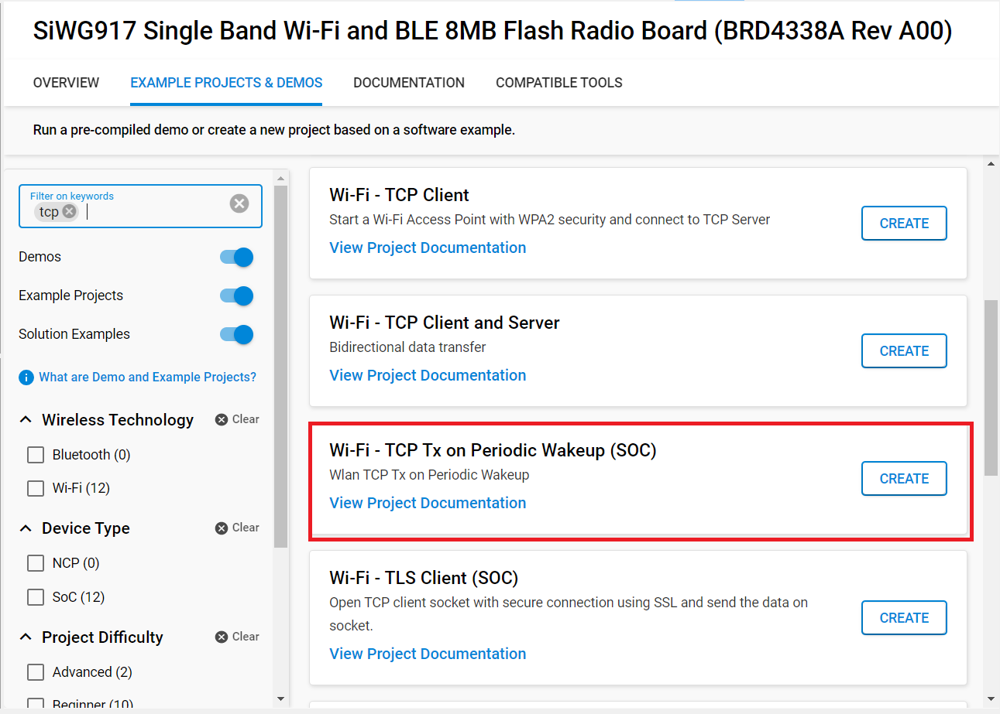
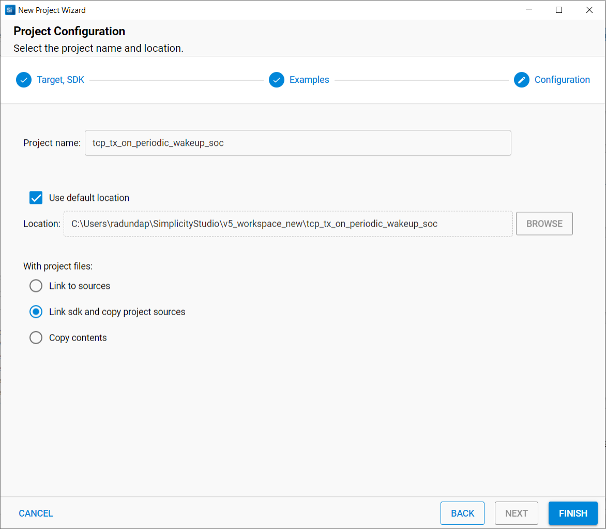
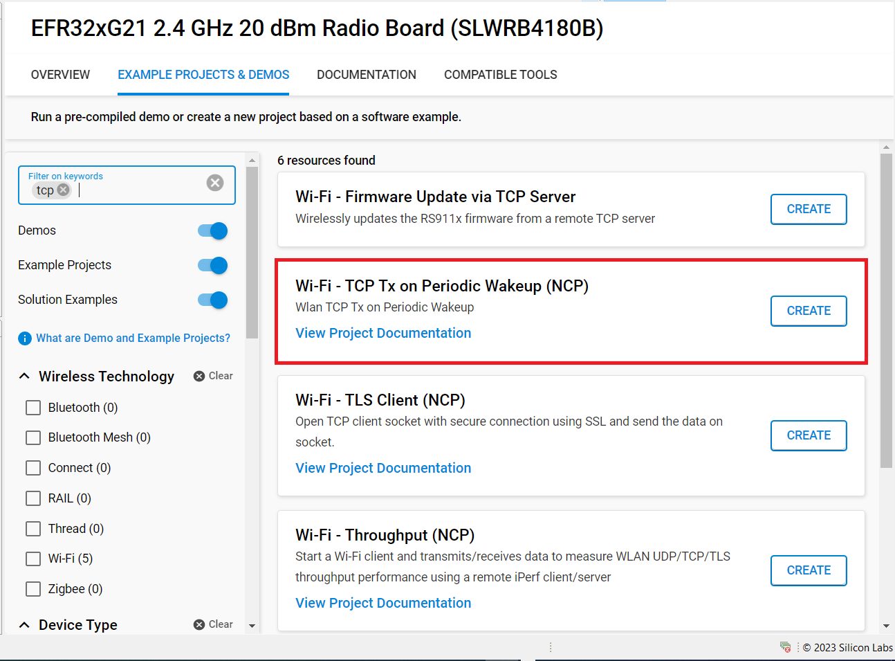
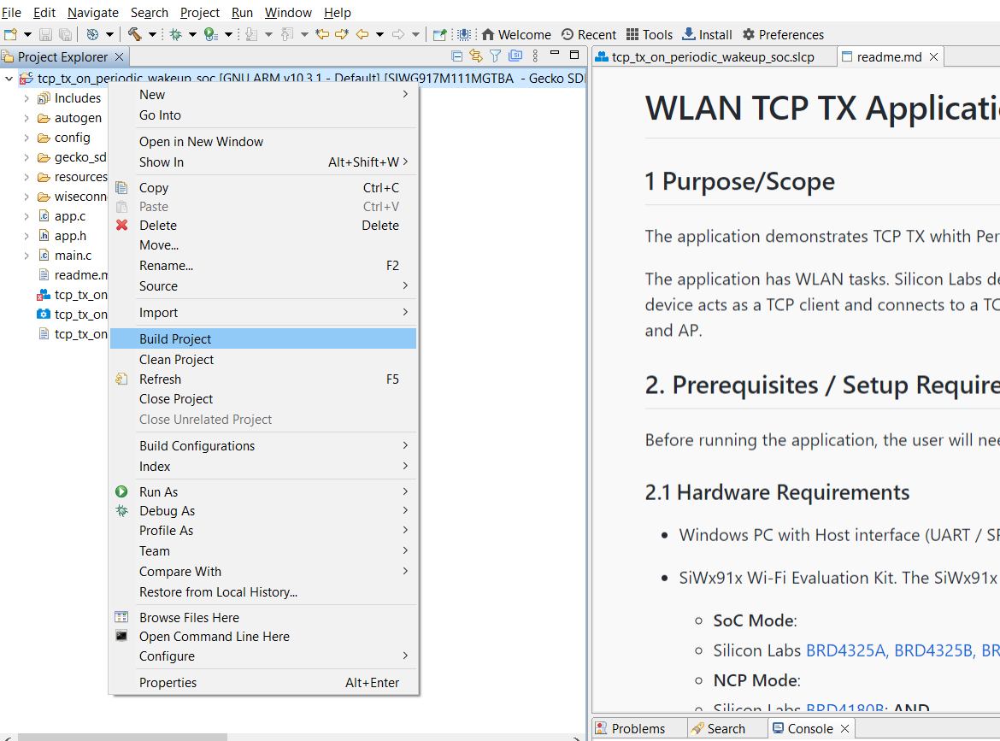
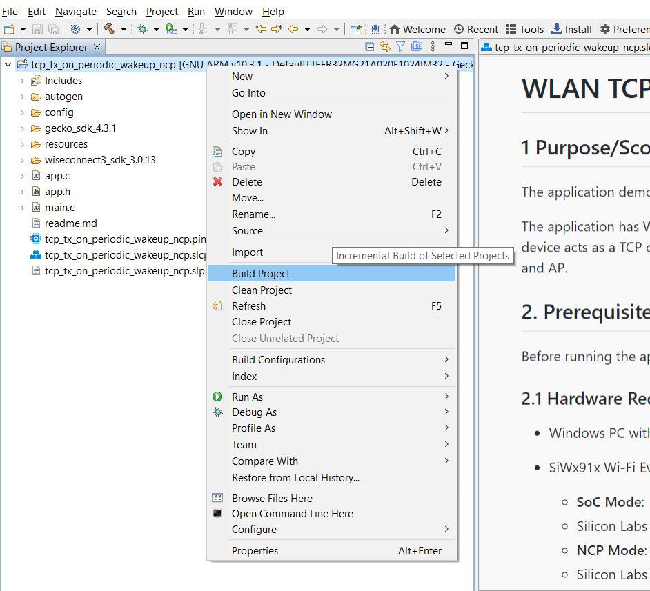
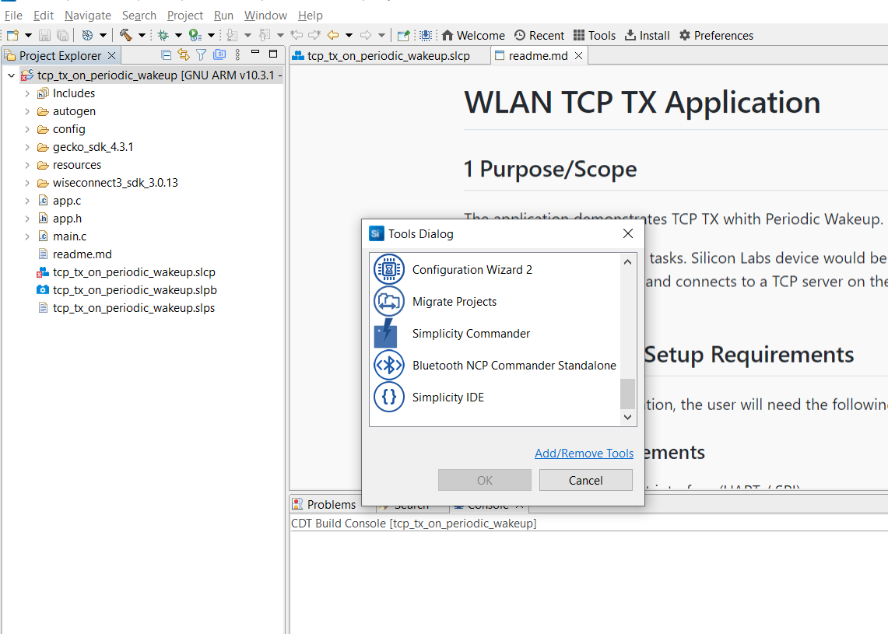
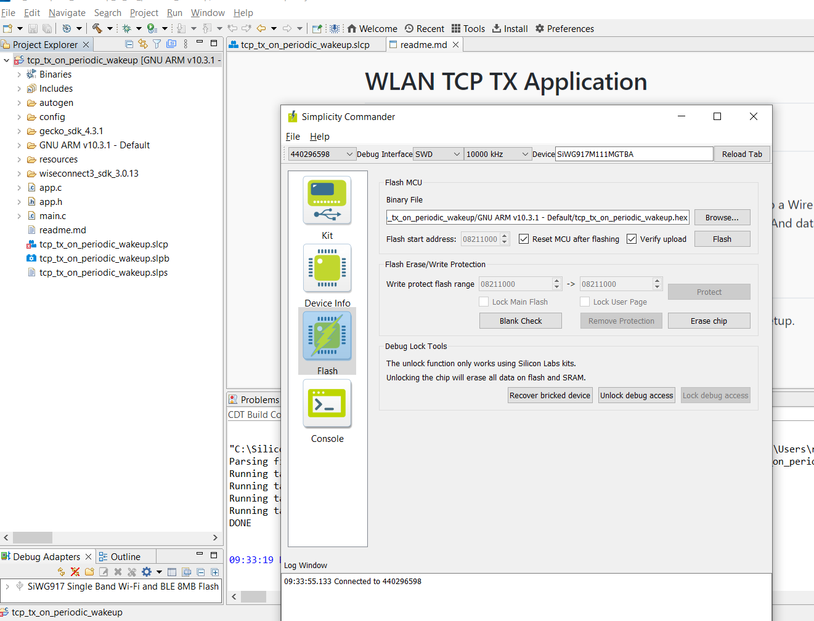
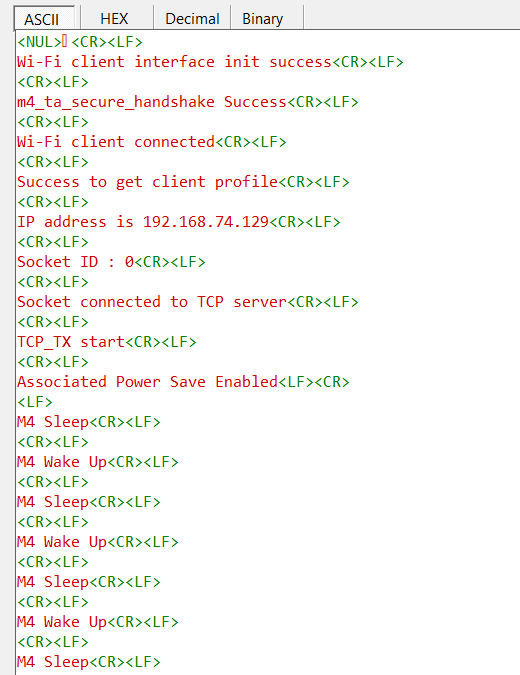

# WLAN TCP TX Application

## 1 Purpose/Scope
The application demonstrates TCP TX whith Periodic Wakeup.

The application has WLAN tasks. Silicon Labs device would be connected to a Wireless Access Point. Then configured device acts as a TCP client and connects to a TCP server on the remote PC. And data transfer will happen between Station and AP.

## 2. Prerequisites / Setup Requirements

Before running the application, the user will need the following things to setup.

### 2.1 Hardware Requirements

- Windows PC with Host interface (UART / SPI).
- SiWx91x Wi-Fi Evaluation Kit. The SiWx91x supports multiple operating modes. See [Operating Modes]() for details.
  - **SoC Mode**:
    - Silicon Labs [BRD4325A, BRD4325B, BRD4325C, BRD4325G, BRD4338A, BRD4340A](https://www.silabs.com/)
  - **NCP Mode**:
    - Silicon Labs [BRD4180B](https://www.silabs.com/); **AND**
    - Host MCU Eval Kit. This example has been tested with:
      - Silicon Labs [WSTK + EFR32MG21](https://www.silabs.com/development-tools/wireless/efr32xg21-bluetooth-starter-kit)
        
- Wireless Access Point
- Smart phone/tablet with BLE Application (Ex: Light Blue / BLE Connect App)
- Windows PC with iperf and openssl applications.






### 2.2 Software Requirements

- WiSeConnect SDK 3

- Embedded Development Environment

  - For Silicon Labs EFx32, use the latest version of [Simplicity Studio](https://www.silabs.com/developers/simplicity-studio)

  - Download and install iperf from this link [Iperf Application](https://iperf.fr/iperf-download.php).

  - Download and install OpenSSL from this link [OpenSSL](http://ufpr.dl.sourceforge.net/project/gnuwin32/openssl/0.9.8h-1/openssl-0.9.8h-1-bin.zip) to download openssl in remote PC.

- Download and install the Silicon Labs [EFR Connect App](https://www.silabs.com/developers/efr-connect-mobile-app) in the android smart phones for testing the BLE applications.  


Follow the [Getting Started with Wiseconnect3 SDK](https://docs.silabs.com/wiseconnect/latest/wiseconnect-getting-started/) guide to set up the hardware connections and Simplicity Studio IDE.

**NOTE**:

- The Host MCU platform (EFR32MG21) and the SiWx91x interact with each other through the SPI interface.

## 3 Project Environment

- Ensure the SiWx91x loaded with the latest firmware following the [Upgrade Si91x firmware](https://docs.silabs.com/wiseconnect/latest/wiseconnect-getting-started/getting-started-with-soc-mode#upgrade-si-wx91x-connectivity-firmware)

- Ensure the latest Gecko SDK along with the extension WiSeConnect3 is added to Simplicity Studio.

### 3.1 Creating the project

#### 3.1.1 SoC Mode

1. Ensure the SiWx91x setup is connected to your PC.

- In the Simplicity Studio IDE, the SiWx91x SoC board will be detected under **Debug Adapters** pane as shown below.

   ****

#### 3.1.2 NCP Mode

1. Ensure the EFx32 and SiWx91x setup is connected to your PC.

- In the Simplicity Studio IDE, the EFR32 board will be detected under **Debug Adapters** pane as shown below.

   ****

### 3.2 Importing the project

- Studio should detect your board. Your board will be shown here. Click on the board detected and go to **EXAMPLE PROJECTS & DEMOS** section 

#### SOC Mode

- Select **Wi-Fi - TCP TX on Periodic Wakeup** test application

  ****

- Click 'Create'. The "New Project Wizard" window appears. Click 'Finish'

  ****

#### NCP Mode

- Select **Wi-Fi - Throughput(NCP)** test application

  ****

- Click 'Create'. The "New Project Wizard" window appears. Click 'Finish'

  ****

### 3.3 Set up for application prints

#### 3.3.1 Teraterm set up - for BRD4325A, BRD4325B, BRD4325C, BRD4325G, BRD4340A

You can use either of the below USB to UART converters for application prints.

1. Set up using USB to UART converter board.

   - Connect Tx (Pin-6) to P27 on WSTK
   - Connect GND (Pin 8 or 10) to GND on WSTK

   ****

2. Set up using USB to UART converter cable.

   - Connect RX (Pin 5) of TTL convertor to P27 on WSTK
   - Connect GND (Pin1) of TTL convertor to GND on WSTK

   ****

3. Open the Teraterm tool.

   - For SoC mode, choose the serial port to which USB to UART converter is connected and click on **OK**.

     ****

**Note:** For Other 917 SoC boards please refer section #3.3.2

#### 3.3.2 **Teraterm set up - for NCP and SoC modes**

1. Open the Teraterm tool.

- choose the J-Link port and click on **OK**.
    
    ****

2. Navigate to the Setup → Serial port and update the baud rate to **115200** and click on **OK**.

    ****

    ****

## 4 Application Build Environment

The application can be configured to suit your requirements and development environment. Read through the following sections and make any changes needed.

### 4.1.1 Below parameters in **app.c** can be configured

```c

#define ALARM_TIMER_BASED_WAKEUP   1   //!Enable this macro for M4 to wake up based on alarm time period
#define BUTTON_BASED_WAKEUP        1   //!Enable this macro for M4 to wake up based on button (BTN1) press

#define ALARM_PERIODIC_TIME 30  //! periodic alarm configuration in SEC
```
**Client/Server IP Settings**

```c
#define DEVICE_PORT        <local_port>   // Local port to use
#define SERVER_PORT        <remote_port>  // Remote server port
#define SERVER_IP_ADDRESS  "192.168.0.100"     // Remote server IP address
#define BUF_SIZE 		   1400			  //! Memory length for send buffer
```

### 4.1.2 Below parameters in **sl_net_default_values.h** can be configured

By default, the application connects to the remote Access point with **default_wifi_client_profile** configuration provided in **sl_net_default_values.h**.

```c
#define DEFAULT_WIFI_CLIENT_PROFILE_SSID "YOUR_AP_SSID"
#define DEFAULT_WIFI_CLIENT_CREDENTIAL   "YOUR_AP_PASSPHRASE"
```

## 5 Build and Test the Application

Follow the below steps for the successful execution of the application.

** SoC Mode **

- Once the project is created, click on the build icon (hammer) to build the project (or) right click on project and click on Build Project.

   
   
- Successful build output will show as below.
   
** NCP Mode **

   
   
- Successful build output will show as below.

### 5.2 Loading the Application Image

1. Click on Tools and Simplicity Commander as shown below.

   ****
   
2. Load the firmware image
 - Select the board. 
 - Browse the application image (.hex) and click on Flash button.

   ****

### 5.3 Steps to verify the WLAN TCP TX Example

1. Configure the Access point with internet connection in OPEN/WPA-PSK/WPA2-PSK mode to connect the SiWx91x EVK in STA mode.

2. Connect any serial console for prints.

3. The device which is configured as TCP client will connect to iperf server and sends data continuously..

4. After each packet sent, M4 will go to sleep and wakeup after specified time interval. It will print the M4 State. 

The following sections describe how to run the SiWx91x application together with examples for Iperf configurations that run on the PC.   

##### TCP Tx
To Start TCP Tx, configure the SiWx91x as a TCP client and start a TCP server on the remote PC.
The Iperf command to start the TCP server is: 
		
> `C:\> iperf.exe -s -p <SERVER_PORT> -i 1`
>
> For example ...
>
> `C:\> iperf.exe -s -p 5001 -i 1`


The SiWx91x, which is configured as a UDP/TCP/SSL server/client, connects to the iperf server/client and sends/receives data for configured intervals. While module is transmitting/receiving the data, With M4 sleep-wakeup with defined time interval.
> Note:
> Verify that all connections are stable as expected.

## 5.4 Observing the output prints on serial terminal  

