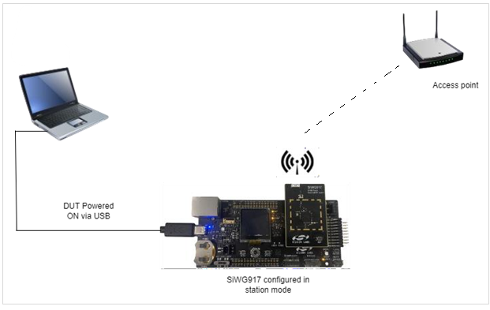
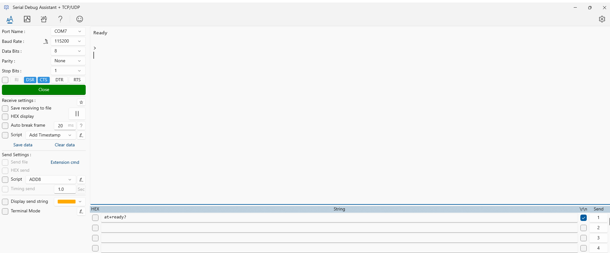
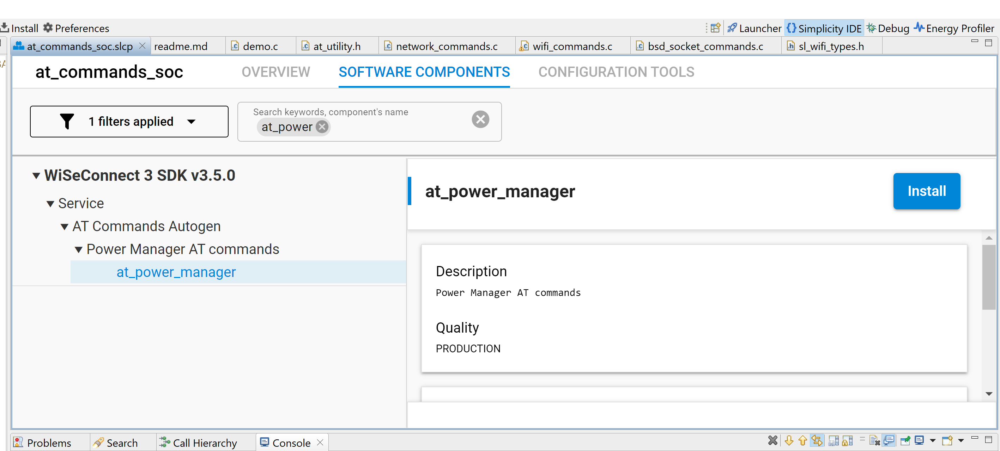

# AT Commands

## Table of Contents

- [AT Commands](#at-commands)
  - [Table of Contents](#table-of-contents)
  - [Purpose/Scope](#purposescope)
  - [Prerequisites/Setup Requirements](#prerequisitessetup-requirements)
    - [Hardware Requirements](#hardware-requirements)
    - [Software Requirements](#software-requirements)
    - [Setup Diagram](#setup-diagram)
  - [Getting Started](#getting-started)
  - [Application Build Environment](#application-build-environment)
  - [Test the Application](#test-the-application)
    - [Powersave Commands](#powersave-commands)
  - [Creating a new command handler](#creating-a-new-command-handler)
    - [Argument types](#argument-types)

## Purpose/Scope

The AT Commands application is a Command-Line Interface (CLI) application designed to showcase various functionalities and capabilities of SiWx91x in different scenarios and configuration modes. It serves as a quick reference guide and a hands-on demonstration of SiWx91x core features for developers and users.

## Prerequisites/Setup Requirements

### Hardware Requirements

- A Windows PC.
- 802.11 ax/b/g/n access point - For Signaling mode or End-to-End mode testing.
- Spectrum Analyzer for TX RF measurement (PER-TX) - For Non -signaling mode testing. 
- Signal Generator for RX RF measurement (PER_RX) - For Non-signaling mode testing. 
- A Micro-coaxial connector plug to SMA-female cable (RF connector) for connecting the U.Fl port of the Si917 radio board to the Spectrum Analyzer or Signal Generator.
- **SoC Mode**:
  - Standalone
    - BRD4002A Wireless Pro Kit Mainboard [SI-MB4002A]
    - Radio Boards 
  	  - BRD4338A [SiWx917-RB4338A]
      - BRD4339B [SiWx917-RB4339B]
  	  - BRD4340A [SiWx917-RB4340A]
  	  - BRD4343A [SiWx917-RB4343A]
  - Kits
  	- SiWx917 Pro Kit [Si917-PK6031A](https://www.silabs.com/development-tools/wireless/wi-fi/siwx917-pro-kit?tab=overview)
  	- SiWx917 Pro Kit [Si917-PK6032A]
    - SiWx917 AC1 Module Explorer Kit (BRD2708A)

### Software Requirements

- Simplicity Studio
- A Serial terminal software such as [Serial Debug Assistant](https://apps.microsoft.com/detail/9NBLGGH43HDM?rtc=1&hl=en-in&gl=in)

Note : The user can also use the Simplicity studio’s console window for sending and receiving the CLI command but it is recommended to use Serial Debug Assistant for ease of the command usage.


### Setup Diagram

- The figure below shows the setup and the connections for SiWG917 in Station mode.




## Getting Started

Refer to the instructions [here](https://docs.silabs.com/wiseconnect/latest/wiseconnect-getting-started/) to:

- [Install Simplicity Studio](https://docs.silabs.com/wiseconnect/latest/wiseconnect-developers-guide-developing-for-silabs-hosts/#install-simplicity-studio)
- [Install WiSeConnect 3 extension](https://docs.silabs.com/wiseconnect/latest/wiseconnect-developers-guide-developing-for-silabs-hosts/#install-the-wi-se-connect-3-extension)
- [Connect your device to the computer](https://docs.silabs.com/wiseconnect/latest/wiseconnect-developers-guide-developing-for-silabs-hosts/#connect-si-wx91x-to-computer)
- [Upgrade your connectivity firmware ](https://docs.silabs.com/wiseconnect/latest/wiseconnect-developers-guide-developing-for-silabs-hosts/#update-si-wx91x-connectivity-firmware)
- [Create a Studio project ](https://docs.silabs.com/wiseconnect/latest/wiseconnect-developers-guide-developing-for-silabs-hosts/#create-a-project)

For project folder structure details, see the [WiSeConnect Examples](https://docs.silabs.com/wiseconnect/latest/wiseconnect-examples/#example-folder-structure) page.


## Application Build Environment

The application can be configured to suit your requirements and development environment.

- The application uses the default configurations as provided in the **wifi_commands.c** and you can choose to configure these parameters as needed.

> **Note**: For recommended settings, see the [recommendations guide](https://docs.silabs.com/wiseconnect/latest/wiseconnect-developers-guide-prog-recommended-settings/).

## Test the Application

See the instructions [here](https://docs.silabs.com/wiseconnect/latest/wiseconnect-getting-started/) to:

- Build the application in Studio.
- Flash, run, and debug the application.



### Powersave Commands

To use the powersave commands, follow the steps below to install the at_power_manager component:

1. Open the `.slcp` file in Simplicity Studio and navigate to the `SOFTWARE COMPONENTS` section.
2. Search for `at_power_manager`. In the WiseConnect3 SDK, click on `Expand All`.
3. Select the `at_power_manager` component. In the right-side pane, click on `Install`.



> **Note:**
- By default, the `SL_SI91X_TICKLESS_MODE=1` macro is enabled.
For testing power manager sleep and standby modes, modify the macro to `SL_SI91X_TICKLESS_MODE=0` in the Studio Preprocessor Settings.

 **Here is a list of commands:**

1. at+net-init=8
2. at+net-cred-wifipsk=1,Silabs123
3. at+net-sta-cred=0,SiLabsAP,1
4. at+net-up=8
5. at+wifisys-fwver?
6. at+wifi-get-mac
7. at+net-deinit
8. at+siwx91x-nvic-reset
9. at+ready?
10. at+echo=1

    And so on...


## Creating a new command handler

Command handlers consist of two parts:
1. A function that prepares the function arguments and calls the target API.
Metadata that goes into the SLC component file, which is used to generate the command database.
2. The metadata is stored in the template_contribution section of the SLCC file under the name console_commands.

Sample command handler metadata:
```
template_contribution:
  - name: console_commands
    value:
      my_command: # This is the string used to identify the command
        handler: my_command_handler # This is the name of the command handler function
        arguments:
          # Arguments can be as simple as specifying the type
          - int32
          # Arguments can also be provided with 'type'
          - type: uint8
          # This represents all remaining data on the command line
          - "*"
```

The command handler function must have the following syntax:

```
sl_status_t my_command_handler(const console_args_t *arguments)
```
### Argument types

|String|Representation|
|------|--------------|
|uint8|unsigned integer|
|uint16|unsigned integer|
|uint32|unsigned integer|
|int|signed integer|
|int8|signed integer|
|int16|signed integer|
|int32|signed integer|
|string|string|
|hex|Data represented is hexadecimal|
|*	| All remaining command line data|
