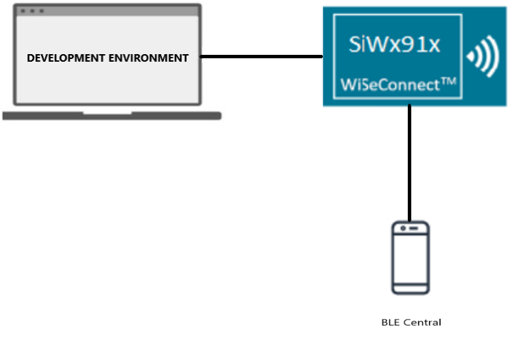
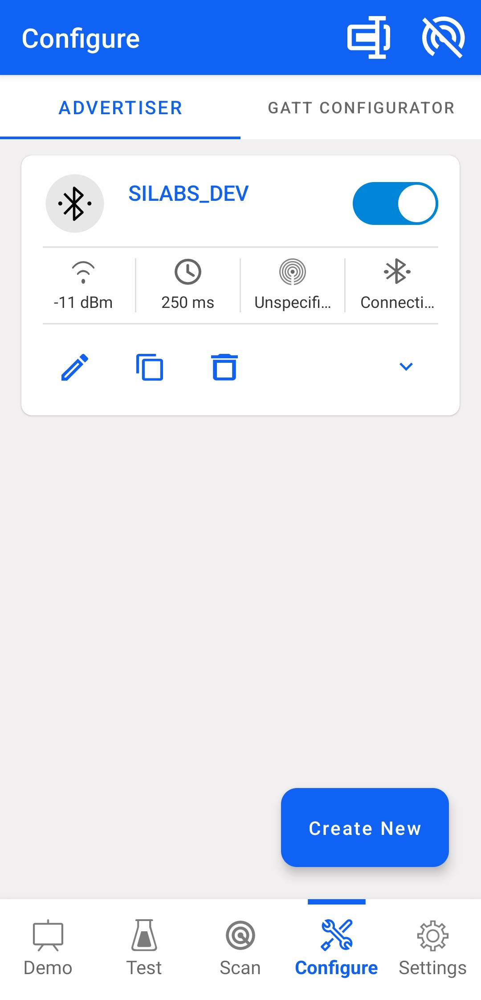
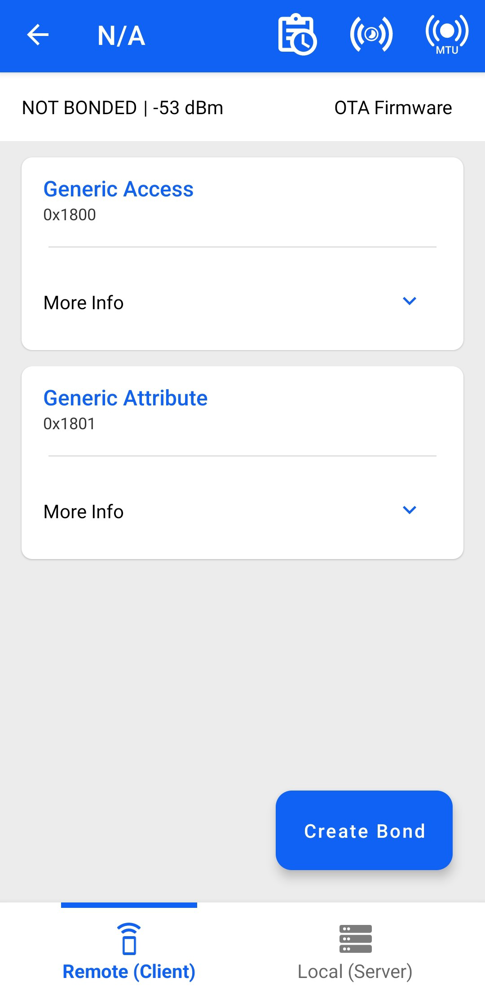
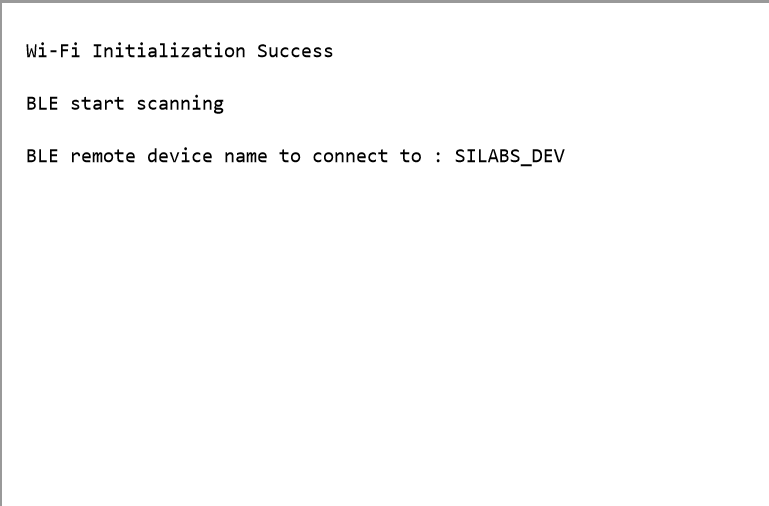

# BLE - Acceptlist

## Table of Contents

- [Purpose/Scope](#purposescope) 
- [Prerequisites/Setup Requirements](#prerequisitessetup-requirements)
  - [Hardware Requirements](#hardware-requirements)
  - [Software Requirements](#software-requirements)
  - [Setup Diagram](#setup-diagram)
- [Getting Started](#getting-started)
- [Application Build Environment](#application-build-environment)
- [Test the Application](#test-the-application)

## Purpose/Scope

This application is used to add a particular BD-Address to the Accept List. The device to connect is saved on the Accept List located in the LL block of the controller.

This enumerates the remote devices that are allowed to communicate with the local device. The Accept List can restrict which device are allowed to connect to other device.

If it is not added to accept list,connection is not established. Once the address is saved, the connection with that device is going to be an auto connection establishment procedure.

This means that the Controller autonomously establishes a connection with the device address that matches the address stored in the Accept List.

## Prerequisites/Setup Requirements

### Hardware Requirements

- Windows PC with Host interface(UART/ SPI/ SDIO).
  - SiWx91x Wi-Fi Evaluation Kit. The SiWx91x supports multiple operating modes. See [Operating Modes]() for details.
- **SoC Mode**:
  - Standalone
    - BRD4002A Wireless pro kit mainboard [SI-MB4002A]
    - Radio Boards 
  	  - BRD4338A [SiWx917-RB4338A]
      - BRD4339B [SiWx917-RB4339B]
  	  - BRD4340A [SiWx917-RB4340A]
      - BRD4343A [SiWx917-RB4343A]
  - Kits
  	- SiWx917 Pro Kit [Si917-PK6031A](https://www.silabs.com/development-tools/wireless/wi-fi/siwx917-pro-kit?tab=overview)
  	- SiWx917 Pro Kit [Si917-PK6032A]
    - SiWx917 AC1 Module Explorer Kit (BRD2708A)
- **PSRAM Mode**:
  - Silicon Labs [BRD4340A, BRD4342A, BRD4325G](https://www.silabs.com/)  	
- **NCP Mode**:
  - Standalone
    - BRD4002A Wireless pro kit mainboard [SI-MB4002A]
    - EFR32xG24 Wireless 2.4 GHz +10 dBm Radio Board [xG24-RB4186C](https://www.silabs.com/development-tools/wireless/xg24-rb4186c-efr32xg24-wireless-gecko-radio-board?tab=overview)
    - NCP Expansion Kit with NCP Radio boards
      - (BRD4346A + BRD8045A) [SiWx917-EB4346A]
      - (BRD4357A + BRD8045A) [SiWx917-EB4357A]
  - Kits
  	- EFR32xG24 Pro Kit +10 dBm [xG24-PK6009A](https://www.silabs.com/development-tools/wireless/efr32xg24-pro-kit-10-dbm?tab=overview)
  - Interface and Host MCU Supported
    - SPI - EFR32 
- Smartphone configured as BLE central


### Software Requirements

- Simplicity Studio

### Setup Diagram


  
## Getting Started

Refer to the instructions [here](https://docs.silabs.com/wiseconnect/latest/wiseconnect-getting-started/) to:

- [Install Simplicity Studio](https://docs.silabs.com/wiseconnect/latest/wiseconnect-developers-guide-developing-for-silabs-hosts/#install-simplicity-studio)
- [Install WiSeConnect 3 extension](https://docs.silabs.com/wiseconnect/latest/wiseconnect-developers-guide-developing-for-silabs-hosts/#install-the-wi-se-connect-3-extension)
- [Connect your device to the computer](https://docs.silabs.com/wiseconnect/latest/wiseconnect-developers-guide-developing-for-silabs-hosts/#connect-si-wx91x-to-computer)
- [Upgrade your connectivity firmware ](https://docs.silabs.com/wiseconnect/latest/wiseconnect-developers-guide-developing-for-silabs-hosts/#update-si-wx91x-connectivity-firmware)
- [Create a Studio project ](https://docs.silabs.com/wiseconnect/latest/wiseconnect-developers-guide-developing-for-silabs-hosts/#create-a-project)

For details on the project folder structure, see the [WiSeConnect Examples](https://docs.silabs.com/wiseconnect/latest/wiseconnect-examples/#example-folder-structure) page.

## Application Build Environment

The application can be configured to suit your requirements and development environment. Read through the following sections and make any changes needed.

- Open `app.c` file, and update/modify the following parameters

  - `RSI_BLE_DEV_ADDR_TYPE` refers address type of the remote device to connect.  

  ```c
    #define RSI_BLE_DEV_ADDR_TYPE                          LE_PUBLIC_ADDRESS 
  ```

  - Based on the address of the advertising device, Valid configurations are

      - LE_RANDOM_ADDRESS
      - LE_PUBLIC_ADDRESS

    > **Note:** Depending on the remote device, the address type may need to be changed. If the remote device is a mobile phone (Android/IOS), RSI_BLE_DEV_ADDR_TYPE should be set to LE_RANDOM_ADDRESS.

  - `RSI_BLE_DEV_ADDR` refers address of the remote device to connect.

  ```c
  #define RSI_BLE_DEV_ADDR                      "00:1A:7D:DA:71:48"
  ```

  - `RSI_BLE_ACCEPTLIST_DEV_ADDR1_TYPE`, `RSI_BLE_ACCEPTLIST_DEV_ADDR2_TYPE` refer to the address types of the remotes device to be acceptlisted

  ```c
    #define RSI_BLE_ACCEPTLIST_DEV_ADDR1_TYPE              LE_PUBLIC_ADDRESS
    #define RSI_BLE_ACCEPTLIST_DEV_ADDR2_TYPE              LE_PUBLIC_ADDRESS
  ```
  - `ble_acceptlist_addr1`,fill the address of the remote devices to be added to accept list in these arrays in big-endian format .
  ```c
  ble_acceptlist_addr1[6] = { 0x48, 0x71, 0xDA, 0x7D, 0x1A, 0x00 };
  ble_acceptlist_addr2[6] = { 0xB9, 0x70, 0x80, 0xA7, 0x23, 0x00 };
   ```

  > **Note:** Remote device address needs to be added to accept list, as the host will only receive advertising reports from devices that are present in the accept list.

  - `RSI_REMOTE_DEVICE_NAME` refers the name of remote device to which Silicon Labs device has to connect.

  ```c
    #define RSI_REMOTE_DEVICE_NAME                         "SILABS_DEV" 
  ```

  > **Note:** user can configure either RSI_BLE_DEV_ADDR or RSI_REMOTE_DEVICE_NAME of the remote device.

  - Power save configuration

    - By default, The Application is configured without power save.

  ```c
    #define ENABLE_NWP_POWER_SAVE 0
  ```

    - If user wants to run the application in power save, modify the following configuration.

  ```c
    #define ENABLE_NWP_POWER_SAVE 1
  ```  

  - The desired parameters are provided in following steps. User can also modify the parameters as per their needs and requirements.

  - Following are the event numbers for advertising report, connection and Disconnection events,

  ```c
    #define RSI_APP_EVENT_ADV_REPORT                       0
    #define RSI_APP_EVENT_CONNECTED                        1
    #define RSI_APP_EVENT_DISCONNECTED                     2
  ```

- Open `ble_config.h` file and update/modify following macros,

  ```c
    #define RSI_BLE_PWR_INX                                30
    #define RSI_BLE_PWR_SAVE_OPTIONS                       0
    #define RSI_BLE_SCAN_FILTER_TYPE                       SCAN_FILTER_TYPE_ONLY_ACCEPT_LIST
  ```

  > **Note:**
   ble_config.h files are already set with desired configuration in respective example folders user need not change for each example.
  
> **Note:** 
> User can configure default region specific regulatory information using `sl_wifi_region_db_config.h`

## Test the Application

Refer to the instructions [here](https://docs.silabs.com/wiseconnect/latest/wiseconnect-getting-started/) to:

- Build the application.
- Flash, run and debug the application

Follow the steps as mentioned for the successful execution of the application:

1. Configure the remote ble device in peripheral mode and put it in advertising mode.

         

   > **Note:** Refer the [Creating New Advertisement Sets](https://docs.silabs.com/bluetooth/5.0/miscellaneous/mobile/efr-connect-mobile-app) for configuring the Simplicity Connect mobile App(formerly EFR Connect App) as advertiser.

2. After the program gets executed, it adds the configured remote device addresses to the acceptlist, and Silicon Labs device tries to connect only with the acceptlisted remote device specified in **RSI_BLE_DEV_ADDR or RSI_REMOTE_DEVICE_NAME** macro and ble_acceptlist_addr1 array.

  

3. Observe that the connection is established between the desired device and Silicon Labs device.

4. Refer the following ouput image:


