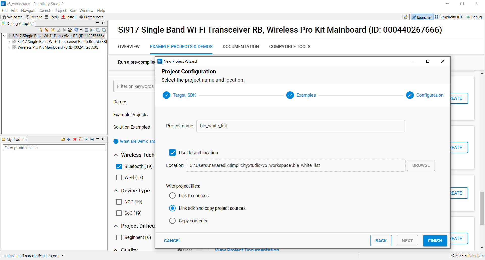
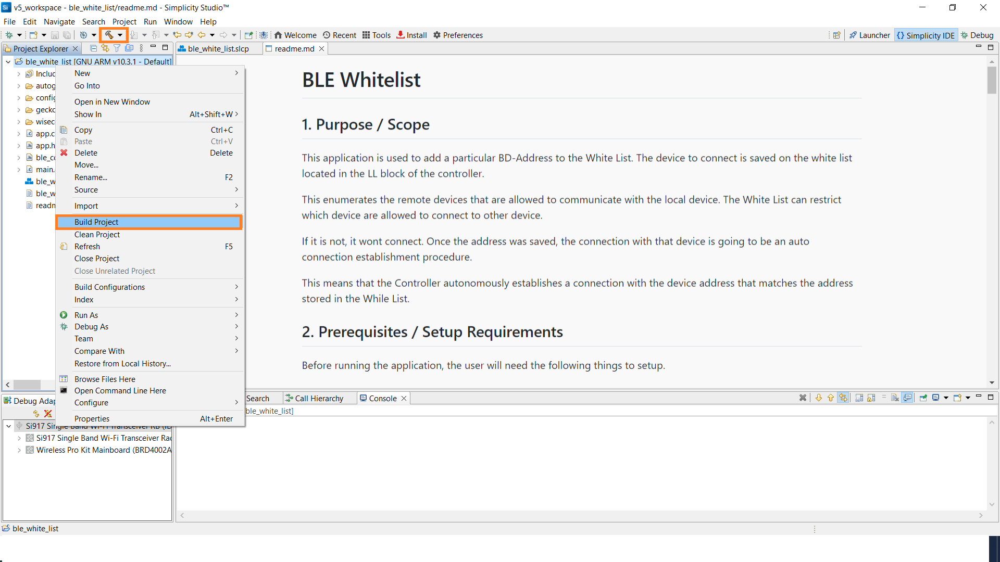

# BLE Acceptlist

## 1. Purpose / Scope

This application is used to add a particular BD-Address to the White List. The device to connect is saved on the white list located in the LL block of the controller.

This enumerates the remote devices that are allowed to communicate with the local device. The White List can restrict which device are allowed to connect to other device.

If it is not, it wont connect. Once the address was saved, the connection with that device is going to be an auto connection establishment procedure.

This means that the Controller autonomously establishes a connection with the device address that matches the address stored in the While List.

## 2. Prerequisites / Setup Requirements

Before running the application, the user will need the following things to setup.

### 2.1 Hardware Requirements

- Windows PC with Host interface(UART/ SPI/ SDIO).
  - SiWx91x Wi-Fi Evaluation Kit. The SiWx91x supports multiple operating modes. See [Operating Modes]() for details.
  - **SoC Mode**:
    - Silicon Labs [BRD4325A, BRD4325B, BRD4325C, BRD4325G, BRD4338A](https://www.silabs.com/)
  - **NCP Mode**:
    - Silicon Labs [BRD4180B](https://www.silabs.com/);
    - Host MCU Eval Kit. This example has been tested with:
      - Silicon Labs [WSTK + EFR32MG21](https://www.silabs.com/development-tools/wireless/efr32xg21-bluetooth-starter-kit)
- BLE peripheral device

### 2.2 Software Requirements

- Embedded Development Environment

  - For Silicon Labs EFx32, use the latest version of [Simplicity Studio](https://www.silabs.com/developers/simplicity-studio)- Download and install the Silicon Labs [EFR Connect App](https://www.silabs.com/developers/efr-connect-mobile-app) in the android smart phones for testing BLE applications. Users can also use their choice of BLE apps available in Android/iOS smart phones.

### 2.3 Setup Diagram

**SoC Mode :**

  
**NCP Mode :**


**NOTE**: 
- The Host MCU platform (EFR32xG21) and the SiWx91x interact with each other through the SPI interface. 

## 3 Project Environment

- Ensure the SiWx91x loaded with the latest firmware following the [Upgrade Si91x firmware](https://docs.silabs.com/wiseconnect/latest/wiseconnect-getting-started/getting-started-with-soc-mode#upgrade-si-wx91x-connectivity-firmware)

- Ensure the latest Gecko SDK along with the extension WiSeConnect3 is added to Simplicity Studio.

### 3.1 Creating the project

#### 3.1.1 SoC mode

- Ensure the SiWx91x set up is connected to your PC.

- In the Simplicity Studio IDE, the SiWx91x SoC board will be detected under **Debug Adapters** pane as shown below.

  ****

#### 3.1.2 NCP mode

- Ensure the EFx32 and SiWx91x set up is connected to your PC.

- In the Simplicity Studio IDE, the EFR32 board will be detected under **Debug Adapters** pane as shown below.

  ****

### 3.2 Importing the project

- Studio should detect your board. Your board will be shown here. Click on the board detected and go to **EXAMPLE PROJECTS & DEMOS** section 

#### SOC Mode

- Select **BLE - Acceptlist** test application

  ****

- Click 'Create'. The "New Project Wizard" window appears. Click 'Finish'

  ****

### 3.3 Set up for application prints

#### 3.3.1 Teraterm set up - for BRD4325A, BRD4325B, BRD4325C, BRD4325G

You can use either of the below USB to UART converters for application prints.

1. Set up using USB to UART converter board.

   - Connect Tx (Pin-6) to P27 on WSTK
   - Connect GND (Pin 8 or 10) to GND on WSTK

   ****

2. Set up using USB to UART converter cable.

   - Connect RX (Pin 5) of TTL convertor to P27 on WSTK
   - Connect GND (Pin1) of TTL convertor to GND on WSTK

   ****

3. Open the Teraterm tool.

   - For SoC mode, choose the serial port to which USB to UART converter is connected and click on **OK**.

     ****

**Note:** For Other 917 SoC boards please refer section #3.3.2

#### 3.3.2 **Teraterm set up - for NCP and SoC modes**

1. Open the Teraterm tool.

- choose the J-Link port and click on **OK**.
    
    ****

2. Navigate to the Setup → Serial port and update the baud rate to **115200** and click on **OK**.

    ****

    ****

## 4 Application Build Environment

### 4.1 Application Configuration

The application can be configured to suit your requirements and development environment. Read through the following sections and make any changes needed.

**4.1.1** In the Project explorer pane of the IDE, expand the **ble_accept_list** folder and open the **app.c** file. Configure the following parameters based on your requirements.    


**4.1.2** **Remote device configuration parameters**

  ```c
  // RSI_BLE_DEV_ADDR_TYPE refers to the address type of the remote device to connect.
  //! Based on address type of remote device, valid configurations are LE_RANDOM_ADDRESS and LE_PUBLIC_ADDRESS
 
	#define RSI_BLE_DEV_ADDR_TYPE                          LE_PUBLIC_ADDRESS 
  
  //RSI_BLE_DEV_ADDR refers to the address of the remote device to connect.
  
  #define RSI_BLE_DEV_ADDR                               "00:1A:7D:DA:71:48" 
  
  //RSI_REMOTE_DEVICE_NAME refers to the name of remote device to which Silicon Labs device has to connect.

	#define RSI_REMOTE_DEVICE_NAME                         "SILABS_DEV"

   //RSI_BLE_ACCEPTLIST_DEV_ADDR1_TYPE and RSI_BLE_ACCEPTLIST_DEV_ADDR1_TYPE refers address of the remote devices to be acceptlisted
	#define RSI_BLE_ACCEPTLIST_DEV_ADDR1_TYPE              LE_PUBLIC_ADDRESS
	#define RSI_BLE_ACCEPTLIST_DEV_ADDR2_TYPE              LE_PUBLIC_ADDRESS

   //Address of the device to add in white list, Update the address in little indian format
   uint8_t ble_acceptlist_addr1[6] = { 0x48, 0x71, 0xDA, 0x7D, 0x1A, 0x00 };

   //Address of the device to add in white list,Update the address in little indian format
   uint8_t ble_acceptlist_addr2[6] = { 0xB9, 0x70, 0x80, 0xA7, 0x23, 0x00 };

   // To clear whitlist, If this define is enabled specify the bd address of the device which has to remove from acceptlist
   #define DELETE_ACCEPTLIST 0
  ```
  
  **Note:** you required to configure either the `RSI_BLE_DEV_ADDR` or `RSI_REMOTE_DEVICE_NAME` of the remote device.

**4.1.3** Open **ble_config.h** file and configure the Opermode command parameters.   
   

- **SCAN based Acceptlist Configurations**

   ```c
   //RSI_BLE_SCAN_TYPE refers to the SCAN type either SCAN_TYPE_ACTIVE or SCAN_TYPE_PASSIVE
   
   #define RSI_BLE_SCAN_TYPE        SCAN_TYPE_ACTIVE

   //RSI_BLE_SCAN_FILTER_TYPE refers to the SCAN filter type
   #define RSI_BLE_SCAN_FILTER_TYPE SCAN_FILTER_TYPE_ONLY_ACCEPT_LIST
   ```

- **Opermode command parameters**
  This configuration can be found in app.c as `config`	

   **Note:** `ble_config.h` and `app.c` files are already set with desired configuration in respective example folders you need not change for each example. 

### 4.2 Build the Application

- Follow the below steps for the successful execution of the application.

#### Build Project - SoC Mode

- Once the project is created, click on the build icon (hammer) to build the project (or) right click on project and click on Build Project.

   

- Successful build output will show as below.

#### Build Project - NCP Mode

   

- Successful build output will show as below.

## 5. Test the Application

- Follow the below steps for the successful execution of the application.

### 5.1 Load the SiWx91x Firmware

Refer [Getting started with PC](https://docs.silabs.com/rs9116/latest/wiseconnect-getting-started) to load the firmware into SiWx91x EVK. The firmware binary is located in `<SDK>/firmware/`

### 5.2 Load the Application Image

1. Click on Tools and Simplicity Commander as shown below.

   

2. Load the application image
 - Select the board.
 - Browse the application image (.hex) and click on Flash button.

   

### 5.3 Run the Application

1. Configure the remote ble device in peripheral mode and put it in advertising mode.
       

   **Note:** Refer the [Creating New Advertisement Sets](https://docs.silabs.com/bluetooth/5.0/miscellaneous/mobile/efr-connect-mobile-app) for configuring the EFR connect mobile APP as advertiser.

2. After the program gets executed, it adds the configured remote device addresses to the acceptlist, and Silicon Labs device tries to connect only with the acceptlisted remote device specified in **RSI_BLE_DEV_ADDR or RSI_REMOTE_DEVICE_NAME** macro and ble_acceptlist_addr1 array.


3. Observe that the connection is established between the desired device and Silicon Labs device.

## Application Output

