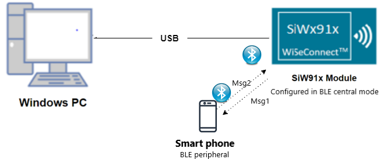
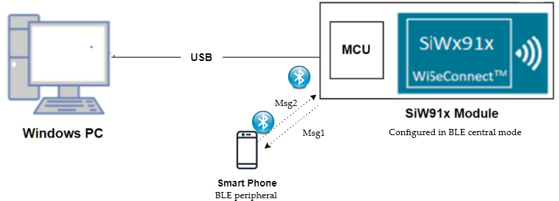

# BLE AE Central

## Table of Contents

- [Purpose/Scope](#purposescope) 
- [Prerequisites/Setup Requirements](#prerequisitessetup-requirements)
  - [Hardware Requirements](#hardware-requirements)
  - [Software Requirements](#software-requirements)
  - [Setup Diagram](#setup-diagram)
- [Getting Started](#getting-started)
- [Application Build Environment](#application-build-environment)
- [Test the Application](#test-the-application)

## Purpose/Scope

This application demonstrates how to configure SiWx91x in Advertising Extended cental mode .

## Prerequisites/Setup Requirements

### Hardware Requirements

- Windows PC
- SoC Mode:
  - Silicon Labs [BRD4325A, BRD4325B, BRD4325C, BRD4325G, BRD4338A](https://www.silabs.com/)
- NCP Mode:
  - Silicon Labs [BRD4180B](https://www.silabs.com/);
  - Host MCU Eval Kit. This example has been tested with:
    - Silicon Labs [WSTK + EFR32MG21](https://www.silabs.com/development-tools/wireless/efr32xg21-bluetooth-starter-kit)
- Smartphone configured as BLE peripheral

### Software Requirements

- Simplicity Studio IDE

- Download and install the Silicon Labs [EFR Connect App or other BLE Central/Peripheral app.](https://www.silabs.com/developers/efr-connect-mobile-app) in the android smart phones for testing BLE applications. Users can also use their choice of BLE apps available in Android/iOS smart phones.

### Setup Diagram

#### SoC Mode : 


  
#### NCP Mode :  

	
   		
## Getting Started

Refer to the instructions [here](https://docs.silabs.com/wiseconnect/latest/wiseconnect-getting-started/) to:

- Install Studio and WiSeConnect 3 extension
- Connect your device to the computer
- Upgrade your connectivity firmware
- Create a Studio project

## Application Build Environment

The application can be configured to suit your requirements and development environment. Read through the following sections and make any changes needed.

1. In the Project explorer pane of the IDE, expand the **ble\_ae\_central** folder and open the **app.c** file. Configure the following parameters based on your requirements.    
   - **Remote device configuration parameters**
   ```c
      // RSI_BLE_DEV_ADDR_TYPE refers to the address type of the remote device to connect.
      //! Based on address type of remote device, valid configurations are LE_RANDOM_ADDRESS and LE_PUBLIC_ADDRESS
      
      #define RSI_BLE_DEV_ADDR_TYPE                          LE_PUBLIC_ADDRESS 
      
      //RSI_BLE_DEV_ADDR refers to the address of the remote device to connect.
      
      #define RSI_BLE_DEV_ADDR                               "00:1E:7C:25:E9:4D" 
      
      //RSI_REMOTE_DEVICE_NAME refers to the name of remote device to which Silicon Labs device has to connect.

      #define RSI_REMOTE_DEVICE_NAME                         "SILABS_DEV" 
   ```
   **Note:** you're required to configure either the `RSI_BLE_DEV_ADDR` or `RSI_REMOTE_DEVICE_NAME` of the remote device.
   - **Power Save Configuration**
   Configure "ENABLE_POWER_SAVE" parameter to enable power save mode.      
      ```c
         #define ENABLE_POWER_SAVE              1
      ```
      **Note:** If you are using the NCP-EXP-Board, refer the "**Powersave functionality with NCP expansion board**" section  the ***Getting started with SiWx91x NCP*** guide.

**Note:** `app.c` files are already set with desired configuration in respective example folders user need not change for each example. 
   
## Test the Application

Refer to the instructions [here](https://docs.silabs.com/wiseconnect/latest/wiseconnect-getting-started/) to:

- Build the application
- Flash, run and debug the application

Follow the steps as mentioned for the successful execution of the application:

1. Configure the remote BLE device in peripheral mode, where add the complete local name record,  Enable the Scan response data, and connectable options to the advertising data. And keep it in the Advertising mode. Ensure that the specified the remote device name in the RSI_REMOTE_DEVICE_NAME macro is proper.    
  
**Note:** 
   - Refer the [Creating New Advertisement Sets](https://docs.silabs.com/bluetooth/5.0/miscellaneous/mobile/efr-connect-mobile-app) for configuring the EFR connect mobile APP as advertiser. 
   - The provided mobile screenshots are from the 2.5.2 version of the EFR Connect app, it is recommended to use the latest version. 
2. After the program gets executed, Silicon Labs device tries to connect with the remote device specified in `RSI_BLE_DEV_ADDR` or `RSI_REMOTE_DEVICE_NAME` macro.
3. Observe that the connection is established between the desired device and SiWx91x module.     


   **Note:** Examples for BLE peripherals: Bluetooth Dongle, mobile application, TA sensor tag.

## Application Output

   
