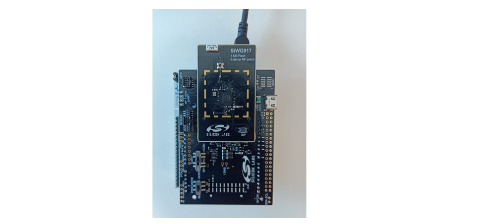

# BLE - AE Central

## Table of Contents

- [Purpose/Scope](#purposescope) 
- [Prerequisites/Setup Requirements](#prerequisitessetup-requirements)
  - [Hardware Requirements](#hardware-requirements)
  - [Software Requirements](#software-requirements)
  - [Setup Diagram](#setup-diagram)
- [Getting Started](#getting-started)
- [Application Build Environment](#application-build-environment)
- [Test the Application](#test-the-application)

## Purpose/Scope

This application demonstrates how to configure SiWx91x in Advertising Extended cental mode . It has 2 scan set and it is able scan both 1Mbps and coded PHY.

## Prerequisites/Setup Requirements

### Hardware Requirements

- Windows PC
- SoC Mode:
  - Silicon Labs [BRD4325A, BRD4325B, BRD4325C, BRD4325G, BRD4338A, BRD4339B, BRD4343A](https://www.silabs.com/)
  - Kits
    - SiWx917 AC1 Module Explorer Kit (BRD2708A)
- PSRAM Mode:  
  - Silicon Labs [BRD4340A, BRD4342A, BRD4325G](https://www.silabs.com/)
- NCP Mode:
  - Silicon Labs [BRD4180B](https://www.silabs.com/);
  - Host MCU Eval Kit. This example has been tested with:
    - Silicon Labs [WSTK + EFR32MG21](https://www.silabs.com/development-tools/wireless/efr32xg21-bluetooth-starter-kit)
    - NCP Expansion Kit with NCP Radio boards
      - (BRD4346A + BRD8045A) [SiWx917-EB4346A]
      - (BRD4357A + BRD8045A) [SiWx917-EB4357A]
  - STM32F411RE MCU
     - [STM32F411RE](https://www.st.com/en/microcontrollers-microprocessors/stm32f411re.html) MCU
     - NCP Radio Board (BRD4346A + BRD8045C)
  - Interface and Host MCU Supported
    - SPI - EFR32 
    - UART - EFR32

- Smartphone configured as BLE peripheral which supports extended advertising 

### Software Requirements

- Simplicity Studio IDE (to be used with Silicon Labs MCU)
- Keil IDE (to be used with STM32F411RE MCU)
- Serial Terminal - [Docklight](https://docklight.de/)/[Tera Term](https://ttssh2.osdn.jp/index.html.en) (to be used with Keil IDE)
- Download and install the Silicon Labs [Simplicity Connect App(formerly EFR Connect App) or other BLE Central/Peripheral app.](https://www.silabs.com/developers/simplicity-connect-mobile-app ) in the android smart phones for testing BLE applications. Users can also use their choice of BLE apps available in Android/iOS smart phones.

### Setup Diagram

#### SoC Mode : 


   		
## Getting Started

### Instructions for Simplicity Studio IDE and Silicon Labs devices (SoC and NCP Modes)
Refer to the instructions [here](https://docs.silabs.com/wiseconnect/latest/wiseconnect-getting-started/) to:

- [Install Simplicity Studio](https://docs.silabs.com/wiseconnect/latest/wiseconnect-developers-guide-developing-for-silabs-hosts/#install-simplicity-studio)
- [Install WiSeConnect 3 extension](https://docs.silabs.com/wiseconnect/latest/wiseconnect-developers-guide-developing-for-silabs-hosts/#install-the-wi-se-connect-3-extension)
- [Connect your device to the computer](https://docs.silabs.com/wiseconnect/latest/wiseconnect-developers-guide-developing-for-silabs-hosts/#connect-si-wx91x-to-computer)
- [Upgrade your connectivity firmware ](https://docs.silabs.com/wiseconnect/latest/wiseconnect-developers-guide-developing-for-silabs-hosts/#update-si-wx91x-connectivity-firmware)
- [Create a Studio project ](https://docs.silabs.com/wiseconnect/latest/wiseconnect-developers-guide-developing-for-silabs-hosts/#create-a-project)

For details on the project folder structure, see the [WiSeConnect Examples](https://docs.silabs.com/wiseconnect/latest/wiseconnect-examples/#example-folder-structure) page.

### Instructions for Keil IDE and STM32F411RE MCU (NCP Mode)

  - Install the [Keil IDE](https://www.keil.com/).
  - Download [WiSeConnect 3 SDK](https://github.com/SiliconLabs/wiseconnect)
  - Update the device's connectivity firmware as mentioned [here](https://docs.silabs.com/wiseconnect/latest/wiseconnect-getting-started/getting-started-with-ncp-mode).
  - Connect the SiWx91x NCP to STM32F411RE Nucleo Board following the below steps:
  - Connect the male Arduino compatible header on carrier board to female Arduino compatible header on STM32F411RE Nucleo board.
  - Mount the NCP Radio board (BRD4346A) onto the radio board socket available on the base board (BRD8045C).
  - After connecting all the boards, the setup should look like the image shown below:

   
   
  - Connect the setup to the computer.
  - Open the BLE PER µVision project - **ble_ae_central.uvprojx** by navigating to **WiSeConnect 3 SDK → examples → snippets → ble → ble_ae_central → keil_project**.

## Application Build Environment

The application can be configured to suit your requirements and development environment. Read through the following sections and make any changes needed.

- In the Project explorer pane of the IDE, expand the **ble\_ae\_central** folder and open the **app.c** file. Configure the following parameters based on your requirements.    
   - **Remote device configuration parameters**
   
      - `RSI_BLE_DEV_ADDR_TYPE` refers to the address type of the remote device to connect.
         - Based on address type of remote device, valid configurations are `LE_RANDOM_ADDRESS` and `LE_PUBLIC_ADDRESS`
         ```c
         #define RSI_BLE_DEV_ADDR_TYPE                          LE_PUBLIC_ADDRESS 
         ```
      
      - `RSI_BLE_DEV_ADDR` refers to the address of the remote device to connect.
         ```c
         #define RSI_BLE_DEV_ADDR                               "00:1E:7C:25:E9:4D" 
         ```
      - `RSI_REMOTE_DEVICE_NAME` refers to the name of remote device to which Silicon Labs device has to connect.
         ```c
         #define RSI_REMOTE_DEVICE_NAME                         "SILABS_DEV" 
         ```
         > **Note:** You're required to configure either the `RSI_BLE_DEV_ADDR` or `RSI_REMOTE_DEVICE_NAME` of the remote device.
   - **Power Save Configuration**
      - Configure `ENABLE_NWP_POWER_SAVE` parameter to enable power save mode.      
         ```c
         #define ENABLE_NWP_POWER_SAVE              1
         ```
      > **Note:** If you are using the NCP-EXP-Board, refer the "**Powersave functionality with NCP expansion board**" section  the ***Getting started with SiWx91x NCP*** guide.

   >**Note:** `app.c` files are already set with desired configuration in respective example folders user need not change for each example. 

- Change the following parameters as desired in **ble_config.h**
    - `Initiating phys:` 
    ```c
        #define INITIATING_PHYS (PHY_1M | PHY_2M | PHY_LE_CODED)
    ```
    - `LE_SCAN_INTERVAL` refers to primary phy scan interval.
    - `LE_SCAN_WINDOW` refers to primary phy scan window.
    - `SEC_PHY_LE_SCAN_INTERVAL` refers to secondary phy scan interval.
    - `SEC_PHY_LE_SCAN_WINDOW` refers to secondary phy scan window.
   ```c
       #define LE_SCAN_INTERVAL         0x100
       #define LE_SCAN_WINDOW           0x50
       #define SEC_PHY_LE_SCAN_INTERVAL 0x100
       #define SEC_PHY_LE_SCAN_WINDOW   0x50
   ```
   >**Note:** Scan window value should always be less than or equal to scan inerval.

    - `RSI_BLE_SCAN_TYPE` refers to primary phy scan type.
    - `SEC_PHY_BLE_SCAN_TYPE` refers to secondary phy scan type.  
    - `RSI_BLE_SCAN_FILTER_TYPE` refers to the scan filter type

   ```c
       #define RSI_BLE_SCAN_TYPE        SCAN_TYPE_ACTIVE
       #define SEC_PHY_BLE_SCAN_TYPE    SCAN_TYPE_ACTIVE
       #define RSI_BLE_SCAN_FILTER_TYPE SCAN_FILTER_TYPE_ALL
   ```
    - `BLE_SCAN_DUR` refers to extended scan duration.
    - `BLE_SCAN_PERIOD` refers to extended scan period. 
    - `BLE_SCAN_ENABLE_FILTER_DUP` refers to enable scan filter duplicates. 

   ```c
       #define BLE_SCAN_ENABLE_FILTER_DUP 0x00 
       #define BLE_SCAN_DUR               0x00
       #define BLE_SCAN_PERIOD            0x00
   ```
    - `RSI_SEL_INTERNAL_ANTENNA` refers to select internal antenna.
    - `RSI_SEL_EXTERNAL_ANTENNA` refers to select aftermarket antenna. 
   ```c
       #define RSI_SEL_INTERNAL_ANTENNA 0x00
       #define RSI_SEL_EXTERNAL_ANTENNA 0x01
   ```   
>**Note:** `ble_config.h` files are already set with desired configuration in respective example folders user need not change for each example.

> **Note:** 
> User can configure default region specific regulatory information using `sl_wifi_region_db_config.h`
- The desired scan parameters are provided for AE_SCAN_SET1. you can enable similar parameters for AE_SCAN_SET2
```c
	ae_set_scan_params.own_addr_type               			 	= LE_PUBLIC_ADDRESS; // SiWx917 device address type
	ae_set_scan_params.scanning_filter_policy       			= RSI_BLE_SCAN_FILTER_TYPE; //filter policy to be used.
	ae_set_scan_params.scanning_phys                			= (PHY_1M | PHY_LE_CODED);
    ae_set_scan_params.ScanParams[AE_SCAN_SET1].ScanType        = RSI_BLE_SCAN_TYPE;
	ae_set_scan_params.ScanParams[AE_SCAN_SET1].ScanInterval 	= LE_SCAN_INTERVAL;
	ae_set_scan_params.ScanParams[AE_SCAN_SET1].ScanWindow   	= LE_SCAN_WINDOW;
```

- SET2_ENABLE is a configuration parameter that enables or disables  AE_SCAN_SET2 functionality.
```c
	#define SET2_ENABLE 1
```
- Parameters to Configure scan enable
```c
	ae_set_scan_enable.enable                       = RSI_BLE_START_SCAN;
	ae_set_scan_enable.filter_duplicates            = BLE_SCAN_ENABLE_FILTER_DUP;
	ae_set_scan_enable.duration                     = BLE_SCAN_DUR;
	ae_set_scan_enable.period                       = BLE_SCAN_PERIOD;
```
## Test the Application

### Instructions for Simplicity Studio IDE and Silicon Labs devices (SoC and NCP Modes)
Refer to the instructions [here](https://docs.silabs.com/wiseconnect/latest/wiseconnect-getting-started/) to:

- Build the application
- Flash, run and debug the application

### Instructions for Keil IDE and STM32F411RE MCU

- Build the application.
- Set the Docklight up by connecting STM32's Serial COM port. This enables you to view the application prints.
- Flash, run and debug the application.

Follow the steps as mentioned for the successful execution of the application:

1. Configure the remote BLE device in peripheral mode, add the complete local name record, enable the scan response data, and connectable options to the advertising data. And keep it in the advertising mode. Ensure that the specified remote device name in the RSI_REMOTE_DEVICE_NAME macro is proper.

   

   > **Note:** 
   > - Refer the [Creating New Advertisement Sets](https://docs.silabs.com/bluetooth/5.0/miscellaneous/mobile/efr-connect-mobile-app) for configuring the Simplicity Connect mobile App(formerly EFR Connect App) as advertiser. 
   > - The provided mobile screenshots are from the 2.8.1 version of the Simplicity Connect App(formerly EFR Connect App), it is recommended to use the latest version. 
2. After the program gets executed, Silicon Labs device tries to connect with the remote device specified in `RSI_BLE_DEV_ADDR` or `RSI_REMOTE_DEVICE_NAME` macro.
3. Observe that the connection is established between the desired device and SiWx91x module. 

   
   > **Note:** Examples for BLE peripherals: Bluetooth dongle, mobile application, TA sensor tag.

4. Refer the following images for console prints.

   