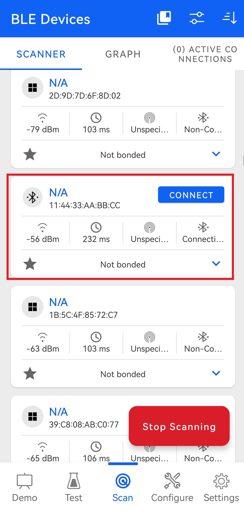
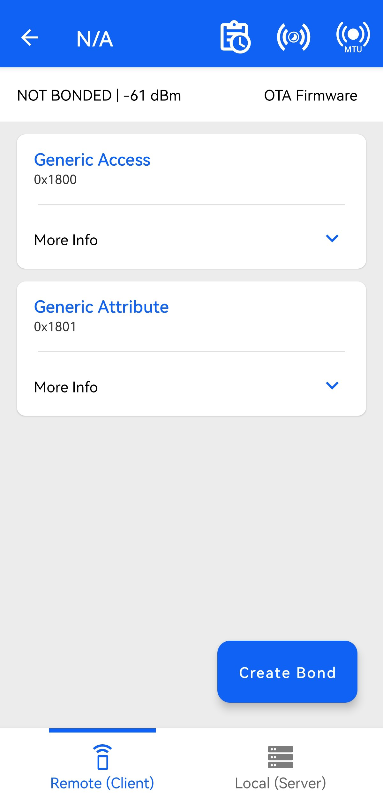
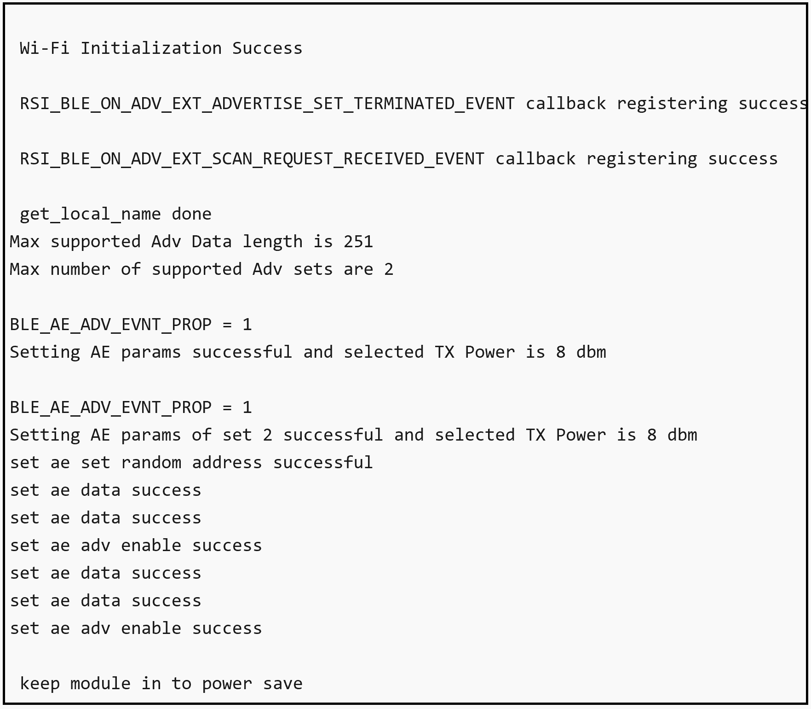
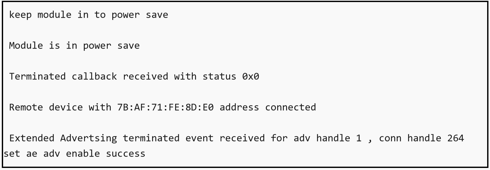

# BLE - AE Peripheral

## Table of Contents

- [Purpose/Scope](#purposescope) 
- [Prerequisites/Setup Requirements](#prerequisitessetup-requirements)
  - [Hardware Requirements](#hardware-requirements)
  - [Software Requirements](#software-requirements)
  - [Setup Diagram](#setup-diagram)
- [Getting Started](#getting-started)
- [Application Build Environment](#application-build-environment)
- [Test the Application](#test-the-application)

## Purpose/Scope

This application demonstrates how to configure SiWx91x in Advertising Extended peripheral mode. the application is designed with 2 adv sets and has the provision of periodic advertising for a set

## Prerequisites/Setup Requirements

### Hardware Requirements

- Windows PC
- SoC Mode:
  - Silicon Labs [BRD4325A, BRD4325B, BRD4325C, BRD4325G, BRD4338A, BRD4339B](https://www.silabs.com/)
- PSRAM Mode:  
  - Silicon Labs [BRD4340A, BRD4342A, BRD4325G](https://www.silabs.com/)
- NCP Mode:
  - Silicon Labs [BRD4180B](https://www.silabs.com/);
  - Host MCU Eval Kit. This example has been tested with:
    - Silicon Labs [WSTK + EFR32MG21](https://www.silabs.com/development-tools/wireless/efr32xg21-bluetooth-starter-kit)
  - STM32F411RE MCU
    - [STM32F411RE](https://www.st.com/en/microcontrollers-microprocessors/stm32f411re.html) MCU
    - NCP Radio Board (BRD4346A + BRD8045C)
- Smartphone configured as BLE central which supports extended scanning

### Software Requirements

- Simplicity Studio IDE(to be used with Silicon Labs MCU)
- Keil IDE (to be used with STM32F411RE MCU)
- Serial Terminal - [Docklight](https://docklight.de/)/[Tera Term](https://ttssh2.osdn.jp/index.html.en) (to be used with Keil IDE)

- Download and install the Silicon Labs [Simplicity Connect App(formerly EFR Connect App) or other BLE Central/Peripheral app.](https://www.silabs.com/developers/simplicity-connect-mobile-app ) in the android smart phones for testing BLE applications. Users can also use their choice of BLE apps available in Android/iOS smart phones.

> **Note:** The provided mobile screenshots are from the 2.8.1 version of the Simplicity Connect App(formerly EFR Connect App), it is recommended to use the latest version.


### Setup Diagram

  
  
## Getting Started

### Instructions for Simplicity Studio IDE and Silicon Labs devices (SoC and NCP Modes)

Refer to the instructions [here](https://docs.silabs.com/wiseconnect/latest/wiseconnect-getting-started/) to:

- Install Studio and WiSeConnect 3 extension
- Connect your device to the computer
- Upgrade your connectivity firmware
- Create a Studio project

For details on the project folder structure, see the [WiSeConnect Examples](https://docs.silabs.com/wiseconnect/latest/wiseconnect-examples/#example-folder-structure) page.

### Instructions for Keil IDE and STM32F411RE MCU

  - Install the [Keil IDE](https://www.keil.com/).
  - Download [WiSeConnect 3 SDK](https://github.com/SiliconLabs/wiseconnect)
  - Update the device's connectivity firmware as mentioned [here](https://docs.silabs.com/wiseconnect/latest/wiseconnect-getting-started/getting-started-with-ncp-mode).
  - Connect the SiWx91x NCP to STM32F411RE Nucleo Board following the below steps:
  - Connect the male Arduino compatible header on carrier board to female Arduino compatible header on STM32F411RE Nucleo board.
  - Mount the NCP Radio board (BRD4346A) onto the radio board socket available on the base board (BRD8045C).
  - After connecting all the boards, the setup should look like the image shown below:

    
    
  - Connect the setup to the computer.
  - Open the BLE PER µVision project - **ble_ae_peripheral.uvprojx** by navigating to **WiSeConnect 3 SDK → examples → snippets → ble → ble_ae_peripheral → keil_project**.

## Application Build Environment

The application can be configured to suit your requirements and development environment. Read through the following sections and make any changes needed.

- Open `app.c` file and update/modify the following parameters 

  - `RSI_BLE_LOCAL_NAME` defines the name with which SiWx91x advertises with
 
    ```c
    #define RSI_BLE_LOCAL_NAME             "AE_PERIPHERAL" 
    ```
  - `ADV_SET2` is a configuration parameter that enables or disables SET2 functionality.
    
    ```c
    #define ADV_SET2            1
    ```

  - `PERIODIC_ADV_EN` is a configuration parameter that enables or disables periodic advertisement.
    ```c
    #define PERIODIC_ADV_EN     0
    ```    
  - The desired parameters are provided following. User can also modify the parameters as per their needs and requirements.

  - Following are the event numbers for advertising, connection and disconnection events

    ```c
    #define RSI_APP_EVENT_CONNECTED                        0
    #define RSI_APP_EVENT_DISCONNECTED                     1
    ```
 
- Open `ble_config.h` file and update/modify following macros,

  - The desired parameters are provided following steps. User can also modify the parameters as per their needs and requirements.

  - `RSI_BLE_SET_RAND_ADDR` refers random address of the devce to be set while advertising

    ```c
    #define RSI_BLE_SET_RAND_ADDR                    "11:22:33:44:55:66"
    ```

  - `RSI_BLE_ADV_INT_MIN` refers to the minimum advertising interval
  - `RSI_BLE_ADV_INT_MAX` refers to the maximum advertising interval

    ```c
    #define  RSI_BLE_ADV_INT_MIN                           0x100
    #define  RSI_BLE_ADV_INT_MAX                           0x200
    ```

  - `RSI_BLE_ADV_CHANNEL_MAP` refers to the channels SiWx91x advertises in 

    ```c
    #define  RSI_BLE_ADV_CHANNEL_MAP                       0x07 
    ```

  - `BLE_AE_ADV_EVNT_PROP` defines the type of advertising for SET 1

    ```c
    #define BLE_CONNECTABLE_ADV        (1 << 0)
    #define BLE_SCANNABLE_ADV          (0 << 1)
    #define BLE_LOW_DUTY_DIR_CONN_ADV  (0 << 2)
    #define BLE_HIGH_DUTY_DIR_CONN_ADV (0 << 3)
    #define BLE_LEGACY_ADV             (0 << 4)
    #define BLE_ANONYMOUS_ADV          (0 << 5)
    #define BLE_TX_WR_ADV              (0 << 6)
    #define BLE_AE_ADV_EVNT_PROP                                                \
      (BLE_CONNECTABLE_ADV | BLE_SCANNABLE_ADV | BLE_LOW_DUTY_DIR_CONN_ADV | BLE_HIGH_DUTY_DIR_CONN_ADV | BLE_LEGACY_ADV | BLE_ANONYMOUS_ADV | BLE_TX_WR_ADV)
      ```
    ```c
        #define RSI_BLE_PWR_INX     30
        #define RSI_BLE_PWR_SAVE_OPTIONS                   BLE_DISABLE_DUTY_CYCLING
    ```
     > **Note:** To configure SET 2 properties below parameters should be modified in app.c 
       ```c
      ble_ae_params.adv_handle                = 0x01;
      ble_ae_params.adv_event_prop            = 0x01; //Connectable;
      ble_ae_params.primary_adv_intterval_min = 0x30; //140 only 3bytes are valid;
      ble_ae_params.primary_adv_intterval_max = 0x30; //160 only 3bytes are valid;
      ble_ae_params.primary_adv_chnl_map      = RSI_BLE_ADV_CHANNEL_MAP;
    ```
    ```c 
    - To configure the periodic advertisement parameters, change below parameters in app.c
    ```
    ```c
    rsi_ble_ae_periodic_adv_params_t ae_periodic_param = { 0 };
    ae_periodic_param.max_interval                     = 0x190;
    ae_periodic_param.min_interval                     = 0x90;
    ae_periodic_param.properties                       = 0x40;
    ae_periodic_param.adv_handle                       = BLE_ADV_HNDL1;
    ``` 
  - Following are the non configurable macros

    - There are three advertising data types:

    ```c
    #define BLE_AE_ADV_DATA_TYPE                              0x01
    #define BLE_AE_PERIODIC_ADV_DATA_TYPE                     0x02
    #define BLE_AE_SCAN_RSP_DATA_TYPE                         0x03
    ```

    - The following are the address types: 

    ```c
    #define LE_PUBLIC_ADDRESS                             0x00
    #define LE_RANDOM_ADDRESS                             0x01
    #define LE_RESOLVABLE_PUBLIC_ADDRESS                  0x02
    #define LE_RESOLVABLE_RANDOM_ADDRESS                  0x03
    ```

   > **Note:** `ble_config.h` files are already set with desired configuration in respective example folders user need not change for each example. 
   
## Test the Application

### Instructions for Simplicity Studio IDE and Silicon Labs devices (SoC and NCP Modes)
Refer to the instructions [here](https://docs.silabs.com/wiseconnect/latest/wiseconnect-getting-started/) to:

- Build the application
- Flash, run and debug the application
### Instructions for Keil IDE and STM32F411RE MCU

- Build the application.
- Set the Docklight up by connecting STM32's Serial COM port. This enables you to view the application prints.
- Flash, run and debug the application.

Follow the steps as mentioned for the successful execution of the application:

1. Set the desired name Silicon Labs device needs to advertise in `RSI_BLE_LOCAL_NAME` and its random address in `RSI_BLE_SET_RAND_ADDR`. User needs to populate `RSI_BLE_ADV_INT_MIN` and `RSI_BLE_ADV_INT_MAX` with desired values for minimum advertsing interval and maximum advertsing interval.

2. After the program gets executed, from remote device scan for Silicon Labs device which advertsises with the remote device specified in `RSI_BLE_LOCAL_NAME` macro or check for device address specified in `RSI_BLE_SET_RAND_ADDR` macro

     

3. Observe that the connection is established between the desired device and SiWx91x. 

     

   > **Note:** Examples for BLE peripherals: Bluetooth Dongle, mobile application, TA sensor tag.
   
7. After successful program execution the prints in teraterm looks as shown in following image.   
     
     
     