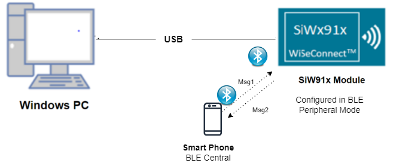
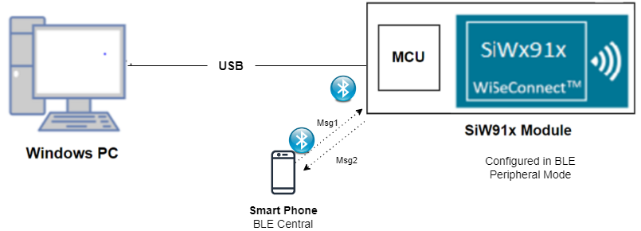
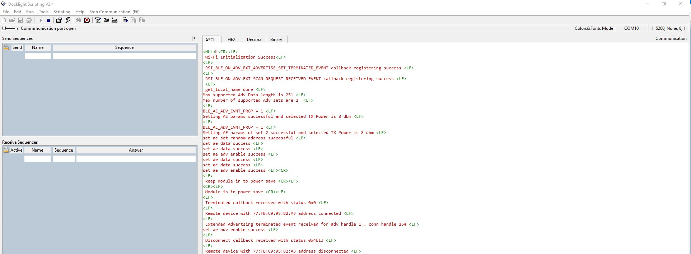

# BLE AE Peripheral


## Table of Contents

- [Purpose/Scope](#purposescope) 
- [Prerequisites/Setup Requirements](#prerequisitessetup-requirements)
  - [Hardware Requirements](#hardware-requirements)
  - [Software Requirements](#software-requirements)
  - [Setup Diagram](#setup-diagram)
- [Getting Started](#getting-started)
- [Application Build Environment](#application-build-environment)
- [Test the Application](#test-the-application)

## Purpose/Scope

This application demonstrates how to configure SiWx91x in Advertising Extended peripheral mode.

## Prerequisites/Setup Requirements

### Hardware Requirements

- Windows PC
- SoC Mode:
  - Silicon Labs [BRD4325A, BRD4325B, BRD4325C, BRD4325G, BRD4338A](https://www.silabs.com/)
- NCP Mode:
  - Silicon Labs [BRD4180B](https://www.silabs.com/);
  - Host MCU Eval Kit. This example has been tested with:
    - Silicon Labs [WSTK + EFR32MG21](https://www.silabs.com/development-tools/wireless/efr32xg21-bluetooth-starter-kit)
- Smartphone configured as BLE peripheral

### Software Requirements

- Simplicity Studio IDE

- Download and install the Silicon Labs [EFR Connect App or other BLE Central/Peripheral app.](https://www.silabs.com/developers/efr-connect-mobile-app) in the android smart phones for testing BLE applications. Users can also use their choice of BLE apps available in Android/iOS smart phones.

### Setup Diagram

#### SoC Mode : 


  
#### NCP Mode :  

	
   		
## Getting Started

Refer to the instructions [here](https://docs.silabs.com/wiseconnect/latest/wiseconnect-getting-started/) to:

- Install Studio and WiSeConnect 3 extension
- Connect your device to the computer
- Upgrade your connectivity firmware
- Create a Studio project

## Application Build Environment

The application can be configured to suit your requirements and development environment. Read through the following sections and make any changes needed.

- Open `app.c` file
User must update the below parameters 

- `RSI_BLE_LOCAL_NAME` defines the name with which RS9116W EVK advertises with
 
   ```c
   #define RSI_BLE_LOCAL_NAME             "AE_PERIPHERAL" 
   ```
- `AE_ADV_TYPE` defines the type of advertising . Possible values are :
   ADVERTISING and PERIODIC_ADVERTISING
   
   ```c
   #define AE_ADV_TYPE  ADVERTISING
   ```

- The desired parameters are provided below. User can also modify the parameters as per their needs and requirements.

- Following are the event numbers for advertising, connection and disconnection events

```c
#define RSI_APP_EVENT_CONNECTED                        0
#define RSI_APP_EVENT_DISCONNECTED                     1
```

- Open `ble_config.h` file and update/modify following macros,

- The desired parameters are provided below. User can also modify the parameters as per their needs and requirements.

- `RSI_BLE_SET_RAND_ADDR` refers random address of the devce to be set while advertising

```c
#define RSI_BLE_SET_RAND_ADDR                    "11:22:33:44:55:66"
```

- `RSI_BLE_ADV_INT_MIN` refers to the minimum advertising interval
- `RSI_BLE_ADV_INT_MAX` refers to the maximum advertising interval

```c
#define  RSI_BLE_ADV_INT_MIN                           0x100
#define  RSI_BLE_ADV_INT_MAX                           0x200
```

- `RSI_BLE_ADV_CHANNEL_MAP` refers to the channels RS9116W EVK advertises in 

```c
#define  RSI_BLE_ADV_CHANNEL_MAP                       0x07 
```

- `BLE_AE_ADV_EVNT_PROP` defines the type of advertising 

```c
#define BLE_CONNECTABLE_ADV                           (1 << 0)
#define BLE_SCANNABLE_ADV                             (1 << 1)
#define BLE_AE_ADV_EVNT_PROP                          (BLE_CONNECTABLE_ADV | BLE_SCANNABLE_ADV )
```

```c
#define RSI_BLE_PWR_INX                                30
#define RSI_BLE_PWR_SAVE_OPTIONS                       BLE_DISABLE_DUTY_CYCLING
```

- Following are the non configurable macros

- There are three advertising types

```c
#define BLE_AE_ADV_DATA_TYPE                              0x01
#define BLE_AE_PERIODIC_ADV_DATA_TYPE                     0x02
#define BLE_AE_SCAN_RSP_DATA_TYPE                         0x03
```

- The following are the address types 

```c
#define LE_PUBLIC_ADDRESS                             0x00
#define LE_RANDOM_ADDRESS                             0x01
#define LE_RESOLVABLE_PUBLIC_ADDRESS                  0x02
#define LE_RESOLVABLE_RANDOM_ADDRESS                  0x03
```

**Note:** `ble_config.h` files are already set with desired configuration in respective example folders user need not change for each example. 
   

## Test the Application

Refer to the instructions [here](https://docs.silabs.com/wiseconnect/latest/wiseconnect-getting-started/) to:

- Build the application
- Flash, run and debug the application

Follow the steps as mentioned for the successful execution of the application:

1. Set the desired name Silicon Labs device needs to advertise in `RSI_BLE_LOCAL_NAME` and its random address in `RSI_BLE_SET_RAND_ADDR`. User needs to populate `RSI_BLE_ADV_INT_MIN` and `RSI_BLE_ADV_INT_MAX` with desired values for minimum advertsing interval and maximum advertsing interval.

2. As soon as the debug process is completed, the application control branches to the main().

3. Go to the J-link Silicon Labs console pane to observe the debug prints in the Serial 1 tab.

4. Click on the **Resume** icon in the Simplicity Studio IDE toolbar to run the application.

5. After the program gets executed, from remote device scan for Silicon Labs device which advertsises with the remote device specified in `RSI_BLE_LOCAL_NAME` macro.

6. Observe that the connection is established between the desired device and SiWx91x. 

   **Note:** Examples for BLE peripherals: Bluetooth Dongle, mobile application, TA sensor tag.
   
7. After successful program execution the prints in teraterm looks as shown below.   
     
 