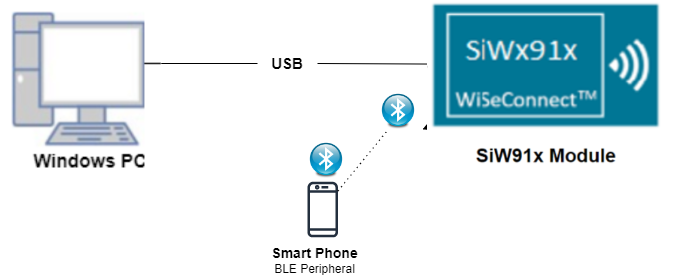
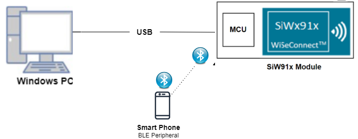
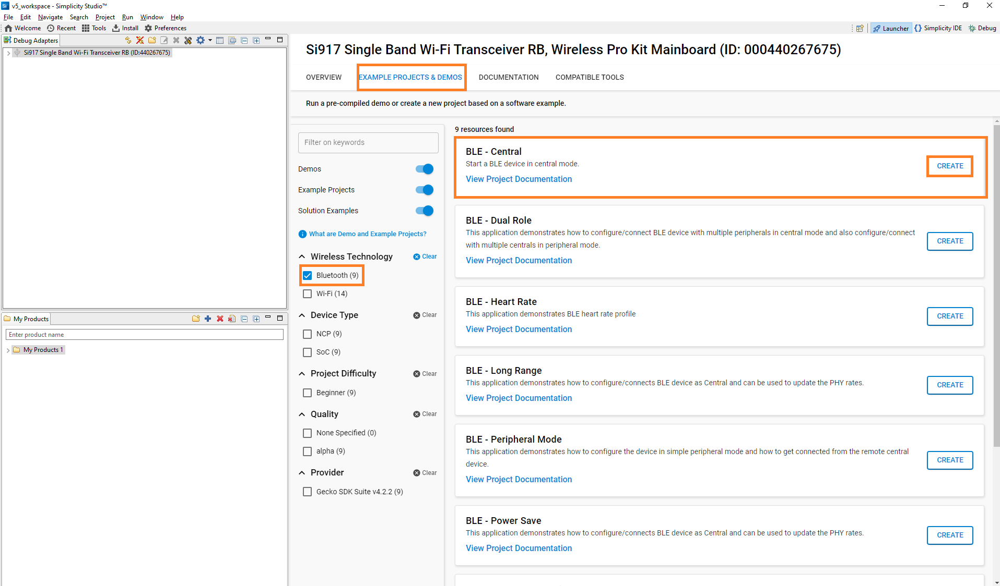
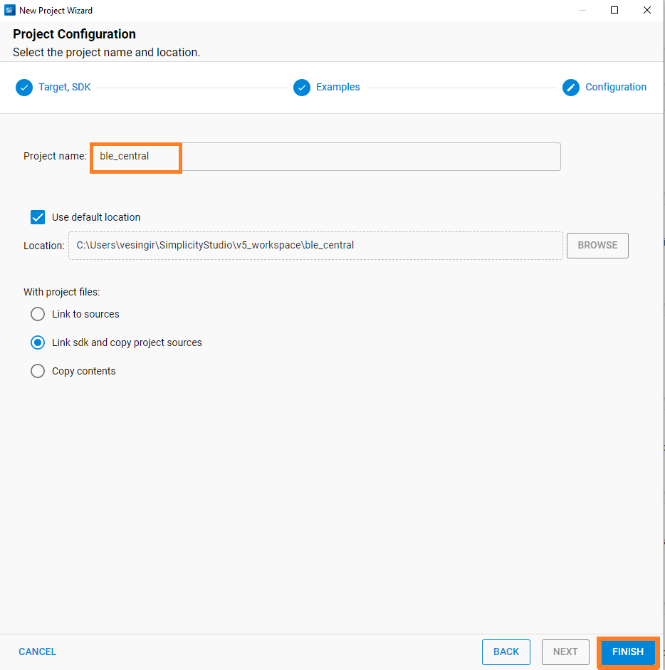
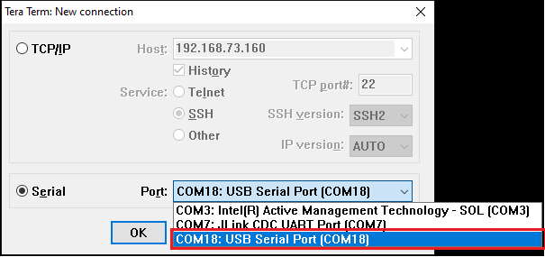
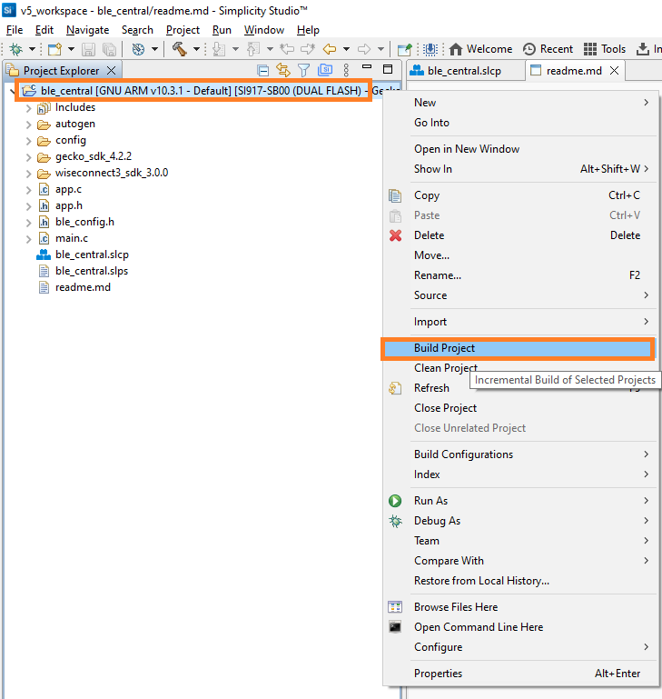
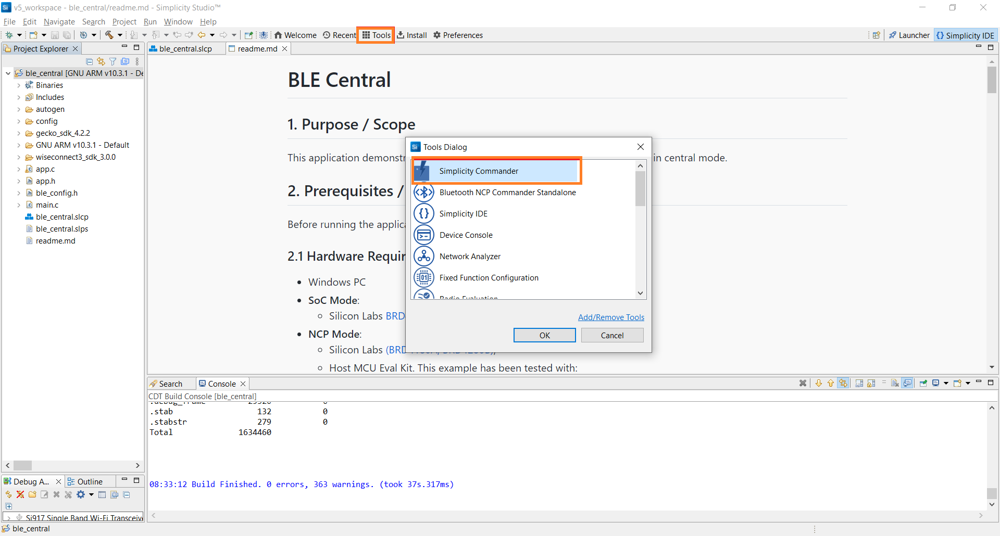
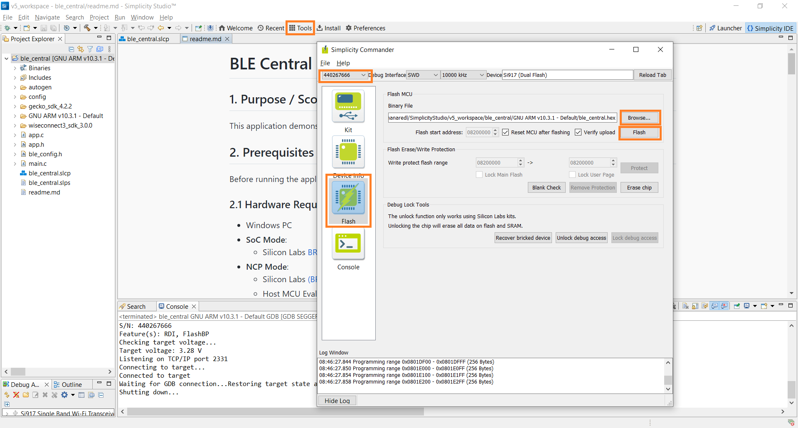
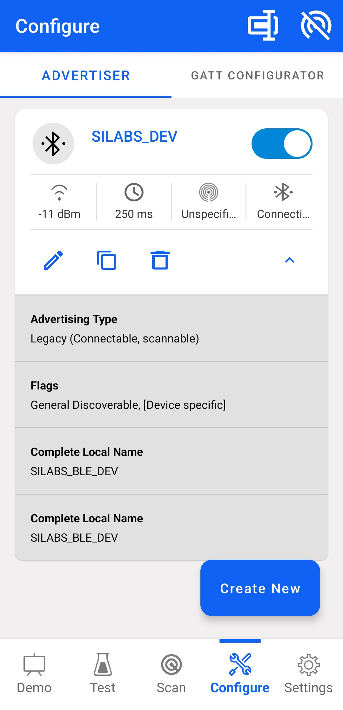
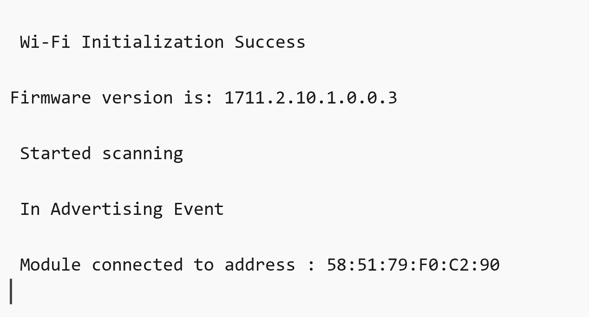

# BLE Central

## 1. Purpose / Scope

This application demonstrates how to connect SiWx91x with remote BLE device in central mode.

## 2. Prerequisites / Setup Requirements

Before running the application, the user will need the following things to setup.

### 2.1 Hardware Requirements

- Windows PC
- **SoC Mode**:
  - Silicon Labs [BRD4325A, BRD4325B, BRD4325C, BRD4325G, BRD4338A](https://www.silabs.com/)
- **NCP Mode**:
  - Silicon Labs [BRD4180B](https://www.silabs.com/);
  - Host MCU Eval Kit. This example has been tested with:
    - Silicon Labs [WSTK + EFR32MG21](https://www.silabs.com/development-tools/wireless/efr32xg21-bluetooth-starter-kit)
- BLE peripheral device

### 2.2 Software Requirements

- Simplicity Studio IDE

  - Use the latest version of [Simplicity Studio](https://www.silabs.com/developers/simplicity-studio)

- Download and install the Silicon Labs [EFR Connect App](https://www.silabs.com/developers/efr-connect-mobile-app) in the android smart phones for testing BLE applications. Users can also use their choice of BLE apps available in Android/iOS smart phones.

### 2.3 Setup Diagram

**SoC Mode :**


  
**NCP Mode :**  



Follow the [Getting Started with Wiseconnect3 SDK](https://docs.silabs.com/wiseconnect/latest/wiseconnect-getting-started/) guide to set up the hardware connections and Simplicity Studio IDE.

## 3 Project Environment

- Ensure the SiWx91x loaded with the latest firmware following the [Upgrade Si91x firmware](https://docs.silabs.com/wiseconnect/latest/wiseconnect-getting-started/getting-started-with-soc-mode#upgrade-si-wx91x-connectivity-firmware)

- Ensure the latest Gecko SDK along with the extension WiSeConnect3 is added to Simplicity Studio.

### 3.1 Creating the project

#### 3.1.1 SoC mode

- Ensure the SiWx91x set up is connected to your PC.

- In the Simplicity Studio IDE, the SiWx91x SoC board will be detected under **Debug Adapters** pane as shown below.

  ****

#### 3.1.2 NCP mode

- Ensure the EFx32 and SiWx91x set up is connected to your PC.

- In the Simplicity Studio IDE, the EFR32 board will be detected under **Debug Adapters** pane as shown below.

  ****

### 3.2 Importing the project

- Studio should detect your board. Your board will be shown here. Click on the board detected and go to **EXAMPLE PROJECTS & DEMOS** section 

#### SOC Mode

- Select **BLE- Central** test application

  ****

- Click 'Create'. The "New Project Wizard" window appears. Click 'Finish'

  ****

### 3.3 Set up for application prints

#### 3.3.1 Teraterm set up - for BRD4325A, BRD4325B, BRD4325C, BRD4325G

You can use either of the below USB to UART converters for application prints.

1. Set up using USB to UART converter board.

   - Connect Tx (Pin-6) to P27 on WSTK
   - Connect GND (Pin 8 or 10) to GND on WSTK

   ****

2. Set up using USB to UART converter cable.

   - Connect RX (Pin 5) of TTL convertor to P27 on WSTK
   - Connect GND (Pin1) of TTL convertor to GND on WSTK

   ****

3. Open the Teraterm tool.

   - For SoC mode, choose the serial port to which USB to UART converter is connected and click on **OK**.

     ****

**Note:** For Other 917 SoC boards please refer section #3.3.2

#### 3.3.2 **Teraterm set up - for NCP and SoC modes**

1. Open the Teraterm tool.

- choose the J-Link port and click on **OK**.
    
    ****

2. Navigate to the Setup → Serial port and update the baud rate to **115200** and click on **OK**.

    ****

    ****

## 4. Application Build Environment

The application can be configured to suit your requirements and development environment. Read through the following sections and make any changes needed.

### 4.1 Configure the Application

**4.1.1** Open `app.c` file.
User must update the below parameters

- `RSI_BLE_DEV_ADDR_TYPE` refers address type of the remote device to connect.

```c
#define RSI_BLE_DEV_ADDR_TYPE                          LE_PUBLIC_ADDRESS 
```

Based on address type of remote device, valid configurations are

```c
LE_RANDOM_ADDRESS
LE_PUBLIC_ADDRESS
```

- `RSI_BLE_DEV_ADDR` refers address of the remote device to connect.

```c
#define RSI_BLE_DEV_ADDR                               "00:1E:7C:25:E9:4D"
```

- `RSI_REMOTE_DEVICE_NAME` refers the name of remote device to which Silicon Labs device has to connect.

```c
#define RSI_REMOTE_DEVICE_NAME                         "SILABS_DEV" 
```

**Note:** user can configure either RSI_BLE_DEV_ADDR or RSI_REMOTE_DEVICE_NAME of the remote device.

**Power save configuration**

- By default, The Application is configured without power save.

```c
#define ENABLE_POWER_SAVE 0
```

- If user wants to run the application in power save, modify the below configuration.

```c
#define ENABLE_POWER_SAVE 1 
```

- Following are the event numbers for advertising, connection and disconnection events

```c
#define RSI_APP_EVENT_ADV_REPORT                       0
#define RSI_APP_EVENT_CONNECTED                        1
#define RSI_APP_EVENT_DISCONNECTED                     2
```

**4.1.2** Open `ble_config.h` file and update/modify following macros,

```c
#define RSI_BLE_PWR_INX                                30
#define RSI_BLE_PWR_SAVE_OPTIONS                       BLE_DISABLE_DUTY_CYCLING
```

  **Note:** The configurations are already set with desired configuration in respective example folders you need not change for each example.

### 4.2 Build the Application

- Once the project is created, click on the build icon (hammer) to build the project (or) right click on project and click on Build Project.

   

### 4.3 Run and Test the Application Using Debug Mode

1. Once the build was successfull, right click on project and click on Debug As->Silicon Labs ARM Program as shown in below image.

2. As soon as the debug process is completed, the application control branches to the main().

3. Go to the J-link Silicon Labs console pane to observe the debug prints in the Serial 1 tab.

4. Click on the **Resume** icon in the Simplicity Studio IDE toolbar to run the application.

### 4.4 Load the Application Image

1. Click on Tools and Simplicity Commander as shown below.

   

2. Load the firmware image

- Select the board.
- Browse the application image (.hex) and click on Flash button.

   

### 4.5 Running the SiWx91x Application

1. Configure the remote BLE device in peripheral mode and put it in advertising mode.For remote mobile ensure that the device is named same as the value mentioned in RSI_REMOTE_DEVICE_NAME macro also see to it that Complete local name record is added to advertising data and Scan response data and connectable is ticked in options.

   **Note:** Refer the [Creating New Advertisement Sets](https://docs.silabs.com/bluetooth/5.0/miscellaneous/mobile/efr-connect-mobile-app) for configuring the EFR connect mobile APP as advertiser.
2. After the program gets executed, Silicon Labs device tries to connect with the remote device specified in `RSI_BLE_DEV_ADDR` or `RSI_REMOTE_DEVICE_NAME` macro.

3. Observe that the connection is established between the desired device and SiWx91x.  
   **Note:** Examples for BLE peripherals: Bluetooth Dongle, mobile application, TA sensor tag.
4. Refer the below images for console prints

### 4.5 Application Output

    
