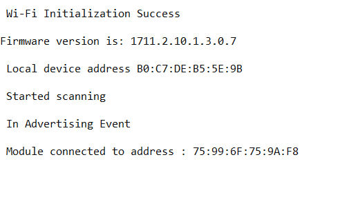

# BLE - Central

## Table of Contents

- [Purpose/Scope](#purposescope) 
- [Prerequisites/Setup Requirements](#prerequisitessetup-requirements)
  - [Hardware Requirements](#hardware-requirements)
  - [Software Requirements](#software-requirements)
  - [Setup Diagram](#setup-diagram)
- [Getting Started](#getting-started)
- [Application Build Environment](#application-build-environment)
- [Test the Application](#test-the-application)

## Purpose/Scope

This application demonstrates how to connect SiWx91x with remote BLE device in central mode.

## Prerequisites/Setup Requirements

### Hardware Requirements

- Windows PC
- SoC Mode:
  - Silicon Labs [BRD4325A, BRD4325B, BRD4325C, BRD4325G, BRD4338A, BRD4339B](https://www.silabs.com/)
- PSRAM Mode:  
  - Silicon Labs [BRD4340A, BRD4342A, BRD4325G](https://www.silabs.com/)
- NCP Mode:
  - Silicon Labs [BRD4180B](https://www.silabs.com/);
  - Host MCU Eval Kit. This example has been tested with:
    - Silicon Labs [WSTK + EFR32MG21](https://www.silabs.com/development-tools/wireless/efr32xg21-bluetooth-starter-kit)
- Smartphone configured as BLE peripheral
### Software Requirements

- Simplicity Studio IDE

- Download and install the Silicon Labs [Simplicity Connect App(formerly EFR Connect App) or other BLE Central/Peripheral app.](https://www.silabs.com/developers/simplicity-connect-mobile-app ) in the android smart phones for testing BLE applications. Users can also use their choice of BLE apps available in Android/iOS smart phones.

   > **Note:** The provided mobile screenshots are from the 2.8.1 version of the Simplicity Connect App(formerly EFR Connect App), it is recommended to use the latest version.

### Setup Diagram


  
## Getting Started

Refer to the instructions [here](https://docs.silabs.com/wiseconnect/latest/wiseconnect-getting-started/) to:

- Install Studio and WiSeConnect 3 extension
- Connect your device to the computer
- Upgrade your connectivity firmware
- Create a Studio project

For details on the project folder structure, see the [WiSeConnect Examples](https://docs.silabs.com/wiseconnect/latest/wiseconnect-examples/#example-folder-structure) page.

## Application Build Environment

The application can be configured to suit your requirements and development environment. Read through the following sections and make any changes needed.

- Open `app.c` file.
User must update the below parameters

   - `RSI_BLE_DEV_ADDR_TYPE` refers address type of the remote device to connect.

   ```c
   #define RSI_BLE_DEV_ADDR_TYPE                          LE_PUBLIC_ADDRESS 
   ```

   - Based on address type of remote device, valid configurations are

   ```c
   LE_RANDOM_ADDRESS
   LE_PUBLIC_ADDRESS
   ```

   - `RSI_BLE_DEV_ADDR` refers address of the remote device to connect.

   ```c
   #define RSI_BLE_DEV_ADDR                               "00:1E:7C:25:E9:4D"
   ```

   - `RSI_REMOTE_DEVICE_NAME` refers the name of remote device to which Silicon Labs device has to connect.

   ```c
   #define RSI_REMOTE_DEVICE_NAME                         "SILABS_DEV" 
   ```

   > **Note:** User can configure either RSI_BLE_DEV_ADDR or RSI_REMOTE_DEVICE_NAME of the remote device.

   - Power save configuration

      - By default, The Application is configured without power save.

   ```c
   #define ENABLE_POWER_SAVE 0
   ```

   - If user wants to run the application in power save, modify the below configuration.

   ```c
   #define ENABLE_POWER_SAVE 1 
   ```

   - Following are the event numbers for advertising, connection and disconnection events

   ```c
   #define RSI_APP_EVENT_ADV_REPORT                       0
   #define RSI_APP_EVENT_CONNECTED                        1
   #define RSI_APP_EVENT_DISCONNECTED                     2
   ```

- Open `ble_config.h` file and update/modify following macros,

   ```c
   #define RSI_BLE_PWR_INX                                30
   #define RSI_BLE_PWR_SAVE_OPTIONS                       BLE_DISABLE_DUTY_CYCLING
   ```

   > **Note:** The configurations are already set with desired configuration in respective example folders you need not change for each example.

## Test the Application

Refer to the instructions [here](https://docs.silabs.com/wiseconnect/latest/wiseconnect-getting-started/) to:

- Build the application in Studio.
- Flash, run and debug the application

Follow the steps as mentioned for the successful execution of the application:

1. As soon as the debug process is completed, the application control branches to the main().

2. Go to the J-link Silicon Labs console pane to observe the debug prints in the Serial 1 tab.

3. Click on the **Resume** icon in the Simplicity Studio IDE toolbar to run the application.

4. Configure the remote BLE device in peripheral mode and put it in advertising mode.For remote device ensure that the device is named same as the value mentioned in RSI_REMOTE_DEVICE_NAME macro also see to it that Complete local name record is added to advertising data and Scan response data and connectable is configured in options.

   

   > **Note:** Refer the [Creating New Advertisement Sets](https://docs.silabs.com/bluetooth/5.0/miscellaneous/mobile/efr-connect-mobile-app) for configuring the Simplicity Connect mobile App(formerly EFR Connect App) as advertiser.

5. After the program gets executed, Silicon Labs device tries to connect with the remote device specified in `RSI_BLE_DEV_ADDR` or `RSI_REMOTE_DEVICE_NAME` macro.

6. Observe that the connection is established between the desired device and SiWx91x.  

   

   > **Note:** Examples for BLE peripherals: Bluetooth Dongle, mobile application, TA sensor tag.

7. Refer the following images for console prints:

    
