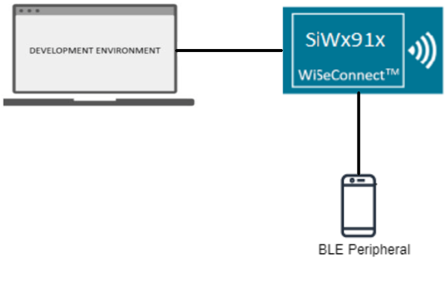

# BLE - Datalength

## Table of Contents

- [BLE - Datalength](#ble---datalength)
  - [Table of Contents](#table-of-contents)
  - [Purpose/Scope](#purposescope)
  - [Prerequisites](#prerequisites)
    - [Hardware Requirements](#hardware-requirements)
    - [Software Requirements](#software-requirements)
    - [Setup Diagram](#setup-diagram)
  - [Getting Started](#getting-started)
  - [Application Build Environment](#application-build-environment)
  - [Test the Application](#test-the-application)

## Purpose/Scope

This application demonstrates how to set data length extension with the connected remote device by configuring the SiWx91x module in a central role.

Packet length extension refers to increasing the size of the packet data unit (PDU) from 27 to 251 bytes during data transfer during connection events.
After connecting, both the central and peripheral devices can initiate this procedure at any time.

## Prerequisites

### Hardware Requirements

- Windows PC with Host interface(UART/ SPI/ SDIO).
  - SiWx91x Wi-Fi Evaluation Kit. The SiWx91x supports multiple operating modes. See [Operating Modes]() for details.
  - SoC Mode:
    - Silicon Labs [BRD4325A, BRD4325B, BRD4325C, BRD4325G, BRD4338A, BRD4339B, BRD4343A](https://www.silabs.com/)
    - Kits
      - SiWx917 AC1 Module Explorer Kit (BRD2708A)
  - PSRAM Mode:  
    - Silicon Labs [BRD4340A, BRD4342A, BRD4325G](https://www.silabs.com/)
  - NCP Mode:
    - Silicon Labs [BRD4180B](https://www.silabs.com/);
    - Host MCU Eval Kit. This example has been tested with:
      - Silicon Labs [WSTK + EFR32MG21](https://www.silabs.com/development-tools/wireless/efr32xg21-bluetooth-starter-kit)
  - Interface and Host MCU Supported
    - SPI - EFR32 
  - BLE peripheral device

### Software Requirements

- Simplicity Studio

- Download and install the Silicon Labs [Simplicity Connect App(formerly EFR Connect App) or other BLE Central/Peripheral app.](https://www.silabs.com/developers/simplicity-connect-mobile-app ) in the android smart phones for testing BLE applications. Users can also use their choice of BLE apps available in Android/iOS smart phones.

### Setup Diagram


## Getting Started

Refer to the instructions [here](https://docs.silabs.com/wiseconnect/latest/wiseconnect-getting-started/) to:

- [Install Simplicity Studio](https://docs.silabs.com/wiseconnect/latest/wiseconnect-developers-guide-developing-for-silabs-hosts/#install-simplicity-studio)
- [Install WiSeConnect extension](https://docs.silabs.com/wiseconnect/latest/wiseconnect-developers-guide-developing-for-silabs-hosts/#install-the-wi-se-connect-extension)
- [Connect your device to the computer](https://docs.silabs.com/wiseconnect/latest/wiseconnect-developers-guide-developing-for-silabs-hosts/#connect-si-wx91x-to-computer)
- [Upgrade your connectivity firmware ](https://docs.silabs.com/wiseconnect/latest/wiseconnect-developers-guide-developing-for-silabs-hosts/#update-si-wx91x-connectivity-firmware)
- [Create a Studio project ](https://docs.silabs.com/wiseconnect/latest/wiseconnect-developers-guide-developing-for-silabs-hosts/#create-a-project)

For details on the project folder structure, see the [WiSeConnect Examples](https://docs.silabs.com/wiseconnect/latest/wiseconnect-examples/#example-folder-structure) page.

## Application Build Environment

The application can be configured to suit you requirements and development environment. Go through the following sections and make any changes if needed.

- In the Project Explorer pane of the IDE, expand the **ble_datalength** folder and open the **app.c** file.
- Configure the following parameters based on your requirements.

- Remote device configuration parameters

   - `RSI_BLE_DEV_ADDR_TYPE` refers to the address type of the remote device to connect.  
    Based on address type of remote device, valid configurations are LE_RANDOM_ADDRESS and LE_PUBLIC_ADDRESS
  ```c
  #define RSI_BLE_DEV_ADDR_TYPE                          LE_PUBLIC_ADDRESS
  ```

  - `RSI_BLE_DEV_ADDR` refers to the address of the remote device to connect.
  ```c
    #define RSI_BLE_DEV_ADDR                               "00:1E:7C:25:E9:4D"
  ```

  - `RSI_REMOTE_DEVICE_NAME` refers to the name of remote device to which Silicon Labs device has to connect.
  ```c
  #define RSI_REMOTE_DEVICE_NAME                         "SILABS_DEV"
  ```
  > **Note:** you are required to configure either the `RSI_BLE_DEV_ADDR` or `RSI_REMOTE_DEVICE_NAME` of the remote device.

  - Configure `ENABLE_NWP_POWER_SAVE` parameter to enable power save mode.
  ```c
      #define ENABLE_NWP_POWER_SAVE              1
  ```
  > **Note:** If you are using the NCP-EXP-Board, refer the "**Powersave functionality with NCP expansion board**" section  the ***Getting started with SiWx91x NCP*** guide.

- Configure the Opermode command parameters as needed.

  >  **Note:** The configurations are already set with desired configuration in respective example folders you need not change for each example.

> **Note**: For recommended settings, please refer the [recommendations guide](https://docs.silabs.com/wiseconnect/latest/wiseconnect-developers-guide-prog-recommended-settings/).

## Test the Application

Refer to the instructions [here](https://docs.silabs.com/wiseconnect/latest/wiseconnect-getting-started/) to:

- Build the application in Studio.
- Flash, run and debug the application.

Follow the steps below for the successful execution of the application:

1. Configure the remote BLE device in peripheral mode, where add the complete local name record,  Enable the Scan response data, and connectable options to the advertising data. And keep it in the Advertising mode. Ensure that the specified the remote device name in the RSI_REMOTE_DEVICE_NAME macro is proper.

    > **Note:**
    >  - Refer the [Creating New Advertisement Sets](https://docs.silabs.com/bluetooth/5.0/miscellaneous/mobile/efr-connect-mobile-app) for configuring the Simplicity Connect mobile App(formerly EFR Connect App) as advertiser.
    >  - The provided mobile screenshots are from the 2.5.2 version of the Simplicity Connect App(formerly EFR Connect App), it is recommended to use the latest version.

2. After the program gets executed, the Silicon Labs device initiates the scanning.

3. When the Silicon Labs device receives the advertising report of the remote device, which is specified in the **RSI_BLE_DEV_ADDR** or **RSI_REMOTE_DEVICE_NAME** macro, it initiates the connection.

4. Observe that the connection is established between the desired device and Silicon Labs device.

5. After connection, the Silicon Labs device will set data length of the remote device.

6. Observe a data length change event after setting the data length.

7. After successful program execution, Prints can see as below in any Console terminal.


   
