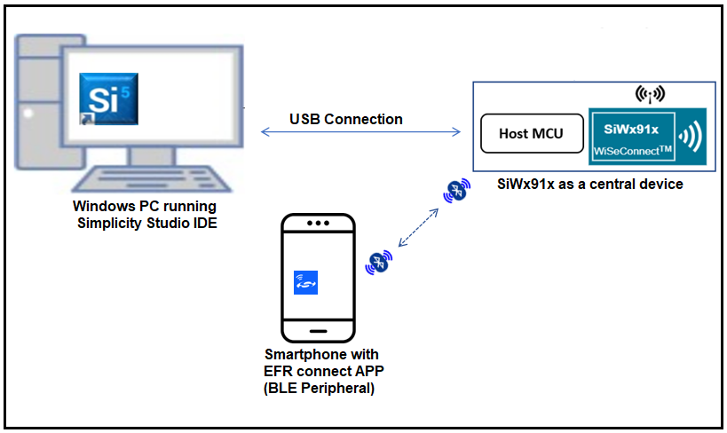

# BLE Data Length Extensions

## **1 Introduction**

This application demonstrates how to set data length extension with the connected remote device by configuring the SiWx91x module in a central role.

Packet length extension refers to increasing the size of the packet data unit (PDU) from 27 to 251 bytes during data transfer during connection events.
After connecting, both the central and peripheral devices can initiate this procedure at any time.

## **2 Prerequisites**

Before running the application, the user will need the following things to setup.

### 2.1 Hardware Requirements

- Windows PC with Host interface(UART/ SPI/ SDIO).
  - SiWx91x Wi-Fi Evaluation Kit. The SiWx91x supports multiple operating modes. See [Operating Modes]() for details.
  - **SoC Mode**:
    - Silicon Labs [BRD4325A, BRD4325B, BRD4325C, BRD4325G, BRD4338A](https://www.silabs.com/)
  - **NCP Mode**:
    - Silicon Labs [BRD4180B](https://www.silabs.com/);
    - Host MCU Eval Kit. This example has been tested with:
      - Silicon Labs [WSTK + EFR32MG21](https://www.silabs.com/development-tools/wireless/efr32xg21-bluetooth-starter-kit)

- BLE peripheral device

#### SoC Mode

  
#### NCP Mode  

Follow the [Getting Started with Wiseconnect3 SDK](https://docs.silabs.com/wiseconnect/latest/wiseconnect-getting-started/) guide to set up the hardware connections and Simplicity Studio IDE.

### 2.2 Software Requirements

- [WiSeConnect SDK](https://github.com/SiliconLabs/wiseconnect-wifi-bt-sdk/)

- Embedded Development Environment

  - For Silicon Labs EFx32, use the latest version of [Simplicity Studio](https://www.silabs.com/developers/simplicity-studio)

- Download and install the Silicon Labs [EFR Connect App](https://www.silabs.com/developers/efr-connect-mobile-app) in the android smart phones for testing BLE applications. Users can also use their choice of BLE apps available in Android/iOS smart phones.

## 3 Project Environment

- Ensure the SiWx91x loaded with the latest firmware following the [Upgrade Si91x firmware](https://docs.silabs.com/wiseconnect/latest/wiseconnect-getting-started/getting-started-with-soc-mode#upgrade-si-wx91x-connectivity-firmware)

- Ensure the latest Gecko SDK along with the extension WiSeConnect3 is added to Simplicity Studio.

### 3.1 Creating the project

#### 3.1.1 SoC mode

- Ensure the SiWx91x set up is connected to your PC.

- In the Simplicity Studio IDE, the SiWx91x SoC board will be detected under **Debug Adapters** pane as shown below.

  ****

#### 3.1.2 NCP mode

- Ensure the EFx32 and SiWx91x set up is connected to your PC.

- In the Simplicity Studio IDE, the EFR32 board will be detected under **Debug Adapters** pane as shown below.

  ****

### 3.2 Importing the project

- Studio should detect your board. Your board will be shown here. Click on the board detected and go to **EXAMPLE PROJECTS & DEMOS** section 

#### SOC Mode

- Select **BLE - Datalength** test application

  ****

- Click 'Create'. The "New Project Wizard" window appears. Click 'Finish'

  ****

### 3.3 Set up for application prints

#### 3.3.1 Teraterm set up - for BRD4325A, BRD4325B, BRD4325C, BRD4325G

You can use either of the below USB to UART converters for application prints.

1. Set up using USB to UART converter board.

   - Connect Tx (Pin-6) to P27 on WSTK
   - Connect GND (Pin 8 or 10) to GND on WSTK

   ****

2. Set up using USB to UART converter cable.

   - Connect RX (Pin 5) of TTL convertor to P27 on WSTK
   - Connect GND (Pin1) of TTL convertor to GND on WSTK

   ****

3. Open the Teraterm tool.

   - For SoC mode, choose the serial port to which USB to UART converter is connected and click on **OK**.

     ****

**Note:** For Other 917 SoC boards please refer section #3.3.2

#### 3.3.2 **Teraterm set up - for NCP and SoC modes**

1. Open the Teraterm tool.

- choose the J-Link port and click on **OK**.
    
    ****

2. Navigate to the Setup → Serial port and update the baud rate to **115200** and click on **OK**.

    ****

    ****

## 4. Application Build Environment

### 4.1 Application configuration

The application can be configured to suit you requirements and development environment. Go through the following sections and make any changes if needed.

1. In the Project explorer pane of the IDE, expand the **ble_datalength** folder and open the **app.c** file.
2. Configure the following parameters based on your requirements.

- **Remote device configuration parameters**

   `RSI_BLE_DEV_ADDR_TYPE` refers to the address type of the remote device to connect.  
    Based on address type of remote device, valid configurations are LE_RANDOM_ADDRESS and LE_PUBLIC_ADDRESS

  #define RSI_BLE_DEV_ADDR_TYPE                          LE_PUBLIC_ADDRESS
  
  `RSI_BLE_DEV_ADDR` refers to the address of the remote device to connect.
  
    #define RSI_BLE_DEV_ADDR                               "00:1E:7C:25:E9:4D"
  
  `RSI_REMOTE_DEVICE_NAME` refers to the name of remote device to which Silicon Labs device has to connect.

  #define RSI_REMOTE_DEVICE_NAME                         "SILABS_DEV"

  **Note:** you are required to configure either the `RSI_BLE_DEV_ADDR` or `RSI_REMOTE_DEVICE_NAME` of the remote device.
  
- **Power Save Configuration**
Configure `ENABLE_POWER_SAVE` parameter to enable power save mode.

      #define ENABLE_POWER_SAVE              1

   **Note:** If you are using the NCP-EXP-Board, refer the "**Powersave functionality with NCP expansion board**" section  the ***Getting started with SiWx91x NCP*** guide.

3. Configure the Opermode command parameters as needed.

  **Note:** The configurations are already set with desired configuration in respective example folders you need not change for each example.

### 4.2 Build the Application

- Follow the below steps for the successful execution of the application.

#### Build Project - SoC Mode

- Once the project is created, click on the build icon (hammer) to build the project (or) right click on project and click on Build Project.

   

- Successful build output will show as below.

#### Build Project - NCP Mode

   

## 5. Test the Application

Follow the steps below for the successful execution of the application.

### 5.1 Load the SiWx91x Firmware

Refer [Getting started with PC](https://docs.silabs.com/rs9116/latest/wiseconnect-getting-started) to load the firmware into SiWx91x EVK. The firmware binary is located in `<SDK>/firmware/`

### 5.2 Load the Application Image

1. Click on Tools and Simplicity Commander as shown below.

   

2. Load the application image

- Select the board. 
- Browse the application image (.hex) and click on Flash button.

   

### 5.3 Common Steps

1. Configure the remote BLE device in peripheral mode, where add the complete local name record,  Enable the Scan response data, and connectable options to the advertising data. And keep it in the Advertising mode. Ensure that the specified the remote device name in the RSI_REMOTE_DEVICE_NAME macro is proper.

**Note:**
    - Refer the [Creating New Advertisement Sets](https://docs.silabs.com/bluetooth/5.0/miscellaneous/mobile/efr-connect-mobile-app) for configuring the EFR connect mobile APP as advertiser.
    - The provided mobile screenshots are from the 2.5.2 version of the EFR Connect app, it is recommended to use the latest version.

2. After the program gets executed, the Silicon Labs device initiates the scanning.

3. When the Silicon Labs device receives the advertising report of the remote device, which is specified in the **RSI_BLE_DEV_ADDR** or **RSI_REMOTE_DEVICE_NAME** macro, it initiates the connection.

4. Observe that the connection is established between the desired device and Silicon Labs device.

5. After connection, the Silicon Labs device will set data length of the remote device.

6. Observe a data length change event after setting the data length.

7. After successful program execution, Prints can see as below in any Console terminal.

   

   
