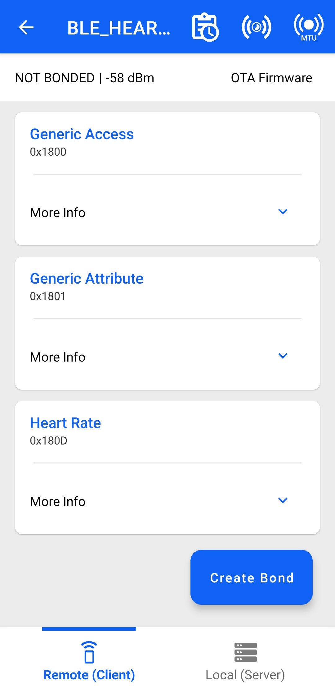
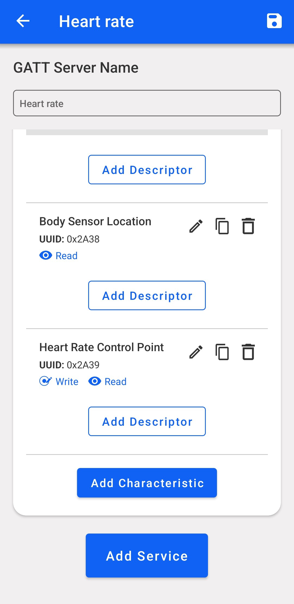
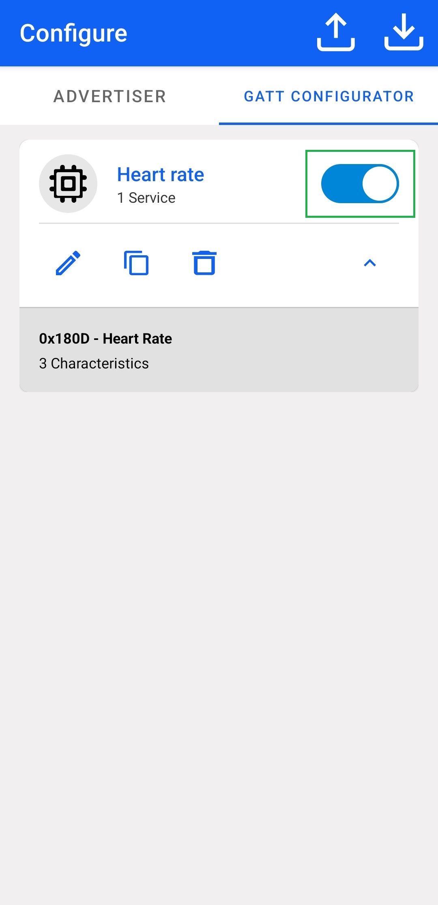
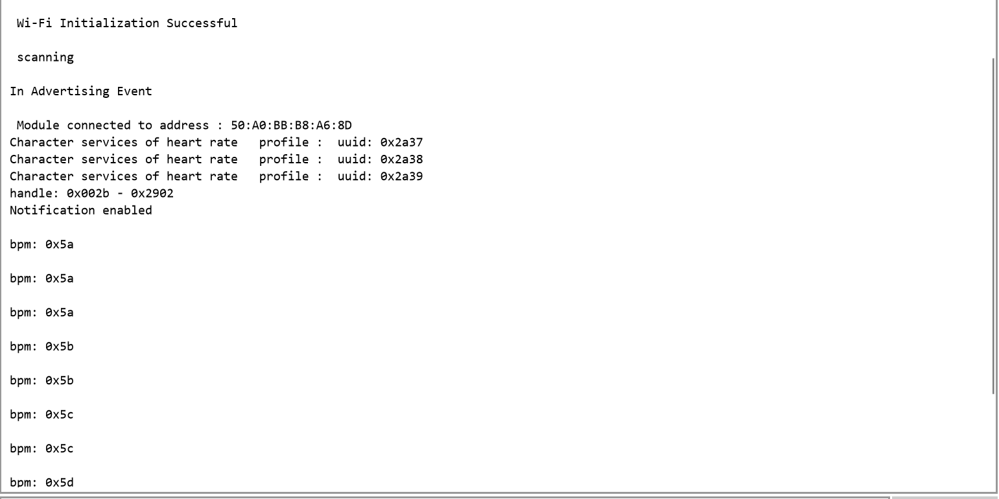

# BLE - Heart Rate

## Table of Contents

- [Purpose/Scope](#purposescope) 
- [Prerequisites/Setup Requirements](#prerequisitessetup-requirements)
  - [Hardware Requirements](#hardware-requirements)
  - [Software Requirements](#software-requirements)
  - [Setup Diagram](#setup-diagram)
- [Getting Started](#getting-started)
- [Application Build Environment](#application-build-environment)
- [Test the Application](#test-the-application)
  - [Verify BLE Heart Rate Profile Application as a Server](#verify-ble-heart-rate-profile-application-as-a-server)
  - [Verify BLE Heart Rate Profile Application as a Client](#verify-ble-heart-rate-profile-application-as-a-client)

## Purpose/Scope

This application demonstrates how to configure SiWx91x module as a GATT server with heart rate service in BLE peripheral mode and explains how to indicate operations with the GATT server from a connected remote device using the GATT client.

Also configure SiWx91x module as a GATT client in BLE central mode and enable indication of operation of the heart rate service of the connected remote GATT server from the GATT client. In the application,heart rate GATT server is configured with heart rate services and their corresponding characteristic UUIDs.

When the connected remote device writes data to writable characteristic UUID, the WiseConnect device receives the data that is received on writable characteristic UUID, writes the same data to readable characteristic UUID and sends indications to the connected device (or) remote device that can read the same data using read characteristic UUID if indication enabled on client side.

## Prerequisites/Setup Requirements

### Hardware Requirements

- Windows PC with Host interface(UART/ SPI/ SDIO).
  - SiWx91x Wi-Fi Evaluation Kit. The SiWx91x supports multiple operating modes. See [Operating Modes]() for details.
  - SoC Mode:
    - Silicon Labs [BRD4325A, BRD4325B, BRD4325C, BRD4338A, BRD4339B, BRD4343A](https://www.silabs.com/)
    - Kits
      - SiWx917 AC1 Module Explorer Kit (BRD2708A)
  - PSRAM Mode:  
    - Silicon Labs [BRD4340A, BRD4342A, BRD4325G](https://www.silabs.com/)
  - NCP Mode:
    - Silicon Labs [BRD4180B](https://www.silabs.com/);
    - Host MCU Eval Kit. This example has been tested with:
      - Silicon Labs [WSTK + EFR32MG21](https://www.silabs.com/development-tools/wireless/efr32xg21-bluetooth-starter-kit)
    - NCP Expansion Kit with NCP Radio boards
      - (BRD4346A + BRD8045A) [SiWx917-EB4346A]
      - (BRD4357A + BRD8045A) [SiWx917-EB4357A]
  - Interface and Host MCU Supported
    - SPI - EFR32 
  - BLE Smartphone
  
### Software Requirements

- Embedded Development Environment.

- Download and install the Silicon Labs [Simplicity Connect App(formerly EFR Connect App) or other BLE Central/Peripheral app.](https://www.silabs.com/developers/simplicity-connect-mobile-app ) in the android smart phones for testing BLE applications. Users can also use their choice of BLE apps available in Android/iOS smart phones.

> **Note:** The provided mobile screenshots are from the 2.5.2 version of the Simplicity Connect App(formerly EFR Connect App), it is recommended to use the latest version.

### Setup Diagram


## Getting Started

Refer to the instructions [here](https://docs.silabs.com/wiseconnect/latest/wiseconnect-getting-started/) to:

- [Install Simplicity Studio](https://docs.silabs.com/wiseconnect/latest/wiseconnect-developers-guide-developing-for-silabs-hosts/#install-simplicity-studio)
- [Install WiSeConnect 3 extension](https://docs.silabs.com/wiseconnect/latest/wiseconnect-developers-guide-developing-for-silabs-hosts/#install-the-wi-se-connect-3-extension)
- [Connect your device to the computer](https://docs.silabs.com/wiseconnect/latest/wiseconnect-developers-guide-developing-for-silabs-hosts/#connect-si-wx91x-to-computer)
- [Upgrade your connectivity firmware ](https://docs.silabs.com/wiseconnect/latest/wiseconnect-developers-guide-developing-for-silabs-hosts/#update-si-wx91x-connectivity-firmware)
- [Create a Studio project ](https://docs.silabs.com/wiseconnect/latest/wiseconnect-developers-guide-developing-for-silabs-hosts/#create-a-project)

For details on the project folder structure, see the [WiSeConnect Examples](https://docs.silabs.com/wiseconnect/latest/wiseconnect-examples/#example-folder-structure) page.

## Application Build Environment

The application can be configured to suit your requirements and development environment. Read through the following sections and make any changes needed.

- Open `app.c` file and update/modify following macros,


  - `` GATT_ROLE`` refers the role of the Silicon Labs module to be selected``

    - If user configures, ``SERVER``, Silicon Labs module will act as GATT SERVER, means will add heart rate profile.

    - If user configures, ``CLIENT``, Silicon Labs module will act as GATT CLIENT, means will connect to remote GATT server and get services and enable notify.

    ```c
    #define GATT_ROLE                                     SERVER
    ```
   - The following parameters are required to configure, when the SiWx91x module as a **CLIENT**

      - `RSI_BLE_DEV_ADDR_TYPE` refers address type of the remote device to connect.

      - Based on the address of the advertising device, valid configurations are

        - LE_RANDOM_ADDRESS
        - LE_PUBLIC_ADDRESS
    
        ```c
        #define RSI_BLE_DEV_ADDR_TYPE                         LE_PUBLIC_ADDRESS
        ```

        > **Note:** Depending on the remote device, address type will be changed.

      - `RSI_BLE_DEV_ADDR` refers address of the remote device to connect.

        ```c
        #define RSI_BLE_DEV_ADDR                              "00:23:A7:80:70:B9"
        ```

      - `RSI_REMOTE_DEVICE_NAME` refers the name of remote device to which Silicon Labs device has to connect.

        ```c
        #define RSI_REMOTE_DEVICE_NAME                        "SILABS_DEV"
        ```

  > **Note:** Silicon Labs module can connect to remote device by referring either RSI_BLE_DEV_ADDR or RSI_REMOTE_DEVICE_NAME of the remote device.

  - The following parameters are required to configure, when the SiWx91x module as a **SERVER**

    - `RSI_BLE_HEART_RATE_UUID` refers to the attribute value of the newly created service.

      ```c
      #define RSI_BLE_HEART_RATE_SERVICE_UUID                0x180D
      ```
    - `RSI_BLE_HEART_RATE_MEASUREMENT_UUID` refers to the attribute type of the first attribute under this service (RSI_BLE_HEART_RATE_SERVICE_UUID`).
      ```c
      #define RSI_BLE_HEART_RATE_MEASUREMENT_UUID            0x2A37
      ```
    - `RSI_BLE_SENSOR_LOCATION_UUID` refers to the attribute type of the second attribute under this service (RSI_BLE_HEART_RATE_SERVICE_UUID`).
      ```c
      #define RSI_BLE_SENSOR_LOCATION_UUID                   0x2A38
      ```
    - `RSI_BLE_HEART_RATE_CONTROL_POINT_UUID` refers to the attribute type of the second attribute under this service (`RSI_BLE_HEART_RATE_SERVICE_UUID`).
      ```c
      #define RSI_BLE_HEART_RATE_CONTROL_POINT_UUID          0x2A39
      ```
    - `RSI_BLE_MAX_DATA_LEN` refers to the Maximum length of the attribute data.
      ```c
      #define RSI_BLE_MAX_DATA_LEN                           20
      ```
    - `BLE_HEART_RATE_PROFILE` refers name of the Silabs device to appear during scanning by remote devices.
      ```c
      #define RSI_BLE_HEART_RATE_PROFILE                     "BLE_HEART_RATE_PROFILE"
      ```

  - Following are the **non-configurable** macros in the application.

    - `RSI_BLE_CHAR_SERV_UUID` refers to the attribute type of the characteristics to be added in a service.

      ```c
      #define RSI_BLE_CHAR_SERV_UUID                         0x2803
      ```
    - `RSI_BLE_CLIENT_CHAR_UUID` refers to the attribute type of the client characteristics descriptor to be added in a service.
      ```c
      #define RSI_BLE_CLIENT_CHAR_UUID                       0x2902
      ```
    - `RSI_BLE_ATT_PROPERTY_READ` is used to set the read property to an attribute value.
      ```c
      #define RSI_BLE_ATT_PROPERTY_READ                      0x02
      ```
    - `RSI_BLE_ATT_PROPERTY_WRITE` is used to set the WRITE property to an attribute value.
      ```c
      #define RSI_BLE_ATT_PROPERTY_WRITE                     0x08
      ```
    - `RSI_BLE_ATT_PROPERTY_NOTIFY` is used to set the NOTIFY property to an attribute value.
      ```c
      #define RSI_BLE_ATT_PROPERTY_NOTIFY                      0x10
      ```
    - `BT_GLOBAL_BUFF_LEN` refers Number of bytes required by the application and the driver.
      ```c
      #define BT_GLOBAL_BUFF_LEN                             15000
      ```
  
  - Power save configuration

    - By default, the application is configured without power save.

    ```c  
    #define ENABLE_NWP_POWER_SAVE 0
    ```

    -  If user wants to run the application in power save, modify the below configuration. 

      ```c  
      #define ENABLE_NWP_POWER_SAVE 1
      ``` 
  
  - Configure the Opermode command parameters in as needed.

    >  **Note:** The configurations are already set with desired configuration in respective example folders you need not change for each example.

> **Note:** 
> User can configure default region specific regulatory information using `sl_wifi_region_db_config.h`

- Open `ble_config.h` file and update/modify following macros,

  ```c
    #define RSI_BLE_PWR_INX          30
    #define RSI_BLE_PWR_SAVE_OPTIONS 0    
    #define BLE_DISABLE_DUTY_CYCLING 0
    #define BLE_DUTY_CYCLING         1
    #define BLR_DUTY_CYCLING         2
    #define BLE_4X_PWR_SAVE_MODE     4
  ```
  > **Note:** ble_config.h files are already set with desired configuration in respective example folders user need not change for each example.

## Test the Application

Refer to the instructions [here](https://docs.silabs.com/wiseconnect/latest/wiseconnect-getting-started/) to:

- Build the application in Studio.
- Flash, run and debug the application.

Follow the steps below for successful execution of the application:

### Verify BLE Heart Rate Profile Application as a Server

1. After the program gets executed, if Silicon Labs device is configured as ``SERVER`` specified in the macro ``GATT_ROLE``, Silicon Labs device will be in Advertising state.

2. Connect any serial console for prints.

3. Open a Simplicity Connect App(formerly EFR Connect App) in the Smartphone and do the scan.

4. In the App, Silicon Labs module device will appear with the name configured in the macro `RSI_BLE_HEART_RATE_PROFILE (Ex: "BLE_HEART_RATE")` or sometimes observed as Silicon Labs device as internal name "**SimpleBLEPeripheral**".

    

5. Initiate connection from the App.

6. After successful connection, Simplicity Connect App(formerly EFR Connect App) displays the supported services of Silicon Labs module.

    

7. Select the attribute service which is added `RSI_BLE_HEART_RATE_SERVICE_UUID`

8. Enable notify for the characteristic `RSI_BLE_HEART_RATE_MEASUREMENT_UUID`, so that GATT server indicates when value updated in that particular attribute.

    

9. Whenever the value is updated at server, it will be notified to the client which can be read at `Heart_Rate_Measurement` attribute.

    
10. Observe the connection status of heart rate on the Docklight.

    
### Verify BLE Heart Rate Profile Application as a Client

1. Configure the **GATT_ROLE** macro as **CLIENT**

2. Connect any serial console for prints.

3. Open the Simplicity Connect App(formerly EFR Connect App) and Create the **Heart rate service** to configure the Remote device as a GATT server.
   - Name: Heart Rate
   - UUID: 0x180D

   > **Note:** Refer the [Adding Services](https://docs.silabs.com/bluetooth/5.0/miscellaneous/mobile/efr-connect-mobile-app) for creating the GATT server the Simplicity Connect mobile App(formerly EFR Connect App) as advertiser.

   

4. Add the characteristic services and their coresponding properties as shown below:

   | S.No | Name | UUID | Property |
   |------|------|------|----------|
   |1|Heart Rate Measurement | 0x2A37 | Notify|
   |2|Body sensor Location | 0x2A38 | Read|
   |3|Heart Rate Control Point | 0x2A39 | Write|

   > **Note:** Refer the [Adding Characteristics and Descriptors](https://docs.silabs.com/bluetooth/5.0/miscellaneous/mobile/efr-connect-mobile-app) for creating the GATT server in the Simplicity Connect mobile App(formerly EFR Connect App).

   

   

5. Enable the **Heart rate** service.

    

6. Configure the advertiser.

       

    > **Note:** Refer the [Creating New Advertisement Sets](https://docs.silabs.com/bluetooth/5.0/miscellaneous/mobile/efr-connect-mobile-app) for configuring the Simplicity Connect mobile App(formerly EFR Connect App)as advertiser.

7. When Silicon Labs device is configured as **CLIENT** specified in the macro ``GATT_ROLE``, scans for remote device and tries to connect with the remote device specified in `RSI_BLE_DEV_ADDR or RSI_REMOTE_DEVICE_NAME` macro.

8. Get all GATT profiles of remote device and Search for profile specified in the macro `RSI_BLE_HEART_RATE_SERVICE_UUID`. And get all characteristics of the heart rate service and verify the characteristic `RSI_BLE_HEART_RATE_MEASUREMENT_UUID` which has notify property.

9. Observe notify property is enabled in the GATT server and indicates to the GATT client whenever the value is updated at server.

    

10. Observe the updated heart rate measurement value on the Docklight. Refer the below images for console prints:

   
