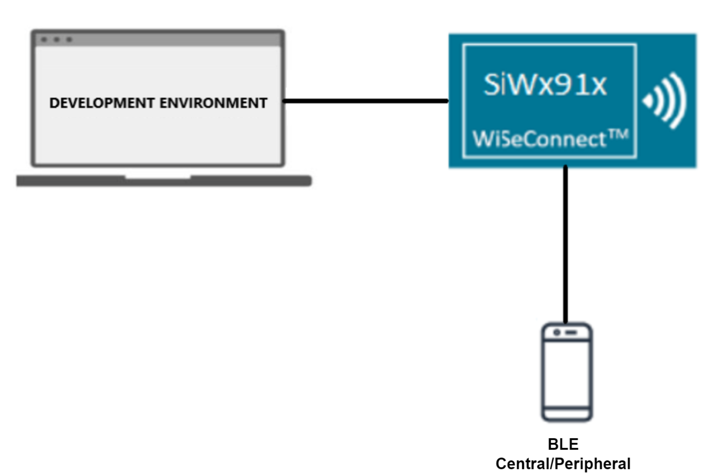

# BLE - HID On GATT

## Table of Contents

- [BLE - HID On GATT](#ble---hid-on-gatt)
  - [Table of Contents](#table-of-contents)
  - [Purpose/Scope](#purposescope)
  - [Prerequisites/Setup Requirements](#prerequisitessetup-requirements)
    - [Hardware Requirements](#hardware-requirements)
    - [Software Requirements](#software-requirements)
    - [Setup Diagram](#setup-diagram)
  - [Getting Started](#getting-started)
  - [Application Build Environment](#application-build-environment)
    - [Power save configuration](#power-save-configuration)
    - [Non-configurable Values](#non-configurable-values)
  - [Test the Application](#test-the-application)
    - [Server Role](#server-role)
    - [Client Role](#client-role)

## Purpose/Scope

This application demonstrates how to configure SiWx91x EVK as GATT a server in BLE peripheral mode and as a GATT client in BLE central mode, and provides details of how to do read, notify and indicate operations with the GATT server from connected remote device using the GATT client and details of getting GATT information from remote GATT server in case of our module as client.

HID (Human Interface Device) service GATT server configured with an HID service with notification characteristic UUID. When a connected remote device writes data to writable characteristic UUID, module receives the data which is received on writable characteristic UUID and writes the same data to readable characteristic UUID and sends notifications to the connected device (or) remote device can read the same data using read characteristic UUID if notification enabled on client side.

HID service GATT client will get HID service (primary service) , Report Map (characteristic service), and descriptors(client characteristic configuration and report reference) information from the remote GATT server. If remote device supports notify, our module will enable notify property and will be notified by the remote GATT server when value changed.

## Prerequisites/Setup Requirements

### Hardware Requirements

- Windows PC with Host interface(UART/ SPI/ SDIO).
  - SiWx91x Wi-Fi Evaluation Kit.
  - SoC Mode:
    - Silicon Labs [BRD4325A, BRD4325B, BRD4325C, BRD4325G, BRD4338A, BRD4339B, BRD4343A](https://www.silabs.com/)
    - Kits
      - SiWx917 AC1 Module Explorer Kit (BRD2708A)
  - PSRAM Mode:  
    - Silicon Labs [BRD4340A, BRD4342A, BRD4325G](https://www.silabs.com/)
  - NCP Mode:
    - Silicon Labs [BRD4180B](https://www.silabs.com/);
    - Host MCU Eval Kit. This example has been tested with:
      - Silicon Labs [WSTK + EFR32MG21](https://www.silabs.com/development-tools/wireless/efr32xg21-bluetooth-starter-kit)
    - NCP Expansion Kit with NCP Radio boards
      - (BRD4346A + BRD8045A) [SiWx917-EB4346A]
      - (BRD4357A + BRD8045A) [SiWx917-EB4357A]
  - Interface and Host MCU Supported
    - SPI - EFR32 
- BLE supported smart phone with GATT client in case of our module as GATT server.
- BLE supported smart phone with GATT Human Interface Device server  in case of our module as GATT client.

### Software Requirements

- Embedded Development Environment

### Setup Diagram


  
## Getting Started

Refer to the instructions [here](https://docs.silabs.com/wiseconnect/latest/wiseconnect-getting-started/) to:

- [Install Simplicity Studio](https://docs.silabs.com/wiseconnect/latest/wiseconnect-developers-guide-developing-for-silabs-hosts/#install-simplicity-studio)
- [Install WiSeConnect extension](https://docs.silabs.com/wiseconnect/latest/wiseconnect-developers-guide-developing-for-silabs-hosts/#install-the-wi-se-connect-extension)
- [Connect your device to the computer](https://docs.silabs.com/wiseconnect/latest/wiseconnect-developers-guide-developing-for-silabs-hosts/#connect-si-wx91x-to-computer)
- [Upgrade your connectivity firmware ](https://docs.silabs.com/wiseconnect/latest/wiseconnect-developers-guide-developing-for-silabs-hosts/#update-si-wx91x-connectivity-firmware)
- [Create a Studio project ](https://docs.silabs.com/wiseconnect/latest/wiseconnect-developers-guide-developing-for-silabs-hosts/#create-a-project)

For details on the project folder structure, see the [WiSeConnect Examples](https://docs.silabs.com/wiseconnect/latest/wiseconnect-examples/#example-folder-structure) page.

## Application Build Environment

The application can be configured to suit your requirements and development environment. Read through the following sections and make any changes needed.

- Open `app.c` file and update/modify following macros.

  - ``GATT_ROLE`` refers the role of the Silicon Labs module to be selected.

    - If user configure ``SERVER``, Silicon Labs module will act as GATT SERVER, means will add Human Interface Device service profile.

    - If user configure ``CLIENT``, Silicon Labs module will act as GATT CLIENT, means will connect to remote GATT server and get services.

    ```c
    #define GATT_ROLE                                        SERVER 
    ```

  - The following parameters are required to configure, when the SiWx91x module as a **CLIENT**

    - `RSI_BLE_REMOTE_BD_ADDRESS_TYPE` refers address type of the remote device to connect.

      ```c
      #define RSI_BLE_REMOTE_BD_ADDRESS_TYPE                   RANDOM_ADDRESS 
      ```

      Valid configurations are RANDOM_ADDRESS and PUBLIC_ADDRESS.

    - `RSI_BLE_REMOTE_BD_ADDRESS` refers address of the remote device to connect. Replace this with valid BD address.

      ```c
      #define RSI_BLE_REMOTE_BD_ADDRESS                        "F5:64:91:A2:F6:6F"
      ```

    - `RSI_REMOTE_DEVICE_NAME` refers the name of remote device to which Silicon Labs device has to connect.

      ```c
      #define RSI_REMOTE_DEVICE_NAME                           "Designer_Keyboard"
      ```

      > **Note:** User can configure either `RSI_BLE_REMOTE_BD_ADDRESS` or `RSI_REMOTE_DEVICE_NAME` of the remote device.

  - The following parameters are required to configure, when the SiWx91x module as a **SERVER**


    - `RSI_BLE_HID_SERVICE_UUID` refers to the attribute value of the newly created service.

      ```c
      #define RSI_BLE_HID_SERVICE_UUID                         0x1812 
      ```

    - `RSI_BLE_HID_PROTOCOL_MODE_UUID` refers to the attribute type of the first attribute under this above primary service.

      ```c
      #define RSI_BLE_HID_PROTOCOL_MODE_UUID                   0x2A4E
      ```

    - `RSI_BLE_HID_REPORT_UUID` refers to the attribute type of the second attribute under this above primary service.

      ```c
      #define RSI_BLE_HID_REPORT_UUID                          0x2A4D
      ```

    - `RSI_BLE_HID_REPORT_MAP_UUID` refers to the attribute type of the third attribute under this above primary service.

      ```c
      #define RSI_BLE_HID_REPORT_MAP_UUID             0x2A4B
      ```

    - `RSI_BLE_HID_INFO_UUID` refers to the attribute type of the fourth attribute under this above primary service.

      ```c
      #define RSI_BLE_HID_INFO_UUID                            0x2A4A
      ```

    - `RSI_BLE_HID_CONTROL_POINT_UUID` refers to the attribute type of the fifth attribute under this above primary service.

      ```c
      #define RSI_BLE_HID_CONTROL_POINT_UUID                   0x2A4C 
      ```

    - `RSI_BLE_APP_HIDS` refers name of the Silicon Labs device to appear during scanning by remote devices.

      ```c
      #define RSI_BLE_APP_HIDS                                 "HID_OVER_GATT" 
      ```

    > **Note:** Following are the non configurable macros related to attribute properties.

    ```c
    #define RSI_BLE_ATT_PROP_RD                              0x02
    #define RSI_BLE_ATT_PROP_WR_NO_RESP                      0x04
    #define RSI_BLE_ATT_PROP_WR                              0x08
    #define RSI_BLE_ATT_PROP_NOTIFY                          0x10
    #define RSI_BLE_ATT_PROP_INDICATE                        0x20 
    ```

### Power save configuration

  - By default, The application is configured without power save.

    ```c
    #define ENABLE_NWP_POWER_SAVE 0
    ```

  - If user wants to run the application in power save, modify the following configuration.

    ```c  
    #define ENABLE_NWP_POWER_SAVE 1 
    ```


### Non-configurable Values

- `RSI_BLE_CHAR_SERV_UUID` refers to the attribute type of the characteristics to be added in a service.

   ```c
  #define RSI_BLE_CHAR_SERV_UUID                           0x2803
  ```

- `RSI_BLE_CLIENT_CHAR_UUID` refers to the attribute type of the client characteristics descriptor to be added in a service.

    ```c
    #define RSI_BLE_CLIENT_CHAR_UUID                         0x2902
    ```

- `RSI_BLE_REPORT_REFERENCE_UUID` refers to the attribute type of the report reference descriptor to be added in a service.

    ```c
    #define RSI_BLE_REPORT_REFERENCE_UUID                    0x2908
    ```

- Open `ble_config.h` file and update/modify following macros, #define RSI_BLE_PWR_INX 8

    ```c
    #define RSI_BLE_PWR_INX                                  30
    #define RSI_BLE_PWR_SAVE_OPTIONS                         BLE_DISABLE_DUTY_CYCLING 
    ```

    > **Note:** ble_config.h files are already set with desired configuration in respective example folders user need not change for each example.

> **Note**: For recommended settings, please refer the [recommendations guide](https://docs.silabs.com/wiseconnect/latest/wiseconnect-developers-guide-prog-recommended-settings/).

## Test the Application

Refer to the instructions [here](https://docs.silabs.com/wiseconnect/latest/wiseconnect-getting-started/) to:

  - Build the application in Studio.
  - Flash, run and debug the application.

Follow the steps as mentioned for the successful execution of the application:

### Server Role

1. After the program gets executed, Silicon Labs module will be in advertising state.

2. Connect any serial console for prints.

3. Open a default bluetooth settings and do the scan.

4. In the App, Silicon Labs module will appear with the name configured in the macro **RSI_BLE_APP_HIDS (Ex: "HID_OVER_GATT")** or sometimes observed as Silicon Labs device as internal name "**SimpleBLEPeripheral**".

    

5. Initiate connection from the bluetooth settings. It automatically redirects to the pin-code entry pop-up window.

    

6. Enter the **Pin code** which is displayed in the serial terminal.

7. While connection, smart phone will do service discovery and it will find the HID service with UUID **RSI_BLE_HID_SERVICE_UUID.** After that it will read report map and enables the notification.

8. After successful connection, open note pad or any text editor in phone, you can see some text printing.

    

9. By default, the application is sending some text (i.e., "hog") in regular intervals, which will come as a notification to a smart phone. Use notepad or chrome to observe the received data.

    

### Client Role

1. Advertise a LE device which supports Human Interface Device service.

2. After the program gets executed, Silicon Labs module will connect to that remote device based on given BD address.

3. After successful connection Silicon Labs module will read the services from the remote GATT server.

4. If remote device support notify property Silicon Labs module will enable notify, and ready to receive notifications from remote device.

5. Whenever GATT server changes value and notifies that Silicon Labs module will receive that value.

Refer the following images for console prints:

  

  

  

  

  
