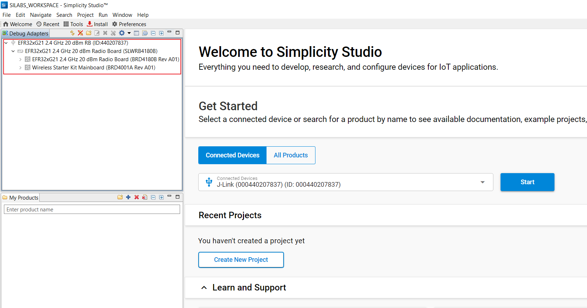

# HID on GATT

## 1. Purpose / Scope

This application demonstrates how to configure SiWx91x EVK as GATT server in BLE peripheral mode and as GATT client in BLE central mode, and provides details of how to do read, notify and indicate operations with GATT server from connected remote device using GATT client and details of getting GATT information from remote GATT server in case of our module as client.

HID (Human Interface Device) Service GATT server configures with HID service with notification characteristic UUID. When connected remote device writes data to writable characteristic UUID, module receives the data which is received on writable characteristic UUID and writes the same data to readable characteristic UUID and sends notifications to the connected device (or) remote device can read the same data using read characteristic UUID if notification enabled on client side.

HID Service GATT client will get HID service (primary service) , Report Map (characteristic service), and descriptors(client characteristic configuration and report reference) information from the remote GATT server. If remote device supports notify, our module will enable notify property and will be notified by the remote GATT server when value changed.

## 2. Prerequisites / Setup Requirements

Before running the application, the user will need the following things to setup.

### 2.1 Hardware Requirements

- Windows PC with Host interface(UART/ SPI/ SDIO).
  - SiWx91x Wi-Fi Evaluation Kit. The SiWx91x supports multiple operating modes. See [Operating Modes]() for details.
  - **SoC Mode**:
    - Silicon Labs [BRD4325A, BRD4325B, BRD4325C, BRD4325G, BRD4338A](https://www.silabs.com/)
  - **NCP Mode**:
    - Silicon Labs [BRD4180B](https://www.silabs.com/);
    - Host MCU Eval Kit. This example has been tested with:
      - Silicon Labs [WSTK + EFR32MG21](https://www.silabs.com/development-tools/wireless/efr32xg21-bluetooth-starter-kit)

- BLE supported Smart phone with GATT client in case of our module as GATT server
- BLE supported Smart phone with GATT Human Interface Device server  in case of our module as GATT client

### 2.2 Software Requirements

- Embedded Development Environment

  - For Silicon Labs EFx32, use the latest version of [Simplicity Studio](https://www.silabs.com/developers/simplicity-studio)- Download and install the Silicon Labs [EFR Connect App](https://www.silabs.com/developers/efr-connect-mobile-app) in the android smart phones for testing BLE applications. Users can also use their choice of BLE apps available in Android/iOS smart phones.
  
  - [EFR connect Mobile APP](https://www.silabs.com/developers/efr-connect-mobile-app)

### 2.3 Setup Diagram
 
**SoC Mode :** 


  
**NCP Mode :**


   **NOTE**: The Host MCU platform (EFR32xG21) and the SiWx91x interact with each other through the SPI interface. 
   
Follow the [Getting Started with Wiseconnect3 SDK](https://docs.silabs.com/wiseconnect/latest/wiseconnect-getting-started/) guide to set up the hardware connections and Simplicity Studio IDE.

## 3 Project Environment

- Ensure the SiWx91x loaded with the latest firmware following the [Upgrade Si91x firmware](https://docs.silabs.com/wiseconnect/latest/wiseconnect-getting-started/getting-started-with-soc-mode#upgrade-si-wx91x-connectivity-firmware)

- Ensure the latest Gecko SDK along with the extension WiSeConnect3 is added to Simplicity Studio.

### 3.1 Creating the project

#### 3.1.1 SoC mode

- Ensure the SiWx91x set up is connected to your PC.

- In the Simplicity Studio IDE, the SiWx91x SoC board will be detected under **Debug Adapters** pane as shown below.

  ****

#### 3.1.2 NCP mode

- Ensure the EFx32 and SiWx91x set up is connected to your PC.

- In the Simplicity Studio IDE, the EFR32 board will be detected under **Debug Adapters** pane as shown below.

  ****

### 3.2 Importing the project

- Studio should detect your board. Your board will be shown here. Click on the board detected and go to **EXAMPLE PROJECTS & DEMOS** section 

#### SOC Mode

- Select **BLE - HID On GATT** test application

  ****

- Click 'Create'. The "New Project Wizard" window appears. Click 'Finish'

  ****

### 3.3 Set up for application prints

#### 3.3.1 Teraterm set up - for BRD4325A, BRD4325B, BRD4325C, BRD4325G

You can use either of the below USB to UART converters for application prints.

1. Set up using USB to UART converter board.

   - Connect Tx (Pin-6) to P27 on WSTK
   - Connect GND (Pin 8 or 10) to GND on WSTK

   ****

2. Set up using USB to UART converter cable.

   - Connect RX (Pin 5) of TTL convertor to P27 on WSTK
   - Connect GND (Pin1) of TTL convertor to GND on WSTK

   ****

3. Open the Teraterm tool.

   - For SoC mode, choose the serial port to which USB to UART converter is connected and click on **OK**.

     ****

**Note:** For Other 917 SoC boards please refer section #3.3.2

#### 3.3.2 **Teraterm set up - for NCP and SoC modes**

1. Open the Teraterm tool.

- choose the J-Link port and click on **OK**.
    
    ****

2. Navigate to the Setup → Serial port and update the baud rate to **115200** and click on **OK**.

    ****

    ****

## 4 Application Build Environment

### 4.1 Application Configuration Parameters

The application can be configured to suit your requirements and development environment. Read through the following sections and make any changes needed.

**4.1.1** In the Project explorer pane of the IDE, expand the **ble_hid_on_gatt** folder and open the **app.c** file. 
	****
	
**4.1.2** `RSI_BLE_APP_HIDS` refers to the local device name

   ```c
      #define RSI_BLE_APP_HIDS "HID_OVER_GATT"
   ```
   
**4.1.3** `GATT_ROLE` refers to the role of the Silicon Labs module to be selected,Valid configurations are SERVER and CLIENT.
   - If user configure SERVER, Silicon Labs module will act as GATT SERVER, means will add Human Interface Device service profile.

   - If user configure CLIENT, Silicon Labs module will act as GATT CLIENT, means will connect to remote GATT server and get services
   
      ```c
      #define GATT_ROLE                                        SERVER 
      ```	

**4.1.4 BLE HID application as a CLIENT**

   ```c
   //RSI_BLE_REMOTE_BD_ADDRESS_TYPE refers address type of the remote device to connect.
   #define RSI_BLE_REMOTE_BD_ADDRESS_TYPE                   RANDOM_ADDRESS

   //RSI_BLE_REMOTE_BD_ADDRESS refers address of the remote device to connect. Replace this with valid BD address.
   #define RSI_BLE_REMOTE_BD_ADDRESS                        "04:D4:C4:9A:F3:CC"

   //RSI_REMOTE_DEVICE_NAME refers the name of remote device to which Silicon Labs device has to connect
   #define RSI_REMOTE_DEVICE_NAME                           "SILABS_DEV"
   ```
   **Note:** User can ccd onfigure either RSI_BLE_REMOTE_BD_ADDRESS or RSI_REMOTE_DEVICE_NAME of the remote device.

**4.1.5 BLE-HID appication as a SERVER**

   ```c
   //RSI_BLE_HID_SERVICE_UUID refers to the attribute value of the newly created service.
   #define RSI_BLE_HID_SERVICE_UUID                         0x1812

   //RSI_BLE_HID_PROTOCOL_MODE_UUID refers to the attribute type of the first attribute under this above primary service.
   #define RSI_BLE_HID_PROTOCOL_MODE_UUID                   0x2A4E

   //RSI_BLE_HID_REPORT_UUID refers to the attribute type of the second attribute under this above primary service.
   #define RSI_BLE_HID_REPORT_UUID                          0x2A4D

   // RSI_BLE_HID_INFO_UUID refers to the attribute type of the fourth attribute under this above primary service.
   #define RSI_BLE_HID_INFO_UUID                            0x2A4A
   
   // RSI_BLE_HID_CONTROL_POINT_UUID refers to the attribute type of the fifth attribute under this above primary service.
   #define RSI_BLE_HID_CONTROL_POINT_UUID                   0x2A4C

   //RSI_BLE_CHAR_SERV_UUID refers to the attribute type of the characteristics to be added in a service.
   #define RSI_BLE_CHAR_SERV_UUID                           0x2803
   
   //RSI_BLE_CLIENT_CHAR_UUID refers to the attribute type of the client characteristics descriptor to be added in a service.
   #define RSI_BLE_CLIENT_CHAR_UUID                         0x2902

   //RSI_BLE_REPORT_REFERENCE_UUID refers to the attribute type of the report reference descriptor to be added in a service.
   #define RSI_BLE_REPORT_REFERENCE_UUID                    0x2908  
   ```

**4.1.6**  Open `ble_config.h`and `app.c` file and update the below parameters.    


- **SMP Configurations**

   ```c
   //RSI_BLE_SMP_IO_CAPABILITY refers the IO capability of Silicon Labs device for SMP
   #define RSI_BLE_SMP_IO_CAPABILITY                        0x01

   //RSI_BLE_SMP_PASSKEY is smp passkey key from Silicon Labs device
   #define RSI_BLE_SMP_PASSKEY                              0
   ```
 
- **Opermode command parameters**
  This configuration can be found in app.c as `config`	

- **BLE ATTRIBUTE PROPERTIES**

   ```c
   #define RSI_BLE_ATT_PROP_RD                              0x02
   #define RSI_BLE_ATT_PROP_WR_NO_RESP                      0x04
   #define RSI_BLE_ATT_PROP_WR                              0x08
   #define RSI_BLE_ATT_PROP_NOTIFY                          0x10
   #define RSI_BLE_ATT_PROP_INDICATE                        0x20 
   ```
   **Note:** `ble_config.h` and `app.c` files are already set with desired configuration in respective example folders you need not change for each example.
   
### 4.2 Build the Application

- Follow the below steps for the successful execution of the application.

#### Build Project - SoC Mode

- Once the project is created, click on the build icon (hammer) to build the project (or) right click on project and click on Build Project.

   

- Successful build output will show as below.

#### Build Project - NCP Mode

   

## 5. Test the Application

- Follow the below steps for the successful execution of the application.

### 5.1 Load the SiWx91x Firmware

Refer [Getting started with PC](https://docs.silabs.com/rs9116/latest/wiseconnect-getting-started) to load the firmware into SiWx91x EVK. The firmware binary is located in `<SDK>/firmware/`

### 5.2 Load the Application Image

1. Click on Tools and Simplicity Commander as shown below.

   

2. Load the application image

- Select the board.
- Browse the application image (.hex) and click on Flash button.

   

### 5.3 Application Execution Flow
Application has the feasibility to configure the HID GATT server (or) GATT client.     
**Note:**      
- The provided mobile screenshots are from the 2.5.2 version of the EFR Connect app, it is recommended to use the latest version.

**5.3.1 BLE HID OVER GATT application as a SERVER**

1. After the program gets executed, Silicon Labs module will be in Advertising state.

2. Connect any serial console for prints.

3. Open a default Bluetooth settings and do the scan.

4. In the App, Silicon Labs module will appear with the name configured in the macro **RSI_BLE_APP_HIDS (Ex: "HID_OVER_GATT")** or sometimes observed as Silicon Labs device as internal name "**SimpleBLEPeripheral**".


5. Initiate connection from the Bluetooth settings. It automatically redirects to the pin-code entry pop-up window.


6. Enter the **Pin code** which is displayed in the serial terminal.

7. While connection, smart phone will do service discovery and it will find the HID service with UUID **RSI_BLE_HID_SERVICE_UUID.** After that it will read report map and enables the notification.

8. After successful connection, open note pad or any text editor in phone, you can see some text printing.


9. By default, the application is sending some text (i.e., "hog") in regular intervals, which will come as a notification to a smart phone. Use Notepad or Chrome to observe the received data.


**5.3.2 BLE HID OVER GATT application as a CLIENT**

1. Advertise a LE device which supports Human Interface Device Service.

2. After the program gets executed, Silicon Labs module will connect to that remote device based on given BD address.

3. After successful connection Silicon Labs module will read the services from the remote GATT server.

4. If remote device support notify property Silicon Labs module will enable notify, and ready to receive notifications from remote device.

5. Whenever GATT server changes value and notifies that Silicon Labs module will receive that value.

## 6. Application Output

Refer the below images for console prints


