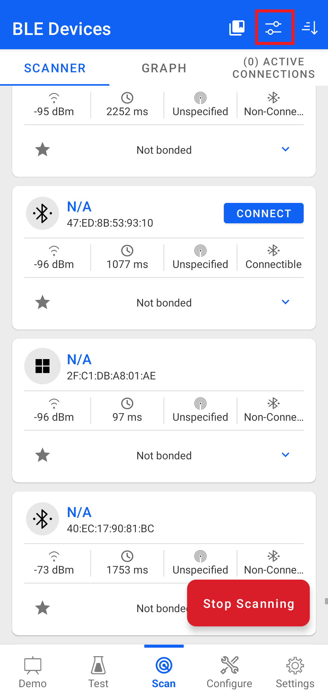
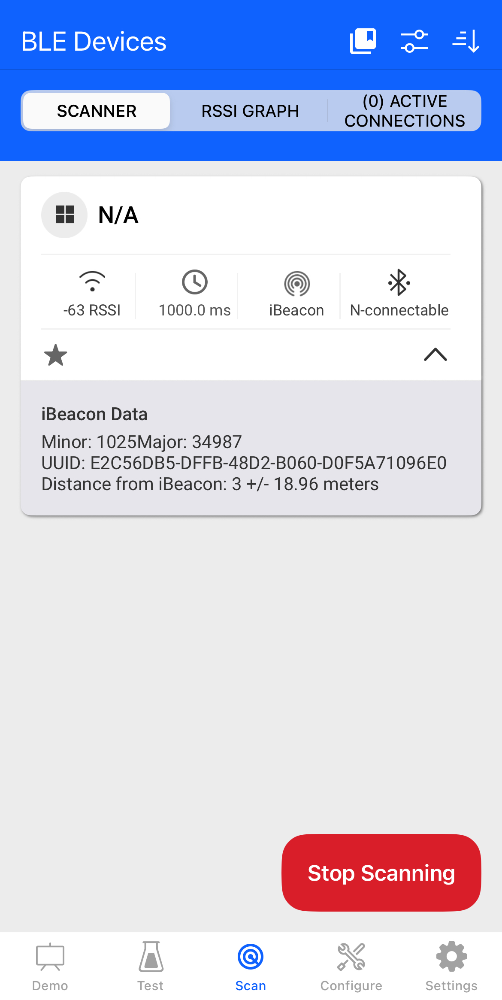

#BLE - iBeacon

##Table of Contents

    - [BLE - iBeacon](#ble-- - ibeacon) - [Table of Contents](#table - of - contents) - [Purpose / Scope](#purposescope)
    - [iBeacon Overview](#ibeacon - overview) - [Prerequisites / Setup Requirements](#prerequisitessetup - requirements)
    - [Hardware Requirements](#hardware - requirements) - [Software Requirements](#software - requirements)
    - [Setup Diagram](#setup - diagram) - [Getting Started](#getting - started)
    - [Application Build Environment](#application - build - environment)
    - [Test the Application](#test - the - application)

          ##Purpose
        / Scope

          This application demonstrates how to set the iBeacon data format in advertising parameters in BLE
          peripheral mode.

          ##iBeacon Overview

          The iBeacon advertise data format is as follows :

  | iBeacon prefix | UUID | Major Number | Minor | Number | TX Power |
  | -- -- -- | -- - | -- -- -- | -- -- -- | -- -- -- | -- -- -- | | 1 | 9Bytes | 16bytes | 2Bytes | 2 Bytes | 1bytes |

  -iBeacon Prefix : Vendor specific fixed value.Default iBeacon prefix values setting by application is :
   ``Prefix = { 0x02, 0x01, 0x02, 0x1A, 0xFF, 0x4C, 0x00, 0x02, 0x15 }``

               - UUID : -User generated proximity UUID.
               - Remote devices recognize which beacon they approach on the basis of UUID,
    major and minor numbers.- Default UUID,
    Major and Minor values setting by application is
    : - ``UUID = { 0xE2, 0xC5, 0x6D, 0xB5, 0xDF, 0xFB, 0x48, 0xD2, 0xB0, 0x60, 0xD0, 0xF5, 0xA7, 0x10, 0x96, 0xE0 }``
                 - ``major_num = { 0x88, 0xAB }`` - ``minor_num = { 0x04, 0x01 }``

                                                                  - TX Power is used to calculate distance from iBeacon
                                                                      .Default TX power value setting by application is
    :
   `TX Power = 0x33`
                > **Note : ** > -The iBeacon UUID "E2C56DB5-DFFB-48D2-B060-D0F5A71096E0" is specific to Silicon Labs.
                > -If the user wants to change the prefix,
    UUID, Major number, Minor number and TX Power values,
    change the following values in app.c file.>> **For Prefix
    : ** >> uint8_t adv[31]            = { 0x02, 0x01, 0x02, 0x1A, 0xFF, 0x4C, 0x00, 0x02, 0x15 }; //prefix(9bytes)
>> **For UUID : ** >> uint8_t uuid[16] = { 0xE2, 0xC5, 0x6D, 0xB5, 0xDF, 0xFB, 0x48, 0xD2,
                                           0xB0, 0x60, 0xD0, 0xF5, 0xA7, 0x10, 0x96, 0xE0 };
>> **For Major Number : ** >> uint8_t major_num[2] = { 0x88, 0xAB };
>> **For Minor Number : ** > uint8_t minor_num[2]  = { 0x04, 0x01 };
>> **For TX Power : ** > uint8_t tx_power          = 0xD7;

## Prerequisites/Setup Requirements

### Hardware Requirements

- Windows PC with Host interface(UART/ SPI/ SDIO).
- SiWx91x Wi-Fi Evaluation Kit. The SiWx91x supports multiple operating modes. See [Operating Modes]() for details.
- **SoC Mode**:
  - Standalone
    - BRD4002A Wireless pro kit mainboard [SI-MB4002A]
    - Radio Boards 
  	  - BRD4338A [SiWx917-RB4338A]
      - BRD4339B [SiWx917-RB4339B]
  	  - BRD4340A [SiWx917-RB4340A]
      - BRD4343A [SiWx917-RB4343A]
  - Kits
  	- SiWx917 Pro Kit [Si917-PK6031A](https://www.silabs.com/development-tools/wireless/wi-fi/siwx917-pro-kit?tab=overview)
  	- SiWx917 Pro Kit [Si917-PK6032A]
    - SiWx917 AC1 Module Explorer Kit (BRD2708A)
- **PSRAM Mode**:
  - Standalone
    - BRD4002A Wireless pro kit mainboard [SI-MB4002A]  
    - Radio Boards [BRD4340A, BRD4342A, BRD4325G]  	
- **NCP Mode**:
  - Standalone
    - BRD4002A Wireless pro kit mainboard [SI-MB4002A]
    - EFR32xG24 Wireless 2.4 GHz +10 dBm Radio Board [xG24-RB4186C](https://www.silabs.com/development-tools/wireless/xg24-rb4186c-efr32xg24-wireless-gecko-radio-board?tab=overview)
    - NCP Expansion Kit with NCP Radio boards
      - (BRD4346A + BRD8045A) [SiWx917-EB4346A]
      - (BRD4357A + BRD8045A) [SiWx917-EB4357A]
  - Kits
  	- EFR32xG24 Pro Kit +10 dBm [xG24-PK6009A](https://www.silabs.com/development-tools/wireless/efr32xg24-pro-kit-10-dbm?tab=overview)
  - Interface and Host MCU Supported
    - SPI - EFR32 

- Smart phone with Simplicity Connect App(formerly EFR Connect App) mobile app

### Software Requirements

- Simplicity Studio
- Smartphone configured as BLE Peripheral

- Download and install the Silicon Labs [Simplicity Connect App(formerly EFR Connect App) or other BLE Central/Peripheral app.](https://www.silabs.com/developers/simplicity-connect-mobile-app ) in the android smart phones for testing BLE applications. Users can also use their choice of BLE apps available in Android/iOS smart phones.

> **Note:** The provided mobile screenshots are from the 2.8.1 version of the Simplicity Connect App(formerly EFR Connect App), it is recommended to use the latest version.

### Setup Diagram


  
## Getting Started

Refer to the instructions [here](https://docs.silabs.com/wiseconnect/latest/wiseconnect-getting-started/) to:

- [Install Simplicity Studio](https://docs.silabs.com/wiseconnect/latest/wiseconnect-developers-guide-developing-for-silabs-hosts/#install-simplicity-studio)
- [Install WiSeConnect extension](https://docs.silabs.com/wiseconnect/latest/wiseconnect-developers-guide-developing-for-silabs-hosts/#install-the-wi-se-connect-extension)
- [Connect your device to the computer](https://docs.silabs.com/wiseconnect/latest/wiseconnect-developers-guide-developing-for-silabs-hosts/#connect-si-wx91x-to-computer)
- [Upgrade your connectivity firmware ](https://docs.silabs.com/wiseconnect/latest/wiseconnect-developers-guide-developing-for-silabs-hosts/#update-si-wx91x-connectivity-firmware)
- [Create a Studio project ](https://docs.silabs.com/wiseconnect/latest/wiseconnect-developers-guide-developing-for-silabs-hosts/#create-a-project)

For details on the project folder structure, see the [WiSeConnect Examples](https://docs.silabs.com/wiseconnect/latest/wiseconnect-examples/#example-folder-structure) page.

## Application Build Environment

The application can be configured to suit your requirements and development environment. Read through the following sections and make any changes needed.

- Open `app.c` file and update/modify following macros:

  - `RSI_BLE_LOCAL_NAME` refers name of the Silicon Labs device to appear during scanning by remote devices.

     ```c
#define RSI_BLE_LOCAL_NAME "iBeacon"
    ```

  - Following are the event numbers for connection and Disconnection events,

    ```c
#define RSI_APP_EVENT_CONNECTED    1
#define RSI_APP_EVENT_DISCONNECTED 2
    ```

- Following are the **non-configurable** macros in the application.

  - BT_GLOBAL_BUFF_LEN refers Number of bytes required by the application and the driver

    ```c
#define BT_GLOBAL_BUFF_LEN 15000
    ```

- Open `ble_config.h` file and update/modify following macros,

  ```c
#define RSI_BLE_PWR_INX          30
#define RSI_BLE_PWR_SAVE_OPTIONS BLE_DISABLE_DUTY_CYCLING
  ```  

  > **Note:** `rsi_ble_config.h` files are already set with desired configuration in respective example folders user need not change for each example.

> **Note**: For recommended settings, please refer the [recommendations guide](https://docs.silabs.com/wiseconnect/latest/wiseconnect-developers-guide-prog-recommended-settings/).

## Test the Application

Refer to the instructions [here](https://docs.silabs.com/wiseconnect/latest/wiseconnect-getting-started/) to:

- Build the application in Studio.
- Flash, run and debug the application.

Follow the steps for the successful execution of the program:

1. After the program gets executed, Silicon Labs module would be in advertising state.

2. Connect any serial console for prints.

3. Open Simplicity Connect App(formerly EFR Connect App) connect mobile app in the smartphone and do scan.



4. Filter the ibeacon devices in filter settings


5. In the Simplicity Connect App (formerly EFR Connect App), the Silicon Labs module appears as an iBeacon packet during scanning. Upon successful detection, the app displays the advertised data from the device, including UUID, Maximum Number, Minimum Number, and TX Power.



6. Refer the following images for console prints:

    
