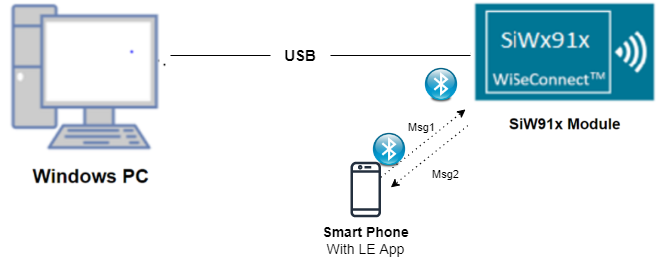
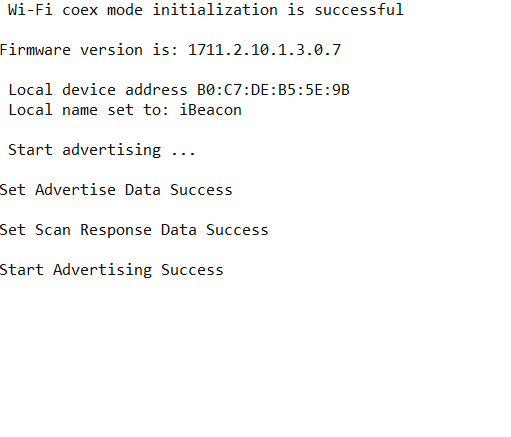

# iBeacon

## 1. Purpose / Scope

This application demonstrates how to set the iBeacon data format in advertising parameters in  BLE peripheral mode.

## 2. Prerequisites / Setup Requirements

Before running the application, the user will need the following things to setup.

### 2.1 Hardware Requirements

- Windows PC with Host interface(UART/ SPI/ SDIO).
  - SiWx91x Wi-Fi Evaluation Kit. The SiWx91x supports multiple operating modes. See [Operating Modes]() for details.
  - **SoC Mode**:
    - Silicon Labs [BRD4325A, BRD4325B, BRD4325C, BRD4325G, BRD4338A](https://www.silabs.com/)
  - **NCP Mode**:
    - Silicon Labs [BRD4180B](https://www.silabs.com/);
    - Host MCU Eval Kit. This example has been tested with:
      - Silicon Labs [WSTK + EFR32MG21](https://www.silabs.com/development-tools/wireless/efr32xg21-bluetooth-starter-kit)

- Smart phone with ibeacon detector application

### 2.2 Software Requirements

- **SoC Mode**
  - **Silicon Labs SiWx91x SoC**. Follow the [Getting Started with SiWx91x SoC](https://docs.silabs.com/) to setup the example to work with SiWx91x SoC and Simplicity Studio.
- **NCP Mode**
  - **Silicon Labs EFx32 Host**. Follow the [Getting Started with EFx32](https://docs.silabs.com/rs9116-wiseconnect/latest/wifibt-wc-getting-started-with-efx32/) to setup the example to work with EFx32 and Simplicity Studio.

### 2.3 Setup Diagram

**SoC Mode :**


  
**NCP Mode :**  


### 2.4 iBeacon details

**iBeacon Advertise Data Format**

  iBeacon prefix   UUID        Major Number   Minor Number    TX Power
  9Bytes           16bytes     2Bytes         2 Bytes         1bytes

   **iBeacon Prefix:**
   Vendor specific fixed value.
   Default iBeacon prefix values setting by application is,
   Prefix = {0x02, 0x01, 0x02, 0x1A, 0xFF, 0x4C, 0x00, 0x02, 0x15}

   **UUID:**
   User generated proximity UUID.
   Remote devices recognize which beacon they approach on the basis of UUID, major and minor numbers.
   Default UUID, Major and Minor values setting by application is,
   UUID = {0xFB , 0x0B , 0x57 , 0xA2 , 0x82 , 0x28 , 0x44 , 0xCD , 0x91 ,
   0x3A , 0x94 , 0xA1 , 0x22 , 0xBA , 0x12 , 0x06}
   major_num = {0x11, 0x22}
   minor_num = {0x33, 0x44}

   **TX Power** is used to calculate distance from iBeacon.
   Default TX power value setting by application is,
   TX Power = 0x33

  Note:
  If the user wants to change the prefix, UUID, Major number, Minor number and TX Power values, change the following values in rsi_ble_ibeacon.c_ file.

   For Prefix:
   `<span style="color: #005032">uint8_t</span> adv[31] = {0x02, 0x01, 0x02, 0x1A, 0xFF, 0x4C, 0x00, 0x02, 0x15}; //prefix(9bytes)`

   **For UUID:**

   uint8_t uuid[16] = {0xFB , 0x0B , 0x57 , 0xA2 , 0x82 , 0x28 , 0x44 , 0xCD , 0x91 , 0x3A , 0x94 , 0xA1 , 0x22 , 0xBA , 0x12 , 0x06};

- For Major Number:
  - uint8_t major_num[2] = {0x11, 0x22};

- For Minor Number:
  - uint8_t minor_num[2] = {0x33, 0x44};

- For TX Power:
  - uint8_t tx_power = 0x33;

## 3 Project Environment

- Ensure the SiWx91x loaded with the latest firmware following the [Upgrade Si91x firmware](https://docs.silabs.com/wiseconnect/latest/wiseconnect-getting-started/getting-started-with-soc-mode#upgrade-si-wx91x-connectivity-firmware)

- Ensure the latest Gecko SDK along with the extension WiSeConnect3 is added to Simplicity Studio.

### 3.1 Creating the project

#### 3.1.1 SoC mode

- Ensure the SiWx91x set up is connected to your PC.

- In the Simplicity Studio IDE, the SiWx91x SoC board will be detected under **Debug Adapters** pane as shown below.

  ****

#### 3.1.2 NCP mode

- Ensure the EFx32 and SiWx91x set up is connected to your PC.

- In the Simplicity Studio IDE, the EFR32 board will be detected under **Debug Adapters** pane as shown below.

  ****

### 3.2 Importing the project

- Studio should detect your board. Your board will be shown here. Click on the board detected and go to **EXAMPLE PROJECTS & DEMOS** section 

#### SOC Mode

- Select **BLE - iBeacon** test application

  ****

- Click 'Create'. The "New Project Wizard" window appears. Click 'Finish'

  ****

### 3.3 Set up for application prints

#### 3.3.1 Teraterm set up - for BRD4325A, BRD4325B, BRD4325C, BRD4325G

You can use either of the below USB to UART converters for application prints.

1. Set up using USB to UART converter board.

   - Connect Tx (Pin-6) to P27 on WSTK
   - Connect GND (Pin 8 or 10) to GND on WSTK

   ****

2. Set up using USB to UART converter cable.

   - Connect RX (Pin 5) of TTL convertor to P27 on WSTK
   - Connect GND (Pin1) of TTL convertor to GND on WSTK

   ****

3. Open the Teraterm tool.

   - For SoC mode, choose the serial port to which USB to UART converter is connected and click on **OK**.

     ****

**Note:** For Other 917 SoC boards please refer section #3.3.2

#### 3.3.2 **Teraterm set up - for NCP and SoC modes**

1. Open the Teraterm tool.

- choose the J-Link port and click on **OK**.
    
    ****

2. Navigate to the Setup → Serial port and update the baud rate to **115200** and click on **OK**.

    ****

    ****

## 4. Application Build Environment

The application can be configured to suit your requirements and development environment. Read through the following sections and make any changes needed.

### 4.1 Application Configuration Parameters

The application can be configured to suit your requirements and development environment. Read through the following sections and make any changes needed.

**4.1** Open `ble_ibeacon.c` file and update/modify following macros:

- `RSI_BLE_LOCAL_NAME` refers name of the Silicon Labs device to appear during scanning by remote devices.

```c
  #define RSI_BLE_LOCAL_NAME                     "ibeacon"```
- Following are the event numbers for connection and Disconnection events,
```c
  #define RSI_APP_EVENT_CONNECTED                1
  #define RSI_APP_EVENT_DISCONNECTED             2```
- Following are the **non-configurable** macros in the application.
   - BT_GLOBAL_BUFF_LEN refers Number of bytes required by the application and the driver
```c
  #define BT_GLOBAL_BUFF_LEN                     15000
```

**4.2** Open `ble_config.h` file and update/modify following macros,

```c
  #define RSI_BLE_PWR_INX                        30
  #define RSI_BLE_PWR_SAVE_OPTIONS               0
```  

**Note:**
   rsi_ble_config.h files are already set with desired configuration in respective example folders user need not change for each example.

## 5. Build and Test the Application

- Follow the below steps for the successful execution of the application.

### 5.1 Build the Application

- Follow the below steps for the successful execution of the application.

#### SoC Mode

- Once the project is created, click on the build icon (hammer) to build the project (or) right click on project and click on Build Project.

   

- Successful build output will show as below.

#### NCP Mode

   

- Successful build output will show as below.

### 5.2 Loading the Application Image

1. Click on Tools and Simplicity Commander as shown below.

   

2. Load the firmware image

- Select the board. 
- Browse the application image (.hex) and click on Flash button.

   

### 5.3 Running the SiWx91x Application

1. After the program gets executed, Silicon Labs module would be in Advertising state.

2. Connect any serial console for prints.

3. Open iBeaconDetector app in the Smartphone and do Scan.

4. In the App, Silicon Labs module device would appear with the name configured in the macro **RSI\_BLE\_LOCAL\_NAME** (Ex: "ibeacon") or sometimes observed as "SimpleBLEPeripheral".

5. After successful scan, user can see the Silicon Labs device advertised data i.e UUID, Maximum Number, Minimum Number and TX Power in iBeaconDetector application.  

6. Refer the below images for console prints

## 7. Observing the output prints on serial terminal

   
