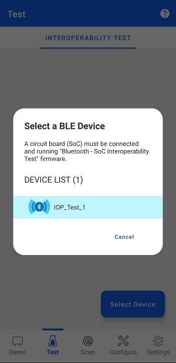
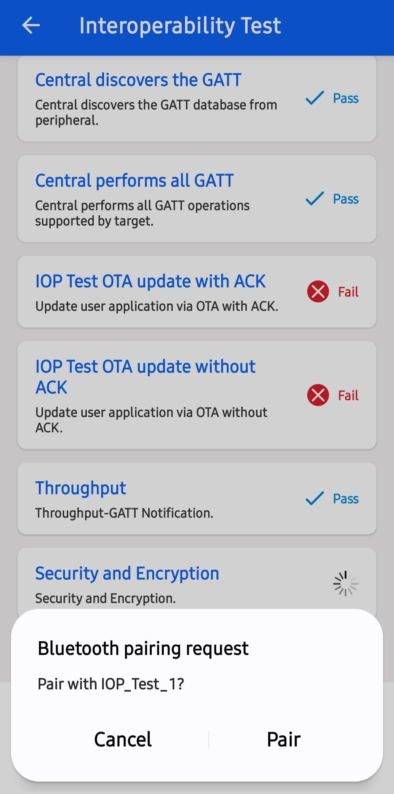

# BLE Interoperability Test App
  
## Table of Contents

- [BLE Interoperability Test App](#ble-interoperability-test-app)
	- [Table of Contents](#table-of-contents)
	- [Purpose/Scope](#purposescope)
	- [Prerequisites/Setup Requirements](#prerequisitessetup-requirements)
		- [Hardware Requirements](#hardware-requirements)
		- [Software Requirements](#software-requirements)
		- [Setup Diagram](#setup-diagram)
	- [Getting Started](#getting-started)
	- [Application Build Environment](#application-build-environment)
	- [Test the Application](#test-the-application)
	- [Logging and Sharing data](#logging-and-sharing-data)
		- [Programming the Radio Board](#programming-the-radio-board)
		- [Limitation](#limitation)

## Purpose/Scope

Interoperability(IOP) is a fundamental aspect of Bluetooth Low Energy (BLE), ensuring seamless communication between Bluetooth-enabled devices from different manufacturers. This project provides a comprehensive framework for testing IOP using Silicon Labs' test setup, which includes hardware kits, embedded software, and a mobile application.

The objective of this framework is to verify the interoperability of the SiWG917 family of SoCs with a wide range of Bluetooth-enabled devices, particularly smartphones. Given the vast diversity in smartphone hardware, Bluetooth firmware, and mobile operating systems, IOP testing is crucial to ensuring reliable connectivity.

This document outlines the requirements, setup process, test execution, and data collection methods for performing IOP testing. The results of these tests help in analyzing compatibility, identifying potential issues, and improving Bluetooth performance across different devices.


## Prerequisites/Setup Requirements

### Hardware Requirements

- Silicon Labs Bluetooth Development Kit:
	- Android/iOS phone that supports BLE can be used for IOP testing.
	
- Test Hardware:
	- SiWG917 SoC Family Development Kits:
		-   SOC Expansion Kits with SOC Radio Boards:
			- (BRD4338A + BRD4002A)
	- BLE Smartphone
			
### Software Requirements

- Development Environment:

    - Install Simplicity Studio 5 and WiseConnect SDK 3.0, which are part of the SiSDK.
    - Refer to the Simplicity Studio 5 documentation for installation instructions.

- Mobile App Requirements:

    - Install the Simplicity Connect Mobile App (v2.4 or newer) for Android or iOS.
    - The app source code is available on GitHub for further customization.
    - Alternative BLE apps available on Android/iOS can also be used.

- Device Bonding Considerations:

    - Before running IOP tests, ensure that no existing bond exists between the embedded device and the smartphone.
    - If bonded, remove the bond via the smartphone’s Bluetooth settings before initiating the test.
> **Note:** The provided mobile screenshots are from the 3.0.1 version of the Simplicity Connect App(formerly EFR Connect App), it is recommended to use the latest version.

### Setup Diagram


## Getting Started

Refer to the instructions [here](https://docs.silabs.com/wiseconnect/latest/wiseconnect-getting-started/) to:

- [Install Simplicity Studio](https://docs.silabs.com/wiseconnect/latest/wiseconnect-developers-guide-developing-for-silabs-hosts/#install-simplicity-studio)
- [Install WiSeConnect 3 extension](https://docs.silabs.com/wiseconnect/latest/wiseconnect-developers-guide-developing-for-silabs-hosts/#install-the-wi-se-connect-3-extension)
- [Connect your device to the computer](https://docs.silabs.com/wiseconnect/latest/wiseconnect-developers-guide-developing-for-silabs-hosts/#connect-si-wx91x-to-computer)
- [Upgrade your connectivity firmware ](https://docs.silabs.com/wiseconnect/latest/wiseconnect-developers-guide-developing-for-silabs-hosts/#update-si-wx91x-connectivity-firmware)
- [Create a Studio project ](https://docs.silabs.com/wiseconnect/latest/wiseconnect-developers-guide-developing-for-silabs-hosts/#create-a-project)

For details on the project folder structure, see the [WiSeConnect Examples](https://docs.silabs.com/wiseconnect/latest/wiseconnect-examples/#example-folder-structure) page.

## Application Build Environment

The application can be configured to suit your requirements and development environment. Read through the following sections and make any changes needed.

1. Open **ble_iop.h** file and update/modify following macro:

	- RSI_REMOTE_DEVICE_NAME refers the name of remote device to which theSilicon Labs device has to connect.

     ```c
		#define RSI_BLE_DEVICE_NAME 				(void *)"IOP_Test_1"
	 ```

> **Note**: For recommended settings, see the [recommendations guide](https://docs.silabs.com/wiseconnect/latest/wiseconnect-developers-guide-prog-recommended-settings/).

## Test the Application

Refer to the instructions [here](https://docs.silabs.com/wiseconnect/latest/wiseconnect-getting-started/) to:

- Build the application in Studio.
- Flash, run and debug the application.

Follow the steps below for successful execution of the application:

### Bringing up the Test Environment

Flash the IOP Test Application to the 917 board.
	


### Running the IOP Test on Si Connect App

1. On your smartphone, launch the Si Connect App.

2. Click on the "Test" tab at the bottom of the screen.

	

3. The Test tab displays a list of boards running the IOP Test Firmware.
	
	

4. Select the name of the IOP application flashed to the 917 board.

5. The app will navigate to the "IOP View", where you can click on "Run Test" to start the IOP test sequence.

    

### Running the IOP Test

1. Once the IOP test sequence starts, the mobile app will execute test cases and indicate Pass/Fail when completed.

   

2. The execution of the test cases will proceed as follows:

    - **Scan** tab: Scans for nearby BLE devices running the IOP Test Firmware.

    - **Connect** tab: Connects to the selected BLE device for further operations.

    - **GATT Discovery** tab: Discovers all GATT services and characteristics on   the connected device.

    - **GATT Operations** tab: Performs all GATT operations, such as read, write, and notifications.

    - **IOP Test OTA Update with ACK**: Becasue OTA is not supported in the current release, when a pop-up appears to upload the files, click **Cancel**.

    - **IOP Test OTA Update with UNACK**: Because OTA is not supported in the current release, when a pop-up appears to upload the files, click **Cancel**.

    - **Throughput** tab: Measures and displays the data transfer throughput   between the devices.

    - Most tests run automatically, except for **Security** and Encryption tab: This test case will initiate the pairing process followed by the bonding procedure.

        - The app will display a pop-up to bond with the device.

          

        - Some prompts require simple confirmation (Just Works pairing), while others require entering a PIN (Authenticated pairing).

          

        - The PIN will be displayed in the serial port and must be entered twice for two different sub-test cases.

           

    - **LE Privacy Test** tab: This test case involved the reconnection process with the help of the eariler bonding information.

      

After successful program execution, the output should be similar to the images shown below:

   

   

   

## Logging and Sharing data

After all the tests are executed, the SiConnect app provides an option to share the results.

  

- To rerun the test case, you need to press the hard reset. The reset button is located on the lower right edge of the mainboard. Additionally, clear the bonding information from the phone's default Bluetooth settings.

- The *Share* option allows sharing the test log through OS-standard mediums, such as cloud storage (e.g., Dropbox, Google Drive, iCloud, and so on) or email, or saving it locally. The log is in xml format and contains information about the phone model, OS version, Bluetooth connection parameters, and the result of each test. 

NOTE: Below is an example of a test log from running IOP test on Samsung A14 with Android 14.


### Programming the Radio Board

Before programming the radio board mounted on the mainboard, make sure the power supply switch is in the AEM position (right side) as shown below.


### Limitation

- OTA ACK/UNACK features are not supported in Si917 IOP application.
- PSRAM support is not provided for ble_iop_app application.
- The ble_iop_app application is not supported NCP mode.
