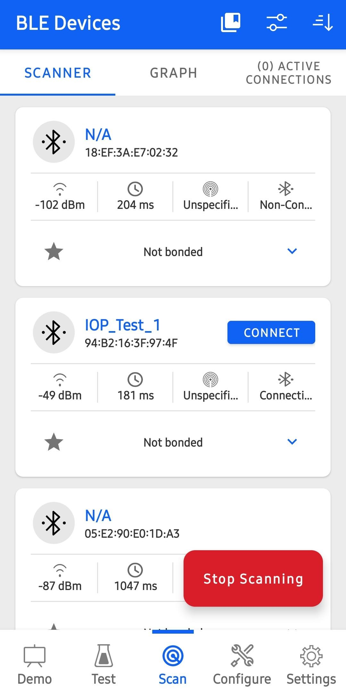
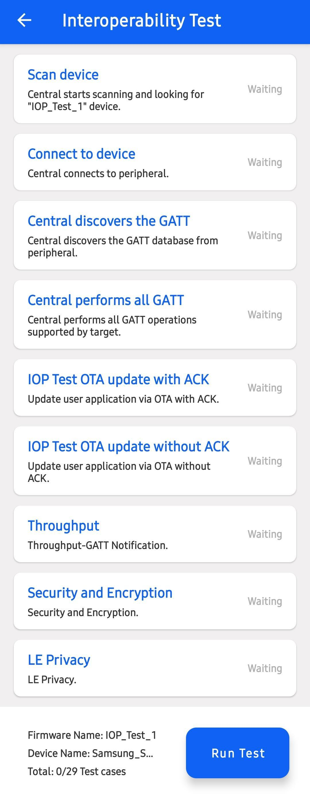
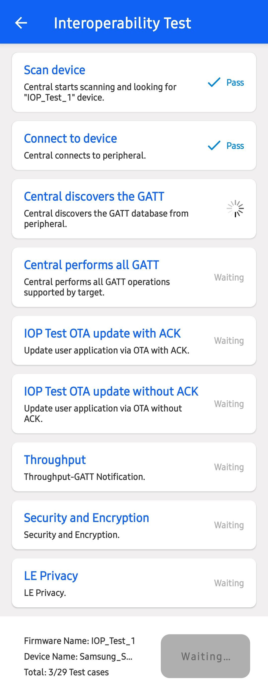
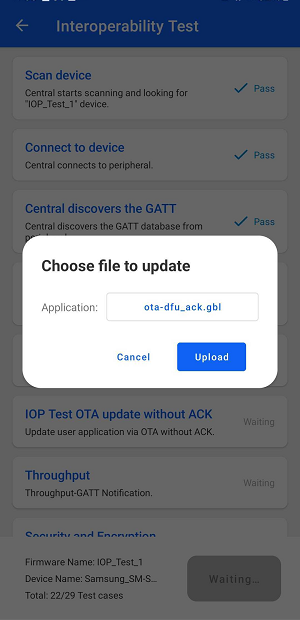
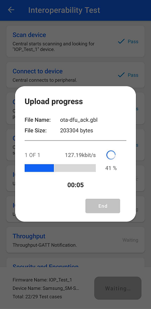
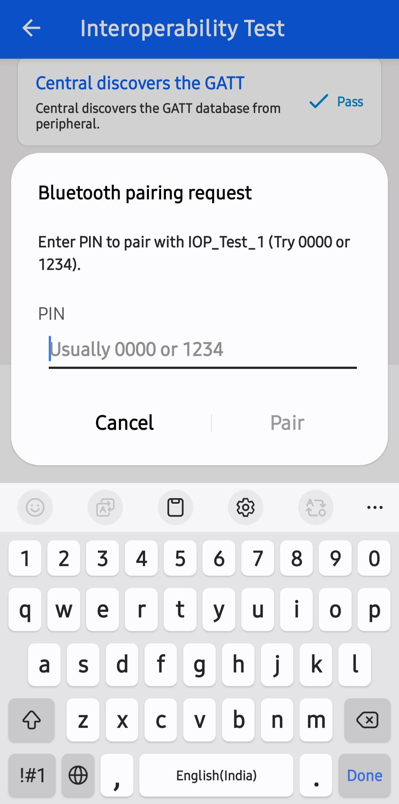
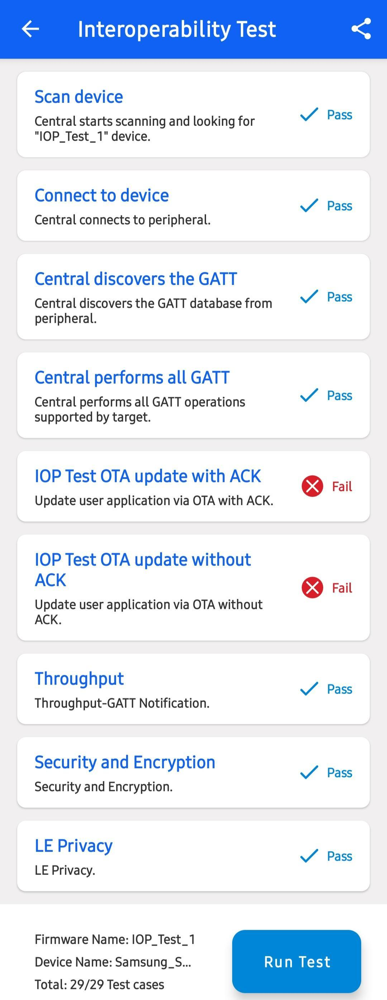

## BLE Interoperability Test App
  

 ## Table of Contents
  - [Purpose / Scope](#purposescope) - [Prerequisites / Setup Requirements](#prerequisitessetup - requirements)
  - [Hardware Requirements](#hardware - requirements) - [Software Requirements](#software - requirements)
  - [Setup Diagram](#setup - diagram) - [Getting Started](#getting - started)
  - [Application Build Environment](#application - build - environment)
  - [Test the Application](#test - the - application)

 ## Purpose/Scope

      Interoperability(IOP) is a fundamental aspect of Bluetooth Low Energy (BLE), ensuring seamless communication between Bluetooth-enabled devices from different manufacturers. This project provides a comprehensive framework for testing IOP using Silicon Labs' test setup, which includes hardware kits, embedded software, and a mobile application.

The objective of this framework is to verify the interoperability of the SiWG917 family of SoCs with a wide range of Bluetooth-enabled devices, particularly smartphones. Given the vast diversity in smartphone hardware, Bluetooth firmware, and mobile operating systems, IOP testing is crucial to ensuring reliable connectivity.

This document outlines the requirements, setup process, test execution, and data collection methods for performing IOP testing. The results of these tests help in analyzing compatibility, identifying potential issues, and improving Bluetooth performance across different devices.

## NOTE: OTA ACK/UNACK features are not supported in Si917 IOP application 

## Prerequisites/Setup Requirements

### Hardware Requirements

- Silicon Labs Bluetooth Development Kit:
	- Any Silicon Labs kit that supports Bluetooth technology can be used for IOP testing.
	
- Test Hardware:
	- SiWG917 SoC Family Development Kits:
		-   SOC Expansion Kits with SOC Radio Boards:
			- (BRD4338A + BRD4002A)
			
### Software Requirements

- Development Environment:

    - Install Simplicity Studio 5 and WiseConnect SDK 3.0, which are part of the SiSDK.
    - Refer to the Simplicity Studio 5 documentation for installation instructions.

- Mobile App Requirements:

    - Install the Simplicity Connect Mobile App (v2.4 or newer) for Android or iOS.
    - The app source code is available on GitHub for further customization.
    - Alternative BLE apps available on Android/iOS can also be used.

- Device Bonding Considerations:

    - Before running IOP tests, ensure that no existing bond exists between the embedded device and the smartphone.
    - If bonded, remove the bond via the smartphone’s Bluetooth settings before initiating the test.
> **Note:** The provided mobile screenshots are from the 3.0.1 version of the Simplicity Connect App(formerly EFR Connect App), it is recommended to use the latest version.

### Setup Diagram

## Getting Started

Refer to the instructions [here](https://docs.silabs.com/wiseconnect/latest/wiseconnect-getting-started/) to:

- [Install Simplicity Studio](https://docs.silabs.com/wiseconnect/latest/wiseconnect-developers-guide-developing-for-silabs-hosts/#install-simplicity-studio)
- [Install WiSeConnect 3 extension](https://docs.silabs.com/wiseconnect/latest/wiseconnect-developers-guide-developing-for-silabs-hosts/#install-the-wi-se-connect-3-extension)
- [Connect your device to the computer](https://docs.silabs.com/wiseconnect/latest/wiseconnect-developers-guide-developing-for-silabs-hosts/#connect-si-wx91x-to-computer)
- [Upgrade your connectivity firmware ](https://docs.silabs.com/wiseconnect/latest/wiseconnect-developers-guide-developing-for-silabs-hosts/#update-si-wx91x-connectivity-firmware)
- [Create a Studio project ](https://docs.silabs.com/wiseconnect/latest/wiseconnect-developers-guide-developing-for-silabs-hosts/#create-a-project)

For details on the project folder structure, see the [WiSeConnect Examples](https://docs.silabs.com/wiseconnect/latest/wiseconnect-examples/#example-folder-structure) page.

## Test the Application

Refer to the instructions [here](https://docs.silabs.com/wiseconnect/latest/wiseconnect-getting-started/) to:

- Build the application in Studio.
- Flash, run and debug the application.

Follow the steps below for successful execution of the application:

- Bringing up the Test Environment

	1. Flash the IOP Test Application to the 917 board.

	2. After flashing is complete, modify the application name defined using RSI_BLE_IOP_TEST_APPLICATION, rebuild it, and navigate to the binaries folder.

	3. Right-click on any file within the folder and select "Browse files here" to locate the project_name.rps file.

	4. Rename the file extension from .rps to .gbl (e.g., project_name.gbl).

	5. Transfer this .gbl file to a location accessible on your smartphone, either in local storage or cloud storage.

	6. This file will be used for acknowledged OTA testing during the IOP Test on the Si Connect mobile app.
	
	

- Running the IOP Test on Si Connect App

	1. On your smartphone, launch the Si Connect App.

	2. Click on the "Test" tab at the bottom of the screen.
	
	

	3. The Test tab displays a list of boards running the IOP Test Firmware.
	
	

	4. Select the name of the IOP application flashed to the 917 board.

	5. The app will navigate to the "IOP View", where you can tap on "Run Test" to start the IOP test sequence.
	
	

- Running the IOP Test

	1. Once the IOP test sequence starts, the mobile app will execute test cases and indicate Pass/Fail when completed.
	
	

	2. Most tests run automatically, except for:

		- OTA Test: The app prompts you to upload the .gbl file. Select the file from local storage or cloud storage.
		
		    

		- Security Tests:

			- The app prompts you to bond with the device.
			
			

			- Some prompts require simple confirmation (Just Works pairing), while others require entering a PIN (Authenticated pairing).
			
			

			- The PIN is displayed on the mainboard or logged via UART if the board lacks a display.

## Logging and Sharing data

After the test is finalized on the mobile app, you can rerun the test or share the results.

To rerun the tests, first reset the embedded device by pressing the reset button on the lower right side of the mainboard. Additionally, remove the bond from the phone’s Bluetooth settings.

The *Share* option allows sharing the test log through OS-standard mediums, such as cloud storage (e.g., Dropbox, Google Drive, iCloud, and so on) or email, or saving it locally. The log is in xml format and contains information about the phone model, OS version, Bluetooth connection parameters, and the result of each test. Below is an example of a test log from running IOP test on a Pixel 2 with Android 11.

### Programming the Radio Board

Before programming the radio board mounted on the mainboard, make sure the power supply switch is in the AEM position (right side) as shown below.

