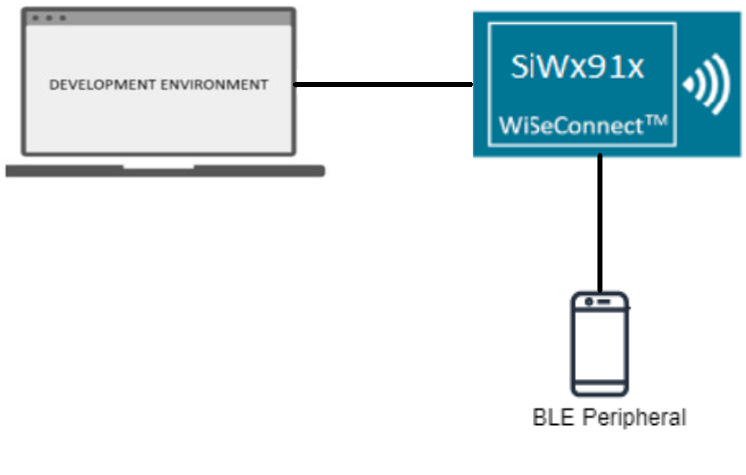
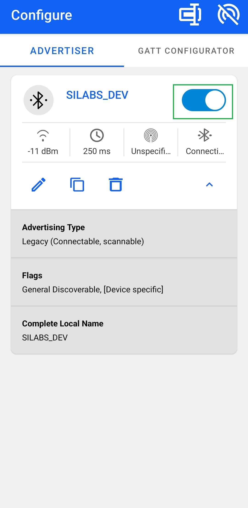
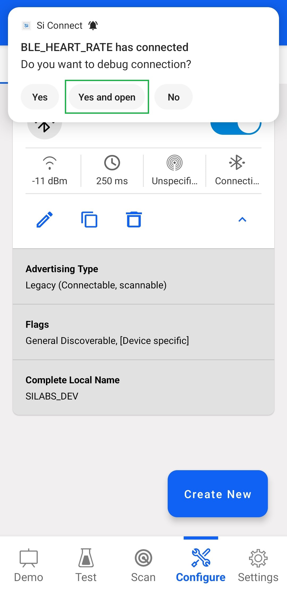
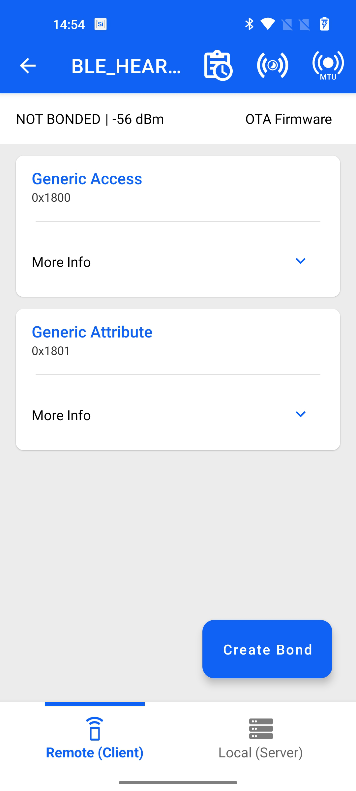
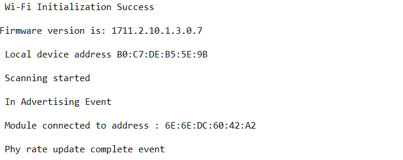
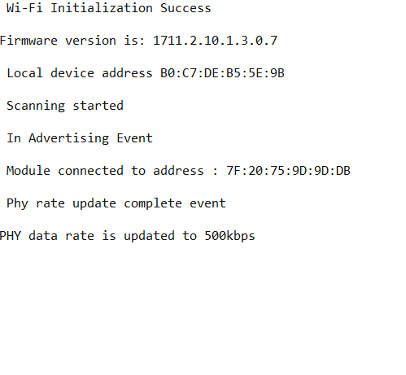
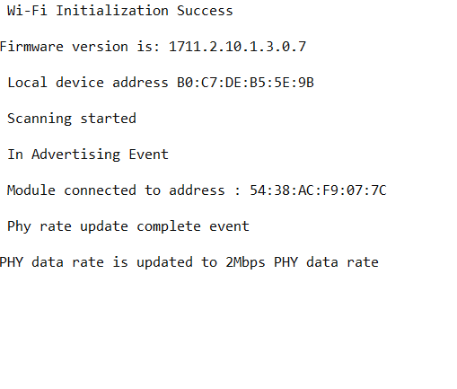

# BLE - Long Range

## High-Level Overview

This application demonstrates how to configure/connects SiWx91x as a Central and can be used to update the PHY rates either coded PHY(long range) or 2Mbps PHY rates. The PHY update Procedure is...

## Table of Contents

- [High-Level Overview](#high-level-overview)
- [Table of Contents](#table-of-contents)
- [Purpose/Scope](#purposescope)
- [Prerequisites/Setup Requirements](#prerequisitessetup-requirements)
  - [Hardware Requirements](#hardware-requirements)
  - [Software Requirements](#software-requirements)
  - [NCP mode: host application and project files](#ncp-mode-host-application-and-project-files)
  - [Setup Diagram](#setup-diagram)
- [Steps to Run Demo](#steps-to-run-demo)
  - [Getting Started](#getting-started)
  - [Configuration and setup](#configuration-and-setup)
  - [Steps for execution](#steps-for-execution)
- [Troubleshooting](#troubleshooting)
- [Resources](#resources)
- [Report Bugs and Get Support](#report-bugs-and-get-support)

## Purpose/Scope

This application demonstrates how to configure/connects SiWx91x as a Central and can be used to update the PHY rates either coded PHY(long range) or 2Mbps PHY rates. The PHY update Procedure is used to change the Transmit or receive PHYs, or both.

The procedure can be initiated either on a request by the host or autonomously by the Link Layer. Either the central or the peripheral may initiate this procedure at any time after entering the Connection State.

## Prerequisites/Setup Requirements

### Hardware Requirements

- Windows PC
- SoC Mode:
  - Silicon Labs [[BRD4002A](https://www.silabs.com/development-tools/wireless/wireless-pro-kit-mainboard?tab=overview) + [BRD4338A](https://www.silabs.com/development-tools/wireless/wi-fi/siwx917-rb4338a-wifi-6-bluetooth-le-soc-radio-board?tab=overview) / [BRD4343A](https://www.silabs.com/development-tools/wireless/wi-fi/siw917y-rb4343a-wi-fi-6-bluetooth-le-8mb-flash-radio-board-for-module?tab=overview) / [BRD4343C](https://www.silabs.com/development-tools/wireless/wi-fi/siw917y-rb4343c-wi-fi-6-bluetooth-le-8mb-flash-radio-board-for-module?tab=overview)]
  - Kits
    - SiWx917 AC1 Module Explorer Kit [BRD2708A](https://www.silabs.com/development-tools/wireless/wi-fi/siw917y-ek2708a-explorer-kit)
- PSRAM Mode:  
  - Silicon Labs [[BRD4342A](https://www.silabs.com/development-tools/wireless/wi-fi/siwx91x-rb4342a-wifi-6-bluetooth-le-soc-radio-board?tab=overview)]
- NCP Mode:
  - Silicon Labs [BRD4186C](https://www.silabs.com/development-tools/wireless/xg24-rb4186c-efr32xg24-wireless-gecko-radio-board?tab=overview)
  - Host MCU Eval Kit. This example has been tested with:
    - Silicon Labs [WSTK + EFR32MG21](https://www.silabs.com/development-tools/wireless/efr32xg21-bluetooth-starter-kit)
  - NCP Expansion Kit with NCP Radio boards
      - [[BRD8045A](https://www.silabs.com/development-tools/wireless/wi-fi/expansion-adapter-board-for-co-processor-radio-boards?tab=overview) + [BRD4346A](https://www.silabs.com/development-tools/wireless/wi-fi/siwx917-rb4346a-wifi-6-bluetooth-le-soc-4mb-flash-radio-board?tab=overview) / [BRD4357A](https://www.silabs.com/development-tools/wireless/wi-fi/siw917y-rb4357a-wi-fi-6-bluetooth-le-4mb-flash-radio-board-for-rcp-and-ncp-modules?tab=overview) / [BRD4357C](https://www.silabs.com/development-tools/wireless/wi-fi/siw917y-rb4357c-wi-fi-6-bluetooth-le-4mb-flash-radio-board-for-rcp-and-ncp-modules?tab=overview)]
- Interface and Host MCU Supported
  - SPI - EFR32 

### Software Requirements

- Simplicity Studio IDE
  
- Download and install the Silicon Labs [Simplicity Connect App(formerly EFR Connect App) or other BLE Central/Peripheral app.](https://www.silabs.com/developers/simplicity-connect-mobile-app ) in the android smart phones for testing BLE applications. Users can also use their choice of BLE apps available in Android/iOS smart phones.

### NCP mode: host application and project files

| Mode | Host / target | Project file (this example folder) |
|------|----------------|-------------------------------------|
| SoC | Application runs on SiWx91x. | `ble_longrange_2mbps_soc.slcp` |
| PSRAM | Application runs on SiWx91x with PSRAM-capable radio board. | `ble_longrange_2mbps_psram.slcp` |
| NCP (SPI) | Application runs on **EFR32** host; SiWx917 is the network co-processor over **SPI**. | `ble_longrange_2mbps_ncp.slcp` |

Open the `.slcp` for your kit from **`examples/snippets/ble/ble_longrange_2mbps/`** in Simplicity Studio. For NCP, follow [Getting started with NCP mode](https://docs.silabs.com/wiseconnect/latest/wiseconnect-getting-started/getting-started-with-ncp-mode).

### Setup Diagram



## Steps to Run Demo

### Getting Started

Refer to the instructions [here](https://docs.silabs.com/wiseconnect/latest/wiseconnect-getting-started/) to:

- [Install Simplicity Studio](https://docs.silabs.com/wiseconnect/latest/wiseconnect-developers-guide-developing-for-silabs-hosts/#install-simplicity-studio)
- [Install WiSeConnect extension](https://docs.silabs.com/wiseconnect/latest/wiseconnect-developers-guide-developing-for-silabs-hosts/#install-the-wi-se-connect-extension)
- [Connect your device to the computer](https://docs.silabs.com/wiseconnect/latest/wiseconnect-developers-guide-developing-for-silabs-hosts/#connect-si-wx91x-to-computer)
- [Upgrade your connectivity firmware ](https://docs.silabs.com/wiseconnect/latest/wiseconnect-developers-guide-developing-for-silabs-hosts/#update-si-wx91x-connectivity-firmware)
- [Create a Studio project ](https://docs.silabs.com/wiseconnect/latest/wiseconnect-developers-guide-developing-for-silabs-hosts/#create-a-project)

For details on the project folder structure, see the [WiSeConnect Examples](https://docs.silabs.com/wiseconnect/latest/wiseconnect-examples/#example-folder-structure) page.

### Configuration and setup

The application can be configured to suit your requirements and development environment.

Read through the following sections and make any changes needed.

- Open `app.c` file and update/modify following macros,

  - `RSI_DEVICE_DATA_RATE` refers the PHY data rate of the Silicon Labs module to be selected.

    - If user configures, **LONG_RANGE**, Silicon Labs module will update PHY data rates to coded PHY data rate. By default it is configured to 500kbps PHY data rate.

    - If user configures, **BLE_2MBPS**, Silicon Labs module will update 2Mbps PHY data rates.

    ```c
    #define RSI_DEVICE_DATA_RATE                LONG_RANGE
    ```

  - `RSI_BLE_DEV_ADDR_TYPE` refers address type of the remote device to connect.

    ```c
    #define RSI_BLE_DEV_ADDR_TYPE                         LE_PUBLIC_ADDRESS
    ```

    - Based on the address of the advertising device, Valid configurations are

      - LE_RANDOM_ADDRESS
      - LE_PUBLIC_ADDRESS

    >  **Note:** Depends on the remote device, address type will be changed.

  - `RSI_BLE_DEV_ADDR` refers address of the remote device to connect.

    ```c
    #define RSI_BLE_DEV_ADDR                          "00:23:A7:80:70:B9"
    ```

  - `RSI_REMOTE_DEVICE_NAME` refers the name of remote device to which Silicon Labs device has to connect

    ```c
    #define RSI_REMOTE_DEVICE_NAME                              "SILABS_DEV"
    ```

    >  **Note:** Silicon Labs module can connect to remote device by referring either RSI_BLE_DEV_ADDR or  RSI_REMOTE_DEVICE_NAME of the remote device.

  - Power save configuration

    - By default, the application is configured without power save.

      ```c  
      #define ENABLE_NWP_POWER_SAVE 0
      ```

    - If user wants to run the application in power save, modify the following configuration.

      ```c  
      #define ENABLE_NWP_POWER_SAVE 1
      ```

  - The desired parameters are provided in following steps. User can also modify the parameters as per their needs and requirements.

  - Open `ble_config.h` file and update/modify following macros,

    ```c
    #define RSI_BLE_PWR_INX                                   30
    #define RSI_BLE_PWR_SAVE_OPTIONS                          0 
    ```

    > **Note:** `ble_config.h` files are already set with desired configuration in respective example folders user need not change for each example.

> **Note**: For recommended settings, please refer the [recommendations guide](https://docs.silabs.com/wiseconnect/latest/wiseconnect-developers-guide-prog-recommended-settings/).

### Steps for execution

Refer to the instructions [here](https://docs.silabs.com/wiseconnect/latest/wiseconnect-getting-started/) to:

- Build the application in Studio.
- Flash, run and debug the application.
    > **Note:**  The provided mobile screenshots are from the 2.8.1 version of the Simplicity Connect App(formerly EFR Connect App), it is recommended to use the latest version.

Follow the steps for successful execution of the application:

1. Configure the remote BLE device in peripheral mode, add the complete local name record,  Enable the Scan response data, and connectable options to the advertising data. And keep it in the Advertising mode. Ensure that the specified remote device name in the RSI_REMOTE_DEVICE_NAME macro is proper.

         

   > **Note:** Refer the [Creating New Advertisement Sets](https://docs.silabs.com/bluetooth/5.0/miscellaneous/mobile/efr-connect-mobile-app) for configuring the Simplicity Connect mobile App(formerly EFR Connect App) connect mobile APP as advertiser.

2. After the program gets executed, Silicon Labs device tries to connect with the remote device specified in **RSI_BLE_DEV_ADDR** **or RSI_REMOTE_DEVICE_NAME** macro.

3. Clicks on "YES AND OPEN" button and Observe that the connection is established between the desired device and Silicon Labs device.

     

4. After connection, Silicon Labs device will read PHY rate of the remote device and set PHY rate of the remote device.

    

5. Observe PHY update complete event after setting PHY rate.

    

6. When Silicon Labs module is configured as **LONG_RANGE** PHY data rate, the Slicon Labs module and remote device updates its PHY data rate to 500kbps and prints in docklight looks as shown below.

    

7. When Silicon Labs module is configured as **BLE_2MBPS** PHY data rate, the Slicon Labs module and remote device updates its PHY data rate to 2mbps and prints in docklight looks as shown below.

    

## Troubleshooting

| Symptom | Things to check |
|--------|------------------|
| No connection / scan issues | Confirm the peer address type and `RSI_BLE_DEV_ADDR` / `RSI_REMOTE_DEVICE_NAME` match the peripheral; phones often use random addresses. |
| NCP: no boot or no HCI traffic | Update SiWx917 connectivity firmware; verify SPI/UART wiring per [NCP getting started](https://docs.silabs.com/wiseconnect/latest/wiseconnect-getting-started/getting-started-with-ncp-mode). Flash the correct `*_ncp.slcp` (or `*_uart_ncp.slcp`) on the **EFR32** host. |
| Power save anomalies on NCP expansion board | See the power-save note under **Configuration and setup** and the *Getting started with SiWx91x NCP* guide. |
| Build or flash errors | Open the `.slcp` that matches your kit (SoC vs PSRAM vs NCP) and matching SDK / WiSeConnect versions. |


## Resources

1. [WiSeConnect getting started](https://docs.silabs.com/wiseconnect/latest/wiseconnect-getting-started/)
2. [WiSeConnect developers guide — developing for Silicon Labs hosts](https://docs.silabs.com/wiseconnect/latest/wiseconnect-developers-guide-developing-for-silabs-hosts/)
3. [Programming recommended settings](https://docs.silabs.com/wiseconnect/latest/wiseconnect-developers-guide-prog-recommended-settings/)


## Report Bugs and Get Support

Report issues and get help from the Silicon Labs community:

- [Silicon Labs Community](https://www.silabs.com/community)
