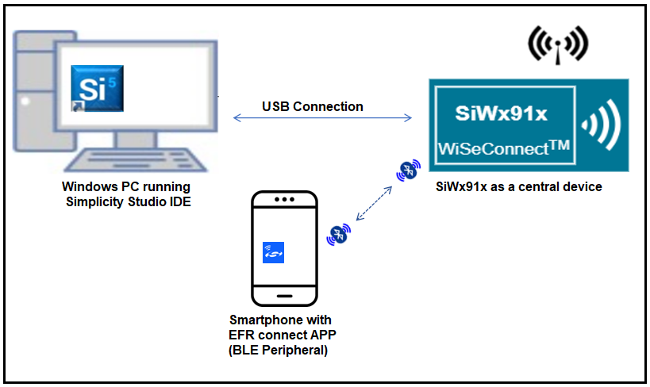
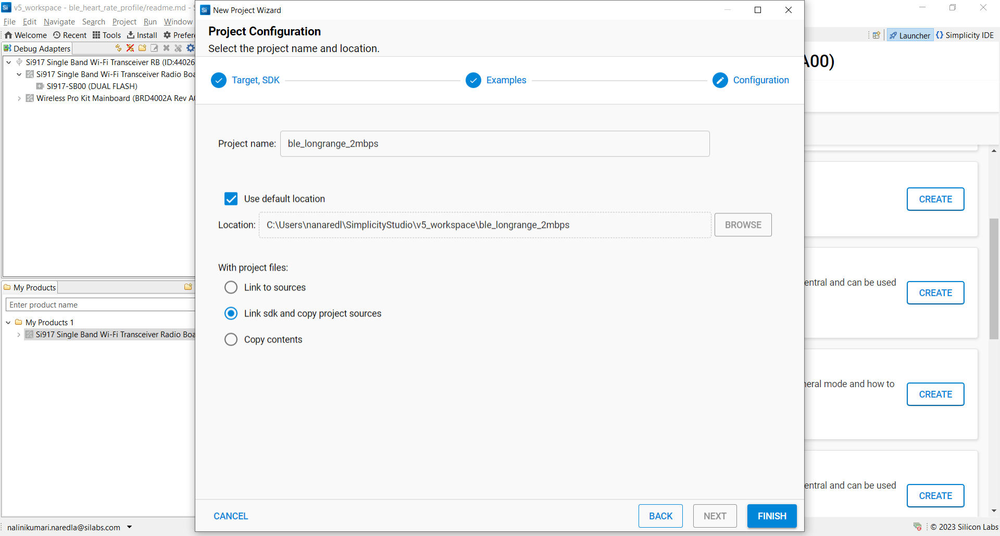
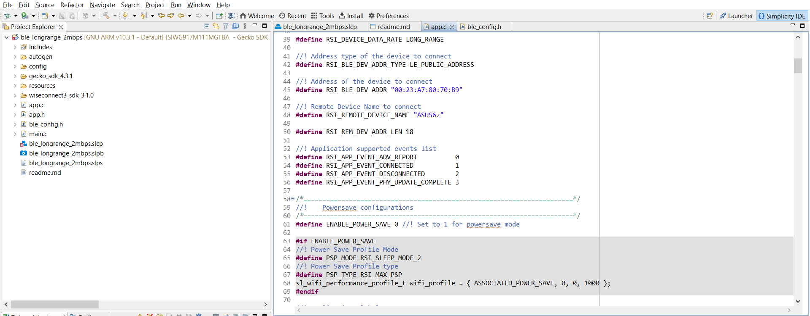
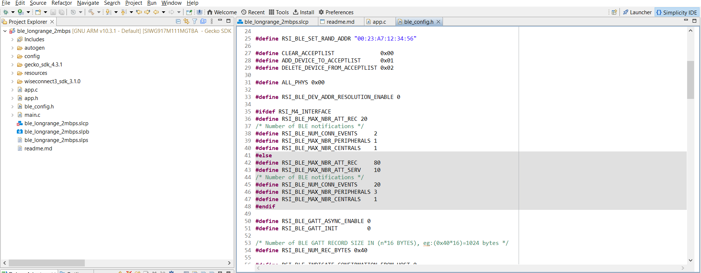

# BLE Longrange 2Mbps

## 1. Purpose/Scope

This application demonstrates how to configure/connects SiWx91x as a Central and can be used to update the PHY rates either coded PHY(long range) or 2Mbps PHY rates. The PHY update Procedure is used to change the Transmit or receive PHYs, or both.

The procedure can be initiated either on a request by the host or autonomously by the Link Layer. Either the central or the peripheral may initiate this procedure at any time after entering the Connection State.

## 2. Prerequisites/Setup Requirements

Before running the application, the user will need the following things to setup.

### 2.1 Hardware Requirements

- Windows PC
- **SoC Mode**:
  - Silicon Labs [BRD4325A, BRD4325B, BRD4325C, BRD4325G, BRD4338A](https://www.silabs.com/)
- **NCP Mode**:
  - Silicon Labs [BRD4180B](https://www.silabs.com/)
  - Host MCU Eval Kit. This example has been tested with:
    - Silicon Labs [WSTK + EFR32MG21](https://www.silabs.com/development-tools/wireless/efr32xg21-bluetooth-starter-kit)

### 2.2 Software Requirements

- Simplicity Studio IDE
  - Download the latest [Simplicity Studio IDE](https://www.silabs.com/developers/simplicity-studio)
  - Follow the [Simplicity Studio user guide](https://docs.silabs.com/simplicity-studio-5-users-guide/1.1.0/ss-5-users-guide-getting-started/install-ss-5-and-software#install-ssv5) to install Simplicity Studio IDE

- Download and install the Silicon Labs [EFR Connect App](https://www.silabs.com/developers/efr-connect-mobile-app) in the android smart phones for testing BLE applications. Users can also use their choice of BLE apps available in Android/iOS smart phones.

### 2.3 Setup Diagram

#### SoC Mode


  
#### NCP Mode


**NOTE**:

- The Host MCU platform (EFR32MG21) and the SiWx91x interact with each other through the SPI interface.

Follow the [Getting Started with Wiseconnect3 SDK](https://docs.silabs.com/wiseconnect/latest/wiseconnect-getting-started/) guide to set up the hardware connections and Simplicity Studio IDE.

## 3 Project Environment

- Ensure the SiWx91x loaded with the latest firmware following the [Upgrade Si91x firmware](https://docs.silabs.com/wiseconnect/latest/wiseconnect-getting-started/getting-started-with-soc-mode#upgrade-si-wx91x-connectivity-firmware)

- Ensure the latest Gecko SDK along with the extension WiSeConnect3 is added to Simplicity Studio.

### 3.1 Creating the project

#### 3.1.1 SoC mode

- Ensure the SiWx91x set up is connected to your PC.

- In the Simplicity Studio IDE, the SiWx91x SoC board will be detected under **Debug Adapters** pane as shown below.

  ****

#### 3.1.2 NCP mode

- Ensure the EFx32 and SiWx91x set up is connected to your PC.

- In the Simplicity Studio IDE, the EFR32 board will be detected under **Debug Adapters** pane as shown below.

  ****

### 3.2 Importing the project

- Studio should detect your board. Your board will be shown here. Click on the board detected and go to **EXAMPLE PROJECTS & DEMOS** section 

#### SOC Mode

- Select **BLE - Long Range** test application

  ****

- Click 'Create'. The "New Project Wizard" window appears. Click 'Finish'

  ****

### 3.3 Set up for application prints

#### 3.3.1 Teraterm set up - for BRD4325A, BRD4325B, BRD4325C, BRD4325G

You can use either of the below USB to UART converters for application prints.

1. Set up using USB to UART converter board.

   - Connect Tx (Pin-6) to P27 on WSTK
   - Connect GND (Pin 8 or 10) to GND on WSTK

   ****

2. Set up using USB to UART converter cable.

   - Connect RX (Pin 5) of TTL convertor to P27 on WSTK
   - Connect GND (Pin1) of TTL convertor to GND on WSTK

   ****

3. Open the Teraterm tool.

   - For SoC mode, choose the serial port to which USB to UART converter is connected and click on **OK**.

     ****

**Note:** For Other 917 SoC boards please refer section #3.3.2

#### 3.3.2 **Teraterm set up - for NCP and SoC modes**

1. Open the Teraterm tool.

- choose the J-Link port and click on **OK**.
    
    ****

2. Navigate to the Setup → Serial port and update the baud rate to **115200** and click on **OK**.

    ****

    ****

## 4 Application Build Environment

### 4.1 Configure the application
The application can be configured to suit your requirements and development environment. Go through the following sections and make any changes if needed. 

**4.1.1** In the Project explorer pane of the IDE, expand the **ble_longrange_2mbps** folder and open the **app.c** file. Configure the following parameters based on your requirements. 


   - **Remote device configuration parameters**
   
   ```c
   //RSI_DEVICE_DATA_RATE refers to the PHY data rates of the SiWx91x module, valid configurations are LONG_RANGE and BLE_2MBPS. By default it is configured to 500kbps PHY data rate. 

   #define RSI_DEVICE_DATA_RATE                LONG_RANGE

   // RSI_BLE_DEV_ADDR_TYPE refers to the address type of the remote device to connect.
   //! Based on address type of remote device, valid configurations are LE_RANDOM_ADDRESS and LE_PUBLIC_ADDRESS
   
   #define RSI_BLE_DEV_ADDR_TYPE                          LE_PUBLIC_ADDRESS 
   
   //RSI_BLE_DEV_ADDR refers to the address of the remote device to connect.
   
   #define RSI_BLE_DEV_ADDR                               "00:23:A7:80:70:B9" 
   
   //RSI_REMOTE_DEVICE_NAME refers to the name of remote device to which Silicon Labs device has to connect.

   #define RSI_REMOTE_DEVICE_NAME                         "SILABS_DEV" 
   ```
   
   **Note:** you're required to configure either the `RSI_BLE_DEV_ADDR` or `RSI_REMOTE_DEVICE_NAME` of the remote device.
   
   - **Power Save Configuration**
   Configure "ENABLE_POWER_SAVE" parameter to enable power save mode. 
        
      ```c
         #define ENABLE_POWER_SAVE              0
      ```

**4.1.2** Open **ble_config.h** file and configure parameters as per requirement.   
 

- **Opermode command parameters**
  This configuration can be found in app.c as `config`	
   
**Note:** `ble_config.h` and `app.c` files are already set with desired configuration in respective example folders you need not change for each example. 

### 4.2 Build the Application

- Follow the below steps for the successful execution of the application.

#### Build Project - SoC Mode

- Once the project is created, click on the build icon (hammer) to build the project (or) right click on project and click on Build Project.

   

- Successful build output will show as below.

#### Build Project - NCP Mode

   

- Successful build output will show as below.

### 4.3 Run and Test the Application

- Once the build was successfull, load the application image.

#### 4.3.1 Load the Application Image

1. Click on Tools and Simplicity Commander as shown below.

   

2. Load the firmware image

- Select the board. 
- Browse the application image (.hex) and click on Flash button.

   

### 4.3.2 Steps to be followed to verify BLE Long Range Application

1. Configure the remote BLE device in peripheral mode, add the complete local name record,  Enable the Scan response data, and connectable options to the advertising data. And keep it in the Advertising mode. Ensure that the specified remote device name in the RSI_REMOTE_DEVICE_NAME macro is proper.

     

   **Note:** Refer the [Creating New Advertisement Sets](https://docs.silabs.com/bluetooth/5.0/miscellaneous/mobile/efr-connect-mobile-app) for configuring the EFR connect mobile APP as advertiser.

2. After the program gets executed, Silicon Labs device tries to connect with the remote device specified in **RSI_BLE_DEV_ADDR** **or RSI_REMOTE_DEVICE_NAME** macro.

3. Clicks on "YES AND OPEN" button and Observe that the connection is established between the desired device and Silicon Labs device.
 

4. After connection, Silicon Labs device will read PHY rate of the remote device and set PHY rate of the remote device.


5. Observe PHY update complete event after setting PHY rate.

6. When Silicon Labs module is configured as **LONG_RANGE** PHY data rate, the Slicon Labs module and remote device updates its PHY data rate to 500kbps and prints in teraterm looks as shown below.

7. When Silicon Labs module is configured as **TWO_MBPS** PHY data rate, the Slicon Labs module and remote device updates its PHY data rate to 1mbps and prints in teraterm looks as shown below.

**Note:**      
- The provided mobile screenshots are from the 2.5.2 version of the EFR Connect app, it is recommended to use the latest version.

### 4.4 Application Output


