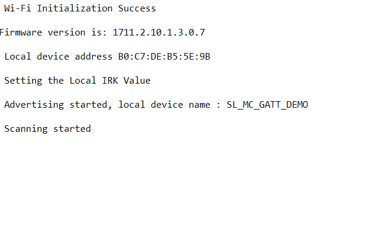
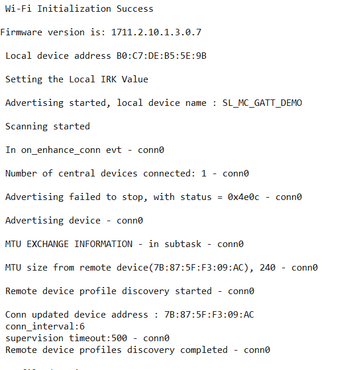

# BLE - Multiconnection GATT Test

## Table of Contents

- [BLE - Multiconnection GATT Test](#ble---multiconnection-gatt-test)
  - [Table of Contents](#table-of-contents)
  - [Purpose/Scope](#purposescope)
  - [Prerequisites/Setup Requirements](#prerequisitessetup-requirements)
    - [Hardware Requirements](#hardware-requirements)
    - [Software Requirements](#software-requirements)
    - [Setup Diagram](#setup-diagram)
  - [Getting Started](#getting-started)
  - [Application Build Environment](#application-build-environment)
  - [Test the Application](#test-the-application)

## Purpose/Scope

The application demonstrates how to configure SiWx91x EVK in central/peripheral modes and then connect with multiple peripherals/centrals.

It provides user to configure secure connection with central and peripheral remote devices and support data transfers.

This also displays all the remote GATT profiles and service characteristics logs of connected remote device.

## Prerequisites/Setup Requirements

### Hardware Requirements

- Windows PC
- **SoC Mode**:
  - Standalone
    - BRD4002A Wireless pro kit mainboard [SI-MB4002A]
    - Radio Boards 
      - BRD4338A [SiWx917-RB4338A]
      - BRD4339B [SiWx917-RB4339B]
      - BRD4340A [SiWx917-RB4340A]
      - BRD4343A [SiWx917-RB4343A]
  - Kits
  	- SiWx917 Pro Kit [Si917-PK6031A](https://www.silabs.com/development-tools/wireless/wi-fi/siwx917-pro-kit?tab=overview)
  	- SiWx917 Pro Kit [Si917-PK6032A]
    - SiWx917 AC1 Module Explorer Kit (BRD2708A)
- **PSRAM Mode**:
  - Standalone
    - BRD4002A Wireless pro kit mainboard [SI-MB4002A]  
    - Radio Boards [BRD4340A, BRD4342A, BRD4325G]
- **NCP Mode**:
  - Standalone
    - BRD4002A Wireless pro kit mainboard [SI-MB4002A]
    - EFR32xG24 Wireless 2.4 GHz +10 dBm Radio Board [xG24-RB4186C](https://www.silabs.com/development-tools/wireless/xg24-rb4186c-efr32xg24-wireless-gecko-radio-board?tab=overview)
    - NCP Expansion Kit with NCP Radio boards
      - (BRD4346A + BRD8045A) [SiWx917-EB4346A]
      - (BRD4357A + BRD8045A) [SiWx917-EB4357A]
  - Kits
  	- EFR32xG24 Pro Kit +10 dBm [xG24-PK6009A](https://www.silabs.com/development-tools/wireless/efr32xg24-pro-kit-10-dbm?tab=overview)
  - Interface and Host MCU Supported
    - SPI - EFR32 

### Software Requirements

- Simplicity Studio
- Download and install the Silicon Labs [Simplicity Connect App(formerly EFR Connect App) or other BLE Central/Peripheral app.](https://www.silabs.com/developers/simplicity-connect-mobile-app ) in the android smart phones for testing BLE applications. Users can also use their choice of BLE apps available in Android/iOS smart phones.

> **Note:** The provided mobile screenshots are from the 2.8.1 version of the Simplicity Connect App(formerly EFR Connect App), it is recommended to use the latest version.

### Setup Diagram


## Getting Started

Refer to the instructions [here](https://docs.silabs.com/wiseconnect/latest/wiseconnect-getting-started/) to:

- [Install Simplicity Studio](https://docs.silabs.com/wiseconnect/latest/wiseconnect-developers-guide-developing-for-silabs-hosts/#install-simplicity-studio)
- [Install WiSeConnect 3 extension](https://docs.silabs.com/wiseconnect/latest/wiseconnect-developers-guide-developing-for-silabs-hosts/#install-the-wi-se-connect-3-extension)
- [Connect your device to the computer](https://docs.silabs.com/wiseconnect/latest/wiseconnect-developers-guide-developing-for-silabs-hosts/#connect-si-wx91x-to-computer)
- [Upgrade your connectivity firmware ](https://docs.silabs.com/wiseconnect/latest/wiseconnect-developers-guide-developing-for-silabs-hosts/#update-si-wx91x-connectivity-firmware)
- [Create a Studio project ](https://docs.silabs.com/wiseconnect/latest/wiseconnect-developers-guide-developing-for-silabs-hosts/#create-a-project)

For details on the project folder structure, see the [WiSeConnect Examples](https://docs.silabs.com/wiseconnect/latest/wiseconnect-examples/#example-folder-structure) page.

## Application Build Environment

The application can be configured to suit you requirements and development environment. Go through the following sections and make any changes if needed.

- In the Project Explorer pane of the IDE, expand the `ble_multiconnection_gatt_test` folder and open the `ble_config.h` file. Configure the following parameters based on your requirements.

   - Multi device connection parameters
      - `RSI_BLE_APP_GATT_TEST` refers to the Silicon Labs device name
         ```c
         #define RSI_BLE_APP_GATT_TEST   (void *)"SI_COEX_MAX_DEMO"
         ```

      - `RSI_BLE_MAX_NBR_PERIPHERALS` refers to the number of remote device peripheral connections
         ```c
         #define RSI_BLE_MAX_NBR_PERIPHERALS  1
         ```

      - `RSI_BLE_MAX_NBR_CENTRALS` refers to the number of remote device central connections
         ```c
         #define RSI_BLE_MAX_NBR_CENTRALS   1
         ```

      > **Note:** Maximum no. of  RSI_BLE_MAX_NBR_CENTRALS and RSI_BLE_MAX_NBR_PERIPHERALS can be configured to max '1'.
  
   - Remote Peripheral device parameters

      - `CONNECT_OPTION` refers to the type of connection, valid configurations are `CONN_BY_ADDR` and `CONN_BY_NAME`
         ```c
         #define CONNECT_OPTION CONN_BY_NAME 
         ```

      - `RSI_REMOTE_DEVICE_NAMEX` refers to the remote Peripheral device name
         ```c
         #define RSI_REMOTE_DEVICE_NAME1 "SILABS_BLE_DEV"
         #define RSI_REMOTE_DEVICE_NAME2 "SILABS_BLE_DEV_1"
         #define RSI_REMOTE_DEVICE_NAME3 "SILABS_BLE_DEV_2"
         ```

      - `RSI_BLE_DEV_ADDR_TYPE` refers to the remote Peripheral device address type
         ```c
         #define RSI_BLE_DEV_ADDR_TYPE LE_PUBLIC_ADDRESS
         ```

      - `RSI_BLE_DEV_X_ADDR` refers to the remote Peripheral device address
         ```c
         #define RSI_BLE_DEV_1_ADDR "00:1A:7D:DA:71:16"
         #define RSI_BLE_DEV_2_ADDR "00:1A:7D:DA:71:74"
         #define RSI_BLE_DEV_3_ADDR "00:1A:7D:DA:73:13"
         ```

   - Specific Remote Periperal device configuration paramters

      > **Note:** Where XX refers to C1 (or) C2

      - Set below macro to enable secure connection
         ```c
         #define SMP_ENABLE_XX 0
         ```

      - Set below macro to add remote device to acceptlist
         ```c
         #define ADD_TO_ACCEPTLIST_XX 0
         ```
   
      - Set below macro to discover remote profiles
         ```c
         #define PROFILE_QUERY_XX 1
         ```
 
      - Set below macro to perform data transfer
         ```c
         #define DATA_TRANSFER_XX 1
         ```
 
      - Configure below macros to select type of data transfer

      - Set below macro to receive 'gatt notifications' from remote device
         ```c
         #define RX_NOTIFICATIONS_FROM_XX 0
         ```
 
      - Set below macro to receive 'gatt indications' from remote device
         ```c
         #define RX_INDICATIONS_FROM_XX 0
         ```
 
      - Set below macro to Transmit 'gatt notifications' to remote device
         ```c
         #define TX_NOTIFICATIONS_TO_XX 1
         ```
 
      - Set below macro to Transmit 'gatt write with response' to remote device
         ```c
         #define TX_WRITES_TO_XX 0
         ```
 
      - Set below macro to Transmit 'gatt write without response' to remote device
         ```c
         #define TX_WRITES_NO_RESP_TO_XX 0
         ```
 
      - Set below macro to Transmit 'gatt indications' to remote device
         ```c
         #define TX_INDICATIONS_TO_XX 0
         ```
 
      - Configure below macro to select data length extension ON/OFF
         ```c
         #define DLE_ON_XX 0
         ```

      - Configure below macros to select connection parameters while data transfer
         ```c
         #define CONN_INTERVAL_XX            36 //! for conn interval of 45ms
         #define CONN_LATENCY_XX             0
         #define CONN_SUPERVISION_TIMEOUT_XX 400
         ```

   - Specific Remote Central device configuration parameters

      > **Note:** Where YY refers to P1 (or) P2 (or) P3

      - Configure below macro to enable secure connection
         ```c
         #define SMP_ENABLE_YY 0
         ```

      - Add remote device to acceptlist
         ```c
         #define ADD_TO_ACCEPTLIST_YY 0
         ```

      - Configure below macro to discover remote profiles
         ```c
         #define PROFILE_QUERY_YY 1
         ```

      - Configure below macro to perform data transfer
         ```c
         #define DATA_TRANSFER_YY 1
         ```

      - Configure below macros to select type of data transfer
      - Set below macro to receive 'gatt notifications' from remote device
         ```c
         #define RX_NOTIFICATIONS_FROM_YY 1
         ```

      - Set below macro to receive 'gatt indications' from remote device
         ```c
         #define RX_INDICATIONS_FROM_YY 0
         ```

      - Set below macro to Transmit 'gatt notifications' to remote device
         ```c
         #define TX_NOTIFICATIONS_TO_YY 0
         ```

      - Set below macro to Transmit 'gatt write with response' to remote device
         ```c
         #define TX_WRITES_TO_YY 0
         ```

      - Set below macro to Transmit 'gatt write without response' to remote device
         ```c
         #define TX_WRITES_NO_RESP_TO_YY 0
         ```

      - Set below macro to Transmit 'gatt indications' to remote device
         ```c
         #define TX_INDICATIONS_TO_YY 0
         ```

      - Configure below macros to select connection parameters while data transfer
         ```c
         #define CONN_INTERVAL_YY            240 // for conn interval of 300ms
         #define CONN_LATENCY_YY             0
         #define CONN_SUPERVISION_TIMEOUT_YY 400
         ```

   - Power Save Configuration

      - Configure "ENABLE_NWP_POWER_SAVE" parameter to enable power save mode.
         ```c
         #define ENABLE_NWP_POWER_SAVE              1
         ```

      > **Note:** If you are using the NCP-EXP-Board, refer the "**Powersave functionality with NCP expansion board**" section  the ***Getting started with SiWx91x NCP*** guide.

   > **Note:** "Opermode command parameters" are already set with desired configuration in app.c.

> **Note**: For recommended settings, see the [recommendations guide](https://docs.silabs.com/wiseconnect/latest/wiseconnect-developers-guide-prog-recommended-settings/).

## Test the Application

Refer to the instructions [here](https://docs.silabs.com/wiseconnect/latest/wiseconnect-getting-started/) to:

- Build the application in Studio.
- Flash, run and debug the application.

Follow the steps below for the successful execution of the program:

1. Configure the remote ble devices in peripheral and put it in advertising mode and/or in central and put in scanning mode.

   > **Note:** Refer the [Creating New Advertisement Sets](https://docs.silabs.com/bluetooth/5.0/miscellaneous/mobile/efr-connect-mobile-app) for configuring the Simplicity Connect mobile App(formerly EFR Connect App) connect mobile APP as advertiser.

2. Connect any serial console for prints.

3. Silicon Labs device is configured as GATT server with the below user-defined services.

   | S.No |UUID size |main service UUID | Characteristic service UUID | Property|
   |------|---|------|------|-----|
   |1|16-bit|0xAABB | 0x1AA1 | Read, Write & Notify|
   |2|128-bit|0x6A4E3304-667B-11E3-949A-0800200C9A66 | 0x6A4E3304-667B-11E3-949A-0800200C9A66 | Write with no response|
   |3|16-bit| 0x1AA1|0x1BB1 | Read & indicate|

4. Silicon Labs device is in scanning and advertising mode.

5. After the program gets executed, Silicon Labs device tries to connect with the remote device name specified in
   the macro **RSI_REMOTE_DEVICE_NAMEX** or **RSI_BLE_DEV_X_ADDR**. X could be 1,2 or 3.

6. Observe that the connection is established between the desired device and Silicon Labs device.

7. When the connection is established with the remote device, the Silicon Labs device fetch the GATT profiles and characteristics and also prints the same on the serial terminal.

8. If user configures SMP pairing in the specified macro **SMP_ENABLE_XX**, after successful connection between Silicon Labs device and remote device flow of commands are as below:

   a. Central device will initiate SMP pairing.
  
   b. Peripheral device gives SMP response.

   c. Based on the configured IO capability, the Silicon Labs device tries to establish the SMP connection.

9. When the SMP connection is established successfully, the host receives an SMP encrypt enabled event. If not, Silicon Labs Device sends an SMP failure event to the host.

10. When the Silicon Labs device as a central device, it initiates the scanning and tries to connects to a **remote BLE peripheral device**, which are specified in the `RSI_BLE_DEV_X_ADDR` or `RSI_REMOTE_DEVICE_NAMEX` macros. After the successful connection, the Silicon Labs device initiates the SMP connection too.

11. When the Silicon Labs device as a Peripheral device, it initiates the advertising. The **remote BLE peripheral device** requires to do a scan and initiates the connection. Once the connection is successful, the Silicon Labs device initiates the SMP pairing.

12. To check data transfer, enable Gatt notifications of Silicon Labs device on service characteristic having UUID 0x1AA1, where the Silicon Lab device as a peripheral device.

13. If enabled, Silicon Labs device continuously transmits notifications which can be seen on remote device.
   - Peripheral Role

      
 
      

      

      

      

   - Central Role
   
      

       
      
      

      