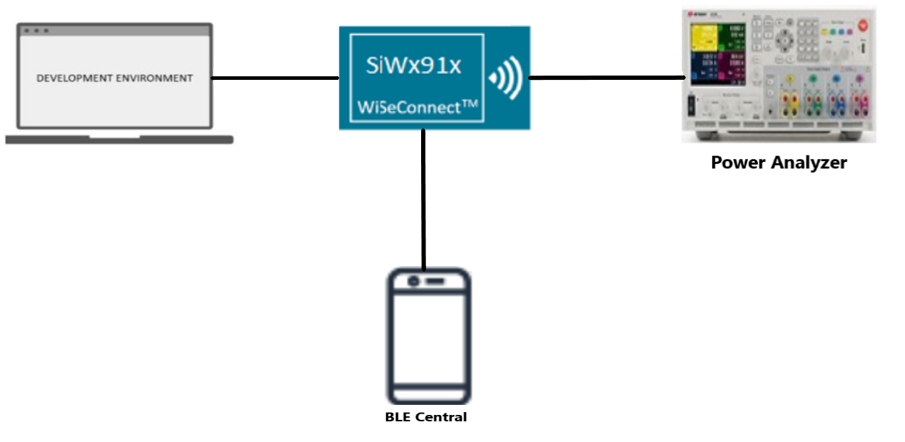
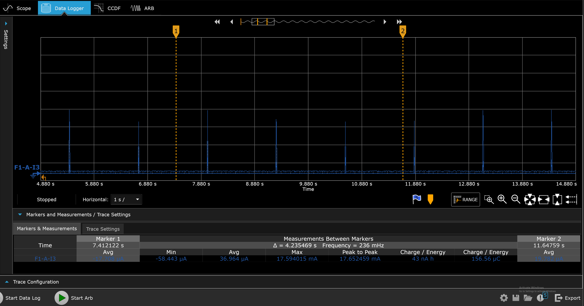
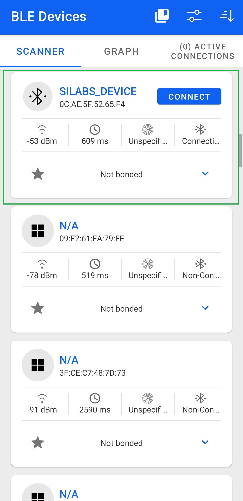
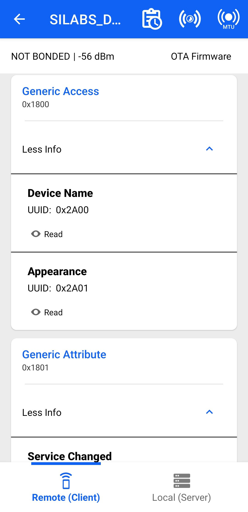
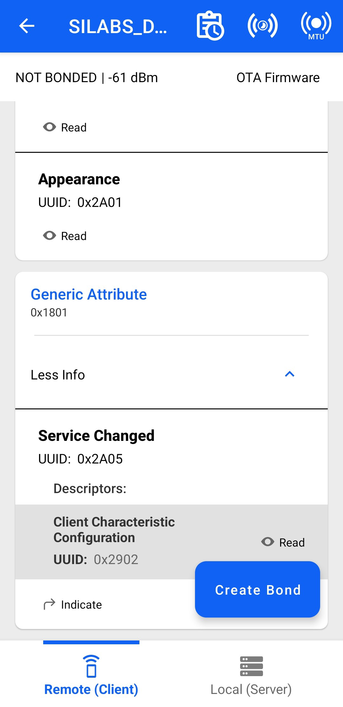
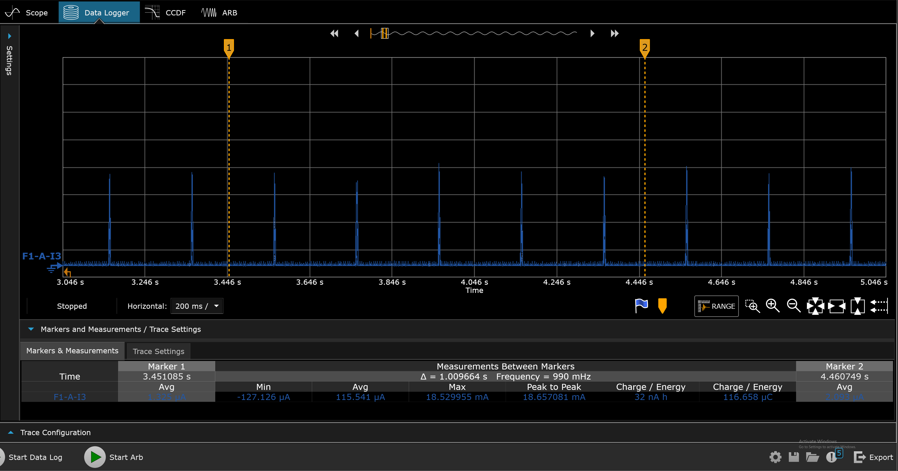
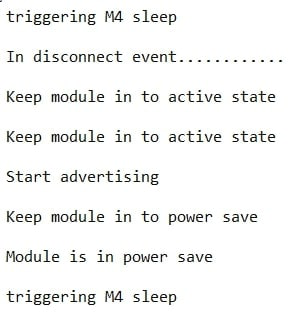
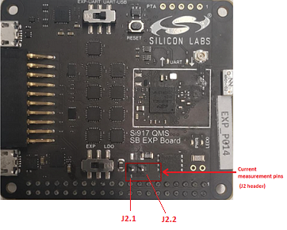
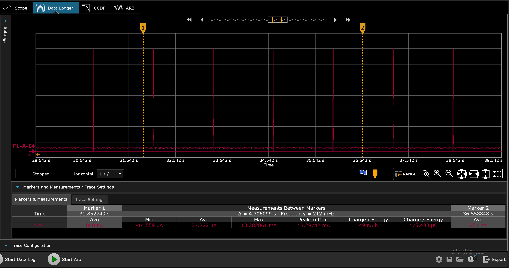
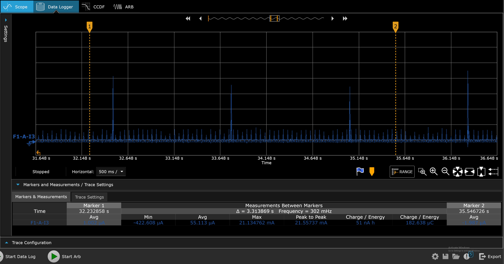

# BLE - Power Save

## Table of Contents

- [Purpose/Scope](#purposescope)
- [Prerequisites/Setup Requirements](#prerequisitessetup-requirements)
  - [Hardware Requirements](#hardware-requirements)
  - [Software Requirements](#software-requirements)
  - [Setup Diagram](#setup-diagram)
- [Getting Started](#getting-started)
- [Application Build Environment](#application-build-environment)
- [Test the Application](#test-the-application)
  
## Purpose/Scope

This application demonstrates how to configure SiWx91x in power save profile in Advertising mode & Connected mode.

## Prerequisites/Setup Requirements

### Hardware Requirements

- Windows PC.
- SiWx91x Wi-Fi Evaluation Kit.
- SoC Mode
  - Silicon Labs [BRD4325A, BRD4325B, BRD4325C, BRD4338A, BRD4339B, BRD4343A ](https://www.silabs.com/)
  - Kits
    - SiWx917 AC1 Module Explorer Kit (BRD2708A)
- NCP Mode:
  - Silicon Labs [BRD4180B](https://www.silabs.com/); **AND**
  - Host MCU Eval Kit. This example has been tested with:
  - Silicon Labs [WSTK + EFR32MG21](https://www.silabs.com/development-tools/wireless/efr32xg21-bluetooth-starter-kit)
  - NCP Expansion Kit with NCP Radio boards
      - (BRD4346A + BRD8045A) [SiWx917-EB4346A]
      - (BRD4357A + BRD8045A) [SiWx917-EB4357A]
  - STM32F411RE MCU
     - [STM32F411RE](https://www.st.com/en/microcontrollers-microprocessors/stm32f411re.html) MCU
     - NCP Radio Board (BRD4346A + BRD8045C)
  - Interface and Host MCU Supported
    - SPI - EFR32 & STM32
    - UART - EFR32
- **PSRAM Mode**:
    - Silicon Labs [BRD4340A](https://www.silabs.com/)
- Power Analyzer

### Software Requirements

- Simplicity Studio (to be used with Silicon Labs MCU)
- Keil IDE (to be used with STM32F411RE MCU)
- Serial Terminal - [Docklight](https://docklight.de/)/[Tera Term](https://ttssh2.osdn.jp/index.html.en) (to be used with Keil IDE)
- Download and install the Silicon Labs [Simplicity Connect App(formerly EFR Connect App) or other BLE Central/Peripheral app.](https://www.silabs.com/developers/simplicity-connect-mobile-app ) in the android smart phones for testing BLE applications. Users can also use their choice of BLE apps available in Android/iOS smart phones.

### Setup Diagram

  

## Getting Started

### Instructions for Simplicity Studio IDE and Silicon Labs devices (SoC and NCP Modes)

Refer to the instructions [here](https://docs.silabs.com/wiseconnect/latest/wiseconnect-getting-started/) to:

- [Install Simplicity Studio](https://docs.silabs.com/wiseconnect/latest/wiseconnect-developers-guide-developing-for-silabs-hosts/#install-simplicity-studio)
- [Install WiSeConnect 3 extension](https://docs.silabs.com/wiseconnect/latest/wiseconnect-developers-guide-developing-for-silabs-hosts/#install-the-wi-se-connect-3-extension)
- [Connect your device to the computer](https://docs.silabs.com/wiseconnect/latest/wiseconnect-developers-guide-developing-for-silabs-hosts/#connect-si-wx91x-to-computer)
- [Upgrade your connectivity firmware ](https://docs.silabs.com/wiseconnect/latest/wiseconnect-developers-guide-developing-for-silabs-hosts/#update-si-wx91x-connectivity-firmware)
- [Create a Studio project ](https://docs.silabs.com/wiseconnect/latest/wiseconnect-developers-guide-developing-for-silabs-hosts/#create-a-project)

For details on the project folder structure, see the [WiSeConnect Examples](https://docs.silabs.com/wiseconnect/latest/wiseconnect-examples/#example-folder-structure) page.

### Instructions for Keil IDE and STM32F411RE MCU (NCP Mode)

  - Install the [Keil IDE](https://www.keil.com/).
  - Download [WiSeConnect 3 SDK](https://github.com/SiliconLabs/wiseconnect)
  - Update the device's connectivity firmware as mentioned [here](https://docs.silabs.com/wiseconnect/latest/wiseconnect-getting-started/getting-started-with-ncp-mode).
  - Connect the SiWx91x NCP to STM32F411RE Nucleo Board following the below steps:
  - Connect the male Arduino compatible header on carrier board to female Arduino compatible header on STM32F411RE Nucleo board.
  - Mount the NCP Radio board (BRD4346A) onto the radio board socket available on the base board (BRD8045C).
  - After connecting all the boards, the setup should look like the image shown below:

  

  - Connect the setup to the computer.
  - Open the BLE PER µVision project - **ble_power_save.uvprojx** by navigating to **WiSeConnect 3 SDK → examples → snippets → ble → ble_power_save → keil_project**.

## Application Build Environment

The application can be configured to suit your requirements and development environment. Read through the following sections and make any changes needed.

- Open `ble_config.h` file and update/modify following macros

   
  - `BLE_ROLE` refers to the SiWx91x device role, valid configurations are `PERIPHERAL_ROLE`, `CENTRAL_ROLE & DUAL_ROLE`.
    ```c
    #define BLE_ROLE    PERIPHERAL_ROLE
    ```
   
  - Remote Peripheral device paramters:
    - `RSI_BLE_DEV_ADDR_TYPE` refers to the address type of the remote device to connect.
    - Based on address type of remote device, valid configurations are `LE_RANDOM_ADDRESS` and `LE_PUBLIC_ADDRESS`
      ```c
	    #define RSI_BLE_DEV_ADDR_TYPE             LE_PUBLIC_ADDRESS 
      ```
    - `RSI_BLE_DEV_ADDR` refers to the address of the remote device to connect.
      ```c
      #define RSI_BLE_DEV_ADDR                               "00:1E:7C:25:E9:4D" 
      ```
    - `RSI_REMOTE_DEVICE_NAME` refers to the name of remote device to which Silicon Labs device has to connect.
      ```c
      #define RSI_REMOTE_DEVICE_NAME                         "SILABS_DEV" 
      ```
  
    > **Note:** you required to configure either the `RSI_BLE_DEV_ADDR` or `RSI_REMOTE_DEVICE_NAME` of the remote device.
### Power save configuration
  - Configure `ENABLE_NWP_POWER_SAVE` parameter to enable power save mode.  
  
    ```c
    #define ENABLE_NWP_POWER_SAVE              1
    ```
   
    > **Note:** If you are using the NCP-EXP-Board, refer the "**Powersave functionality with NCP expansion board**" section  the ***Getting started with SiWx91x NCP*** guide.

  - `PSP_TYPE` refers power save profile type.
    ```c
    #define PSP_TYPE                             RSI_MAX_PSP
    ```
    The Silicon Labs device supports following power save profile types in BTLE mode,
    - **RSI_MAX_PSP (0):** In this mode, the Silicon Labs device will be in Maximum power save mode. i.e Device will wake up for every DTIM beacon and do data Tx and Rx.

  - `PSP_MODE` refers power save profile mode. 
    ```c
    #define PSP_MODE                             RSI_SLEEP_MODE_2
    ```
    The Silicon Labs device supports following power modes in BTLE,
   
    - **RSI_ACTIVE (0):** In this mode, the Silicon Labs device is active and power save is disabled.
   
    - **RSI_SLEEP_MODE_2 :** This mode is applicable when the Silicon Labs device is in Advertising state as well as in connected state. In this sleep mode, SoC will go to sleep based on GPIO handshake, therefore handshake is required before sending data to the Silicon Labs device.
   
    - **RSI_SLEEP_MODE_8 :** In this power mode, the Silicon Labs device goes to power save when it is in the unassociated state with the remote device. In this sleep mode, SoC will go to sleep based on Message exchange, therefore handshake is required before sending the command to the Silicon Labs device.     
   
    > **Note:** Default `RSI_SLEEP_MODE_2` with `MAX_PSP` is configured in the application.

> **Note:** "Opermode command parameters" are set with desired configuration in app.c.	

> **Note:** `ble_config.h` and `app.c` files are already set with desired configuration in respective example folders you need not change for each example.

> **Note:** This application doesn't have provision to update the PHY

> **Note:** 
> User can configure default region specific regulatory information using `sl_wifi_region_db_config.h`

## Test the application

### Instructions for Simplicity Studio IDE and Silicon Labs devices (SoC and NCP Modes)

Refer to the instructions [here](https://docs.silabs.com/wiseconnect/latest/wiseconnect-getting-started/) to:

- Build the application in Studio.
- Flash, run and debug the application.
### Instructions for Keil IDE and STM32F411RE MCU

- Build the application.
- Set the Docklight up by connecting STM32's Serial COM port. This enables you to view the application prints.
- Flash, run and debug the application.

Follow the steps for successful execution of the program:

> **Note:** The provided mobile screenshots are from the 2.8.1 version of the Simplicity Connect App(formerly EFR Connect App), it is recommended to use the latest version.

1. After the program gets executed, the Silicon Labs device  would be in Advertising state with configured power save the profile.

2. Connect any serial console for prints.

3. The Silicon Labs device will go to sleep and wakes up for every advertising interval and goes back to sleep after advertising. Refer the given following image for power save cycle in advertising mode.

           

4. Open an Simplicity Connect App(formerly EFR Connect App) in the Smartphone and do Scan.

5. In the App, Silicon Labs device will appear with the name configured in the macro RSI_BLE_LOCAL_NAME i.e. "SILABS_DEVICE".

     

6. Initiate connection from the mobile App.

7. After successful connection, user can see the connected state in Simplicity Connect App(formerly EFR Connect App) and also check the default services by the Silicon Labs device. 

     

     

8. After successful connection, Silicon Labs device goes to sleep and wakes up for every connection interval. Check the following image for power save cycle after connection.
> **Note:** : Here connection interval is 200ms

       

9. After successful program execution, if the Silicon Labs device is configured in PERIPHERAL_ROLE , the prints in teraterm looks as shown below.

> **Note:**
>- Default configuration of connection interval of Central device (smartphone) is 18 ms. So, the Silicon Labs device  will wake up for every 18ms sec and goes back to sleep after advertise.
>- Above power save profile image capture when it is in the idle state after successful connection. So, the user may not get same profile as shown above image.
It will vary based on the traffic.

10. Refer the following image for console prints:

    
    

## **Current consumption measurement**

- **NCP**      
   - A Power meter can be used to measure the current consumption of SiWx91x NCP module.    

           
   - Negative probe of power meter should be connected to J2.1 pin and the positive probe should be connected to J2.2 pin.    
   -  Average current consumption of SiWx91x NCP module as measured with a power-meter.  

      

- **SoC**

   - Refer [AEM measurement](https://docs.silabs.com/) section in ***Getting Started with SiWx91x SoC*** guide for measuring current consumption of SiWx91x SoC module. 

       

- **PSRAM**

   - Refer [AEM measurement](https://docs.silabs.com/) section in ***Getting Started with SiWx91x PSRAM*** guide for measuring current consumption of SiWx91x PSRAM module.    

       
 
> **NOTE:** 
> - The measured current may vary if the scenario is performed in open environment. 